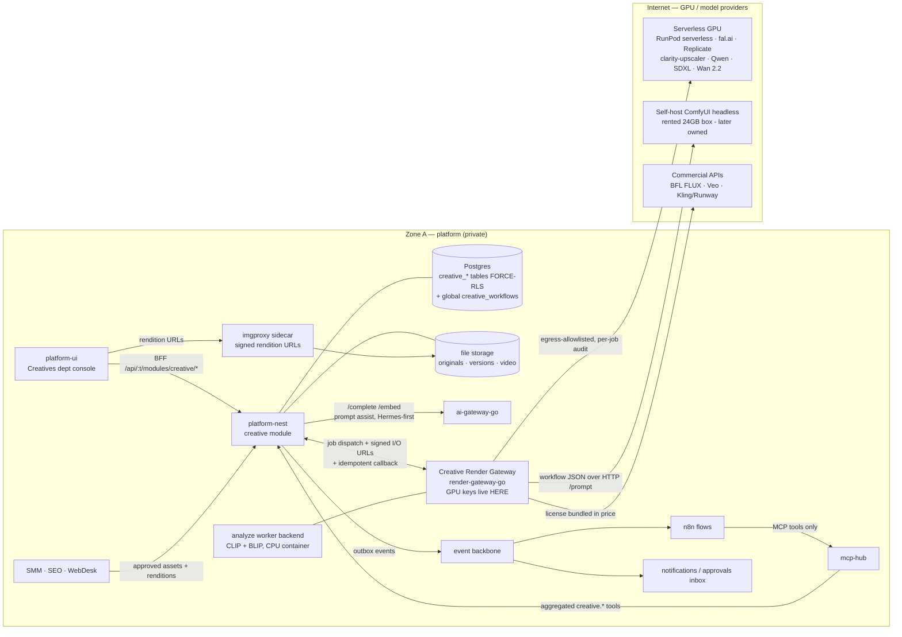
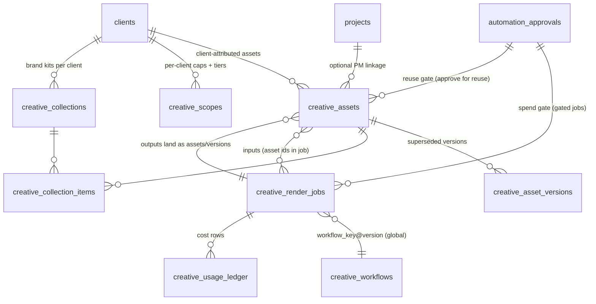

# Creative Subsystem — Architect Design (Render Factory · DAM · Studio)

> **Status:** Design blueprint — targets a future **`creative` module, `0.0.0 · PLANNED`**
> (register in [`../modules/MODULES.md`](../modules/MODULES.md) on approval). The **Image Studio**
> persist surface it absorbs (migrations 0031/0032 + `CreativeController` + the platform-ui studio)
> is already **PROTOTYPED** — everything else in this doc does not exist as code.
> **Version:** v1.0 · **Date:** 2026-07-23 · **Author:** System Architect (Claude)
> **Primary input:** [`creative-foundation.md`](./creative-foundation.md) — foundation research +
> the **4 LOCKED decisions (2026-07-23, user)**: (1) GPU posture = **serverless/rent-by-second
> first** (RunPod serverless + fal.ai, ComfyUI headless), owned box later; (2) image licensing =
> **hybrid** — commercial-clean default (Qwen-Image / Qwen-Image-Edit / SDXL / Z-Image-Turbo /
> BiRefNet), **FLUX quarantined behind an explicit paid opt-in tier** (BFL license or hosted API);
> (3) video = **hybrid** — Wan 2.2 OSS on rented GPU + a ~$100–300/mo commercial-API budget (Veo
> for synced audio, Kling/Runway for hero shots) via fal/Replicate; (4) DAM = **build-light on our
> own stack** (Nest asset domain + RLS + Shared Drive + pgvector CLIP search + BLIP auto-tag +
> imgproxy renditions), no external DAM. This design conforms to those locks and does not
> relitigate them.
> **Sibling deliverables:** [`seo-sem-design.md`](./seo-sem-design.md) ·
> [`smm-design.md`](./smm-design.md) — same rigor, same section map. Where search-marketing is a
> *data + judgment* subsystem and SMM is a *judgment + publication* subsystem, Creative is the
> **production + supply** subsystem: its defining hazards are **GPU money burning by the second**
> and a **license boundary** (a non-commercial model's pixels must be structurally unable to reach
> a client deliverable). Creative is the asset factory SMM/SEO/WebDesk consume.

---

## §00 · Executive summary

Creative becomes a **platform-nest module vertical** (`ModuleContract` key **`creative`**, tables
`creative_*` — **extending, not duplicating, the shipped `creative_assets` table** from 0031/0032)
plus **one new deployable** — the **Creative Render Gateway** (`render-gateway-go/`, the mirror of
`ai-gateway-go` for diffusion workloads) — plus the expanded Creatives department console on the
dept-interface-template. The architecture in six moves:

1. **The Creative Render Gateway is the only door to GPU compute.** A typed render job
   (`upscale / generate / edit / bg_remove / relight / analyze / t2v / i2v / flf2v /
   interpolate / video_upscale`) is created as an RLS-scoped `creative_render_jobs` row in
   platform-nest, then dispatched to the gateway, which routes it to the cheapest capable
   **RenderBackend** — serverless GPU (RunPod/fal/Replicate), self-hosted headless ComfyUI (rented
   box, later owned), or commercial API (BFL/Veo/Kling) — filtered by **capability + license class
   + cost cap + scope + backend health**. Platform-nest owns job state; the gateway owns GPU
   provider keys (the "bot never holds provider keys" custody rule, applied to GPUs) and holds no
   tenant data at rest.
2. **License discipline is structural, not procedural.** Every ComfyUI workflow is a **versioned
   JSON artifact** (`creative_workflows`, global) carrying a **model manifest with license
   classes**. The gateway stamps every output with its license provenance; platform-nest computes
   an asset's `license_class` as the weakest link of its derivation chain; and the
   approve-for-reuse gate **refuses** any asset whose chain is not fully
   `commercial`/`licensed`. FLUX dev-class quality is reachable only through the **premium tier**
   (BFL commercial license or hosted API where the license is bundled), gated per client scope +
   `creative:render:premium`. v1 ships **zero** non-commercial workflows enabled.
3. **DAM = the extended `creative_assets` domain**, not a product: version stack, collections +
   brand kits, rights/licensing fields with expiry, provenance (model/workflow/prompt/seed/
   backend), CLIP embeddings → pgvector for visual/semantic search + dedup (checksum / pHash /
   cosine), BLIP captions + auto-tags, and **imgproxy** as a stateless signed-URL rendition
   sidecar. Cross-dept consumers (SMM/SEO/WebDesk) see **approved assets only**, through the
   module's BFF surface + signed rendition URLs — never the tables.
4. **Two gates, not one.** The **spend gate** (per-client scope config → creative ledger stop-loss
   chain client → tenant → global, fail-closed, checked before dispatch; WS4 suspension for every
   automation-principal job and any job above the per-job cost threshold or on a premium backend)
   and the **reuse gate** (a human WS4-surfaced approval promotes an asset to cross-dept /
   client-deliverable status, and is where the license chain is verified). Generative spend and
   generative publication are different risks and get different gates.
5. **AI assist is local-first via ai-gateway-go** (prompt expansion, tag normalization, alt-text —
   Hermes default, Claude polish flag), while **vision models run as `analyze` render jobs**
   (CLIP ViT-B/32 embeddings + BLIP captions on a cheap CPU worker backend — deliberately NOT the
   gateway `/embed`, which is not CLIP-space; see §07). Retrieval-shaped RAG stays in WS8 (D9).
6. **The Magnific bleed stops in week one:** Phase 0 is a 1-day spike pointing the team at
   clarity-upscaler on Replicate (~$0.019/run, ~10x cheaper per image than Magnific credits)
   before any platform code lands; P1 then productizes exactly that path through the Render
   Gateway. Build order is cost-honest: **P0 contracts → P1 upscale (Magnific kill) → P2 image
   generate/edit → P3 DAM search/tagging + cross-dept supply → P4 video**. 27 tickets
   (CR-00 – CR-26), /army-ready, in §12.

---

## §01 · Scope & service lines

### Service lines (foundation §1 — modeled distinctly; all five are v1, phased)

| Service line | v1 delivers | Deferred |
|---|---|---|
| **Image enhancement / upscale** (the Magnific replacement) | Creative upscale (clarity-upscaler recipe: SDXL + ControlNet-Tile), precision upscale (Real-ESRGAN/DiffBIR), relight (IC-Light **V1**), batch jobs, before/after compare, preset tuning to Magnific parity | SUPIR (non-commercial — internal experiments only, ships disabled); Topaz-class video masters |
| **Image generation** | Text→image on the commercial-clean set (Qwen-Image / SDXL / Z-Image-Turbo), prompt-expansion assist, style presets per brand kit, FLUX hero tier behind the premium gate | LoRA training on client brand looks; OmniGen 2 unified gen+edit (prototype later) |
| **Image editing** | Instruction editing (Qwen-Image-Edit), background removal (BiRefNet — **not** RMBG), inpaint/outpaint (ControlNet + IP-Adapter), per-network crop/format via renditions | Full layered canvas editor (v1 = form-canvas + mask-lite; InvokeAI-embed vs own-canvas is OQ-6) |
| **Video generation + I2V** | Wan 2.2 T2V / I2V / **FLF2V** (first+last-frame morph) on serverless GPU; RIFE interpolation + Real-ESRGAN video upscale post-pipeline; commercial-API hero shots (Veo synced audio, Kling/Runway) inside the $100–300/mo envelope | Generative video editing/NLE (no OSS equivalent — assemble stays ffmpeg/Kdenlive, human-finished); object removal in video (immature) |
| **Asset management (DAM)** | The shared library: versions, collections, brand kits, rights/licensing + expiry, provenance, CLIP/BLIP search + dedup, imgproxy renditions, approve-for-reuse, Shared Drive mirror | Client-facing brand portals; smart-crop face detection (thumbor — add only if needed); federation to external DAMs |

### Non-goals (v1)

- **No adopted external UIs** — ComfyUI and InvokeAI UIs are never exposed; the Creatives console
  is the only operator surface (foundation §9.8). ComfyUI runs headless at arm's length (GPL never
  linked, HTTP only).
- **No owned GPU hardware** — locked. The rented/serverless posture is the design; the owned-box
  tripwire is OQ-2.
- **No direct vendor AI calls** — LLM assist through ai-gateway-go only; GPU calls through the
  Render Gateway only.
- **No non-commercial model output on any client-visible path** — structural rule (§05/§07), not
  policy. SUPIR / IC-Light V2 / RMBG / SVD / FLUX-dev-free-weights are quarantined; HunyuanVideo
  additionally geo-caveated (EU/UK/S.Korea exclusion) and stays out of v1.
- **No payroll/billing changes** — GPU costs are metered in the creative ledger; invoicing them is
  the billing module's concern (a rollup metric feeds it).
- **No new PM system** — creative work items ride the existing PM vertical; the module adds
  production/library domain only (P5c lesson).

### Fit with prior decisions (and two flagged conflicts)

- Conforms to the **ERP holding-OS vision**: enablement via `enabled_modules` OR active
  `service_assignment`, WSD-3 module-sliced third-wall RLS — the Creative department in the agency
  company serves sibling companies without data bleed.
- Lands on the **dept-interface-template**: Creatives already has the two-level console (craft
  group "Studio": Image Studio · Asset Library). This design grows it to two craft groups (§08)
  and keeps the toolkit rule: no tab registered before its route exists.
- Fills the **mcp-hub reserved seam**: CLAUDE.md lists "Magnific `image.enhance` (no Gateway
  capability yet)" as a deferral — `creative.enhanceImage` (§07) closes it, backed by the Render
  Gateway rather than a Magnific subscription.
- Reuses, not duplicates: `clients`, `projects`, `files` storage backend, the `file` Cerbos
  policy (already how `creative_assets` authorizes), WS4 `automation_approvals` (origin widened),
  the SEO-proven ledger/stop-loss + one-shot-approval patterns (SEO D-6/D-11, SMM D-6/D-8/D-9).
- **⚠ Flagged conflict 1 — SMM D-9 (generative-image credits).** `smm-design.md` books
  generative-image credits in `social_usage_ledger`. Once this module exists, the **render cost
  books exactly once, in `creative_usage_ledger`**, attributed `requester_module='social'` +
  the requesting client; SMM's `tool_scope.ai.imageGen` toggle and caps still gate the request
  at its own choke point, but its ledger must not double-book the GPU dollars (it may keep a
  zero-cost reference row). SMM-20 should be built against this rule; noted for the owner as
  D-7 (§14) rather than silently overriding SMM's decision log.
- **⚠ Flagged conflict 2 — agency creative-asset review (0006).** The agency vertical already has
  campaign-bound creative-asset review. That surface is **campaign deliverable review** and stays;
  the DAM is the production/library layer underneath. v1 keeps them separate; a bridging seam
  (agency review items referencing `creative_asset_id`) is a noted v2 item, not built now.
- **⚠ Design change to shipped code (deliberate, coordinated):** 0031 gave `creative_assets` a
  plain tenant wall with an explicit "not a gated module" comment. This design **retrofits the
  third wall** and moves the controller into the module (D-3, §04) — the 0031 comment is
  superseded by the module vertical materializing. The shipped HTTP contract is preserved.

---

## §02 · System overview



**Reading the diagram.** All state, tenancy, judgment, and money controls live in Zone A. The
Render Gateway is Zone A infrastructure with **egress-only** GPU traffic (allowlisted hosts,
per-job audit of every byte of client pixels leaving — §03). Bytes flow storage → gateway →
backend → gateway → storage via **short-lived signed URLs platform-nest issues per job**; the
gateway persists nothing tenant-owned. imgproxy is a stateless sidecar reading the same storage,
serving signed, on-the-fly renditions to the UI and to consuming departments. No inbound internet
path exists to any of it; commercial-API webhooks are not used (the gateway polls providers).

---

## §03 · Trust zones & network

Follows the WebDesk zone doctrine adapted to this subsystem's actual exposure — Creative has **no
public-facing surface at all**; its risk is *egress* (client pixels to GPU clouds) and *money*.

| Surface | Zone | Rules |
|---|---|---|
| `creative` module + DAM + ledger + scopes | **A** | Standard FORCE-RLS + third wall; all writes through the module controller; approvals via WS4. |
| **Creative Render Gateway** (`render-gateway-go`) | **A, egress-only** | Holds **all GPU/model provider keys** (RunPod, fal, Replicate, BFL, Google/Veo, Kling/Runway) — env now, OpenBao target-state; platform-nest never sees them (mirror of the ai-gateway custody rule). No inbound ports beyond the platform-nest-facing API (service-token auth; mTLS via the synccert CA when enrolled). **Egress allowlist** enforced at DialContext exactly like ai-gateway-go — only registered backend hosts are reachable; every dispatch writes an egress-audit line `{job, tenant-hash, client-hash, backend, bytes_out, model}`. |
| Self-host ComfyUI target | **external execution env** | A rented box (RunPod/Vast) reachable only from the gateway over its HTTP API (`/prompt`, `/history`, ws progress); it holds **zero credentials into Zone A** — the gateway pushes inputs and pulls outputs. Treated as untrusted compute: outputs are content-type-validated and re-encoded on ingest (a compromised worker can corrupt a render, never reach the platform). GPL isolation is the same arm's-length HTTP pattern (foundation §9.1). |
| Serverless / commercial API backends | **internet** | Server-side keys only, per-call cost accounting, no client identifiers in prompts/filenames (opaque job ids); providers see pixels + prompt, nothing else. Clients who cannot accept cloud-GPU egress get `allow_cloud_gpu:false` in scope (OQ-5) — their jobs route only to the self-host target or refuse. |
| imgproxy sidecar | **A** | Stateless MIT Go/libvips container; **signed URLs only** (`IMGPROXY_KEY/SALT`, expiring), source restricted to our storage; never exposed to the public internet in v1 (client delivery goes through Drive/files, not hotlinks). |
| Input/output byte transfer | **A ↔ gateway** | Platform-nest issues **short-lived signed GET (inputs) and PUT (outputs) URLs** per job; the gateway and backends never get storage credentials; callback references stored keys. |
| Callbacks (gateway → platform-nest) | **A** | `POST /api/internal/creative/render-callback`, idempotent by `job_id`, bearer service token (+ mTLS option), schema-validated; a forged callback without the per-job callback token is refused, and even a replayed valid one is idempotent (terminal-state transitions are one-way). |

---

## §04 · Domain model & schema

### Design rules (inherited, not optional)

- Every tenant table: `tenant_id uuid NOT NULL REFERENCES companies(id)`, `origin_site`,
  `created_at/updated_at`, soft-delete `deleted_at` where user-facing.
- **FORCE-RLS with the WSD-3 third wall** — policy predicate
  `tenant_id = ANY(app_current_tenants()) AND app_module_allowed('creative')` on both USING and
  WITH CHECK, byte-identical in shape to
  [`0028_module_hr.sql`](../../platform-nest/migrations/0028_module_hr.sql). App side reaches
  these tables only via `withTenants(tenants, { modules: ['creative'] })`.
- **Migration numbering — stated assumption:** the module block starts at
  **`0036_module_creative.sql`** (+ `0037` if a follow-up is needed). Basis: as of 2026-07-23 the
  ledger runs through `0035_integration_connections_search_providers.sql` (the SEO design's
  "0034+" was drawn down by the search module). Per
  [`migrations/README.md`](../../platform-nest/migrations/README.md) rule 5, CR-01 takes the
  **next unused number at merge time** and coordinates with SMM-01 (which also targets
  next-unused) — whichever merges second rebases. No in-migration GRANTs; no `sync_app` grants
  (creative tables do not sync in v1).
- Money: **GPU/provider cost is `numeric(12,6)` USD** (serverless unit prices go to fractions of
  a cent — same rationale as the SEO ledger). No client-facing money in this module's v1.
- **The two RLS decisions this module makes explicitly:**
  1. `creative_workflows` is **global, no-RLS, admin-write-only** — it holds pipeline
     definitions (workflow JSON + model manifests), zero client data; per-tenant duplication
     would fork the license source of truth. Same class of deliberate exemption as
     `social_platform_apps` (SMM D-4), narrower than SEO's `search_data_cache`.
  2. `creative_assets` (shipped with a plain tenant wall in 0031) is **upgraded to the third
     wall** in this module's migration, in lockstep with moving `CreativeController` into the
     module (which adds `{modules:['creative']}` to its `withTenants` calls). The HTTP contract
     (`/api/:t/creative/assets`, used by the studio UI and `creative-grading-trainer`) is
     preserved as a stable alias; new surface lives under `/api/:t/modules/creative/*`. This is
     the one behavior change to shipped code and it ships atomically in CR-01+CR-02 (D-3).

### Entity map



### Tables (DDL sketch — illustrative, refined at CR-01)

**`creative_assets` — EXTENDED in place (additive `ALTER TABLE`).** Existing columns (0031/0032:
`id, tenant_id, uploader_id, department_id, name, content_type, width, height, preset_id, grade,
original_key, original_content_type, original_byte_size, graded_key, graded_byte_size,
origin_site, timestamps, deleted_at, training_ready`) are untouched. **Semantics note:**
`graded_key` remains the storage key of the **current/primary bytes** for every asset kind (the
name is studio-era; renaming a shipped column is deliberately avoided — the service layer exposes
it as `primaryKey`). New columns:

```sql
ALTER TABLE creative_assets
  ADD COLUMN kind text NOT NULL DEFAULT 'image' CHECK (kind IN ('image','video')),
  ADD COLUMN source text NOT NULL DEFAULT 'studio'
    CHECK (source IN ('studio','upload','render','import')),
  ADD COLUMN client_id uuid REFERENCES clients(id),          -- nullable: internal assets
  ADD COLUMN project_id uuid REFERENCES projects(id),        -- optional PM linkage
  ADD COLUMN render_job_id uuid,                             -- producing job (FK added after jobs table)
  ADD COLUMN duration_ms integer,                            -- video only
  -- rights & licensing (the DAM's legal spine)
  ADD COLUMN license_class text NOT NULL DEFAULT 'unknown'
    CHECK (license_class IN ('commercial','licensed','noncommercial','unknown')),
  ADD COLUMN rights jsonb NOT NULL DEFAULT '{}',             -- {source, model_releases, property_releases, territory, notes}
  ADD COLUMN rights_expires_on date,
  ADD COLUMN reuse_status text NOT NULL DEFAULT 'private'
    CHECK (reuse_status IN ('private','pending_approval','approved','revoked')),
  ADD COLUMN reuse_approval_id uuid REFERENCES automation_approvals(id),
  ADD COLUMN approved_by uuid REFERENCES users(id),
  ADD COLUMN approved_at timestamptz,
  -- provenance (the C2PA-shaped derivation record; license chain computed from it)
  ADD COLUMN provenance jsonb NOT NULL DEFAULT '{}',         -- {workflow, workflow_version, models:[{name,license_class}], backend, prompt_sha256, seed, derived_from:[asset_id]}
  -- search / dedup / AI metadata (filled async by analyze jobs, fail-soft)
  ADD COLUMN checksum_sha256 text,
  ADD COLUMN phash text,                                     -- 64-bit perceptual hash, hex
  ADD COLUMN embedding vector(512),                          -- CLIP ViT-B/32; DUAL-MODE (float8[] fallback
                                                             -- when pgvector absent — WS8 store pattern)
  ADD COLUMN caption text,                                   -- BLIP caption (searchable)
  ADD COLUMN auto_tags jsonb NOT NULL DEFAULT '[]',
  ADD COLUMN exif jsonb NOT NULL DEFAULT '{}',
  ADD COLUMN current_version integer NOT NULL DEFAULT 1;
-- Backfill: existing studio rows get source='studio', license_class='commercial'
-- (deterministic grade of a client-supplied original; no generative model in the chain),
-- rights = {"source":"client-supplied original; deterministic studio grade"}.
-- RLS: policy REPLACED with the third-wall predicate (see design rule above).
```

**`creative_asset_versions`** — superseded versions only; the asset row always holds current
bytes (so every shipped read path stays correct): `id, tenant_id, asset_id FK, version int,
storage_key, content_type, byte_size, width, height, duration_ms, grade jsonb NULL,
render_job_id uuid NULL, note text, created_by, origin_site, created_at`;
`UNIQUE (tenant_id, asset_id, version)`. New version = copy current into versions, overwrite the
asset row, bump `current_version`, re-run analyze.

**`creative_collections`** + **`creative_collection_items`** — `kind ('collection','brand_kit')`,
`client_id uuid NULL`, `name`, `slots jsonb NOT NULL DEFAULT '{}'` (brand kit:
`{logo_asset_ids, palette:[hex], fonts:[{family,url}], approved_imagery:collection-self}`),
soft-delete; items = `(collection_id, asset_id, position)` with
`UNIQUE (tenant_id, collection_id, asset_id)`.

**`creative_render_jobs`** — the job spine (state machine authoritative here, not in the gateway):

```sql
CREATE TABLE creative_render_jobs (
  id uuid PRIMARY KEY,
  tenant_id uuid NOT NULL REFERENCES companies(id),
  client_id uuid REFERENCES clients(id),
  requested_by uuid REFERENCES users(id),          -- human or the OBO automation user
  requester_module text NOT NULL DEFAULT 'creative'
    CHECK (requester_module IN ('creative','social','search','webdesk','agent','automation')),
  capability text NOT NULL CHECK (capability IN
    ('upscale','generate','edit','bg_remove','relight','analyze',
     't2v','i2v','flf2v','interpolate','video_upscale')),
  workflow_key text NOT NULL, workflow_version integer NOT NULL,
  params jsonb NOT NULL DEFAULT '{}',              -- prompt, size, sliders, masks — client data, RLS-protected
  input_asset_ids uuid[] NOT NULL DEFAULT '{}',
  constraints jsonb NOT NULL DEFAULT '{}',         -- {license_floor:'commercial'|'licensed', max_cost_usd, deny_cloud:bool}
  status text NOT NULL DEFAULT 'queued' CHECK (status IN
    ('pending_approval','queued','dispatched','running','uploading',
     'succeeded','failed','cancelled','refused')),
  approval_id uuid REFERENCES automation_approvals(id),  -- spend gate (one-shot, §07)
  backend_key text, backend_ref text,              -- stamped at dispatch
  license_stamp jsonb,                             -- gateway-returned {models:[{name,license_class}],backend}
  estimated_cost_usd numeric(12,6),
  actual_cost_usd numeric(12,6),
  progress integer NOT NULL DEFAULT 0,
  error text, attempt integer NOT NULL DEFAULT 0,
  lease_expires_at timestamptz,                    -- reconciler re-drives stale dispatched/running
  correlation_id text,                             -- MCP call / n8n run id
  origin_site text NOT NULL, created_at timestamptz NOT NULL DEFAULT now(),
  updated_at timestamptz NOT NULL DEFAULT now(),
  queued_at timestamptz, started_at timestamptz, finished_at timestamptz
);
CREATE INDEX ix_creative_jobs_active ON creative_render_jobs (tenant_id, status)
  WHERE status IN ('pending_approval','queued','dispatched','running','uploading');
ALTER TABLE creative_assets ADD CONSTRAINT fk_assets_render_job
  FOREIGN KEY (render_job_id) REFERENCES creative_render_jobs(id);
```

**`creative_usage_ledger`** — the metering ledger (one row per dispatched job + true-up; mirrors
`search_provider_calls`): `id, tenant_id, client_id NULL, job_id FK, requester_module,
backend text, model text, capability text, units numeric(12,4)` (GPU-seconds or images or clip-
seconds), `unit_kind text ('gpu_seconds','images','clip_seconds','api_call')`,
`cost_usd numeric(12,6)` (estimated at dispatch, trued-up on completion), `cost_class text
CHECK (cost_class IN ('image','video','analyze'))` (separate budget envelopes per locked decision
3), `status ('posted','completed','failed')`, `requested_by, correlation_id, origin_site,
created_at`. RLS: standard creative wall. Indexed `(tenant_id, client_id, created_at DESC)`.

**`creative_scopes`** — the human-set per-client service config (the SEO D-11 pattern,
creative-shaped): `id, tenant_id, client_id uuid NULL` (NULL = tenant default row),
`config jsonb NOT NULL DEFAULT '{}'`:

```jsonc
{
  "upscale":  { "enabled": true },
  "generate": { "enabled": true },
  "edit":     { "enabled": true },
  "video":    { "enabled": false },                 // t2v/i2v/flf2v as a class
  "analyze":  { "enabled": true },
  "premium":  { "flux": false, "video_api": false },// THE paid opt-in tier (locked decision 2/3)
  "allow_cloud_gpu": true,                          // false => self-host-only routing (OQ-5)
  "budgets_usd": { "image_month": 25, "video_month": 0, "per_job_approval_threshold": 2.0 }
}
```
`UNIQUE NULLS NOT DISTINCT (tenant_id, client_id)` (PG15+; else paired partial unique indexes).
Effective scope = client row else tenant default else platform default (env). Every dispatch and
every scheduled flow consults it; a disabled capability refuses **naming the toggle**.

**`creative_workflows`** — **global, no-RLS, admin-write-only** (deliberate exemption, D-4): `id,
key text, version integer, engine text NOT NULL DEFAULT 'comfyui' CHECK (engine IN
('comfyui','api')), capability text, definition jsonb NOT NULL` (the ComfyUI workflow JSON or the
API template), `params_schema jsonb NOT NULL DEFAULT '{}'`, `models jsonb NOT NULL` (manifest:
`[{name, license_class ('commercial','licensed','noncommercial'), source}]`), `min_vram_gb
integer, active boolean NOT NULL DEFAULT false, notes text, created_at, updated_at`;
`UNIQUE (key, version)`. Workflows are immutable once referenced by a job (new behavior = new
version). **v1 seeds only commercial-clean workflows active** (§06); the quarantine list may
exist as rows with `active=false` + `license_class` telling the router why.

**Approvals** — reuse `automation_approvals` with the origin CHECK **widened to include
`'creative'`** (same widen-only DO-block as 0028; include whatever set is current at merge time).
Both gates ride it: spend-gate rows (`tool_name='creative.render'`, args = job envelope hash) and
reuse-gate rows (`tool_name='creative.approveReuse'`, args = asset id + license-chain summary).

### Custom fields & relations

- D17 `customFieldTargets`: `creative_asset`, `creative_collection`.
- **Clients/projects** are the core rows — no duplicates (P5c lesson). Delivering an approved
  asset to a client as a formal deliverable rides the existing `deliverables` flow (seam noted,
  not new schema).

---

## §05 · The Creative Render Gateway (the centerpiece)

### Verdict and shape

**A separate Go service, `render-gateway-go/`** (compose service `render-gateway`; port: next free
slot in `infra/compose/docker-compose.vps.yml`, confirmed at CR-04) — NOT a platform-nest
in-process worker, for the same reasons ai-gateway-go is separate: key custody isolation (GPU
provider keys never enter the platform process), egress-allowlist enforcement at the dialer,
independent failure/restart behavior for long-running jobs, and Go's fitness for
concurrent poll/stream workloads. **Platform-nest stays the source of truth for job state**; the
gateway is a stateless-ish executor (in-flight leases in memory/Redis; crash ⇒ platform
reconciler re-drives by lease timeout, idempotent on `job_id`).

### Job lifecycle (states live on `creative_render_jobs`)

```
(create) ──scope+license+budget check──► queued ──dispatch──► dispatched ─► running ─► uploading ─► succeeded
   │                                                                        │            │
   ├─ needs approval ─► pending_approval ─(WS4 approve, one-shot)─► queued  └──────────► failed
   ├─ check fails ────► refused (reason names the toggle/cap/license)       (cancel ⇒ cancelled, any pre-terminal state)
```

- **Create** (console button or MCP tool): platform-nest validates capability against the
  effective `creative_scopes`, resolves the workflow (`key@version`, must be `active`), computes
  the **license floor** (client-attributed job ⇒ `commercial|licensed` only), asks the gateway
  `POST /estimate` for cost, then runs the **stop-loss chain** (§ below). Outcome: `queued`,
  `pending_approval`, or `refused`.
- **Approval (spend gate):** required when (a) the principal is an automation/agent OBO user —
  always, D14; (b) `estimated_cost_usd > per_job_approval_threshold` in scope; (c) the resolved
  route is a **premium backend** (BFL FLUX tier, commercial video API); or (d) capability class
  `video` for any non-human requester. Approved rows are **one-shot**: dispatch consumes
  `approval_id` (status `approved`, payload-hash match on the job envelope, unconsumed)
  transactionally — the SEO D-6 / SMM D-6 pattern, replay-proof.
- **Dispatch:** platform-nest → `POST /jobs` on the gateway with the job envelope: `{job_id,
  capability, workflow:{key,version,definition_hash}, params, inputs:[{signed GET url, sha256}],
  output:{signed PUT url}, constraints:{license_floor, max_cost_usd, deny_cloud},
  callback:{url, per_job_token}}`. Idempotent on `job_id`. Gateway picks the backend (routing
  policy below), stamps `backend_key`, and leases the job.
- **Execute:** backend-specific — serverless (submit, poll), ComfyUI (`POST /prompt`, ws/poll
  `/history`, fetch artifacts), commercial API (submit, poll). Progress callbacks are optional;
  terminal callback is mandatory and idempotent.
- **Callback:** `POST /api/internal/creative/render-callback` `{job_id, status, backend,
  units, cost_usd, license_stamp, outputs:[{storage_key, sha256, content_type, width, height,
  duration_ms}], error?}`. Platform-nest verifies the per-job token, transitions the row
  (one-way), **creates the output asset or version** with provenance + computed `license_class`
  (weakest of `license_stamp.models[].license_class` ∪ input assets' classes), true-ups the
  ledger row, emits `creative.render.completed|failed`, and enqueues an `analyze` job (fail-soft).
- **Reconciler:** a periodic module task re-drives `dispatched/running` rows past
  `lease_expires_at` (`GET /jobs/:id` first; re-dispatch only for never-started jobs — mid-run
  failures fail closed to human retry, never silent re-spend).

### The RenderBackend abstraction (gateway-side)

```go
// Design sketch — capability-based so drivers can be partial (SearchDataProvider's sibling).
type RenderBackend interface {
    Key() string                    // 'replicate' | 'fal' | 'runpod-serverless' | 'comfy-selfhost'
                                    // | 'bfl-api' | 'video-api' | 'analyze-cpu' | 'echo' (tests)
    Capabilities() []Capability
    // License class of what THIS backend runs for a given workflow/model — the router's filter input.
    LicenseClass(workflow WorkflowRef) LicenseClass   // commercial | licensed | noncommercial
    EstimateCostUsd(job JobSpec) (float64, error)     // consulted BEFORE dispatch (stop-loss + approval threshold)
    Submit(ctx context.Context, job JobSpec) (BackendRef, error)
    Poll(ctx context.Context, ref BackendRef) (JobUpdate, error)
    Cancel(ctx context.Context, ref BackendRef) error
}
```

**Routing policy** (config-driven table, hot-reloadable like the bot's `groups.yaml`): per
capability, an ordered, cost-ascending candidate list of `{backend, workflow constraint}`. At
dispatch the router filters by: capability ∧ `license_floor` (a `commercial` floor excludes every
`noncommercial` route and excludes `licensed` unless the job's scope has the premium tier) ∧
`deny_cloud` (self-host only) ∧ `max_cost_usd` ∧ circuit-breaker health (per-backend, mirroring
ai-gateway-go), then takes the first. **Failover:** pre-start errors (429/5xx before compute
starts) advance to the next candidate; **mid-run failures never failover** (no double spend) —
they fail the job with the backend's error for a human decision. Per-tenant concurrent-job caps
(fairness) and a global concurrency cap are gateway config.

### ComfyUI workflows as versioned JSON

The unit of pipeline definition is a `creative_workflows` row: the exact ComfyUI graph JSON (or
API template), a params schema (what the console/MCP may inject: prompt, image refs, denoise,
creativity/HDR sliders mapped to denoise-strength + ControlNet weight per foundation §5.1), and
the **model manifest with license classes** — the single source of truth the router filters on
and the license stamp derives from. Platform-nest resolves `key@version` and sends the definition
hash; the gateway verifies hash before execution (a tampered workflow refuses). Seeded v1 set:
`upscale-clarity@1` (clarity-upscaler recipe), `upscale-precision@1` (Real-ESRGAN),
`relight-iclight1@1`, `gen-qwen@1`, `gen-sdxl@1`, `gen-zimage@1`, `edit-qwen@1`,
`bgremove-birefnet@1`, `analyze-clip-blip@1`, `t2v-wan22@1`, `i2v-wan22@1`, `flf2v-wan22@1`,
`interp-rife@1`, `vupscale-esrgan@1`; premium: `gen-flux-bfl@1` (api engine). Quarantined-inactive
(documentation of the boundary): `upscale-supir@0`, `relight-iclight2@0`.

### The stop-loss choke point (fail-closed, one place, before dispatch)

(0) capability enabled in effective scope (else refuse naming the toggle) → (1) license floor
satisfiable by at least one active route (else refuse naming the license wall) → (2) estimate ≤
`max_cost_usd` and, if > per-job threshold or premium route or automation principal →
`pending_approval` → (3) month-to-date `SUM(cost_usd)` per **cost class** (image / video /
analyze) vs client budget → tenant cap → global env cap (defaults: image $200/mo, video $300/mo —
the locked decision-3 envelope, analyze $10/mo) — any breach refuses + emits
`creative.budget.threshold` (also at 80%) → (4) advisory-lock single-flight per job id → dispatch
→ true-up on callback. Manual override = `creative:provider:admin` + audit. The ledger powers the
Jobs & Usage panel, tenant rollups, and the `creative.render_cost.month` metric that feeds
billing.

---

## §06 · Backend / model / license matrix (the locked hybrid, made operational)

**Default pipeline = commercial-clean only** (locked decision 2). The premium tier is a scope
flag + permission, never a default. License classes here are what `creative_workflows.models`
declares and the router enforces.

| Capability | Model / workflow | License class | Backend(s), cost-ordered | Notes |
|---|---|---|---|---|
| Upscale (creative) | clarity-upscaler (SDXL + ControlNet-Tile) | commercial (AGPL tool, internal use — OQ-8 counsel memo) | **replicate** (~$0.019/img) → comfy-selfhost | THE Magnific replacement; P0 spike target |
| Upscale (precision) | Real-ESRGAN · DiffBIR | commercial (BSD / Apache) | replicate/fal → comfy-selfhost | fast/faithful mode |
| Relight | IC-Light **V1** | commercial | comfy-selfhost → fal | **V2 is NC — quarantined** |
| Generate | Qwen-Image · SDXL · Z-Image-Turbo · FLUX schnell/klein | commercial (Apache/OpenRAIL) | fal/replicate serverless → comfy-selfhost | Qwen = text-rendering strength; Z-Image = cheap/fast |
| Generate (hero) | **FLUX dev-class via BFL/fal hosted API** | **licensed** (license bundled in price) | bfl-api / fal | **Premium tier only**: scope `premium.flux` + `creative:render:premium` + spend approval |
| Edit (instruction) | Qwen-Image-Edit | commercial (Apache) | fal/replicate → comfy-selfhost | default editing engine |
| BG removal | **BiRefNet** (MIT) | commercial | analyze-cpu / replicate | **RMBG is NC — never** |
| Inpaint/outpaint/style/structure | ControlNet + IP-Adapter (SDXL) | commercial | comfy-selfhost → serverless | Magnific-style sliders live here |
| T2V / I2V / FLF2V | **Wan 2.2** (5B/14B) | commercial (Apache) | runpod-serverless ComfyUI (~$0.03–0.10/clip compute) | anchor; FLF2V = the A→B morph requirement |
| Video (hero / synced audio) | **Veo** · Kling/Runway | **licensed** (commercial API) | video-api via fal/replicate | **Premium tier**, $100–300/mo envelope, per-clip approval |
| Interpolate / video upscale | RIFE · Real-ESRGAN | commercial | comfy-selfhost / serverless | post-pipeline for masters |
| Analyze (embed/caption/tag) | CLIP ViT-B/32 + BLIP-base | commercial | **analyze-cpu** (local container, ~$0) → replicate | fail-soft ingest enrichment |
| **Quarantined — ships disabled** | SUPIR · IC-Light V2 · RMBG · SVD · FLUX dev free weights · HunyuanVideo (geo-caveat) · LTX (license ambiguous) | noncommercial / caveated | none active | Rows exist `active=false` so the boundary is visible, not tribal knowledge |

---

## §07 · AI design

### Task → model routing

| Task | Where it runs | Trigger | Notes |
|---|---|---|---|
| Prompt expansion / negative-prompt / style suggestions | **ai-gateway-go `/complete`** — Hermes default, Claude flag for client-facing copy | Generate/Edit canvas | Never a direct vendor call; gateway DLP + caps apply |
| Alt-text + tag normalization (post-BLIP cleanup) | ai-gateway `/complete` (Hermes) | analyze pipeline | Draft metadata only |
| Image captioning | **BLIP-base as an `analyze` render job** on the CPU worker backend | asset ingest (event-driven, fail-soft) | NOT via gateway `/media` — local-first, $0, batch-friendly |
| Visual/semantic embeddings | **CLIP ViT-B/32 as the same `analyze` job** → `creative_assets.embedding` | ingest + on new version | **Pitfall made explicit:** text→image search must encode the query with the **CLIP text encoder** (same job capability), NOT ai-gateway `/embed` (nomic-space ≠ CLIP-space). `/embed` is never used for asset search. |
| Similar-asset search + dedup | Postgres: checksum exact → pHash near-dup → pgvector cosine | Library UX, pre-save dedup hint | Dual-mode column (pgvector else `float8[]` + app-side cosine — the WS8 store pattern; keeps plain-PG tests green; OQ-7 shared with SEO) |
| Keyword search | Postgres FTS over `name/caption/auto_tags` | Library | No extra engine |
| Learned house-look (Image Studio phase-2) | existing `creative-grading-trainer` (unchanged) | curation flywheel | This design does not touch it; the 3D-LUT seam stays the attach point |

**D9 hygiene (same reasoning as SEO D-7):** `creative_assets.embedding` is an *operational
feature column* (search/dedup over module rows), not a knowledge store. Anything
retrieval-shaped (brand-voice corpora, style guides) stays in WS8 via `knowledge.search`.

### The two-gate WS4 spine

1. **Spend gate (before GPU money):** §05 choke point. Automation/agent principals **always**
   suspend into `automation_approvals` (D14 — MCP render tools are `write:true`); humans suspend
   above the per-job threshold or on premium routes. Execution consumes the one-shot approvalId
   with payload-hash match.
2. **Reuse gate (before an asset can leave the department):** a generated/edited asset is born
   `reuse_status='private'`. "Submit for reuse" → `pending_approval` + an approvals-inbox item
   showing preview + **the full license chain**; approval requires every element of the
   provenance chain ∈ {`commercial`,`licensed`} — the service refuses otherwise (structural rule;
   there is no override flag). Approved assets become visible to cross-dept consumers (§09) and
   deliverable to clients; `revoked` (e.g. rights expiry) removes them from the shared surface
   and emits an event so consuming departments are notified.

### Creative capabilities as MCP tools (fills the reserved `image.enhance` seam)

Registered via `ModuleContract.mcpTools` (hub-aggregated — nothing hub-side to hardcode). Reads
`minAssurance:'low'`; every GPU-spending tool is `write:true` (spending money is a mutation —
SEO D-5), so automation principals hit the D14 gate by construction:

| Tool | Kind | Impact |
|---|---|---|
| `creative.searchAssets` / `creative.getAsset` / `creative.listCollections` / `creative.listJobs` / `creative.usageSummary` | read | — |
| `creative.enhanceImage` (upscale/relight/precision) | GPU spend | medium (budget-checked) |
| `creative.generateImage` / `creative.editImage` / `creative.removeBackground` | GPU spend | medium |
| `creative.generateVideo` / `creative.animateImage` (t2v/i2v/flf2v) | GPU spend, video class | **high → always suspends for automation** |
| `creative.submitForReuse` | starts the reuse approval | low (no side effect beyond the inbox item) |
| `creative.captionAssets` (re-run analyze) | cheap job | low |

---

## §08 · Console UX (dept-interface-template)

Dept **Creatives** (existing slug `creatives`) on the two-level template — universal spine
**Home · Work · [craft] · Connections**, growing from one craft group to **two** (DeptTabs
supports N groups; the toolkit rule holds — a tab is registered only when its route exists):

| Group | Sub-tabs (route under `/departments/[deptId]/`) |
|---|---|
| **Studio** (production) | Image Studio (`studio` — PROTOTYPED, unchanged) · Generate & Edit (`generate`) · Upscale (`upscale`) · Video (`video`) |
| **Library** (supply) | Assets (`assets` — exists, upgraded to the DAM surface) · Brand Kits (`brand-kits`) · Jobs & Usage (`jobs`) |

Home = command-center KPIs from rollups (jobs this month, MTD render spend vs caps, assets
approved for reuse, rights expiring ≤30d) + activity feed + launchers (Shared Drive, Figma,
Claude). The My-work rail is inherited unchanged.

### Button capability matrix

**Legend:** 🟢 **local/$0** (client-side studio, own-data search, drafts) · 🔵 **GPU-metered**
(serverless spend; scope + ledger stop-loss) · 🟣 **PREMIUM** (FLUX licensed tier / commercial
video API — explicit paid opt-in per locked decisions 2/3) · 🔴 **WS4 approval** (human decision
before execution). Every 🔵/🟣 action is additionally gated by the client's `creative_scopes`
config: a disabled capability renders the button disabled and names the missing toggle.

| Console action | Tab | Needs | Gate |
|---|---|---|---|
| Auto-correct / grade / batch-export / Save to ERP | Image Studio | 🟢 | permission only (shipped behavior) |
| Creative upscale (clarity recipe, sliders) | Upscale | 🔵 | budget stop-loss |
| Precision upscale / relight (IC-Light V1) | Upscale | 🔵 | budget stop-loss |
| Batch upscale (n8n-driven) | Upscale | 🔵 | 🔴 above threshold; always 🔴 for automation |
| Generate image (Qwen / SDXL / Z-Image) | Generate & Edit | 🔵 | budget stop-loss |
| Prompt expansion / style assist | Generate & Edit | 🟢 (Hermes) | draft only |
| Instruction edit / inpaint / outpaint / bg-remove | Generate & Edit | 🔵 | budget stop-loss |
| **FLUX hero generation** | Generate & Edit | 🟣 | scope `premium.flux` + `creative:render:premium` + 🔴 |
| Wan T2V / I2V / first+last-frame morph | Video | 🔵 | video budget; 🔴 above threshold |
| **Veo / Kling hero clip (synced audio)** | Video | 🟣 | scope `premium.video_api` + 🔴 per clip |
| Interpolate (RIFE) / video upscale | Video | 🔵 | video budget |
| Search / find-similar / dedup check | Assets | 🟢 (post-ingest) | — |
| Re-run caption/tags (analyze) | Assets | 🟢/🔵 (CPU worker ≈ $0) | — |
| Edit rights / license metadata | Assets | 🟢 | `creative:asset:write` |
| **Submit / approve asset for cross-dept reuse** | Assets | 🟢 | 🔴 (reuse gate; license chain must be clean) |
| Revoke reuse (rights expiry etc.) | Assets | 🟢 | `creative:asset:approve_reuse` |
| Assemble / edit brand kit | Brand Kits | 🟢 | `creative:asset:write` |
| Copy rendition URL (per-network crops) | Assets | 🟢 | signed URL, read permission |
| View job queue / cancel job / view ledger | Jobs & Usage | 🟢 | `creative:ledger:read`; cancel = job owner or admin |
| Raise caps / edit client scope config | Jobs & Usage | 🟢 | `creative:scope:write` / `creative:provider:admin` |

Everything 🟢 plus the 🔵 upscale line ships value in **P1** — the Magnific replacement does not
wait for the generative canvas.

---

## §09 · ERP integration points

| Subsystem | Integration (concrete) |
|---|---|
| **platform-nest** | `ModuleContract` key `creative`; controller `@Controller("api/:tenantId/modules/creative")` (hr/search convention) + the preserved legacy alias `api/:tenantId/creative/assets` (studio UI + trainer compat); `ModuleEnabledGuard`; enablement via `enabled_modules` OR active `service_assignment` |
| **BFF contract** | New section in [`../FRONTEND-BFF-CONTRACT.md`](../FRONTEND-BFF-CONTRACT.md) (also closing the deferred `creative_asset` rows noted in memory): `/api/:t/modules/creative/{assets,assets/:id/versions,collections,brand-kits,scopes,jobs,jobs/:id,ledger,search,renditions/sign}` — shapes canonical in `platform-ui/src/lib/creative.ts` (extends the existing file) |
| **Creative Render Gateway** | The §05 service — the one new deployable. Compose service `render-gateway`; GPU keys env→OpenBao; egress allowlist; OTel |
| **ai-gateway-go** | `/complete` for prompt/copy assist (Hermes default, Claude flag). NOT used for CLIP/BLIP (§07) |
| **mcp-hub** | `creative.*` tools via `mcpTools` aggregation (§07 table); closes the hub's reserved Magnific `image.enhance` deferral |
| **WS8 knowledge / pgvector** | Embedding column is operational (dual-mode); brand/style corpora stay WS8-owned; OQ-7 = pgvector in platform DB images (shared with SEO OQ-8) |
| **WS4 approvals** | `automation_approvals.origin` widened with `'creative'`; spend gate + reuse gate both land in the existing inbox; one-shot approvalId consumption at dispatch |
| **automation (n8n)** | Flows in §10; backbone rule — n8n orchestrates, MCP accesses, zero logic in workflows |
| **Event backbone** | Outbox events: `creative.asset.ingested`, `creative.render.completed`, `creative.render.failed`, `creative.render.awaiting_approval`, `creative.budget.threshold`, `creative.asset.reuse_approved`, `creative.asset.reuse_revoked`, `creative.asset.rights_expiring` → bell + n8n bridge |
| **Files / Shared Drive (WS11)** | Asset bytes in the existing storage backend; **approved client deliverables mirrored to the client's Drive folder** (WS11 service account); video default = local storage + Drive mirror (aligns with SMM OQ-5 default) |
| **imgproxy** | New Zone A sidecar (MIT, Go/libvips): signed, expiring rendition URLs (thumbnails, WebP/AVIF, per-network crops) straight off storage — no rendition rows (D-8) |
| **SMM / SEO / WebDesk (consumers)** | Read surface = **approved assets only**: `GET /api/:t/modules/creative/assets?reuseStatus=approved` + `POST .../renditions/sign`. SMM attaches to post variants; SEO pulls content imagery; WebDesk embeds rendition URLs. Consumers never touch `creative_*` tables directly (the third wall enforces this structurally). GPU spend requested by siblings books once in the creative ledger with `requester_module` attribution (D-7 — supersedes SMM D-9's credit booking, flagged §01) |
| **Rollups (D12)** | `creative.renders.month` (count) · `creative.render_cost.month` (money_minor USD, isMonetary — feeds billing) · `creative.assets.added.month` (count) · `creative.assets.approved_total` (count, last) · `creative.rights.expiring_30d` (count) |
| **Cerbos** | New resource policies (§11); asset byte access keeps riding the existing `file` policy (0031 precedent); `lib/rbac.ts` capability mirror (defence-in-depth, Cerbos authoritative) |
| **observability (WS9)** | OTel spans: job dispatch/poll/callback with attrs `{backend, model, capability, cost_usd, cache/queue depth}`; per-backend circuit-state + GPU-seconds gauges; ledger-vs-cap gauge; fail-soft `OTEL_ENABLED` |

---

## §10 · Automation flows (n8n / WS4)

All flows are thin orchestrations calling `creative.*` MCP tools (impact-gated automatically).
JSON lives in [`automation/workflows/`](../../automation/workflows/), kebab-named.

| Flow | Schedule / trigger | MCP calls | Phase |
|---|---|---|---|
| `cr-ingest-analyze` | event `creative.asset.ingested` | `creative.captionAssets` (analyze job: CLIP+BLIP+pHash) | P3 |
| `cr-batch-upscale` | manual trigger / dropbox folder convention | `creative.enhanceImage` per item (each budget-checked; batch > threshold suspends) | P1 |
| `cr-render-notify` | events `creative.render.completed|failed` | notify requester + on approved-deliverable jobs mirror to Drive | P1 |
| `cr-ledger-guard` | daily | `creative.usageSummary` → threshold events → notify / pause queues | P1 |
| `cr-rights-expiry` | weekly | list assets `rights_expires_on <= 30d` → `creative.asset.rights_expiring` events → notify + auto-revoke at expiry | P3 |
| `cr-agent-asset-brief` | WS8 agent goal (post-P2) | `creative.generateImage` drafts → all land as `private` assets + approvals inbox | P4-adjacent (agent side, not this module's build) |

---

## §11 · Trust & security

- **Key custody.** GPU/model provider keys (RunPod, fal, Replicate, BFL, Veo, Kling): render
  gateway env → OpenBao target-state; never in platform-nest, platform-ui, or n8n. Storage
  access: per-job signed URLs only (§03). imgproxy signing key: imgproxy + platform-nest env.
- **RLS.** All `creative_*` tenant tables: FORCE-RLS, third-wall predicate
  (`app_current_tenants() AND app_module_allowed('creative')`), fail-closed empty-set semantics
  (0025). `creative_assets` policy upgraded in the same migration (D-3). The **single exemption**
  is `creative_workflows` (global pipeline definitions, zero client data, admin-write-only — D-4).
- **Cerbos resources** (new policy files, derived-roles reuse): `resource_creative_asset`
  (actions: `read`, `write`, `set_rights`, `submit_reuse`, `approve_reuse`, `revoke_reuse` —
  byte access itself stays on the `file` policy), `resource_creative_render_job` (`read`,
  `submit`, `submit_video`, `submit_premium`, `cancel`), `resource_creative_scope`
  (`read`, `write`), `resource_creative_ledger` (`read`, `admin`),
  `resource_creative_workflow` (`read`, `admin` — platform-admin only). Module permissions:
  `creative:asset:read|write`, `creative:asset:approve_reuse`, `creative:render:submit`,
  `creative:render:video`, `creative:render:premium`, `creative:scope:write`,
  `creative:ledger:read`, `creative:provider:admin`, `creative:workflow:admin`.
- **License wall (structural):** router filters routes below the job's license floor; callback
  stamps the actual models used; asset `license_class` = weakest of the derivation chain;
  `approve_reuse` and deliverable paths refuse any chain element ∉ {commercial, licensed}. There
  is no admin override — changing a chain's class requires a new render on a clean route.
- **Money safety:** single dispatch choke point (scope → license → estimate/approval → MTD caps
  per cost class → advisory-lock → dispatch → true-up); one-shot approvalId with payload-hash
  match; no cross-backend failover after compute starts (no double spend); daily `cr-ledger-guard`
  as the independent watchdog.
- **Egress control + privacy:** DialContext-enforced allowlist of backend hosts; per-job egress
  audit (tenant/client hashes, backend, bytes); opaque job ids in anything a provider sees;
  `allow_cloud_gpu:false` scope pins a client to self-host routes (OQ-5).
- **Untrusted compute:** outputs from any backend are size-capped, content-type-validated, and
  re-encoded on ingest; workflow definition hash verified before execution; callback token is
  per-job and single-purpose.
- **Audit:** ledger row per dispatch (existing pattern), Cerbos decision audit, hub JSONL for
  every MCP call, approvals decisions, egress audit lines — nothing new to invent.

---

## §12 · Rollout & ticket decomposition (/army-ready)

**Phases:** Phase 0 (kill Magnific this week, zero platform code) → P0 contracts → P1 upscale
through the Render Gateway → P2 image generate/edit → P3 DAM search/tagging + cross-dept supply →
P4 video. Registration in `MODULES.md` as `creative · 0.0.0 · PLANNED` happens on approval of
this doc; the first merged ticket flips it to `IN PROGRESS` + CHANGELOG entry (status-language
rule).

Tiers per the agent-army standard; **model = seat default unless flagged** (flag only where
cheap-then-escalate would waste a full re-run). ⚡ = touches a contract (schema/API/policy/
license boundary) → QA gate + architect design-review on the diff.

### Phase 0 — stop the Magnific bleed (this week; below mobilization threshold — run inline, no army)

| # | Ticket | Tier | Model | Deps | Done when (AC) |
|---|---|---|---|---|---|
| CR-00 | clarity-upscaler on Replicate spike: team-usable invocation path (script or n8n manual flow) + preset notes (creativity/HDR slider mapping) + cost log + a 10-image parity set vs Magnific output | medior | default | — | 10 reference images upscaled at ~$0.02/run; side-by-side parity notes written; per-image cost recorded; the preset params doc exists (feeds CR-07/CR-11); team told to stop buying Magnific credits |

### P0 — Contracts

| # | Ticket | Tier | Model | Deps | Done when (AC) |
|---|---|---|---|---|---|
| CR-01 ⚡ | Migration `0036_module_creative.sql` (next-unused rule; coordinate with SMM-01): extend `creative_assets` (§04 columns + backfill + **third-wall policy replacement**), `creative_asset_versions`, `creative_collections`(+items), `creative_render_jobs`, `creative_usage_ledger`, `creative_scopes`, `creative_workflows` (global no-RLS) + seeds, `automation_approvals` origin widen (`'creative'`), dual-mode embedding column, indexes | senior-db | **opus·medium** — RLS retrofit on a live shipped table + 7-table surface incl. the deliberate no-RLS exemption; an RLS mistake is unacceptable | — | Applies clean on fresh + existing DB (existing studio rows readable under module scope, invisible without it); RLS suite: right-tenant+scope → rows, right-tenant w/o scope → zero, cross-tenant → zero; workflows readable w/o tenant GUC, writable only via admin path; backfilled rows have `source='studio'`, `license_class='commercial'` |
| CR-02 ⚡ | `creative` ModuleContract + NestJS module: registry entry, permissions, guard, uiManifest, **CreativeController moved into the module** (legacy path alias kept; `withTenants` gains `{modules:['creative']}`), DAM CRUD (assets/versions/collections/brand-kits/scopes), rollup providers | senior-be | default | CR-01 | Module registers; `/mcp/tool-defs` lists `creative.*` reads; legacy `/api/:t/creative/assets` still serves the studio UI + trainer byte-for-byte; scope CRUD round-trips the §04 shape; disabled-module tenant gets 404s |
| CR-03 ⚡ | Cerbos policies ×5 + derived-roles wiring + policy tests + `lib/rbac.ts` mirror | medior | default | CR-02 | Parity matrix: owner/manager/member/served-dept incl. `approve_reuse`/`submit_premium` denials; file-policy byte access unchanged |
| CR-04 ⚡ | **Render Gateway skeleton** (`render-gateway-go/`): service scaffold, job-envelope contract, `POST /jobs` (idempotent) + `GET /jobs/:id` + `POST /jobs/:id/cancel` + `POST /estimate` + `/health`, per-job callback tokens, Redis lease store, **echo backend**, egress-allowlist dialer, OTel, Dockerfile + compose entry (+ `wsl.ps1` per the SAC rule), platform-nest side: job rows, signed I/O URL issuance, idempotent callback endpoint, reconciler | senior-be | default (mirrors proven ai-gateway-go patterns; bounded) | CR-01 | Echo-backend job runs the full loop: create → dispatch → callback → output asset row with provenance; duplicate dispatch + replayed callback are no-ops; lease expiry re-drives exactly once; non-allowlisted host dial refused with audit line |
| CR-05 | Config plumbing: gateway env (provider keys, allowlist, concurrency caps), platform env (caps per cost class, thresholds), `.env.example`s, compose env | junior | default | CR-04 | Boots with and without provider keys; keyless = 🔵 features cleanly disabled in the console |

### P1 — Upscale (the Magnific replacement, through the platform)

| # | Ticket | Tier | Model | Deps | Done when |
|---|---|---|---|---|---|
| CR-06 ⚡ | **Router + metering choke point**: RenderBackend registry, cost-ordered routing policy (capability ∧ license floor ∧ deny_cloud ∧ health), circuit breakers, pre-start-only failover, and the platform-side stop-loss chain (scope → license → estimate/threshold → per-class MTD caps → advisory-lock → dispatch → true-up) + ledger writes + threshold events | senior-be | **opus·medium** — money-safety concurrency (double-dispatch, stampede, mid-run-failover ban, true-up) across two services | CR-04 | Unit+integration: disabled scope refused naming the toggle; license floor excludes NC routes; concurrent identical submits dispatch once; breach refuses + emits at 80/100%; ledger reconciles a scripted sequence exactly; mid-run failure does NOT re-spend |
| CR-07 | Serverless backend driver (Replicate + fal): clarity-upscaler, Real-ESRGAN, BiRefNet, IC-Light V1 endpoints; per-call cost accounting; CR-00 presets codified into `upscale-clarity@1` params | senior-be | default (bounded by CR-06's interfaces) | CR-06 | Mock-server tests all capabilities; one real Replicate upscale end-to-end lands as an asset with provenance + `license_class='commercial'`; cost within 10% of the provider invoice line |
| CR-08 | Upscale/relight job UX-backend: submit/list/cancel endpoints, version-vs-new-asset semantics (upscale of an existing asset = new version), input signed-URL issuance | medior | default | CR-06,02 | Upscaling a library asset produces version N+1 with the original preserved; fresh upload → new asset; cancel before dispatch works |
| CR-09 ⚡ | Console P1: **Upscale tab** (submit + sliders + before/after compare reusing the studio slider component) + **Jobs & Usage tab** (queue, ledger panel, caps display, scope editor gated by `creative:scope:write`) + `lib/creative.ts` BFF types + toolkit groups update (only routes that now exist) | senior-fe | default | CR-08,03 | E2E: pick asset → upscale → progress → compare → saved as version; ledger panel matches ledger rows; disabled toggle renders the named-toggle state; tsc + unit green |
| CR-10 | Events → notifications wiring (all §09 event types, hrefs into console routes) + flows `cr-render-notify`, `cr-ledger-guard`, `cr-batch-upscale` | junior | default | CR-08 | Each event type produces a bell item deep-linking correctly; batch flow suspends above threshold; guard flow emits at 80% in a scripted month |
| CR-11 | P1 verification: Magnific-parity bake-off (CR-00's 10-image set re-run through the platform; preset tuning pass), cost-per-image report, MODULES.md → `IN PROGRESS` + CHANGELOG | medior | default | CR-09,10 | Parity notes signed off by the creative team; per-image platform cost ≤ $0.03; docs current; **Magnific subscription cancellable** |

### P2 — Image generation + editing

| # | Ticket | Tier | Model | Deps | Done when |
|---|---|---|---|---|---|
| CR-12 ⚡ | **ComfyUI serverless backend** (RunPod serverless worker template — OQ-4 decided here): workflow-JSON execution (`definition_hash` verified), model-cache volume strategy, `gen-qwen/gen-sdxl/gen-zimage/edit-qwen/bgremove-birefnet@1` workflows seeded + validated; **QA gate mandatory** (egress/creds/untrusted-compute ingest) | senior-integrator | default | CR-06 | Each seeded workflow renders on a real serverless endpoint; tampered definition refused; output re-encoded on ingest; cold-start + per-image cost measured and documented |
| CR-13 ⚡ | **The two gates**: spend-gate WS4 integration (automation-always, threshold, premium routes; one-shot approvalId + payload-hash consumption at dispatch) + **reuse gate** (submit/approve/revoke endpoints, license-chain verification, approvals-inbox cards with preview + chain) + FLUX premium tier (BFL/fal `api`-engine workflow behind scope `premium.flux` + `creative:render:premium`) | senior-be | **opus·high** — the authz-critical approve-execute-replay surface plus the license wall; a bypass puts NC pixels in a client deliverable or burns unapproved money | CR-06,03 | Unapproved gated job suspends; approved id executes exactly once (replay refused); hash mismatch refused; NC-chain asset cannot reach `approved` by any path (service + test proof); FLUX route unreachable without tier+permission; audit trail complete |
| CR-14 | **Generate & Edit canvas** (v1 form-canvas: prompt + presets + reference image + mask-lite for inpaint; model picker limited to routes the client's scope allows; premium visibly badged) | senior-fe | default | CR-09,13 | E2E: prompt → generate → save to library (`private`) → edit (bg-remove/instruction) → version stack correct; premium button disabled without tier; approval-pending state renders |
| CR-15 | Prompt assist + style/preset library (ai-gateway Hermes; per-brand-kit style snippets) | medior | default | CR-14 | Expansion drafts render inline; zero direct vendor calls (gateway asserted in tests) |
| CR-16 | P2 e2e on the dev stack: generate → edit → submit-for-reuse → approve (license chain shown) → visible in the shared surface | medior | default | CR-13,14 | Scripted e2e green; DEMO_MODE fixtures added; CHANGELOG current |

### P3 — DAM search/tagging + cross-dept supply

| # | Ticket | Tier | Model | Deps | Done when |
|---|---|---|---|---|---|
| CR-17 | **Analyze pipeline**: CPU worker backend container (CLIP ViT-B/32 + BLIP-base + pHash), `analyze-clip-blip@1` workflow, ingest-event trigger (`cr-ingest-analyze`), dual-mode embedding writes, fail-soft (asset fully usable pre-analysis) | medior | default | CR-06 | Fixture set embeds + captions deterministically in both vector modes; analyze failure leaves the asset usable + retryable; near-zero ledger cost rows |
| CR-18 | **DAM search surface**: keyword FTS + `?similar_to=asset` + `?similar_text=` (CLIP text encoder via analyze backend) + dedup endpoint (checksum → pHash → cosine, thresholds documented) | medior | default | CR-17 | Search fixture suite: text query finds the right images in both vector modes; dedup flags a re-upload with score; RLS suite covers the search path |
| CR-19 | Library UX v2 + Brand Kits tab: filters (kind/source/license/reuse/rights-expiry), rights badges + expiry warnings, similar-to affordance, brand-kit slots editor, thumbnail rendition wiring (closes the 0031-era metadata-only-cards gap) | senior-fe | default | CR-18,20 | Full library loop in-console; approved-only filter matches the cross-dept surface exactly; brand kit round-trips slots |
| CR-20 ⚡ | **imgproxy sidecar**: compose service, signed expiring URLs, `POST /renditions/sign` BFF endpoint, per-network crop preset constants (shared with SMM/SEO/WebDesk via `lib/creative.ts`); **QA gate mandatory** (URL forgery, key handling, no open proxy) | senior-integrator | default | CR-02 | Signed URL renders resized/WebP output; tampered/expired signature refused; unsigned access refused; presets render the documented crops |
| CR-21 | Cross-dept consumption seams: approved-only listing endpoint hardening, SMM attach-flow contract note (supersedes SMM-20's ledger booking per D-7 — coordinate that ticket), BFF contract rows, `deptToolkits` cross-links | medior | default | CR-13,20 | A served sibling company's SMM console lists ONLY `approved` creative assets of its own tenant; ledger rows for a social-requested render carry `requester_module='social'` and book once |
| CR-22 | `cr-rights-expiry` flow + revoke path + docs/registration: MODULES.md bump, CHANGELOG, FRONTEND-BFF-CONTRACT rows, runbook stub (gateway ops + provider onboarding + workflow versioning) | junior | default | CR-19 | Expiry fixture → warning at 30d, auto-revoke at expiry + consumer notification; docs match shipped truth; status vocabulary respected |

### P4 — Video

| # | Ticket | Tier | Model | Deps | Done when |
|---|---|---|---|---|---|
| CR-23 | **Wan 2.2 video workflows** on serverless GPU: `t2v-wan22@1`, `i2v-wan22@1`, `flf2v-wan22@1` (+ `interp-rife@1`, `vupscale-esrgan@1` post-pipeline), duration/resolution preflight cost estimator, video storage + Drive mirror path | senior-integrator | default | CR-12 | A 5s I2V clip renders end-to-end within the estimated cost ±25%; FLF2V morphs between two library stills; post-pipeline produces a master; preflight refuses over-budget durations |
| CR-24 | **Commercial video API driver** (`video-api` backend via fal/Replicate: Veo + Kling/Runway — vendor pick per OQ-3 bake-off inside this ticket): per-clip approval above threshold, monthly envelope enforcement (`budgets_usd.video_month`), license stamp `licensed` | senior-be | default | CR-13,23 | Bake-off doc (3 test briefs across vendors); a Veo clip with synced audio lands as a `licensed` asset behind an approval; envelope breach refuses; ledger true-up matches provider billing |
| CR-25 | **Video tab UX**: t2v/i2v/flf2v submit forms, clip review player, version/master handling, premium badging, per-clip approval states | senior-fe | default | CR-23,24 | E2E: still → I2V → review → submit-for-reuse; premium clip shows approval-pending then plays; video asset renders in Library with duration |
| CR-26 | P4 e2e + full-stack verification (upscale → generate → reuse-approve → SMM pulls rendition → video clip → ledger reconciliation) + Playwright console suite + `DEV-VERIFIED` criteria documented | medior | default | all | Scripted e2e green on the live dev stack; DEMO_MODE fixtures complete; MODULES.md/CHANGELOG current |

**Count by tier (27 tickets CR-00 – CR-26):** senior-db 1 (CR-01) · senior-be 6
(CR-02, 04, 06, 07, 13, 24) · senior-fe 4 (CR-09, 14, 19, 25) · senior-integrator 3
(CR-12, 20, 23) · medior 10 (CR-00, 03, 08, 11, 15, 16, 17, 18, 21, 26) · junior 3
(CR-05, 10, 22). **Opus flags: 3** (CR-01 med, CR-06 med, CR-13 high). **QA gates:** CR-01
(RLS), CR-06 (money), CR-12 (egress/untrusted compute), CR-13 (authz/license), CR-20 (signed
URLs). Concurrency: respect the 1–2 agent cap; safe early pairs are (CR-03 ∥ CR-04) and
(CR-07 ∥ CR-08); CR-06 and CR-13 must each run alone (they define the spines everything after
consumes). CR-00 is below the mobilization threshold — run it inline, not via /army.

---

## §13 · Open questions (owner decisions)

| # | Question | Blocks | Default if unanswered |
|---|---|---|---|
| OQ-1 | **FLUX license procurement**: buy BFL's self-serve commercial license (agency tier, ~3 clients then per-client fees, quote-gated) vs hosted-API-only (license bundled per call)? | Nothing structural (the premium tier ships API-first either way) | **Hosted API only**; revisit when FLUX volume makes per-call pricing worse than the license |
| OQ-2 | **Owned-GPU tripwire**: at what sustained spend does a 24 GB box get bought? Proposed tripwire: serverless+rented GPU spend > $250/mo for 3 consecutive months, OR a data-residency client lands (OQ-5) | Nothing in v1 (posture locked serverless-first) | Adopt the proposed tripwire; ledger rollups make it measurable |
| OQ-3 | **Video-API vendor pick** + envelope split inside the locked $100–300/mo (Veo for audio vs Kling/Runway for hero) | CR-24 (bake-off is in-ticket) | Bake-off at CR-24; Veo weighted for synced audio per the lock |
| OQ-4 | **ComfyUI serverless hosting template**: custom worker image vs community RunPod template; model-cache volume strategy (network volume vs baked image) | CR-12 (decided in-ticket) | Custom slim image + network-volume model cache (reproducibility over convenience) |
| OQ-5 | **Confidential-client tier**: is `allow_cloud_gpu:false` (self-host-only routing) needed for a real client in v1, which would pull the rented dedicated ComfyUI box forward? | Backend priority order only | Ship the scope flag; activate the dedicated box only when such a client exists |
| OQ-6 | **Canvas depth**: embed InvokeAI's Apache-2.0 layered canvas vs keep growing our own form-canvas (miniPaint/Filerobot MIT base)? | Post-P2 editor depth only | Own-canvas path (matches the "own the UI, engine behind BFF" doctrine); prototype InvokeAI embed only if editors hit a wall |
| OQ-7 | **pgvector extension in the platform DB images** (dual-mode fallback keeps plain-PG tests green) — shared decision with SEO OQ-8 | CR-01/17 vector mode | Add to dev/VPS images |
| OQ-8 | **Counsel memo**: AGPL posture for clarity-upscaler (internal-use tool, outputs delivered), GPL arm's-length for ComfyUI, and the §06 quarantine list sign-off | Client-facing output at scale (build proceeds) | Proceed on the documented arm's-length/internal-use posture; get sign-off before P2 client volume |

---

## §14 · Decision log

**Locked upstream (foundation DECISIONS block, 2026-07-23 — not relitigated here):** serverless/
rent-by-second GPU first, owned box later · hybrid image licensing (commercial-clean default,
FLUX behind an explicit paid opt-in tier) · hybrid video (Wan 2.2 OSS on rented GPU + $100–300/mo
commercial-API budget for Veo/Kling/Runway) · build-light DAM on our own stack.

**New decisions made by this design (overturn only with cause):**

| # | Decision | Why |
|---|---|---|
| D-1 | Render Gateway = **separate Go service** (`render-gateway-go`); platform-nest owns job state; gateway owns GPU keys and holds no tenant data at rest | Key-custody isolation (the ai-gateway rule applied to GPUs), egress enforcement at the dialer, independent lifecycle for minutes-long jobs |
| D-2 | Dispatch = nest→gateway HTTP + idempotent callback + lease/reconciler; bytes via per-job signed URLs; **no new queue infra** (Redis for leases only) | Reuses proven patterns (outbox discipline, idempotency); avoids a second durable-queue system before Temporal exists |
| D-3 | `creative_assets` is **extended in place** and upgraded to the third wall; `CreativeController` moves into the module with the legacy path preserved as an alias | One asset table (no DAM/studio split-brain); the 0031 "not a gated module" comment is superseded by the module materializing; shipped studio + trainer contracts unbroken |
| D-4 | Module key `creative`, tables `creative_*`, hr-style controller path + third-wall RLS; **sole no-RLS table = `creative_workflows`** (global pipeline defs, admin-write-only, zero client data) | Newest-vertical conventions; license source of truth must not fork per tenant |
| D-5 | **License wall is structural**: workflow model manifests → gateway license stamp → asset `license_class` = weakest of the derivation chain → `approve_reuse`/deliverable paths refuse chains ∉ {commercial, licensed}; **no override flag exists**; v1 ships zero NC workflows active | The one legal exposure that can't be walked back after delivery; policy would drift, structure won't |
| D-6 | **Two-gate model**: spend gate (scope + per-class stop-loss chain client→tenant→global; WS4 one-shot approval for automation-always / above-threshold / premium routes) + reuse gate (human WS4 approval promotes to cross-dept visibility, verifying the license chain) | Generative *spend* and generative *publication* are different risks; one gate would either rubber-stamp money or approval-fatigue the studio |
| D-7 | **One render ledger platform-wide** (`creative_usage_ledger`): sibling-module requests book once with `requester_module` + client attribution; requesting modules keep their own scope toggles but must not double-book GPU dollars — **refines SMM D-9** (flagged in §01, for owner awareness, not silently overridden) | A dollar of GPU must exist exactly once in metering; billing rollups depend on it |
| D-8 | Renditions = **stateless signed imgproxy URLs**, no rendition rows; video derivatives are asset versions; preset crops are code-level constants shared via the BFF types | The whole point of imgproxy is no materialized rendition state; rows would rot |
| D-9 | CLIP/BLIP/pHash run as **`analyze` render jobs on a CPU worker backend** through the same gateway; embeddings are a dual-mode operational column; gateway `/embed` is never used for asset search (not CLIP-space); retrieval-shaped RAG stays WS8 | Uniform job plumbing, ~$0 cost, fail-soft ingest; avoids the cross-modal embedding-space mismatch pitfall; D9 ownership preserved |
| D-10 | Console = Creatives dept, **two craft groups**: Studio (Image Studio · Generate & Edit · Upscale · Video) + Library (Assets · Brand Kits · Jobs & Usage); tabs registered only when routes exist | Dept-template doctrine; production vs supply is the natural split |
| D-11 | Video routing per the lock: Wan 2.2 serverless default; commercial API only inside the monthly envelope with per-clip approval above threshold; premium video = scope opt-in like FLUX | Cost class is 10–50× image; the envelope is the owner's stated budget |
| D-12 | Cross-dept consumption = **approved-only module endpoints + signed renditions**; consumers never read `creative_*` tables (the third wall makes direct reads return zero rows without the creative scope declaration) | Module boundary enforced by the DB, not convention; rights gating is one choke point |
| D-13 | Migration block assumption **0036+** (0034/0035 drawn by search); CR-01 takes next-unused at merge time, coordinating with SMM-01 per the README rule | Ledger truth as of 2026-07-23; the README's rule 5 handles the race |

---

*Cross-references:* [foundation](./creative-foundation.md) ·
[SEO design](./seo-sem-design.md) · [SMM design](./smm-design.md) ·
[MODULES registry](../modules/MODULES.md) · [BFF contract](../FRONTEND-BFF-CONTRACT.md) ·
[`ModuleContract`](../../platform-nest/src/modules/contract.ts) ·
[hr third-wall migration](../../platform-nest/migrations/0028_module_hr.sql) ·
[shipped asset table](../../platform-nest/migrations/0031_creative_assets.sql) ·
[shipped studio controller](../../platform-nest/src/core/creative.controller.ts) ·
[dept toolkits](../../platform-ui/src/lib/deptToolkits.ts) ·
[WS8 knowledge store](../../ai-agents/src/knowledge/store.ts) ·
[n8n workflows](../../automation/workflows/) ·
[migrations numbering protocol](../../platform-nest/migrations/README.md)
