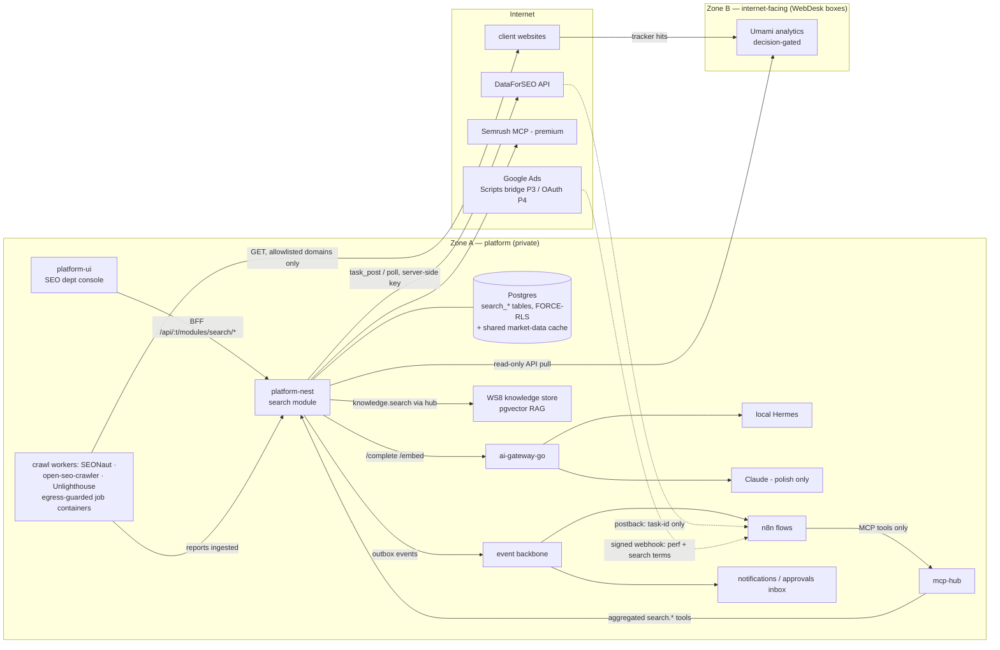
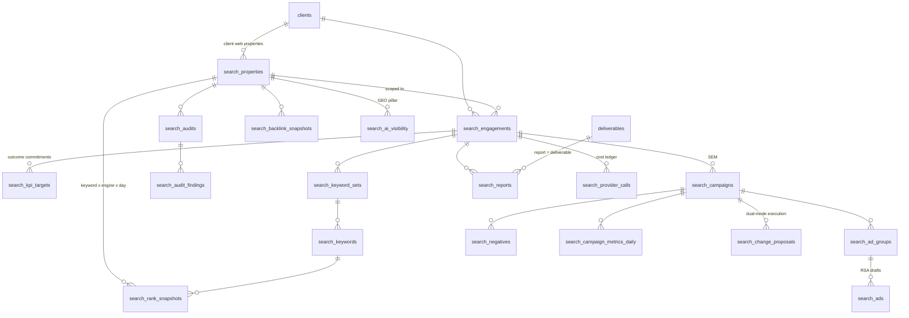

# Search-Marketing Subsystem — Architect Design (SEO · SEM · GEO)

> **Status:** Design blueprint — targets a future **`search-marketing` module, `0.0.0 · PLANNED`**
> (register in [`../modules/MODULES.md`](../modules/MODULES.md) on approval; nothing in this doc exists as code).
> **Version:** v1.1 · **Date:** 2026-07-23 · **Author:** System Architect (Claude)
> **v1.1 (same day):** owner resolved four open questions — console IA ratified (dept name **SEO**,
> Web-Dev-pattern craft groups), **dual-mode SEM execution** (manual export twin + automated
> WS4-gated API twin per action), **per-engagement tool-scope config** replaces fixed tiers, and the
> shared market-data cache is **ratified**. See §13 (remaining OQs) + §14 (D-4, D-8, D-10, D-11).
> **Primary input:** [`seo-sem-foundation.md`](./seo-sem-foundation.md) — foundation research + the
> **LOCKED §8a decisions** (DataForSEO Standard primary + Semrush premium behind a pluggable provider
> abstraction; local-Hermes-first AI; self-hosted crawlers for $0 audit work; Postgres caching;
> per-client metering; ~$8–10/client/mo blended). This design conforms to those locks and does not relitigate them.
> **Sibling deliverable:** the [WebDesk Engineering Blueprint](../BLUEPRINTS.md) — same rigor, same
> trust-zone thinking; where WebDesk is the *website execution* zone, search-marketing is a *data +
> judgment* subsystem that lives almost entirely inside the platform (Zone A).

---

## §00 · Executive summary

Search-marketing becomes a **platform-nest module vertical** (`ModuleContract` key **`search`**,
tables `search_*`) plus a **department console** on the dept-interface-template — *not* a fleet of
adopted external apps. The professional moat is data, not UI (foundation §4), so the architecture is:

1. **One provider abstraction inside platform-nest** — `SearchDataProvider` drivers (DataForSEO
   Standard primary, Semrush MCP premium, free-scraper fallback) behind a Postgres cache and a
   **per-client usage/cost ledger** that enforces budget stop-losses *before* money is spent.
   Which tools/pulls run at all for a given client is a **human-set per-engagement tool-scope
   config** (owner decision) — spend is, by construction, the sum of each engagement's enabled tools.
2. **Self-hosted crawlers as job-mode workers** (SEONaut, open-seo-crawler, Unlighthouse) — $0 API
   cost, egress-guarded, results ingested into RLS-scoped `search_audits`; the tools' own UIs and
   auth are never exposed.
3. **`open-seo` and SerpBear are mined, not run** (data-only verdict, §06): retrofitting
   single-tenant apps with FORCE-RLS + Keycloak + Cerbos costs more than implementing their (thin)
   data calls natively inside our module framework — and their UIs/MCP servers are redundant behind
   our console and mcp-hub.
4. **AI is local-first via ai-gateway-go**: Hermes for bulk (clustering, intent-tagging, negative
   classification, triage, first-draft narratives), Claude only for client-facing polish; embeddings
   via the gateway `/embed`; GEO/brief RAG through the WS8 knowledge store (D9-compliant).
5. **Everything that touches a live site or live ad spend is WS4-approval-gated** — AI drafts,
   human approves, a one-shot approval token authorizes execution. Every live-account action is
   additionally **dual-mode** (owner decision): a **manual twin** (approved proposal exports
   Ads-Editor-ready; a human applies it in the ad platform — zero OAuth, ships P3) and an
   **automated twin** (ERP pushes via API behind WS4 — P4, committed). The human picks per action.
6. **GEO/AEO is a first-class pillar**: AI-visibility snapshots (brand citations in AI answers),
   extractability audits, and citation-oriented content tooling — same entities, same provider
   abstraction, not a bolt-on; enabled per client by the engagement scope like every paid pull
   (not a fixed premium tier).

Build order is cost-honest: **P0 contracts → P1 $0-value (crawls + AI on own data) → P2 paid data
(needs the $50 DataForSEO deposit) → P3 SEM planning/reports + manual-apply path → P4 live-ads
OAuth writes (committed) + premium/analytics extras (decision-gated)**. 26 tickets P0–P3 plus 2
committed P4, /army-ready, in §12.

---

## §01 · Scope & pillars

### Pillars (all three first-class)

| Pillar | v1 delivers | Deferred |
|---|---|---|
| **SEO** | Technical audits (crawl/CWV/links), keyword research + intent clustering, rank tracking, backlink snapshots, content briefs + on-page drafts, outcome-tracked engagements + KPI targets, client reports | Log-file analysis; local SEO (GBP/citations); Bing Webmaster; disavow workflows (risky — human-only for now); full backlink inventory (snapshot aggregates only in v1) |
| **SEM** | Campaign/ad-group/ad **planning objects** built from keyword clusters; AI RSA drafts; negative-keyword proposals; imported performance (CSV / Ads-Scripts bridge); budget-pacing alerts; **dual-mode execution for every live action** — (a) *manual*: AI proposes → approved change proposal exports Ads-Editor-ready → human applies in the platform (zero OAuth, P3), and (b) *automated*: ERP pushes via API behind WS4 + one-shot approvalId (P4 committed, needs Google Ads OAuth) — human picks per action | Microsoft Ads; offline conversion import; automated bid strategies |
| **GEO / AEO** | AI-visibility snapshots per property (brand mentioned/cited across ChatGPT, AI Overviews, Gemini, Claude, Perplexity — via provider drivers), extractability audit kind, citation-oriented brief guidance (RAG over the property's crawled content). Enabled per client via the engagement tool scope, like every paid pull | Ansvisor-style dedicated tracker fork; automated GEO content rewriting at scale |

### Non-goals (v1)

- **No adopted external UIs** — the console is the only operator surface (foundation §7.7).
- **No direct vendor AI calls** — everything through ai-gateway-go (locked).
- **No client-facing portal changes** — reports deliver as files (Shared Drive + `deliverables`); a
  portal view can come later.
- **No Matomo** — Umami chosen (MIT, lighter); and even Umami is decision-gated (OQ-5).
- **No payroll/billing changes** — provider costs are metered in the ledger; invoicing them is the
  existing billing module's concern (a rollup metric feeds it).

### Fit with prior decisions

- Conforms to the **ERP holding-OS vision** (shared-service dept serving N companies): the module
  uses the standard enablement OR-clause (`enabled_modules` OR active `service_assignment`) and the
  WSD-3 module-sliced RLS wall, so an SEO department in the agency company can serve sibling
  companies' engagements without data bleed.
- Supersedes one line of the **dept-console IA plan**
  (`../superpowers/plans/2026-07-23-dept-console-ia-redesign.md` §2 sketched "SEO → Optimize: Site
  Audit · Keywords · Rankings · Content Briefs"). **Ratified by the owner 2026-07-23 (D-10):** the
  department keeps the name **SEO**, and its console follows the dept-interface-template exactly as
  Web Dev does — universal Home · Work · Connections spine plus **three craft groups** (Accounts /
  Optimize / Campaigns) as primary-strip divisions, since SEM cannot honestly fit in four SEO
  sub-tabs. `DeptTabs` supports N groups structurally; SM-23 updates the IA plan doc to match.

---

## §02 · System overview



**Reading the diagram.** All state and judgment live in Zone A. Three arrows cross to the internet:
crawler egress (allowlisted), provider API calls (server-side keys), and inbound webhooks that are
**notification-only** (DataForSEO postbacks carry a task id; the authoritative result is always
fetched over the authenticated API — inbound payloads are never trusted as data). Umami, which must
receive public traffic, sits in Zone B like everything internet-facing (WebDesk doctrine), and the
ERP only ever *pulls* from it.

---

## §03 · Trust zones & network

Follows the WebDesk zone doctrine (Zone A = private brain, Zone B = internet-facing execution,
one-way control), adapted to this subsystem's actual exposure:

| Surface | Zone | Rules |
|---|---|---|
| `search` module + provider layer + ledger | **A** | Paid API keys (DataForSEO, Semrush) are **server-side env → OpenBao target-state**, held only by platform-nest (mirrors "bot never holds provider keys"). Never in the browser, never per-request from the UI, never in n8n credentials. |
| Crawl workers (SEONaut / open-seo-crawler / Unlighthouse) | **A, egress-only** | No inbound ports. **Egress guard:** may fetch only domains registered + verified on a `search_properties` row (allowlist resolved at job dispatch), deny RFC-1918/link-local/metadata IPs after DNS resolution (SSRF), respect robots.txt, identified UA, per-host rate cap. Same DialContext-enforcement idea as the gateway's egress allowlist. |
| DataForSEO postback / Ads-Scripts webhook | **edge → n8n** | Inbound webhooks land on n8n (the existing signed-webhook bridge pattern): HMAC-signed or secret-path, schema-validated, and **treated as triggers only** — n8n calls an MCP tool; the module fetches authoritative data itself. A forged webhook can cause at most a redundant authenticated fetch. |
| Umami (if approved) | **B** | Deployed with the WebDesk boxes (or own VPS); client sites embed its tracker. ERP holds a read-only API token and pulls; Umami has zero credentials into Zone A. One Umami "website" per `search_properties` row; the mapping lives on our side. |
| Client Google accounts (GSC/GA4/Ads — P4) | **A vault** | Per-client OAuth tokens ride the existing **`integration_connections` vault** (0033: AES-256-GCM at rest, `hasToken` reads only) with `owner_kind` widened to `'client'` and new providers — see §04. |

---

## §04 · Domain model & schema

### Design rules (inherited, not optional)

- Every tenant table: `tenant_id uuid NOT NULL REFERENCES companies(id)`, `origin_site`,
  `created_at/updated_at`, soft-delete `deleted_at` where user-facing.
- **FORCE-RLS with the WSD-3 third wall** — policy predicate
  `tenant_id = ANY(app_current_tenants()) AND app_module_allowed('search')` on both USING and
  WITH CHECK, byte-identical to [`0028_module_hr.sql`](../../platform-nest/migrations/0028_module_hr.sql).
  App side reaches these tables only via `withTenants(tenants, { modules: ['search'] })`.
- Migrations: take the **next unused number** per
  [`migrations/README.md`](../../platform-nest/migrations/README.md) (0034+ as of 2026-07-23); no
  in-migration GRANTs (default privileges + `RUNTIME_GRANTS_SQL` cover it); no `sync_app` grants
  (search tables do not sync in v1).
- Money: minor units `bigint` + `currency` for client-facing money (SEM budgets/spend);
  **provider cost is `numeric(12,6)` USD** (DataForSEO unit prices go to $0.00012 — minor-unit
  integers can't hold them).

### Entity map



### Tables (DDL sketch — illustrative, refined at SM-01)

**`search_properties`** — the client web property; anchor for crawls, ranks, GEO, analytics.

```sql
CREATE TABLE search_properties (
  id uuid PRIMARY KEY,
  tenant_id uuid NOT NULL REFERENCES companies(id),
  client_id uuid NOT NULL REFERENCES clients(id),
  domain text NOT NULL,                  -- registrable domain; crawl-allowlist source
  site_url text NOT NULL,                -- canonical origin
  targets jsonb NOT NULL DEFAULT '[]',   -- [{engine:'google',device:'desktop',locale:'id-ID',location_code:...}]
  umami_site_id text,                    -- Zone B analytics binding (nullable)
  gsc_connection_id uuid REFERENCES integration_connections(id),   -- P4
  ga4_connection_id uuid REFERENCES integration_connections(id),   -- P4
  ads_connection_id uuid REFERENCES integration_connections(id),   -- P4
  verified_at timestamptz,               -- crawl-consent checkpoint (activation checklist)
  status text NOT NULL DEFAULT 'active' CHECK (status IN ('active','paused','archived')),
  origin_site text NOT NULL, created_at timestamptz NOT NULL DEFAULT now(),
  updated_at timestamptz NOT NULL DEFAULT now(), deleted_at timestamptz,
  UNIQUE (tenant_id, client_id, domain)
);
```

**`search_engagements`** — the outcome-tracked engagement (foundation §3: "an outcome-tracked
engagement, not a task list").

```sql
CREATE TABLE search_engagements (
  id uuid PRIMARY KEY,
  tenant_id uuid NOT NULL REFERENCES companies(id),
  client_id uuid NOT NULL REFERENCES clients(id),
  property_id uuid NOT NULL REFERENCES search_properties(id),
  project_id uuid REFERENCES projects(id),      -- optional: ties into PM/time/deliverables
  name text NOT NULL,
  scope_preset text CHECK (scope_preset IN ('light','standard','heavy','custom')),
      -- label only: presets SEED tool_scope (§8a cost-tier shapes); enforcement never reads it
  tool_scope jsonb NOT NULL DEFAULT '{}',
      -- THE per-engagement tool/scope config (owner decision, ex-OQ-6): a human enables each
      -- tool / paid pull per client. Every scheduled flow and every paid dispatch consults it.
      -- Shape (illustrative): {"rank":{"enabled":true,"cadence":"weekly","maxKeywords":50},
      --   "volume":{"enabled":true},"backlinks":{"enabled":false},
      --   "ai_visibility":{"enabled":true,"cadence":"weekly"},
      --   "audit_technical":{"enabled":true,"cadence":"weekly"},"audit_cwv":{"enabled":true},
      --   "sem_sync":{"enabled":false,"mode":"manual"},
      --   "provider":{"rank":"dataforseo","backlinks":"semrush"}}   -- per-tool provider override (§05)
  provider_budget_usd numeric(12,6) NOT NULL DEFAULT 10.0,  -- monthly data-spend cap (stop-loss)
  media_budget_minor bigint, media_currency text,           -- SEM ad spend plan (client money)
  status text NOT NULL DEFAULT 'draft' CHECK (status IN ('draft','active','paused','closed')),
  owner_id uuid REFERENCES users(id),
  starts_on date, ends_on date,
  custom_fields jsonb NOT NULL DEFAULT '{}',    -- D17 target
  origin_site text NOT NULL, created_at timestamptz NOT NULL DEFAULT now(),
  updated_at timestamptz NOT NULL DEFAULT now(), deleted_at timestamptz
);
```

**`search_kpi_targets`** — committed outcomes per engagement: `metric_key` (canonical:
`organic_sessions`, `top10_keywords`, `conversions`, `cpa_minor`, `roas_ratio`, `ai_citations`, …),
`baseline_value`, `target_value`, `due_period`, `direction ('up'|'down')`. Reports measure against these.

**Keywords & clustering** — `search_keyword_sets` (per engagement; `source
('client','gsc','research','ai')`) and `search_keywords`:

```sql
CREATE TABLE search_keywords (
  id uuid PRIMARY KEY,
  tenant_id uuid NOT NULL REFERENCES companies(id),
  set_id uuid NOT NULL REFERENCES search_keyword_sets(id),
  keyword text NOT NULL, locale text NOT NULL DEFAULT 'id-ID',
  intent text CHECK (intent IN ('informational','commercial','transactional','navigational')),
  cluster_id uuid, cluster_label text,          -- assigned by the clustering job
  embedding vector(768),                        -- DUAL-MODE like WS8 store: float8[] fallback when
                                                -- the extension is absent (see AI note below)
  volume integer, difficulty numeric(5,2), cpc_usd numeric(12,6),
  metrics_fetched_at timestamptz,               -- cache stamp: no provider re-query inside the window
  is_tracked boolean NOT NULL DEFAULT false,    -- tracked = rank-pulled on schedule (costs money)
  origin_site text NOT NULL, created_at timestamptz NOT NULL DEFAULT now(),
  updated_at timestamptz NOT NULL DEFAULT now(), deleted_at timestamptz,
  UNIQUE (tenant_id, set_id, keyword, locale)
);
```

**`search_rank_snapshots`** — append-only time series: `property_id`, `keyword_id`, `engine`,
`device`, `location_code`, `captured_at`, `position` (nullable = not found), `ranked_url`,
`serp_features jsonb` (`{ai_overview:bool, featured_snippet:bool, local_pack:bool, …}` — the GEO
signal rides here too), `provider`, `provider_call_id`. Index `(property_id, keyword_id,
captured_at DESC)`. Volume at 100 clients ≈ 150–300k rows/mo — fine unpartitioned; a
retention/rollup policy (daily→weekly after 6 months) is a noted v2 item.

**Audits** — `search_audits` (`kind ('technical','cwv','content','links','geo')`, `source
('seonaut','crawler','unlighthouse','ai')`, `status`, `score`, `summary jsonb` severity counts,
`report_file_id → files` for the raw export) and `search_audit_findings` (`code`, `severity`,
`category`, `message`, `url_count`, `sample_urls jsonb`, `status
('open','fixed','ignored','regressed')`, `first_seen_audit_id`, `last_seen_audit_id`). Regression =
diff of consecutive completed audits of the same kind; emits `search.audit.regression`.

**`search_backlink_snapshots`** — monthly aggregates: `totals jsonb` (backlinks, ref_domains,
authority score), `new_links jsonb` / `lost_links jsonb` (top-N samples). Full link inventory is
deliberately **not** stored in v1 (pay-as-you-go cost + bulk).

**`search_ai_visibility`** (GEO) — `property_id`, `captured_at`, `engine
('chatgpt','google_ai_overview','gemini','claude','perplexity')`, `query`, `brand_mentioned bool`,
`cited bool`, `cited_url`, `prominence numeric`, `raw jsonb`, `provider`, `provider_call_id`.

**SEM** — `search_campaigns` (`engagement_id`, `platform ('google_ads','microsoft_ads')`,
`external_id` nullable until linked, `objective`, `status
('draft','proposed','live','paused','ended')` — draft/proposed are ERP-side states; live states
mirror the platform once linked, `budget_minor + currency`, `bid_strategy`, `target_cpa_minor`,
`target_roas numeric`, `custom_fields` D17), `search_ad_groups` (`campaign_id`, `name`,
`cluster_id` — built *from* keyword clusters, `external_id`), `search_ads` (RSA drafts:
`ad_group_id`, `headlines jsonb`, `descriptions jsonb`, `final_url`, `status
('draft','approved','live','rejected')`, `ai_generated bool`), `search_negatives` (`campaign_id`,
`ad_group_id` nullable, `term`, `match_type`, `source ('ai','manual','sweep')`, `status
('proposed','approved','applied','dismissed')`), `search_campaign_metrics_daily` (`campaign_id`,
`date`, `impressions`, `clicks`, `cost_minor`, `conversions numeric`, `conv_value_minor`;
`UNIQUE(campaign_id, date)`; source CSV import or the Ads-Scripts bridge).

**`search_change_proposals`** — the dual-mode execution artifact (owner decision, ex-OQ-4). Every
live-account action (launch, pause, budget/bid change, negatives batch, ads batch) is first a
proposal row; the human picks the mode per action:

```sql
CREATE TABLE search_change_proposals (
  id uuid PRIMARY KEY,
  tenant_id uuid NOT NULL REFERENCES companies(id),
  campaign_id uuid NOT NULL REFERENCES search_campaigns(id),
  kind text NOT NULL CHECK (kind IN ('launch','pause','budget','bid','negatives_batch','ads_batch')),
  payload jsonb NOT NULL,                       -- the exact intended change (hashed for approval match)
  status text NOT NULL DEFAULT 'proposed' CHECK (status IN ('proposed','approved','applied','dismissed')),
  mode text NOT NULL DEFAULT 'manual' CHECK (mode IN ('manual','api')),  -- human-chosen per action
  approval_id uuid REFERENCES automation_approvals(id),  -- WS4 link (api mode; one-shot, §07)
  export_file_id uuid REFERENCES files(id),     -- Ads-Editor-ready artifact (manual mode)
  proposed_by uuid REFERENCES users(id), approved_by uuid REFERENCES users(id),
  applied_by uuid REFERENCES users(id), applied_at timestamptz,
  origin_site text NOT NULL, created_at timestamptz NOT NULL DEFAULT now(),
  updated_at timestamptz NOT NULL DEFAULT now(), deleted_at timestamptz
);
```

Manual mode records who applied it in the ad platform (`applied_by/applied_at`, artifact attached);
api mode executes only by consuming the one-shot approval (§07). `search_negatives.status='applied'`
and `search_ads.status='live'` are stamped by the proposal that carried them.

**`search_reports`** — `engagement_id`, `period`, `kind ('monthly','audit','adhoc')`, `status
('draft','in_review','approved','delivered')`, `metrics jsonb` (frozen snapshot incl. KPI-vs-target),
`narrative_md text` (AI draft → human-edited), `file_id → files` (rendered artifact, mirrored to
Shared Drive per WS11), `deliverable_id → deliverables` (so reports surface in the agency
deliverable flow), `approved_by/at`, `delivered_at`.

**`search_provider_calls`** — the metering ledger (§05). **`search_data_cache`** — the shared
market-data cache (§05, **deliberately no-RLS** — ratified by the owner 2026-07-23, D-4).

### Custom fields & relations to the agency vertical

- D17 `customFieldTargets`: `search_engagement`, `search_campaign`.
- **Clients** are the existing core `clients` rows — no duplicate client table (P5c lesson).
- **Deliverables/time:** reports link into core `deliverables`; hours are logged through the normal
  `time_entries` path against the optional `project_id`. The engagement is the search-specific
  overlay, not a parallel PM system.

---

## §05 · Data-provider abstraction

### The interface (platform-nest, `src/modules/search/providers/`)

**Verdict: the provider layer lives inside platform-nest** (not a separate service, not a running
`open-seo` fork): metering must be transactional with the ledger (same DB/txn), RLS scoping is
native, DataForSEO is plain REST, and no new deployable is created. `open-seo`'s DataForSEO wiring
is mined as reference (§06).

```ts
// Design sketch — capability-based so drivers can be partial.
interface SearchDataProvider {
  key: 'dataforseo' | 'semrush' | 'scraper';
  capabilities: Set<'serp' | 'volume' | 'suggestions' | 'difficulty'
                  | 'backlinks' | 'competitors' | 'ai_visibility'>;
  // Async-queue model (DataForSEO Standard): post returns a task ref; results arrive by
  // poll or postback-triggered fetch. Live/sync providers resolve immediately.
  postSerpTasks(reqs: SerpRequest[]): Promise<TaskRef[]>;
  fetchSerpResults(refs: TaskRef[]): Promise<SerpResult[]>;
  getKeywordMetrics(kws: KeywordQuery[]): Promise<KeywordMetrics[]>;   // volume/cpc/difficulty
  getBacklinkSummary(target: string): Promise<BacklinkSummary>;
  getAiVisibility(q: AiVisibilityQuery): Promise<AiVisibilityResult[]>;
  estimateCostUsd(op: ProviderOp): number;      // consulted BEFORE dispatch (stop-loss)
}
```

**Selection order** per call: engagement `tool_scope.provider` override → tenant default → platform
default (`dataforseo`, Standard queue). Semrush serves premium engagements; the `scraper` driver
(free autocomplete/PAA per the keyword-research-tool reference) is a capability-limited fallback
for suggestions only.

### Caching-in-Postgres (the §8a lever 4)

`search_data_cache` — **shared, no-RLS** (like `companies`): market data is public-world data, and
the whole cost win is cross-tenant reuse (the same keyword volume serves N clients).

```sql
CREATE TABLE search_data_cache (
  cache_key text PRIMARY KEY,      -- canonical: kind|provider-class|norm(query)|engine|locale|location
  kind text NOT NULL CHECK (kind IN ('serp','volume','suggestions','backlinks','competitors','ai_visibility')),
  payload jsonb NOT NULL,
  provider text NOT NULL,
  cost_usd numeric(12,6) NOT NULL DEFAULT 0,
  fetched_at timestamptz NOT NULL DEFAULT now(),
  expires_at timestamptz NOT NULL   -- per-kind TTL: volume 30d · serp 24h (tracked ranks bypass cache) ·
);                                  -- suggestions 14d · backlinks 7d · ai_visibility 7d
```

Rules: **only the provider layer reads/writes it** (never serialized raw to tenant APIs — results
are copied onto tenant rows); it contains no client identifiers or client-private data; single-flight
dispatch (advisory lock per cache_key) prevents stampedes. This is a deliberate, documented RLS
exemption — **ratified by the owner 2026-07-23 (D-4)**.

### The usage/cost ledger (metering → per-client billing)

```sql
CREATE TABLE search_provider_calls (
  id uuid PRIMARY KEY,
  tenant_id uuid NOT NULL REFERENCES companies(id),
  engagement_id uuid REFERENCES search_engagements(id),
  property_id uuid REFERENCES search_properties(id),
  provider text NOT NULL, endpoint text NOT NULL,      -- e.g. 'serp.google.organic.task_post'
  items integer NOT NULL DEFAULT 1,
  cost_usd numeric(12,6) NOT NULL,                     -- estimated at dispatch, trued-up on completion
  cache_hit boolean NOT NULL DEFAULT false,            -- hits logged at cost 0 (visibility of savings)
  status text NOT NULL DEFAULT 'posted' CHECK (status IN ('posted','completed','failed')),
  requested_by uuid REFERENCES users(id),              -- human or the automation OBO user
  correlation_id text,                                 -- n8n run / MCP call id
  origin_site text NOT NULL, created_at timestamptz NOT NULL DEFAULT now()
);  -- RLS: standard search-module wall. Indexed (tenant_id, engagement_id, created_at DESC).
```

**Scope + budget stop-loss (fail-closed, checked in one place before dispatch):**
(0) the capability must be **enabled in the engagement's `tool_scope`** (the human-set client scope,
§04 — a disabled tool is refused with the toggle named, regardless of budget); then month-to-date
`SUM(cost_usd)` vs — engagement `provider_budget_usd` → tenant monthly cap → global platform cap
(env, default $150/mo until the deposit model is proven). Any breach: the call is refused, a
`search.provider.budget_threshold` event is emitted (also at 80%), and the console shows the blocked
state. Manual override = elevated permission (`search:provider:admin`) + audit.
The ledger powers: per-engagement usage panel, tenant admin rollup, the
`search.provider_cost.month` rollup metric (feeds billing), and the §8a "blended $/client" truth —
**spend = Σ each engagement's enabled tools**, exactly the owner's cost model. The scope panel
(SM-29) shows a projected monthly cost per toggle (Σ enabled tools × cadence × `estimateCostUsd`)
so the human sees the price of each switch before flipping it.

---

## §06 · Fork/adapt plan per repo

Per the lock: fork base `open-seo`, supplements as listed; the **monolith-adapt vs data-only call
is made here, per tool**. "Data-only" = we take its data/engine/reference, never run its UI/auth.

| Repo | Verdict | Keep | Strip / never run | Add / how it plugs in |
|---|---|---|---|---|
| **every-app/open-seo** | **Data-only (mine, don't run).** Retrofitting a single-tenant all-in-one with FORCE-RLS + Keycloak + Cerbos exceeds the cost of native implementation; its UI is banned by foundation §7.7 anyway; its MCP server is redundant — mcp-hub aggregates our `ModuleContract.mcpTools` natively. | DataForSEO client code + endpoint coverage map; MCP tool shapes as a checklist; audit heuristics | The running app, its auth, its UI, its MCP server | Its DataForSEO wiring informs the `dataforseo` driver (SM-05); tool list informs `search.*` MCP tools |
| **SEONaut** (Go+MySQL) | **Adapt, job-mode container.** Keep the crawler+audit engine; one crawl = one stateless job; tenancy lives in OUR ingest, so no multi-tenant retrofit needed. | Crawl engine, severity-ranked audit rules | Its web UI + login; long-running server mode | Compose job container (+ ephemeral MySQL sidecar); adapter parses its report → `search_audit_findings`. **Fallback (spike SM-07):** if the MySQL sidecar proves too heavy, open-seo-crawler becomes primary and SEONaut's *rules* are ported into the ingest adapter |
| **open-seo-crawler** | **Adapt, job-mode.** Deep-crawl worker (Screaming-Frog-alt). | Concurrent crawler, sitemap hygiene, exports | Any UI | Job container; XLSX/JSON export → ingest adapter; crawled page content also feeds WS8 knowledge ingest (briefs/GEO RAG) |
| **Unlighthouse** | **Data-only CLI, job-mode.** No adaptation beyond a wrapper. | Site-wide Lighthouse/CWV JSON | Its report UI | n8n-scheduled CLI job → JSON → `search_audits(kind='cwv')`; also wire into WS10 CI for WebDesk-hosted sites later |
| **SerpBear** | **Data-only (reference; don't run).** Running it would create a second rank store outside RLS and a duplicate scheduler (n8n owns schedules). | Its pluggable SERP-scraper adapter list | The app | Adapter list informs the `scraper` fallback driver; rank UX informs the Rankings tab |
| **Umami** | **Run stock as shared infra (like Keycloak/n8n) — no fork.** Internet-facing ⇒ **Zone B** placement (OQ-5). | Everything (stock container, own Postgres DB per db-topology pattern) | Nothing (its multi-site model is used as-is) | One Umami website per `search_properties`; ERP stores `umami_site_id` + read-only API token; console pulls summaries. **Decision-gated** |
| **Claude Ads** | **Integrate as MCP tooling, phased.** P3: its Google-Ads-Scripts patterns → the read bridge **plus the manual-apply twin** (approved change proposals export Ads-Editor-ready — no OAuth). P4 (committed): its MCP/API surface executes api-mode proposals, registered behind mcp-hub with `write:true, impact:'high'` ⇒ every mutation suspends into WS4. | Audit/budget-check/draft-first patterns, scripts | Direct-to-platform key custody (keys live in our vault, calls via our envelope) | SEM console buttons → change proposals → manual export **or** `search.applyNegatives` / `search.setBudget` / `search.launchCampaign` tools → approval queue |
| *(minor)* keyword-research-tool (py) / Ansvisor | Reference-only | Autocomplete/PAA technique; GEO metric ideas | — | Folded into the `scraper` driver + `ai_visibility` design |

---

## §07 · AI design

### Task → model routing (all via ai-gateway-go; never direct vendor calls)

| Task | Model | Trigger | Notes |
|---|---|---|---|
| Keyword/intent clustering | gateway `/embed` (local) + **Hermes** labels | Keywords tab, bulk | Embeddings on `search_keywords.embedding`; cluster (cosine/HDBSCAN-style in the service); Hermes names clusters + tags intent |
| Search-term → negative classification | **Hermes** + rules | Weekly sweep / import | Output = `search_negatives(status='proposed')` |
| Audit-finding triage & fix drafts | **Hermes** | Post-audit | Summary + prioritized fix list on the audit |
| Meta/title/on-page suggestions | **Hermes** | Per page/finding | Draft artifacts only |
| Content briefs (+ GEO extractability guidance) | **Hermes** draft → **Claude** optional polish | Briefs tab | RAG over the property's crawled content via **WS8 `knowledge.search`** (D9: WS8 stays the sole owner of derived knowledge stores — crawler output is ingested as tenant-ACL'd knowledge sources) |
| Report narrative | **Hermes** draft → **Claude** polish where the engagement's `tool_scope` enables it | Monthly flow | Client-facing = the one place cloud polish defaults on (per §8a AI budget +$50–150/mo) |
| RSA ad copy | **Hermes** draft → **Claude** final for approved launches | Ads Studio | Drafts never auto-publish |

**pgvector note (flagged for D9 hygiene):** `search_keywords.embedding` is an *operational feature
column* for clustering — not a retrieval store — and copies the WS8 dual-mode pattern
([`ai-agents/src/knowledge/store.ts`](../../ai-agents/src/knowledge/store.ts)): pgvector when the
extension exists, `float8[]` + app-side cosine fallback otherwise (keeps plain-PG tests green).
Anything retrieval-shaped (briefs, GEO corpus) goes through WS8. Requires the `vector` extension in
the platform DB images (OQ-8).

### AI-drafts → human-approves → execute (the WS4 spine)

1. AI produces a **draft row** (`search_ads.status='draft'`, `search_negatives.status='proposed'`,
   `search_reports.status='draft'`, brief docs) — always persisted, never applied.
2. A human either edits/approves in-console (low-impact artifacts: briefs, reports — gated by
   module permissions like `search:report:approve`), or — for anything touching a **live site or
   live spend** — the action goes through the **WS4 approvals surface**: the MCP tool is declared
   `write:true, impact:'high'`, the hub write-gate suspends it into `automation_approvals`, and it
   appears in the existing approvals inbox.
3. **Execute — dual-mode per action (owner decision, ex-OQ-4):** every live-account action
   materializes as a `search_change_proposals` row (§04) and the human picks its mode:
   **(a) manual** — the approved proposal exports an Ads-Editor-ready artifact; a human applies it
   in the ad platform and marks it applied (permission-gated, `applied_via` recorded, artifact
   attached — zero OAuth, ships P3). **(b) automated** — the ERP pushes it over the ads API (P4,
   committed, needs Google Ads OAuth): the tool is `impact:'high'`, suspends into WS4, and the
   executor consumes a **one-shot `approvalId`** (status `approved`, matching the proposal's
   payload hash, unconsumed) — consuming it executes exactly once. v1 thereby avoids the deferred
   Temporal-resume problem the same way WS4 did: the approved row is the authorization artifact.
   No approval, no API execution — including for humans in the console.

### SEO data as MCP tools (WS8 agents)

Registered via `ModuleContract.mcpTools` (aggregated by mcp-hub — nothing hub-side to hardcode).
Reads are `minAssurance:'low'`; **paid-data pulls are declared `write:true, impact:'medium'` even
though they're semantically reads — they spend money**, so automation principals route through the
D14 gate and the ledger records `requested_by` = the OBO automation user:

| Tool | Kind | Impact |
|---|---|---|
| `search.listEngagements` / `search.rankSummary` / `search.auditSummary` / `search.ledgerSummary` | read | — |
| `search.keywordResearch` (volume/suggestions) | paid pull | medium (budget-checked) |
| `search.pullRanks` / `search.pullBacklinks` / `search.pullAiVisibility` | paid pull | medium |
| `search.runAudit` | job trigger ($0) | low |
| `search.clusterKeywords` / `search.draftBrief` / `search.proposeNegatives` / `search.draftReport` | AI draft | low (writes drafts only) |
| `search.exportProposal` (manual-mode Ads-Editor artifact for an approved change proposal) | export | low (no live side effect) |
| `search.applyNegatives` / `search.setBudget` / `search.launchCampaign` / `search.publishContent` | live mutation (api-mode execution of an approved change proposal) | **high → always suspends to WS4** |

---

## §08 · Console UX (dept-interface-template)

One department console — dept name **"SEO"** (ratified by the owner 2026-07-23, D-10), slug `seo` —
on the two-level dept-interface-template **exactly as Web Dev uses it**: universal spine
**Home · Work · Connections** + **three craft groups** as primary-strip divisions (supersedes the IA
plan's single-"Optimize" sketch; SM-23 updates that doc):

| Group | Sub-tabs (route under `/departments/seo/`) |
|---|---|
| **Accounts** | Engagements (`engagements`) · Reports (`reports`) |
| **Optimize** (SEO+GEO) | Site Audit (`audit`) · Keywords (`keywords`) · Rankings (`rankings`) · Content Briefs (`briefs`) · AI Visibility (`ai-visibility`) |
| **Campaigns** (SEM) | Planner (`planner`) · Ads Studio (`ads`) · Search Terms (`search-terms`) · Pacing (`pacing`) |

Home = the command-center template (KPI strip from rollup metrics: active engagements, top-10
keywords, critical findings, MTD provider spend, MTD ad spend; activity feed via `work_activity`;
launcher row: Google Search Console, GA4, Google Ads, Looker Studio, Claude). The My-work rail is
inherited unchanged. Connections gains the property/provider link states.

### Button capability matrix (explicitly requested)

**Legend — what each action needs:** 🟢 **AI/crawler-only** (local Hermes + gateway + our own
crawlers; buildable and usable immediately, $0 external) · 🔵 **DATA KEY** (DataForSEO deposit
funded — or Semrush premium; ledger/budget-checked) · 🟠 **ADS LINK** (client ad-account OAuth, P4)
· 🔴 **WS4 APPROVAL** (human decision required before execution).
Every 🔵 action is additionally gated by the **engagement's tool-scope config** (§04/§05): if the
human hasn't enabled that tool for the client, the button renders disabled and names the missing
toggle. Every live-account action is **dual-mode** — the manual twin (🟢, export + human applies)
and the automated twin (🟠 + 🔴) appear side by side; the human picks per action.

| Console action | Tab | Needs | Gate |
|---|---|---|---|
| Create engagement / property / KPI targets | Engagements | — | permission only |
| **Configure engagement scope & budget** (per-tool toggle grid + cadence + caps + projected cost) | Engagements | — | `search:scope:write` |
| Run technical audit (SEONaut/crawler) | Site Audit | 🟢 | low |
| Run CWV scan (Unlighthouse) | Site Audit | 🟢 | low |
| AI triage findings / draft fixes | Site Audit | 🟢 | draft only |
| Import keywords (CSV / paste / GSC export file) | Keywords | 🟢 | — |
| AI cluster + intent-tag set | Keywords | 🟢 | draft only |
| Fetch volume / difficulty / CPC | Keywords | 🔵 | budget stop-loss |
| Keyword suggestions (autocomplete/PAA) | Keywords | 🟢 (scraper) / 🔵 richer | budget if 🔵 |
| Track keywords / Pull ranks now | Rankings | 🔵 | budget stop-loss |
| Backlink snapshot | Rankings | 🔵 | budget stop-loss |
| Draft content brief (RAG over own crawl) | Briefs | 🟢 | draft only |
| Polish brief/content with Claude | Briefs | 🟢 (cloud AI, gateway-capped) | draft only |
| **Publish content to client site (WebDesk)** | Briefs | WebDesk P5 seam | 🔴 |
| Pull AI visibility (GEO) | AI Visibility | 🔵 | budget stop-loss |
| Build campaign plan from clusters | Planner | 🟢 | draft only |
| Generate RSA drafts | Ads Studio | 🟢 | draft only |
| Import performance CSV | Pacing | 🟢 | — |
| Live perf/search-term sync (Scripts bridge P3 / OAuth P4) | Pacing / Search Terms | bridge or 🟠 | — (read) |
| AI propose negatives | Search Terms | 🟢 (on imported/synced terms) | draft only |
| Apply negatives — **manual twin**: export approved proposal (Ads-Editor CSV) + mark applied | Search Terms | 🟢 | `search:campaign:launch` |
| Apply negatives — **automated twin**: API push | Search Terms | 🟠 | 🔴 |
| Budget / bid / pause — **manual twin**: export + mark applied | Pacing | 🟢 | `search:campaign:launch` |
| Budget / bid / pause — **automated twin** | Pacing | 🟠 | 🔴 |
| Launch campaign — **manual twin**: export build sheet + mark applied | Planner | 🟢 | `search:campaign:launch` |
| Launch campaign — **automated twin** | Planner | 🟠 | 🔴 |
| Generate report (metrics + AI narrative) | Reports | 🟢 (🔵 enriches) | `search:report:approve` then deliver |
| Deliver report (Shared Drive + deliverable) | Reports | 🟢 | after approve |
| View usage ledger / raise engagement budget | Engagements | — | `search:ledger:read` / `search:provider:admin` |

Everything 🟢 ships value in **P1 with zero external spend** — that is deliberate.

---

## §09 · ERP integration points

| Subsystem | Integration (concrete) |
|---|---|
| **platform-nest** | `ModuleContract` key `search`; controller `@Controller("api/:tenantId/modules/search")` (hr convention); `ModuleEnabledGuard`; enablement via `enabled_modules` OR active `service_assignment` (shared-service dept serving N companies works day one) |
| **BFF contract** | New section in [`../FRONTEND-BFF-CONTRACT.md`](../FRONTEND-BFF-CONTRACT.md): `/api/:t/modules/search/{properties,engagements,engagements/:id/scope,kpi-targets,keyword-sets,keywords,ranks,audits,findings,backlinks,ai-visibility,campaigns,ad-groups,ads,negatives,change-proposals,metrics-daily,reports,ledger,research/*}` — shapes canonical in `platform-ui/src/lib/search.ts` (frontend-first rule) |
| **mcp-hub** | `search.*` tools via `mcpTools` aggregation (§07 table); no hub changes needed |
| **ai-gateway-go** | `/complete` (Hermes default, Claude flagged) + `/embed`; gateway budget caps + DLP + egress audit apply automatically |
| **WS8 knowledge** | Crawled site content ingested as tenant-ACL'd sources; briefs/GEO retrieval via `knowledge.search` (D9 preserved) |
| **automation (n8n)** | Flows in §10; backbone rule respected — n8n orchestrates, MCP accesses, zero logic in workflows |
| **WS4 approvals** | High-impact `search.*` tools suspend into `automation_approvals`; api-mode change proposals execute only with a one-shot approved `approvalId`; manual-mode proposals bypass the API entirely (human applies in-platform, recorded) (§07) |
| **Event backbone** | Outbox events: `search.rank.dropped`, `search.audit.completed`, `search.audit.regression`, `search.backlinks.lost_spike`, `search.budget.overspend`, `search.provider.budget_threshold`, `search.report.ready_for_review`, `search.report.delivered`, `search.campaign.proposed`, `search.ai_visibility.changed` → notifications bell + n8n bridge |
| **Files / Shared Drive (WS11)** | Raw crawl exports + rendered reports as `files` rows mirrored to the client's Drive folder |
| **Rollups (D12)** | Metrics: `search.engagements.active` (count) · `search.rank.top10` (count) · `search.audits.critical_open` (count) · `search.provider_cost.month` (money_minor USD, isMonetary) · `search.sem_spend.month` (money_minor, per-currency dimension) · `search.reports.delivered` (count) |
| **Cerbos** | New resource policies (§11); UI capabilities mirrored in `lib/rbac.ts` (defence-in-depth, Cerbos authoritative) |
| **observability (WS9)** | OTel spans on provider calls (attrs: provider, endpoint, items, cost_usd, cache_hit), crawl jobs, AI calls; ledger-vs-cap gauge; fail-soft `OTEL_ENABLED` |
| **integration_connections (0033)** | Widen `provider` CHECK (`google_search_console`,`google_analytics`,`google_ads`,`semrush`) + `owner_kind` `'client'` (polymorphic owner_id → clients.id, no FK — same convention as 0030). Tokens only ever via `setConnectionTokens` (P4 OAuth) |
| **WebDesk (Zone B)** | Content-publish seam: `search.publishContent` targets the WebDesk content engine for WebDesk-hosted clients (post-WebDesk-P3); until then briefs/drafts export as files |

---

## §10 · Automation flows (n8n / WS4)

All flows are thin orchestrations calling `search.*` MCP tools (impact-gated automatically). JSON
lives in [`automation/workflows/`](../../automation/workflows/), kebab-named like the existing set.
**Scheduling is scope-driven:** each flow iterates only engagements whose `tool_scope` enables the
tool at the due cadence — the module filters (n8n stays logic-free per the backbone rule).

| Flow | Schedule / trigger | MCP calls | Phase |
|---|---|---|---|
| `sm-site-audit` | weekly per active property (staggered) | `search.runAudit(kind='technical')` → (on event) `search.auditSummary` → notify | P1 |
| `sm-cwv-scan` | weekly | `search.runAudit(kind='cwv')` | P1 |
| `sm-rank-pull` | cadence from each engagement's `tool_scope` (daily/weekly) | `search.pullRanks` (posts Standard tasks; scope+ledger-checked) | P2 |
| `sm-rank-collect` | webhook (DataForSEO postback, task-id only) + safety poll | `search.ingestRankResults(taskRefs)` (authoritative API fetch inside the module) | P2 |
| `sm-keyword-refresh` | monthly | `search.keywordResearch` for tracked sets (cache-aware) | P2 |
| `sm-backlink-snapshot` | monthly | `search.pullBacklinks` | P2 |
| `sm-ai-visibility` | weekly, per engagement scope | `search.pullAiVisibility` | P2 |
| `sm-provider-ledger-guard` | daily | `search.ledgerSummary` → threshold events → notify/pause pulls | P2 |
| `sm-search-term-sweep` | weekly (terms via CSV import or the Ads bridge) | ingest terms → `search.proposeNegatives` → change proposals → console/approvals | P3 |
| `sm-budget-pacing` | daily | pacing calc via `search.pacingSummary` → `search.budget.overspend` event; proposed pause = a `budget`/`pause` change proposal — manual export or 🔴 api push per the mode the human picks | P3 |
| `sm-monthly-report` | monthly per engagement | `search.draftReport` → notify reviewer → on approve `search.deliverReport` (Drive + deliverable + notify) | P3 |

---

## §11 · Trust & security

- **Key custody.** DataForSEO/Semrush keys: platform-nest env → OpenBao target-state; never in
  platform-ui, never in n8n credential stores, never per-tenant rows. Client OAuth tokens (P4):
  `integration_connections` vault only (AES-256-GCM, `hasToken` reads). Umami read token: env.
- **RLS.** All `search_*` tenant tables: FORCE-RLS, third-wall predicate
  (`app_current_tenants() AND app_module_allowed('search')`), fail-closed empty-set semantics
  (0025). The **single exemption** is `search_data_cache` (public market data, service-layer-only —
  ratified, D-4). Ledger rows are tenant-scoped (metering is per-client by construction).
- **Cerbos resources** (new policy files in
  [`platform-nest/cerbos/policies/`](../../platform-nest/cerbos/policies/), derived-roles reuse):
  `resource_search_property`, `resource_search_engagement` (covers kpi_targets),
  `resource_search_keyword` (sets/keywords/ranks/research), `resource_search_audit` (audits/findings/backlinks/ai-visibility),
  `resource_search_campaign` (campaigns/ad-groups/ads/negatives/metrics/change-proposals — actions incl. `propose_change`, `apply_manual`, `launch`, `apply_negatives`, `set_budget`),
  `resource_search_report` (actions incl. `approve`, `deliver`), `resource_search_ledger` (read; `admin` for cap overrides).
  `resource_search_engagement` carries a `set_scope` action (the per-client tool-scope decision is
  itself permission-gated). Module permissions declared in the contract:
  `search:engagement:read|write`, `search:scope:write`, `search:keyword:write`,
  `search:rank:read`, `search:audit:run`, `search:brief:write`, `search:campaign:write`,
  `search:campaign:launch` (covers manual mark-applied *and* api execution), `search:content:publish`,
  `search:report:write|approve`, `search:ledger:read`, `search:provider:admin`.
- **Crawler egress guard** (SSRF): resolve-then-check against registered+verified property domains,
  deny private/link-local/metadata ranges, robots.txt respect, rate caps, identified UA. Property
  `verified_at` (activation checklist incl. client consent) is prerequisite to first crawl.
- **Inbound webhooks:** notification-only (task ids), HMAC/secret-path validated at n8n, authoritative
  data always re-fetched over the authenticated provider API.
- **Money safety:** single dispatch choke-point (estimate → ledger check → advisory-lock →
  dispatch → true-up); approval-gated live-spend mutations with one-shot approvalId consumption
  (replay-proof); daily gateway AI cost cap already enforced upstream.
- **Audit:** every provider call (ledger), every Cerbos decision (existing), every hub tool call
  (existing JSONL), every approval decision (existing) — nothing new to invent.

---

## §12 · Rollout & ticket decomposition (/army-ready)

**Phases:** P0 contracts → P1 $0 value → P2 paid data (needs OQ-2 deposit) → P3 SEM + reports +
**manual-apply path** → P4 **committed** live-ads OAuth writes + decision-gated extras (Semrush
premium, Umami). Registration in `MODULES.md` as
`search-marketing · 0.0.0 · PLANNED` happens on approval of this doc; first merged ticket flips it
to `IN PROGRESS` + CHANGELOG entry (status-language rule).

Tiers per the agent-army standard; **model = seat default unless flagged** (flag only where
cheap-then-escalate would waste a full re-run). ⚡ = touches a contract (schema/API/policy) → QA
gate + architect design-review on the diff.

### P0 — Foundation

| # | Ticket | Tier | Model | Deps | Done when (AC) |
|---|---|---|---|---|---|
| SM-01 ⚡ | Migration(s): all §04 tables (incl. `search_change_proposals` + engagement `tool_scope`) + third-wall RLS + indexes + `search_data_cache` (no-RLS, ratified D-4) + dual-mode embedding column + `integration_connections` widen (provider/owner_kind) | senior-db | **opus·medium** — 18-table tenancy surface incl. the no-RLS cache exemption; an RLS mistake is unacceptable | — | Migrations apply clean on a fresh + existing DB; RLS suite proves right-tenant+scope → rows, right-tenant w/o scope → zero, cross-tenant → zero; cache table readable w/o tenant GUC; widen is additive |
| SM-02 ⚡ | `search` ModuleContract + NestJS module/controller skeleton + registry + permissions (incl. `search:scope:write`) + guard + uiManifest + engagement/property/kpi CRUD + **tool-scope endpoints + presets** (light/standard/heavy seed `tool_scope`) | senior-be | default | SM-01 | Module registers; `/mcp/tool-defs` lists `search.*`; CRUD + scope PATCH e2e under RLS; preset seeds the documented shape; disabled-module tenant gets 404s |
| SM-03 ⚡ | Cerbos policies ×7 + derived-roles wiring + policy tests + `lib/rbac.ts` capability mirror | medior | default | SM-02 | Parity tests: owner/manager/member/served-dept matrix incl. `launch`/`approve` denials |
| SM-04 ⚡ | Provider abstraction: `SearchDataProvider`, capability registry, per-engagement selection, cache layer (TTLs, single-flight), **scope check + ledger + stop-loss choke-point** (tool_scope → engagement budget → tenant → global), `estimateCostUsd` projection endpoint, OTel attrs | senior-be | **opus·medium** — money-safety concurrency (double-dispatch, stampede, true-up) | SM-01,02 | Unit+integration: scope-disabled capability refused naming the toggle; cache hit logs cost 0; concurrent identical queries dispatch once; budget breach refuses + emits event; ledger sums match dispatched costs |
| SM-05 | DataForSEO driver: Standard task_post/poll + postback-triggered authoritative fetch; SERP/volume/labs/backlinks/ai-visibility endpoints; per-item cost accounting | senior-be | default (bounded by SM-04's interface) | SM-04 | Mock-server tests for all capabilities; cost table matches §8a published rates; Live-queue flag exists but defaults Standard |
| SM-06 | Config plumbing: server-side creds, caps env, per-pillar feature flags, `.env.example`, compose env | junior | default | SM-04 | Boots with and without keys; keyless = 🔵 features cleanly disabled |

### P1 — $0 value (crawlers + AI on own data)

| # | Ticket | Tier | Model | Deps | Done when |
|---|---|---|---|---|---|
| SM-07 | Crawl workers: SEONaut job-mode (+MySQL sidecar spike w/ open-seo-crawler fallback), open-seo-crawler, Unlighthouse runner; **egress guard** (allowlist, private-IP deny, robots, rate) | senior-integrator | default; **QA gate mandatory** (SSRF) | SM-01 | A crawl of a registered domain completes; unregistered domain + private IP refused with audit line; compose services healthy |
| SM-08 | Audit ingest adapters (SEONaut/crawler/Unlighthouse → audits+findings), regression diff, events | medior | default | SM-07,02 | Fixture reports ingest to findings; second run diffs; regression event lands in bell |
| SM-09 | Keywords: import (CSV/paste), `/embed` embeddings, clustering (dual-mode), Hermes intent/labels | medior | default | SM-02 | 1k-keyword fixture clusters deterministically in both vector modes; intents persisted |
| SM-10 | AI drafting services: briefs (WS8 RAG over crawled content), finding triage, meta suggestions, narrative draft; Hermes-default routing + Claude flag | senior-be | default | SM-08,09 | Drafts persist as rows/files; zero direct vendor calls (gateway asserted in tests); knowledge ingest ACL-scoped |
| SM-11 ⚡ | Console shell: `seo` toolkit (3 craft groups, Web-Dev pattern), tab skeletons, engagement/property pages, `lib/search.ts` BFF types, Connections additions | senior-fe | default | SM-02 | All routes render; degrade cleanly on 404/403 (BackendPending pattern); tsc + unit green |
| SM-12 | Optimize tabs v1: Site Audit (run/list/findings/triage), Keywords (import/cluster; volume shows 🔵/scope-disabled states) | medior | default | SM-11,08,09 | E2E: register property → crawl → findings → triage → cluster, all in-console |
| SM-13 | Events → notifications wiring (hrefs into console routes) for all §09 event types | junior | default | SM-08 | Each event type produces a bell item deep-linking to the right tab |
| SM-29 | **Engagement scope-config surface**: per-tool toggle grid (enable/cadence/limits), preset picker seeding, per-toggle **projected monthly cost** (via SM-04's `estimateCostUsd`), budget-cap editor | medior | default | SM-11,04 | Toggling changes dispatch behavior end-to-end (refused when off); projection matches ledger actuals on a scripted month within tolerance; `search:scope:write` enforced |

### P2 — Paid data (gate: OQ-2 deposit)

| # | Ticket | Tier | Model | Deps | Done when |
|---|---|---|---|---|---|
| SM-14 | Rank tracking: pull/ingest endpoints + Rankings UI (trends, drops, SERP/AI-Overview features) | medior | default | SM-05,11 | Tracked keyword shows positions over time vs mock + one real pull; drop emits event |
| SM-15 | n8n flows batch 1 (`sm-rank-pull/collect`, `sm-site-audit`, `sm-cwv-scan`, `sm-keyword-refresh`) + seeds | medior | default | SM-05,08 | Flows import + run on the dev stack; postback path verified with simulated callback |
| SM-16 | Backlink snapshots + AI-visibility pulls + their panels | medior | default | SM-05,11 | Snapshot rows render; GEO panel shows mention/citation deltas |
| SM-17 | Metering surfaces: engagement usage panel, tenant admin summary, threshold events, rollup metrics | medior | default | SM-04,11 | Ledger sums reconcile with a scripted call sequence; 80%/100% behaviors verified |

### P3 — SEM + reports

| # | Ticket | Tier | Model | Deps | Done when |
|---|---|---|---|---|---|
| SM-18 | SEM domain: campaigns/ad-groups/ads/negatives CRUD, **change-proposal model** (proposed→approved→applied, mode manual/api), cluster→plan generator, RSA + negative AI drafts | senior-be | default | SM-09 | Plan built from clusters; drafts + proposals persist; no live side-effects exist in this ticket |
| SM-30 | **Manual-apply path**: approved proposal → Ads-Editor-ready exports (negatives/ads/budget/build sheets, `files` artifacts) → mark-applied flow (`applied_by/at`, permission-gated) | senior-be | default | SM-18 | Approved proposal exports a valid Ads-Editor CSV; mark-applied stamps who/when; api-mode fields untouched; unapproved proposal refuses export |
| SM-19 | Campaigns craft-group UI (Planner, Ads Studio, Search Terms, Pacing incl. CSV import + pacing math) with the **dual-mode picker** (manual export / api push) per action | senior-fe | default | SM-18,30,11 | Full planning loop in-console; both twins render; approval-pending + applied states correct |
| SM-20 | Ads-Scripts read bridge: exporter template + signed n8n webhook → metrics-daily + search terms | senior-integrator | default | SM-18 | Simulated script POST ingests idempotently (UNIQUE day upsert); tampered signature refused |
| SM-21 ⚡ | WS4 execution path: high-impact tools registered (suspend verified), **one-shot approvalId consumption on api-mode change-proposal execution**, console execute-after-approve UX | senior-be | **opus·high** — authz-critical approve-execute-replay surface across hub gate + module + UI; a bypass is unacceptable | SM-18,03 | Unapproved call suspends; approved id executes exactly once (replay refused); payload-hash mismatch refused; manual-mode proposals cannot ride the api path; audit trail complete |
| SM-22 | Reports: snapshot + narrative draft → review/approve → render → files/Shared Drive + deliverable link; flows `sm-monthly-report`, `sm-budget-pacing`, `sm-search-term-sweep` | medior | default | SM-10,17,18 | Monthly run produces an approvable report; delivery creates deliverable + Drive file + notification |
| SM-23 | Docs/registration: MODULES.md flip + CHANGELOG, FRONTEND-BFF-CONTRACT rows, runbook stub, dept-console IA plan §2 update (per D-10) | junior | default | SM-02 | Docs match shipped truth; status vocabulary respected |
| SM-24 | Full-stack e2e verification on the live dev stack (seed → crawl → cluster → mock-provider rank → report → approval loop) + Playwright console suite | medior | default | all | Scripted e2e green; DEMO_MODE fixtures added; MODULES.md bumped to `DEV-VERIFIED` criteria documented |

### P4 — Live-ads automation (committed) + decision-gated extras

| # | Ticket | Tier | Model | Deps | Done when |
|---|---|---|---|---|---|
| SM-25 ⚡ | Google OAuth (GSC/GA4/Ads) on the 0033 vault: consent flows, token refresh, `owner_kind='client'` links, `setConnectionTokens` path | senior-be | **opus·medium** — client-credential custody + consent-flow edge cases; a token leak is unacceptable | SM-01 | OAuth round-trip stores encrypted tokens (`hasToken` reads only); refresh + revoke verified; property bindings resolve |
| SM-26 | Automated live-write executor: approved **api-mode** change proposals → Google Ads API push (via the Claude Ads MCP surface), one-shot consumption (SM-21 path), per-change result + rollback notes | senior-integrator | default | SM-21,25 | Sandbox/test-account push applies exactly the proposal payload; failure surfaces on the proposal; ledger/audit rows complete |

**Decision-gated (do not mobilize):** SM-27 Umami deploy + property binding [senior-integrator]
(OQ-5) · SM-28 Semrush premium driver [medior] (OQ-3).

**Count by tier (P0–P3, 26 tickets):** senior-db 1 · senior-be 7 (SM-02,04,05,10,18,21,30) ·
senior-fe 2 (SM-11,19) · senior-integrator 2 (SM-07,20) · medior 11 (SM-03,08,09,12,14,15,16,17,22,24,29) ·
junior 3 (SM-06,13,23). **P4 committed adds:** senior-be 1 (SM-25) · senior-integrator 1 (SM-26).
**Opus flags: 4** (SM-01 med, SM-04 med, SM-21 high, SM-25 med). Concurrency: respect the 1–2 agent
cap; the only safe parallel pairs early are (SM-03 ∥ SM-04) and (SM-07 ∥ SM-09).

---

## §13 · Open questions (remaining — owner decisions)

**Resolved by the owner 2026-07-23 (v1.1):** ex-OQ-1 (console IA + name → D-10) · ex-OQ-4 (SEM
dual-mode → D-8) · ex-OQ-6 (per-engagement tool scope, generalized → D-11) · ex-OQ-7 (shared cache
ratified → D-4). Remaining items keep their original IDs:

| # | Question | Blocks | Default if unanswered |
|---|---|---|---|
| OQ-2 | **Fund the $50 DataForSEO deposit** now? (P0/P1 proceed regardless; P2 is gated) | P2 | Build P0/P1, hold P2 |
| OQ-3 | **Semrush MCP OAuth** — authorize now or at first premium client? (Connector is currently unauthorized; needs claude.ai connector settings) | SM-28 | Defer to premium demand |
| OQ-5 | **Umami pillar:** deploy (Zone B WebDesk boxes vs own VPS) or defer — GSC+GA4 may suffice for most clients? | SM-27 | Defer |
| OQ-8 | **pgvector extension in the platform DB** images (dual-mode fallback keeps plain-PG tests green) | SM-01/09 | Add to dev/VPS images |

---

## §14 · Decision log

**Locked upstream (foundation §8a — not relitigated here):** DataForSEO Standard primary + Semrush
premium behind a pluggable abstraction; local-Hermes-first AI via the gateway; self-hosted crawlers
for $0 audit/crawl/speed; Postgres SERP/volume caching; per-client metering on a shared deposit;
~$8–10/client/mo blended · ~$900/mo central at 100 clients.

**New decisions made by this design (overturn only with cause):**

| # | Decision | Why |
|---|---|---|
| D-1 | Provider layer lives **inside platform-nest** (no new service; open-seo not run) | Transactional metering, native RLS, no deployable sprawl |
| D-2 | Per-repo verdicts as §06 (open-seo + SerpBear data-only; SEONaut/crawler/Unlighthouse job-mode; Umami stock infra; Claude Ads via MCP behind WS4) | Multi-tenant retrofit cost vs thin data calls; no external UIs |
| D-3 | Module key `search`, tables `search_*`, hr-style controller path + third-wall RLS | Newest-vertical (hr) conventions |
| D-4 | Shared no-RLS market-data cache, service-layer-only, no client-private data. **Ratified by the owner 2026-07-23** | The cross-tenant reuse *is* the cost model |
| D-5 | Paid-data pulls declared `write:true, impact:'medium'` MCP tools | Spending money is a mutation; automation must hit the D14 gate |
| D-6 | Api-mode executions require one-shot approved `approvalId` (humans included) | Closes the WS4 no-Temporal-resume gap without new infra |
| D-7 | Keyword embeddings as a dual-mode operational column; retrieval-shaped RAG stays in WS8 | D9 ownership preserved; clustering can't round-trip MCP |
| D-8 | **Dual-mode SEM execution (owner, 2026-07-23, ex-OQ-4):** every live-account action is a `search_change_proposals` row; **manual twin** (approved proposal → Ads-Editor export → human applies, P3, zero OAuth) *and* **automated twin** (API push behind WS4 + one-shot approvalId, P4 committed); the human picks the mode per action | Best of both: early value with no OAuth on the critical path, full automation when OAuth lands |
| D-9 | Umami in Zone B if approved; ERP pulls read-only | Internet-facing = WebDesk zone doctrine |
| D-10 | **Console ratified (owner, 2026-07-23, ex-OQ-1):** dept name stays **SEO**; console = dept-interface-template exactly as Web Dev, with the 3 craft groups (Accounts / Optimize / Campaigns) as primary-strip divisions; supersedes the IA plan's single-"Optimize" sketch (SM-23 updates that doc) | One console, WebDev-proven pattern |
| D-11 | **Per-engagement tool-scope config (owner, 2026-07-23, ex-OQ-6 generalized):** every tool/paid pull (GEO, backlinks, rank, audits, volume, SEM sync, …) is enabled per client by a human via `tool_scope` + per-engagement budget caps; fixed tiers survive only as presets that seed the config; scheduled flows and the dispatch choke-point both consult it | Fully custom per-client invocation; cost = Σ enabled tools per engagement |

---

*Cross-references:* [foundation](./seo-sem-foundation.md) · [BLUEPRINTS index](../BLUEPRINTS.md) ·
[MODULES registry](../modules/MODULES.md) · [BFF contract](../FRONTEND-BFF-CONTRACT.md) ·
[dept-console IA plan](../superpowers/plans/2026-07-23-dept-console-ia-redesign.md) ·
[`ModuleContract`](../../platform-nest/src/modules/contract.ts) ·
[hr third-wall migration](../../platform-nest/migrations/0028_module_hr.sql) ·
[connections vault](../../platform-nest/migrations/0033_integration_connections.sql) ·
[dept toolkits](../../platform-ui/src/lib/deptToolkits.ts) ·
[n8n workflows](../../automation/workflows/) ·
[WS8 knowledge store](../../ai-agents/src/knowledge/store.ts)
