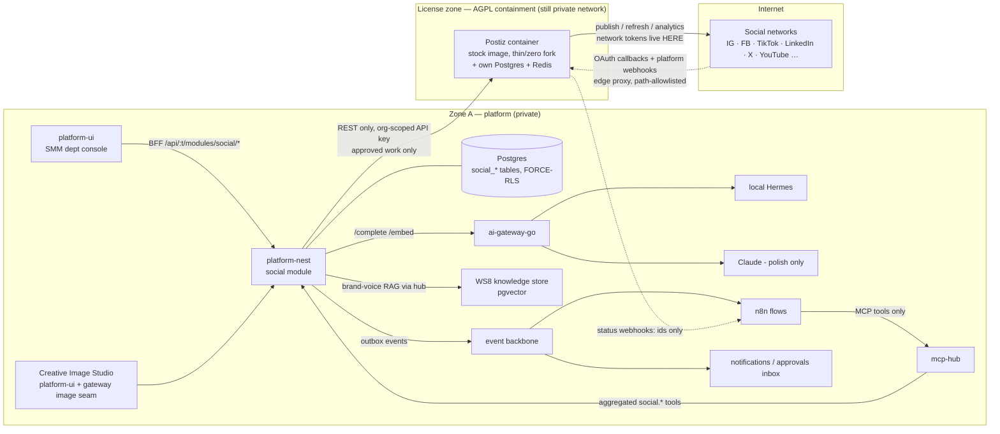
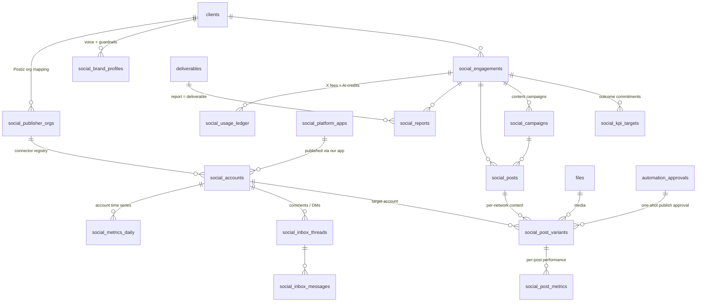

# Social-Media Subsystem — Architect Design (SMM · Organic Publishing)

> **⚠ READ THE ADDENDUM FIRST (2026-08-12):**
> [`smm-design-addendum-2026-08-12.md`](./smm-design-addendum-2026-08-12.md) re-bases this document
> onto the platform as it stands today and **binds where it contradicts what follows**. Six
> assumptions below expired: permission keys are now catalog DATA (`social.engagement.read`, not
> `social:engagement:read`), D14 has a canonical grant/execute contract that replaces the bespoke
> `payload_hash`, the agentic-native bar is binding on every ticket, there is no image-generation
> backend to call, the client portal makes client approval a real P2 surface, and migrations rebase
> `0034+` → `0105+`. The addendum also carries the re-planned ticket set (§A4) that supersedes §12.
>
> **Status:** Design blueprint — targets a future **`social-media` module, `0.0.0 · PLANNED`**
> (register in [`../modules/MODULES.md`](../modules/MODULES.md) on approval; nothing in this doc exists as code).
> **Version:** v1.0 · **Date:** 2026-07-23 · **Author:** System Architect (Claude)
> **Primary input:** [`smm-foundation.md`](./smm-foundation.md) — foundation research + the
> **LOCKED decisions** (v1 scope = organic content-studio + publisher — posting, engagement,
> copywriting, digital assets; paid ads / listening / influencer OUT; publisher = **Postiz**
> AGPL-3.0 run **AGPL-CONTAINED** with Mixpost Pro as the paid fallback; **Chatwoot dropped**;
> copy via ai-gateway-go + brand-voice RAG; assets via the Creative Image Studio; per-network
> platform-API reality as the hard constraint; **human-in-the-loop mandatory** — stricter than
> SEO). This design conforms to those locks and does not relitigate them.
> **Sibling deliverable:** [`seo-sem-design.md`](./seo-sem-design.md) — same rigor, same section
> map; where search-marketing is a *data + judgment* subsystem, SMM is a *judgment + publication*
> subsystem: its defining hazards are **public irreversibility** (a bad post ships to the world)
> and a **license boundary** (the AGPL publisher must never infect the platform).

---

## §00 · Executive summary

Social-media becomes a **platform-nest module vertical** (`ModuleContract` key **`social`**,
tables `social_*`) plus a **department console** on the dept-interface-template — the already-
reserved **"Publish"** craft group (Calendar · Composer · Inbox · Analytics). The professional
moat is **approved platform-app access + brand-fit judgment**, not scheduling plumbing
(foundation §4/§7), so the architecture is:

1. **Postiz is the publishing engine, run AGPL-CONTAINED** — an isolated container reached
   ONLY over its REST API (mere aggregation; our NestJS/Go/Next.js stay uninfected). All domain
   state, tenancy, RBAC, approvals, and judgment live **outside** Postiz in platform-nest. Postiz
   holds exactly two things: network OAuth tokens (it must, to publish + refresh) and the
   approved-and-scheduled execution queue. **Drafts never enter Postiz** — our DB owns the
   content lifecycle; Postiz sees a post only after WS4 approval. The fork stays **thin**
   (target: zero-fork, stock image); Mixpost Pro is the documented fallback with concrete
   tripwires (§06).
2. **No universal post object.** A `social_posts` master carries the idea/brief/approval state;
   **`social_post_variants`** carry per-network content, media, and network-specific settings,
   validated against each network's media rules and quota *before* anything is queued (IG ~25
   posts/24h, TikTok no-native-scheduling, X pay-per-post) — the composer refuses what the API
   would reject.
3. **A first-class connector registry** (`social_accounts` + the global platform-app fleet):
   per client-company × network — app-review status, token health, quota counters, last error —
   surfaced in the console exactly like the IT device registry. Platform-app credentials (our
   approved Meta/TikTok/LinkedIn/X/YouTube apps) are OpenBao-custodied and injected only into the
   Postiz container; the app-review pipeline is tracked as a non-code workstream (OQ-1).
4. **AI is local-first via ai-gateway-go**: Hermes for bulk (captions, hashtags, comment
   triage/sentiment, ideas, first-draft narratives), Claude only for client-facing polish;
   **brand-voice RAG** rides WS8 knowledge (per-client brand corpus, D9 preserved); images come
   from the **Creative Image Studio** + the gateway generative-image seam, **credits-gated**;
   best-time-to-post is classical statistics on our own metrics, not an LLM.
5. **Human-in-the-loop is mandatory and stricter than SEO**: every outbound public action —
   publish, reply, delete — is a WS4 `impact:'high'` suspension, and execution consumes a
   **one-shot approvalId with payload-hash match** (the SEO D-6 pattern). There is no auto-publish
   path, for humans or agents. Editing an approved post invalidates its approval.
6. **Metered money in one ledger**: X per-post fees + generative-image/video credits flow through
   `social_usage_ledger` with the SEO-proven stop-loss chain (engagement budget → tenant cap →
   global cap, fail-closed, checked before dispatch). Unlike SEO there is **no shared no-RLS
   cache** — all social data is client-private.

Build order is risk-honest: **P0 contracts + containment spike → P1 organic publish/calendar/
composer on our OWN accounts ($0, own-risk) → P2 engagement inbox → P3 AI copy/assets +
analytics/reports (+ X metering) → P4 agent-proposed drafts**. 27 tickets P0–P4 plus 2
decision-gated, /army-ready, in §12.

---

## §01 · Scope & pillars

### Service lines (foundation §1 — modeled distinctly, only three are v1)

| Service line | v1 delivers | Deferred |
|---|---|---|
| **Organic publishing** | Multi-network content calendar, composer with per-network variants + media-rule/quota validation, approval-gated scheduling/publishing via contained Postiz (14 networks upstream; we onboard per app-review reality §03/OQ-1), publish status + failure surfacing, native-post import for calendar completeness | Bulk CSV import of calendars; Threads/Pinterest/Bluesky/Mastodon onboarding beyond the core five; auto-repost/evergreen recycling |
| **Content creation (copy + assets)** | Brand-voice profiles + WS8 RAG corpus per client; AI caption/hashtag/idea drafting (Hermes-first, Claude polish); Creative Image Studio seam for on-brand images (credits-gated); asset attachment from files/Drive | Generative video (no gateway capability yet); long-form→shorts repurposing (ClipsAI — decision-gated SMM-29); carousel auto-design |
| **Community engagement** | Unified inbox of comments/mentions (+ DMs where Postiz supports them, OQ-4) pulled from Postiz; AI sentiment/category triage + spike alerts; approval-gated replies; assignment + SLA timers | Reviews platforms (Google Business reviews etc.); social CRM/audience profiles; auto-moderation rules |
| **KPIs & reporting** (cross-cutting) | Outcome-tracked engagements + KPI targets (followers, reach, engagement rate, clicks, response time); daily account + per-post metrics via Postiz analytics; monthly client reports (AI narrative → human approve → Drive + deliverable) | Attribution to revenue (needs analytics/UTM program); competitor benchmarking (listening data — out of v1) |
| **Paid social ads** | **OUT of v1** (locked). Seam noted: `social_campaigns.kind` reserves `'paid'`; the SEO `search_change_proposals` dual-mode pattern is the ready template when this line opens | Whole line |
| **Social listening** | **OUT of v1** (locked). Seam noted: inbox sentiment/spike events are the v1 stand-in; a future listening provider plugs in as a driver + `social_mentions` tables | Whole line |
| **Influencer / UGC** | **OUT of v1** (locked). Seam noted: creators would be `clients`-adjacent contacts + briefs on the agency vertical, not a new subsystem | Whole line |

### Non-goals (v1)

- **No adopted external UIs** — Postiz's web UI (AGPL, and conveyance if served) is **never
  exposed**; the SMM console is the only operator surface.
- **No direct vendor AI calls** — everything through ai-gateway-go (locked).
- **No second inbox stack** — Chatwoot dropped (locked); **wa-chat-bot stays as-is** for
  WhatsApp/Telegram and is not touched by this module.
- **No auto-publish, ever** — not a config option, not for agents, not for "trusted" flows.
  The WS4 gate is structural (§07), not policy.
- **No paid-ad API integration, no listening data purchase, no influencer tooling** (locked out
  of v1; seams noted above).
- **No client-facing portal changes** — reports deliver as files (Shared Drive + `deliverables`).

### Fit with prior decisions

- Conforms to the **ERP holding-OS vision**: enablement via `enabled_modules` OR active
  `service_assignment`, WSD-3 module-sliced RLS third wall — the SMM department in the agency
  company serves sibling companies' engagements without data bleed.
- Lands on the **dept-interface-template exactly as reserved**: the IA plan
  (`../superpowers/plans/2026-07-23-dept-console-ia-redesign.md` §2/§6) and
  [`deptToolkits.ts`](../../platform-ui/src/lib/deptToolkits.ts) already define
  **SMM → "Publish": Calendar · Composer · Inbox · Analytics** — this design builds those four
  pages and only then registers the toolkit (the file's own rule: no TOOLKITS entry until routes
  exist).
- Reuses, not duplicates: `clients`, `deliverables`, `time_entries`, `files`, `projects`
  (P5c lesson), the Creative Image Studio asset tables (0031/0032), the WS4 approvals surface,
  and the SEO-proven ledger/stop-loss + one-shot-approval patterns (D-6/D-11 inherited, §14).

---

## §02 · System overview



**Reading the diagram.** All state and judgment live in Zone A; the AGPL boundary is a **license
zone, not a network zone** — Postiz runs on the private network but is architecturally at arm's
length: platform-nest talks to it exclusively over REST (mere aggregation), no shared code, no
shared DB, no linking. Two arrows cross to the internet: Postiz's publish/refresh egress to the
networks, and a **narrow path-allowlisted ingress** (edge proxy → Postiz's OAuth-callback +
platform-webhook paths only — the admin UI and general API are never reachable from outside).
Status webhooks toward us are **notification-only** (post/integration ids); the authoritative
state is always re-fetched over the authenticated Postiz API. The Creative Image Studio and all
AI ride existing Zone A services.

---

## §03 · Trust zones & network

Follows the WebDesk zone doctrine (Zone A = private brain; internet-facing = own zone; one-way
control), extended with the **license zone** this subsystem introduces:

| Surface | Zone | Rules |
|---|---|---|
| `social` module + ledger + registry | **A** | Postiz org-scoped API keys and our platform-app credentials (Meta/TikTok/LinkedIn/X/YouTube app secrets) are **server-side env → OpenBao target-state**, held by platform-nest / injected into the Postiz container env at deploy. Never in the browser, never in n8n credentials, never per-tenant rows. |
| Postiz (publisher engine) | **A network · L license** | Isolated compose services (app + own Postgres + own Redis — per the db-topology doctrine of per-service isolation). Reached ONLY via REST from platform-nest. Its UI is not routed anywhere; its DB is opaque to us (we never query it). **Containment invariants:** no shared libraries, no shared schema, no in-process embedding; tenancy/RBAC/approvals implemented entirely on our side; fork thin-to-zero (§06); source-offer footer link in our console (AGPL §13). |
| Network OAuth callbacks + platform webhooks | **edge → Postiz** | Networks require publicly reachable redirect URIs. A reverse-proxy edge route exposes **only** Postiz's callback/webhook paths (exact-path allowlist, everything else 404), TLS-terminated, rate-limited. This is the single inbound door; a compromise of it reaches Postiz, not platform data — and Postiz holds only social tokens, not company data. |
| Postiz → us status webhooks | **edge → n8n** | Existing signed-webhook bridge pattern: HMAC/secret-path, schema-validated, **treated as triggers only** — n8n calls an MCP tool; the module re-fetches authoritative status from Postiz's API. A forged webhook causes at most a redundant authenticated fetch. |
| Client social accounts (tokens) | **inside Postiz only** | Locked custody split (D-5, §14): network tokens are created by Postiz's OAuth flows, stored in its encrypted store, refreshed by it, and **never copied into our DB or vault**. Our `social_accounts` registry mirrors *state about* the connection (status/health/quota), never the secret. The 0033 `integration_connections` vault is NOT used for social tokens — it holds nothing here; our vault custody covers only app credentials + Postiz API keys. |
| Creative Image Studio / gateway image seam | **A** | Generative calls ride ai-gateway-go (budget caps, DLP, egress audit apply automatically); outputs land as `files` rows + Studio asset tables — no new trust surface. |
| wa-chat-bot | **untouched** | Explicitly out of scope; WhatsApp/Telegram engagement stays there (locked — no second inbox stack, and no social traffic routed into it). |

> **⚠ Pointer, not an amendment (2026-08-13).** Row 2's "reached ONLY via REST from
> platform-nest" premise assumed both sat on one machine. They no longer do: the owner moved
> Postiz to its own host (addendum §A4k), so that REST hop leaves the machine. It is carried by
> a two-peer **WireGuard** link rather than a public listener, which keeps rows 2 and 3 true as
> written — the edge did not move, the allowlist did not grow, and `FRONTEND_URL` is unchanged.
> The mechanism, the measured 2.6 ms RTT, and the custody consequence (platform-app secrets now
> live on a host that also runs unrelated private production) are in **§A4l**. Anyone rewriting
> this table should read that first; the wording here is deliberately left alone pending the
> architect.

---

## §04 · Domain model & schema

### Design rules (inherited, not optional)

- Every tenant table: `tenant_id uuid NOT NULL REFERENCES companies(id)`, `origin_site`,
  `created_at/updated_at`, soft-delete `deleted_at` where user-facing.
- **FORCE-RLS with the WSD-3 third wall** — policy predicate
  `tenant_id = ANY(app_current_tenants()) AND app_module_allowed('social')` on both USING and
  WITH CHECK, byte-identical to [`0028_module_hr.sql`](../../platform-nest/migrations/0028_module_hr.sql).
  App side reaches these tables only via `withTenants(tenants, { modules: ['social'] })`.
- Migrations: take the **next unused number** per
  [`migrations/README.md`](../../platform-nest/migrations/README.md) (**0034+** as of 2026-07-23 —
  coordinate with any in-flight SEO tickets, which draw from the same sequence); no in-migration
  GRANTs; no `sync_app` grants (social tables do not sync in v1).
- Money: **metered cost is `numeric(12,6)` USD** (X per-post ≈ $0.015; credit unit prices are
  sub-cent) — same rationale as the SEO ledger. Client-facing money (none in v1 — no ad spend)
  would use minor-unit `bigint` + `currency`.
- **The single non-tenant table** is `social_platform_apps` (our own app fleet — no client data;
  admin-endpoint-only). Unlike SEO there is **no shared market-data cache**: every other byte in
  this module is client-private (D-4, §14).

### Entity map



### Tables (DDL sketch — illustrative, refined at SMM-01)

**`social_engagements`** — the outcome-tracked client engagement (foundation §3), carrying the
per-client **tool scope** (inherits SEO D-11):

```sql
CREATE TABLE social_engagements (
  id uuid PRIMARY KEY,
  tenant_id uuid NOT NULL REFERENCES companies(id),
  client_id uuid NOT NULL REFERENCES clients(id),
  project_id uuid REFERENCES projects(id),      -- optional: PM/time/deliverables tie-in
  name text NOT NULL,
  tool_scope jsonb NOT NULL DEFAULT '{}',
      -- THE per-engagement config a human sets per client. Every flow and every metered
      -- dispatch consults it. Shape (illustrative):
      -- {"networks":{"instagram":true,"linkedin":true,"x":false},
      --  "posting":{"cadencePerWeek":5,"requiresClientOk":false},
      --  "inbox":{"enabled":true,"slaMinutes":240,"dm":false},
      --  "ai":{"drafting":true,"cloudPolish":true,"imageGen":true},
      --  "reporting":{"cadence":"monthly"}}
  usage_budget_usd numeric(12,6) NOT NULL DEFAULT 10.0,  -- monthly metered cap (X fees + credits)
  status text NOT NULL DEFAULT 'draft' CHECK (status IN ('draft','active','paused','closed')),
  owner_id uuid REFERENCES users(id),
  starts_on date, ends_on date,
  custom_fields jsonb NOT NULL DEFAULT '{}',    -- D17 target
  origin_site text NOT NULL, created_at timestamptz NOT NULL DEFAULT now(),
  updated_at timestamptz NOT NULL DEFAULT now(), deleted_at timestamptz
);
```

**`social_publisher_orgs`** — the tenant-mapping row that makes AGPL containment concrete: one
Postiz organization per (tenant, client). The mapping — and therefore multi-tenancy — lives in
OUR schema, never inside Postiz:

```sql
CREATE TABLE social_publisher_orgs (
  id uuid PRIMARY KEY,
  tenant_id uuid NOT NULL REFERENCES companies(id),
  client_id uuid NOT NULL REFERENCES clients(id),
  postiz_org_id text NOT NULL,            -- opaque upstream id
  api_key_ref text NOT NULL,              -- alias into env/OpenBao (never the key itself)
  status text NOT NULL DEFAULT 'active' CHECK (status IN ('active','suspended','archived')),
  origin_site text NOT NULL, created_at timestamptz NOT NULL DEFAULT now(),
  updated_at timestamptz NOT NULL DEFAULT now(), deleted_at timestamptz,
  UNIQUE (tenant_id, client_id),
  UNIQUE (postiz_org_id)                  -- one org can never serve two clients
);
```

**`social_accounts`** — the **connector registry** (foundation §7 implication 1; modeled like the
IT device registry): one row per client × network account, mirroring *state about* the Postiz
integration — never tokens:

```sql
CREATE TABLE social_accounts (
  id uuid PRIMARY KEY,
  tenant_id uuid NOT NULL REFERENCES companies(id),
  client_id uuid NOT NULL REFERENCES clients(id),
  publisher_org_id uuid NOT NULL REFERENCES social_publisher_orgs(id),
  platform_app_id uuid REFERENCES social_platform_apps(id),  -- which of OUR apps carries it
  network text NOT NULL CHECK (network IN ('instagram','facebook','tiktok','linkedin','x',
    'youtube','threads','pinterest','bluesky','mastodon')),
  handle text NOT NULL, display_name text,
  postiz_integration_id text,             -- opaque upstream id (set after connect)
  status text NOT NULL DEFAULT 'pending'
    CHECK (status IN ('pending','connected','expiring','expired','error','disconnected')),
  quota jsonb NOT NULL DEFAULT '{}',      -- live counters, e.g. {"igPosts24h":{"used":3,"cap":25},
                                          --   "youtubeUnitsToday":1600}
  capabilities jsonb NOT NULL DEFAULT '{}', -- what this connection can do, resolved per network:
                                          -- {"schedule":true,"directPost":false,"stories":true,
                                          --  "comments":true,"dm":false,"analytics":true}
  health_checked_at timestamptz, last_error text,
  connected_by uuid REFERENCES users(id), connected_at timestamptz,
  origin_site text NOT NULL, created_at timestamptz NOT NULL DEFAULT now(),
  updated_at timestamptz NOT NULL DEFAULT now(), deleted_at timestamptz,
  UNIQUE (tenant_id, client_id, network, handle)
);
```

**`social_platform_apps`** — OUR approved developer-app fleet (the moat): `network`, `app_name`,
`review_status ('sandbox','submitted','approved','rejected','suspended')`, `access_tier` (e.g.
LinkedIn Dev vs Standard), `scopes jsonb`, `quota_regime jsonb` (documented caps), `credential_ref`
(env/OpenBao alias — secrets never in-row), `review_notes`, `expires_at`. **Global table, no
tenant_id, no RLS** — it contains zero client data and is exposed only through admin endpoints
(`social:apps:admin`). One approved app serves all tenants on that network.

**`social_brand_profiles`** — per-client voice config: `client_id`, `tone jsonb` (voice traits,
do/don't lists, banned words, emoji policy, language/locale), `hashtag_strategy jsonb`,
`knowledge_source_ids jsonb` — pointers to WS8 knowledge sources holding the brand corpus (past
posts, guidelines docs). **The corpus itself lives in WS8** (D9 preserved); this table is config
only.

**`social_campaigns`** — content campaigns/themes: `engagement_id`, `name`, `kind` (`'organic'`
now; `'paid'` reserved as the future seam), `goal`, `period daterange`, `status
('planned','active','done','archived')`, `custom_fields` (D17).

**`social_posts` + `social_post_variants`** — the two-level content model (locked: **no universal
post object**):

```sql
CREATE TABLE social_posts (
  id uuid PRIMARY KEY,
  tenant_id uuid NOT NULL REFERENCES companies(id),
  engagement_id uuid NOT NULL REFERENCES social_engagements(id),
  campaign_id uuid REFERENCES social_campaigns(id),
  title text NOT NULL,                    -- internal working title
  brief text,                             -- the idea/angle the variants execute
  source text NOT NULL DEFAULT 'human' CHECK (source IN ('human','ai','agent','native_import')),
  status text NOT NULL DEFAULT 'idea' CHECK (status IN
    ('idea','draft','in_review','approved','scheduled','publishing','published',
     'partially_published','failed','archived')),   -- master rolls up variant states
  scheduled_at timestamptz,               -- the plan-level slot (variants may offset)
  created_by uuid REFERENCES users(id),
  origin_site text NOT NULL, created_at timestamptz NOT NULL DEFAULT now(),
  updated_at timestamptz NOT NULL DEFAULT now(), deleted_at timestamptz
);

CREATE TABLE social_post_variants (
  id uuid PRIMARY KEY,
  tenant_id uuid NOT NULL REFERENCES companies(id),
  post_id uuid NOT NULL REFERENCES social_posts(id),
  account_id uuid NOT NULL REFERENCES social_accounts(id),
  body text NOT NULL DEFAULT '',          -- caption/copy for THIS network
  first_comment text,                     -- e.g. IG hashtag-in-first-comment pattern
  media jsonb NOT NULL DEFAULT '[]',      -- ordered [{fileId, kind:'image'|'video', alt}]
  settings jsonb NOT NULL DEFAULT '{}',   -- network-specific: {"igType":"reel"|"feed"|"story",
                                          --  "tiktokMode":"direct"|"inbox", "ytVisibility":"public"}
  validation jsonb NOT NULL DEFAULT '{}', -- media-rule/quota pre-check result {ok, errors[]}
  payload_hash text,                      -- hash of {body,first_comment,media,settings,scheduled_at}
                                          -- — the approval-match anchor (any edit changes it)
  approval_id uuid REFERENCES automation_approvals(id),  -- WS4 one-shot (§07)
  scheduled_at timestamptz,               -- per-network offset from the master slot
  postiz_post_id text,                    -- set only after approved dispatch
  status text NOT NULL DEFAULT 'draft' CHECK (status IN
    ('draft','in_review','approved','queued','publishing','published','failed','cancelled')),
  published_url text, published_at timestamptz, last_error text,
  estimated_cost_usd numeric(12,6) NOT NULL DEFAULT 0,   -- X per-post preview (§05)
  origin_site text NOT NULL, created_at timestamptz NOT NULL DEFAULT now(),
  updated_at timestamptz NOT NULL DEFAULT now(), deleted_at timestamptz,
  UNIQUE (post_id, account_id)
);
```

State law: a variant reaches `queued` **only** by consuming an approved one-shot `approval_id`
whose payload hash matches (§07); `postiz_post_id` is set in the same transaction. Any edit to an
approved variant nulls `approval_id`, reverts status to `draft`, and recomputes `payload_hash`.
`native_import` posts (published by hand in the network's own app) enter directly as
`published` variants with `postiz_post_id NULL` — calendar completeness without faking an
approval trail.

**Inbox** — `social_inbox_threads` (`account_id`, `network`, `kind
('comment','dm','mention','review')`, `external_thread_id`, `post_variant_id` nullable — link to
our post when the comment is on one, `author_handle`, `author_name`, `excerpt`, `sentiment
('positive','neutral','negative','urgent')` — AI-stamped, `status
('open','replied','escalated','dismissed','closed')`, `assigned_to`, `sla_due_at`,
`last_message_at`; `UNIQUE(account_id, external_thread_id)`) and `social_inbox_messages`
(`thread_id`, `direction ('in','out')`, `external_id`, `body`, `author_handle`, `posted_at`,
`source ('postiz_sync','reply')`, and for outbound: `approval_id`, `payload_hash`, `status
('draft','in_review','approved','sent','failed')` — replies are one-shot-gated exactly like
publishes). Sync is idempotent on `(account_id, external_id)`.

**KPIs & metrics** — `social_kpi_targets` (per engagement: `metric_key` canonical —
`followers_total`, `reach_month`, `engagement_rate`, `link_clicks_month`, `avg_response_minutes`,
`posts_published_month`, `leads_attributed` — `baseline_value`, `target_value`, `due_period`,
`direction`); `social_metrics_daily` (per account per day: `followers`, `impressions`, `reach`,
`engagements`, `link_clicks`, `video_views`, `raw jsonb`; `UNIQUE(account_id, date)`; source =
Postiz analytics pull); `social_post_metrics` (per variant: `impressions`, `likes`, `comments`,
`shares`, `saves`, `video_views`, `clicks`, `fetched_at` — append-only snapshots, indexed
`(variant_id, fetched_at DESC)`).

**`social_reports`** — mirrors `search_reports`: `engagement_id`, `period`, `kind
('monthly','campaign','adhoc')`, `status ('draft','in_review','approved','delivered')`,
`metrics jsonb` (frozen snapshot incl. KPI-vs-target), `narrative_md` (AI draft → human-edited),
`file_id → files` (rendered artifact, mirrored to Shared Drive per WS11), `deliverable_id →
deliverables`, `approved_by/at`, `delivered_at`.

**`social_usage_ledger`** — the metering ledger (§05).

### Custom fields & relations to the agency vertical

- D17 `customFieldTargets`: `social_engagement`, `social_campaign`, `social_post`.
- **Clients** are the existing core `clients` rows; **media** are existing `files` rows (day-one
  scrub + hardening inherited); Studio-graded assets keep their 0031/0032 `creative_assets`
  lineage and are attached to variants by `fileId` — no duplicate asset store.
- **Deliverables/time:** reports link into core `deliverables`; hours log through `time_entries`
  against the optional `project_id`. The engagement is the social-specific overlay, not a
  parallel PM system.

---

## §05 · Publisher abstraction & the usage/cost ledger

### The interface (platform-nest, `src/modules/social/publisher/`)

**Verdict: the publisher port lives inside platform-nest** (mirrors SEO D-1): metering must be
transactional with the ledger, tenancy mapping is RLS-native, and — decisive here — keeping every
call at arm's length behind one adapter **is the AGPL containment line**. One driver ships in v1
(Postiz); the port exists so the Mixpost-Pro fallback (or a direct-API driver for a hostile
network) is a driver swap, not a redesign:

```ts
// Design sketch — capability-based; networks differ, drivers may be partial.
interface SocialPublisher {
  key: 'postiz' | 'mixpost';
  // Org lifecycle (tenant mapping stays OURS; the driver only carries the opaque org ref)
  createOrg(ref: { name: string }): Promise<{ orgId: string; apiKeyRef: string }>;
  connectUrl(orgId: string, network: Network, redirect: string): Promise<string>; // OAuth entry
  listIntegrations(orgId: string): Promise<IntegrationState[]>;   // registry sync source
  // Publishing — accepts ONLY approved work (the caller enforces §07; the driver asserts approvalId present)
  schedulePost(orgId: string, req: VariantDispatch): Promise<{ providerPostId: string }>;
  cancelPost(orgId: string, providerPostId: string): Promise<void>;
  getPostStatus(orgId: string, ids: string[]): Promise<PostStatus[]>;  // authoritative re-fetch
  // Engagement surface
  listComments(orgId: string, integrationId: string, since: Date): Promise<InboxItem[]>;
  sendReply(orgId: string, req: ReplyDispatch): Promise<{ externalId: string }>;
  // Analytics
  getAccountMetrics(orgId: string, integrationId: string, range: DateRange): Promise<DailyMetrics[]>;
  getPostMetrics(orgId: string, providerPostIds: string[]): Promise<PostMetrics[]>;
  // Money (consulted BEFORE dispatch — X pay-per-post)
  estimateCostUsd(op: PublishOp): number;
}
```

Driver rules: **stateless per call**, org-scoped API key resolved from `api_key_ref` at call time,
every request/response OTel-annotated (`network`, `org`, `op`, `cost_usd`), and **no Postiz type
or code imported** — the adapter speaks HTTP+JSON against Postiz's public API only (containment
is enforceable by lint: the module has zero `postiz` package deps).

### No shared cache — deliberate contrast with SEO

The SEO module's no-RLS `search_data_cache` exists because market data is public-world and
reusable cross-tenant. **Nothing in SMM qualifies**: posts, inbox threads, metrics, and account
state are all client-private. Analytics pulls are cheap ($0 via Postiz), so we cache only inside
tenant rows (`social_metrics_daily` *is* the cache). **D-4 (§14): no RLS exemptions in this
module** beyond the client-data-free `social_platform_apps` admin table.

### The usage/cost ledger (X fees + generative credits)

X is a metered cost center (~$0.015/post, ~$0.20 with link — re-verify at build time) and
generative image/video is the highest-cost AI class (locked: gated behind approvals + credits).
Both flow through one ledger, mirroring `search_provider_calls`:

```sql
CREATE TABLE social_usage_ledger (
  id uuid PRIMARY KEY,
  tenant_id uuid NOT NULL REFERENCES companies(id),
  engagement_id uuid REFERENCES social_engagements(id),
  account_id uuid REFERENCES social_accounts(id),
  kind text NOT NULL CHECK (kind IN ('x_post','ai_image','ai_video','ai_cloud_text')),
  ref_id uuid,                            -- variant / asset / report the spend served
  items integer NOT NULL DEFAULT 1,
  cost_usd numeric(12,6) NOT NULL,        -- estimated at dispatch, trued-up on completion
  status text NOT NULL DEFAULT 'posted' CHECK (status IN ('posted','completed','failed')),
  requested_by uuid REFERENCES users(id), -- human or the automation OBO user
  correlation_id text,                    -- n8n run / MCP call id
  origin_site text NOT NULL, created_at timestamptz NOT NULL DEFAULT now()
);  -- RLS: standard social-module wall. Indexed (tenant_id, engagement_id, created_at DESC).
```

**Scope + budget stop-loss (fail-closed, one choke-point before dispatch)** — byte-for-byte the
SEO pattern: (0) the capability must be enabled in the engagement's `tool_scope` (`networks.x`,
`ai.imageGen` — a disabled toggle refuses with the toggle named, regardless of budget); then
month-to-date `SUM(cost_usd)` vs — engagement `usage_budget_usd` → tenant monthly cap → global
platform cap (env, default $100/mo until X usage is proven). Breach: refuse + emit
`social.usage.budget_threshold` (also at 80%); console shows the blocked state; override =
`social:credits:admin` + audit. The composer surfaces `estimateCostUsd` on every X variant
**before** approval is requested, so the approver sees the price of the click. Ledger powers the
per-engagement usage panel, tenant rollup, and the `social.usage_cost.month` rollup metric
(feeds billing). Gateway-side AI cost caps remain enforced upstream independently (defence in
depth); `ai_cloud_text` rows record client-attributable Claude-polish usage for transparency.

---

## §06 · Fork/adapt plan per repo

Per the locks: publisher = Postiz AGPL-contained; Mixpost Pro paid fallback; Chatwoot dropped.
"Contained" = we run it at arm's length as an execution engine; "data-only" = we take
reference/technique, never run it.

| Repo | Verdict | Keep | Strip / never run | Add / how it plugs in |
|---|---|---|---|---|
| **gitroomhq/postiz-app** (AGPL-3.0) | **Adopt, AGPL-CONTAINED (the load-bearing verdict).** Run the **stock upstream image** (target: zero-fork) as an isolated compose stack (app + own Postgres + own Redis). All interaction over its public REST API from one adapter. Tenancy = one Postiz org per (tenant, client), mapped in OUR `social_publisher_orgs`; our RBAC/approvals/judgment never enter its process. | The whole publishing engine: 14-network connectors, OAuth flows + token refresh, media upload, queue/retry, comments surface, analytics endpoints | Its web UI (never routed — also removes the AGPL frontend-JS conveyance vector); its user/org self-signup (disabled by env/admin API); any temptation to edit its Prisma schema | Compose services on the private network; edge exposes **only** callback/webhook paths (§03); OUR app credentials injected via container env from OpenBao; `SocialPublisher` Postiz driver (§05); source-offer footer link in our console pointing at the fork repo (or upstream when zero-fork) — satisfies §13 |
| — Postiz **fork-touchpoint budget** (the thin-fork line, measurable) | Allowed changes ONLY: (a) build/compose/env packaging, (b) disabling signup/UI exposure via config, (c) **if missing upstream**: an outbound status-webhook emitter, (d) security backports. **Tripwires → fall back to Mixpost Pro:** needing to touch its DB schema or tenancy model; needing to embed our authz/IP inside it; patch surface > ~5 files or unrebasable on upstream within a day; a licensing-counsel red flag (OQ-3) | | | Every fork commit is reviewed against this budget (design-review rule); the SMM-04 spike validates the budget is realistic before P1 |
| **inovector/mixpost** (Pro, proprietary ~$299–$1,199) | **FALLBACK only — do not run in v1.** Documented trigger = the tripwires above. | Its 11-network coverage + built-in inbox as the capability checklist the driver port must satisfy | Everything (not deployed) | A `mixpost` driver behind the same `SocialPublisher` port; the port's method set is deliberately implementable against Mixpost's API so the swap is a driver + deploy change |
| **chatwoot/chatwoot** | **DROPPED (locked).** Overlaps wa-chat-bot; would be a second inbox stack. | Nothing operational; its triage/assignment UX informs the Inbox tab | The app | — |
| **ClipsAI/clipsai** (MIT) | **Decision-gated library (SMM-29; not mobilized).** Long-video → clips + 9:16 reframe when video repurposing becomes a real deliverable. | Python lib as a job-mode worker; reuses our local faster-whisper | Any service mode | Job container → clips land as `files` → attach in composer |
| **SamurAIGPT/AI-Youtube-Shorts-Generator** (MIT) | Reference-only | Highlight-selection prompt patterns | — | Folded into the SMM-29 design when gated open |
| **Creative Image Studio** (internal, prototyped) | **Reuse as-is + extend at the seam.** | Client-side grading engine, presets, asset library (0031/0032) | — | "Send to SMM composer" attach flow + the gateway generative-image seam behind credits (§05) + WS4 (§07) |
| **wa-chat-bot** (internal) | **Untouched.** WhatsApp/Telegram only. | — | — | Explicit non-integration (locked) |

**AGPL containment — the five invariants (restated once, normative):** (1) isolated
service/container, REST-only interaction; (2) multi-tenancy + all proprietary logic outside the
Postiz process; (3) thin-to-zero fork within the touchpoint budget; (4) source offer to
interacting users via console footer link; (5) Postiz frontend never served to anyone. Legal
sign-off on this memo is OQ-3; the Mixpost fallback price of failure is known and bounded.

---

## §07 · AI design

### Task → model routing (all via ai-gateway-go; never direct vendor calls)

| Task | Model | Trigger | Notes |
|---|---|---|---|
| Caption/copy drafting (per-network variants) | **Hermes** draft → **Claude** polish when `tool_scope.ai.cloudPolish` | Composer | Prompted with the brand profile + WS8 `knowledge.search` over the client's brand corpus (past posts, guidelines) — the brand-voice RAG |
| Hashtag generation | **Hermes** | Composer | Constrained by `hashtag_strategy`; per-network counts/placement (IG first-comment) |
| Content ideas / angle generation | gateway `/embed` + **Hermes** | Calendar planning | Clusters the client's own top-performing posts + campaign goal; no external trend data in v1 (listening is out) |
| Comment/DM triage — sentiment + category + urgency | **Hermes** + rules | `smm-inbox-pull` flow | Stamps `social_inbox_threads.sentiment`; urgent/negative spike → `social.sentiment.spike` event |
| Reply drafting | **Hermes** | Inbox | Draft rows only; brand-voice RAG applied; **sending is always WS4-gated** |
| Best-time-to-post | **Classical stats, no LLM** | Weekly job | Regression/heatmap over own `social_metrics_daily` + per-post metrics; suggestion chip in the composer — never auto-applied |
| Image generation | **Creative Image Studio + gateway generative-image seam** | Composer / Studio | Highest-cost class: `tool_scope.ai.imageGen` + credits ledger + the asset itself still rides the post's WS4 approval before publication |
| Brand-safety pre-check | gateway **vision** on media + **Hermes** on copy | Pre-submit validation | Advisory flag on the variant (`validation.warnings[]`), never a silent block |
| Report narrative | **Hermes** draft → **Claude** polish | Monthly flow | Client-facing = the one place cloud polish defaults on |
| Video repurposing (gated SMM-29) | local faster-whisper + Hermes highlights + ClipsAI | On demand | Not in v1 scope until gated open |

**Brand-voice RAG (D9 hygiene):** the corpus (approved past posts, brand guidelines, tone docs)
is ingested as **tenant-ACL'd WS8 knowledge sources** — WS8 stays the sole owner of derived
knowledge stores; the module stores only `knowledge_source_ids` pointers on
`social_brand_profiles`. Published posts feed back into the corpus on delivery (approved content
is by definition on-brand), continuously sharpening drafts. No new pgvector columns in this
module — nothing here is clustering-shaped enough to justify an operational embedding column
(contrast SEO D-7).

### AI-drafts → human-approves → publish (the WS4 spine — stricter than SEO)

1. AI (or a human, or a WS8 agent) produces **draft rows** — `social_post_variants.status='draft'`,
   `social_inbox_messages.status='draft'`, `social_reports.status='draft'` — always persisted,
   never dispatched. Drafts live in OUR DB only; **nothing enters Postiz at draft time** (D-12).
2. Low-impact artifacts (reports, campaign plans) approve in-console via module permissions
   (`social:report:approve`). **Anything outbound-public — publish, reply, cancel-published,
   delete — goes through WS4**: the MCP tool is declared `write:true, impact:'high'`, the hub
   write-gate suspends it into `automation_approvals`, and it appears in the existing approvals
   inbox with a full preview (rendered variant, media, target account, scheduled time,
   estimated X cost).
3. **Execute — one-shot, single-mode:** approval produces an `approvalId` bound to the variant's
   `payload_hash`. The dispatch choke-point consumes it (status `approved`, hash match,
   unconsumed) in the same transaction that calls `schedulePost` and stamps `postiz_post_id` —
   exactly once, replay-refused. Any edit after approval nulls the approval (hash change) and the
   variant re-enters review. **No approval, no publish — including for humans in the console.**
   Unlike SEM there is no manual/api dual mode: publishing is inherently API-mode; hand-posted
   content is recorded after the fact as `native_import` (§04), which is bookkeeping, not
   execution.
4. **Scheduling semantics:** approval covers content + target + time window. Postiz executes the
   queue; our reconcile flow (§10) is the safety net that re-fetches authoritative status. A
   variant stuck `queued` past its slot + grace raises `social.post.failed` for human action —
   we never auto-retry a publish that may have half-succeeded (duplicate public posts are worse
   than late ones).

### Social data + actions as MCP tools (WS8 agents)

Registered via `ModuleContract.mcpTools` (aggregated by mcp-hub — nothing hub-side to hardcode).
Reads are `minAssurance:'low'`; **credit-spending drafts are `write:true, impact:'medium'`**
(money-spending mirrors SEO D-5); everything outbound-public is `impact:'high'`:

| Tool | Kind | Impact |
|---|---|---|
| `social.listAccounts` / `social.queueSummary` / `social.inboxSummary` / `social.metricsSummary` / `social.ledgerSummary` | read | — |
| `social.draftPost` (master + variants, brand-voice RAG) / `social.draftReplies` / `social.generateHashtags` / `social.suggestPostTime` / `social.draftReport` | AI draft | low (writes drafts only) |
| `social.generateImage` (Studio/gateway seam) | credit spend | **medium** (tool_scope + ledger stop-loss) |
| `social.pullInbox` / `social.pullMetrics` / `social.syncAccountHealth` | $0 sync trigger | low |
| `social.submitForApproval` (variant/reply → WS4 queue) | workflow | low (creates the suspension) |
| `social.publishPost` / `social.sendReply` / `social.cancelScheduled` / `social.deletePublished` | outbound public (one-shot approvalId execution) | **high → always suspends to WS4** |

This is the P4 agent surface: a WS8 agent can research, draft a week of posts, generate imagery
(within credits), and file everything into the approval queue — and can never publish.

---

## §08 · Console UX (dept-interface-template)

One department console — dept name **"SMM"** (already seeded in the agency org structure), slug
`smm` — on the two-level dept-interface-template exactly as Web Dev/Creatives use it: universal
spine **Home · Work · Connections** + the **already-reserved craft group "Publish"**
([`deptToolkits.ts`](../../platform-ui/src/lib/deptToolkits.ts) Phase-B comment + IA plan §2/§6 —
this design changes nothing about that IA, it builds it):

| Group | Sub-tabs (route under `/departments/smm/`) |
|---|---|
| **Publish** | Calendar (`calendar`) · Composer (`composer`) · Inbox (`inbox`) · Analytics (`analytics`) |

Per the toolkit file's own rule, the `SMM` toolkit is added to `TOOLKITS` **only when these four
routes exist** (SMM-11/SMM-24). Calendar renders `fullBleed` (it is a wide board-like surface).

Home = the command-center template (KPI strip from rollup metrics: posts scheduled this week,
awaiting approval, inbox open + SLA-at-risk, connected accounts (+health), MTD metered spend;
activity feed via `work_activity`; launcher row: Meta Business Suite, TikTok Studio, LinkedIn,
X, YouTube Studio, Claude). The My-work rail is inherited unchanged. Connections gains the
account-connect flow + connector-health states (§04 registry).

Tab intents: **Calendar** — month/week grid of master posts + variant chips, drag-reschedule
(re-approval on hash change), per-network quota strips (IG n/25·24h, TikTok inbox-mode badge,
X $-preview), campaign swimlanes. **Composer** — master post + per-network variant editor,
media-rule validation inline, brand-voice AI drafting, Studio attach, submit-for-approval.
**Inbox** — triage queue (sentiment/urgency sort), thread view, assignment + SLA timers, reply
drafts + approval states. **Analytics** — account trend charts, per-post leaderboard,
KPI-vs-target, usage/ledger panel.

### Button capability matrix

**Legend — what each action needs:** 🟢 **AI/own-stack** (local Hermes + gateway + our data;
usable immediately, $0 external) · 🔌 **ACCOUNT LINK** (client network account connected via
contained Postiz **and** our platform app approved for that network — §03/OQ-1) · 💳 **METERED**
(X per-post fee or generative credits — ledger stop-loss, §05) · 🔴 **WS4 APPROVAL** (human
decision required; one-shot execution).
Every action is additionally gated by the **engagement's `tool_scope`** (§04): a disabled
network/feature renders the button disabled and names the missing toggle.

| Console action | Tab | Needs | Gate |
|---|---|---|---|
| Create engagement / KPI targets / campaign | Home/Calendar | — | permission only |
| **Configure engagement scope & budget** (networks, cadence, inbox SLA, AI toggles, caps) | Home | — | `social:scope:write` |
| Connect a client social account (OAuth via Postiz) | Connections | 🔌 (platform app approved) | `social:account:connect` |
| View connector registry / health / quota | Connections | — | read permission |
| Create post + per-network variants | Composer | — | `social:post:write` |
| Validate media rules / quota pre-check | Composer | 🟢 | automatic on edit |
| AI draft captions / hashtags / ideas (brand-voice RAG) | Composer | 🟢 | draft only |
| Claude polish (client-facing copy) | Composer | 🟢 (cloud, gateway-capped, `ai.cloudPolish`) | draft only |
| Generate image (Creative Image Studio seam) | Composer | 💳 credits | draft only (publishes only inside an approved post) |
| Attach media from files/Drive/Studio library | Composer | 🟢 | — |
| Best-time suggestion chip | Composer | 🟢 (own metrics) | advisory only |
| Submit post for approval (preview + X cost shown) | Composer | — | creates WS4 suspension |
| **Approve & schedule / publish now** | Approvals inbox | 🔌 (+💳 if X) | 🔴 one-shot |
| Reschedule an approved post | Calendar | — | hash change → re-approval 🔴 |
| Cancel a scheduled (unpublished) post | Calendar | 🔌 | 🔴 (outbound-state mutation) |
| Delete a published post | Calendar/Analytics | 🔌 | 🔴 (public, irreversible) |
| Record a natively-posted item (import) | Calendar | — | `social:post:write` (bookkeeping only) |
| Pull inbox now / auto-sync comments+DMs | Inbox | 🔌 | — ($0 read) |
| AI triage sentiment / draft replies | Inbox | 🟢 | draft only |
| **Send reply** (comment/DM) | Inbox | 🔌 | 🔴 one-shot |
| Assign thread / set status / escalate | Inbox | — | `social:inbox:reply` |
| Pull account + post metrics | Analytics | 🔌 | — ($0 read) |
| Generate report (metrics + AI narrative) | Analytics | 🟢 | `social:report:approve` then deliver |
| Deliver report (Shared Drive + deliverable) | Analytics | 🟢 | after approve |
| View usage ledger / raise engagement budget | Home/Analytics | — | `social:ledger:read` / `social:credits:admin` |
| Manage platform-app fleet (review status, creds refs) | Admin (not dept console) | — | `social:apps:admin` |

Everything 🟢 plus the composer/calendar loop against **our own brand accounts** ships value in
**P1 with zero external spend and zero client risk** — that is deliberate (own accounts are the
dogfood + demo surface while client app reviews grind through OQ-1).

---

## §09 · ERP integration points

| Subsystem | Integration (concrete) |
|---|---|
| **platform-nest** | `ModuleContract` key `social`; controller `@Controller("api/:tenantId/modules/social")` (hr convention); `ModuleEnabledGuard`; enablement via `enabled_modules` OR active `service_assignment` (shared-service SMM dept serving N companies works day one) |
| **BFF contract** | New section in [`../FRONTEND-BFF-CONTRACT.md`](../FRONTEND-BFF-CONTRACT.md): `/api/:t/modules/social/{engagements,engagements/:id/scope,brand-profiles,accounts,accounts/connect,campaigns,posts,posts/:id/variants,variants/:id/submit,calendar,inbox/threads,inbox/threads/:id,inbox/threads/:id/reply,kpi-targets,metrics-daily,post-metrics,reports,ledger}` — shapes canonical in `platform-ui/src/lib/social.ts` (frontend-first rule) |
| **Postiz (contained)** | The `SocialPublisher` Postiz driver (§05) is the ONLY caller; compose stack + narrow edge ingress per §03; org-per-client mapping in `social_publisher_orgs` (§04) |
| **mcp-hub** | `social.*` tools via `mcpTools` aggregation (§07 table); no hub changes needed |
| **ai-gateway-go** | `/complete` (Hermes default, Claude flagged) + `/embed` + vision (brand-safety) + the generative-image seam; gateway budget caps + DLP + egress audit apply automatically |
| **WS8 knowledge** | Brand corpus as tenant-ACL'd knowledge sources; drafting retrieval via `knowledge.search` (D9 preserved); delivered posts fed back into the corpus |
| **Creative Image Studio** | Asset attach flow + generative seam; assets keep 0031/0032 lineage; credits metered in the §05 ledger |
| **automation (n8n)** | Flows in §10; backbone rule respected — n8n orchestrates, MCP accesses, zero logic in workflows |
| **WS4 approvals** | Every outbound-public `social.*` tool suspends into `automation_approvals`; execution consumes a one-shot `approvalId` + payload-hash match (§07); approval preview renders the exact variant |
| **Event backbone** | Outbox events: `social.post.published`, `social.post.failed`, `social.post.awaiting_approval`, `social.account.expiring`, `social.account.error`, `social.account.quota_near`, `social.inbox.sla_breach`, `social.sentiment.spike`, `social.usage.budget_threshold`, `social.report.ready_for_review`, `social.report.delivered` → notifications bell + n8n bridge |
| **Files / Shared Drive (WS11)** | Post media + produced creative + rendered reports as `files` rows mirrored to the client's Drive folder |
| **Rollups (D12)** | Metrics: `social.accounts.connected` (count) · `social.posts.published.month` (count) · `social.approvals.pending` (count) · `social.inbox.open` (count) · `social.followers.total` (count) · `social.usage_cost.month` (USD, isMonetary) · `social.reports.delivered` (count) |
| **Cerbos** | New resource policies (§11); UI capabilities mirrored in `lib/rbac.ts` (defence-in-depth, Cerbos authoritative) |
| **observability (WS9)** | OTel spans on every publisher call (attrs: network, org, op, cost_usd), publish latency, connector-health gauge per network, inbox SLA gauge, ledger-vs-cap gauge; fail-soft `OTEL_ENABLED` |
| **wa-chat-bot** | Explicit non-integration (locked): WhatsApp/Telegram stay there; no social traffic crosses |
| **Future service-line seams** | Paid ads → `social_campaigns.kind='paid'` + the SEO change-proposal dual-mode template; listening → provider driver + `social_mentions`; influencer → agency-vertical briefs. Documented, not built |

---

## §10 · Automation flows (n8n / WS4)

All flows are thin orchestrations calling `social.*` MCP tools (impact-gated automatically). JSON
lives in [`automation/workflows/`](../../automation/workflows/), kebab-named like the existing
set. **Scheduling is scope-driven:** each flow iterates only engagements whose `tool_scope`
enables the feature (the module filters; n8n stays logic-free per the backbone rule). Publishing
itself is **not** an n8n flow — dispatch happens transactionally at approval-consumption inside
the module (§07); n8n only reconciles and reacts.

| Flow | Schedule / trigger | MCP calls | Phase |
|---|---|---|---|
| `smm-post-status-sync` | Postiz status webhook (ids only) + 15-min safety poll | `social.syncPostStatus` (authoritative API re-fetch inside the module) → publish/fail events | P1 |
| `smm-connector-health` | daily | `social.syncAccountHealth` → expiring/error/quota events → notify | P1 |
| `smm-inbox-pull` | every 15 min per enabled engagement | `social.pullInbox` (idempotent upsert) | P2 |
| `smm-sentiment-triage` | event `social.inbox.new_batch` | `social.triageInbox` (Hermes) → spike detection → `social.sentiment.spike` → notify/escalate | P2 |
| `smm-inbox-sla-guard` | every 15 min | `social.inboxSummary` → `social.inbox.sla_breach` events → notify assignee + lead | P2 |
| `smm-metrics-daily` | nightly | `social.pullMetrics` (accounts + recent posts) | P3 |
| `smm-usage-guard` | daily | `social.ledgerSummary` → 80%/100% threshold events → notify / block-state | P3 |
| `smm-monthly-report` | monthly per engagement | `social.draftReport` → notify reviewer → on approve `social.deliverReport` (Drive + deliverable + notify) | P3 |
| `smm-best-time-refresh` | weekly | `social.refreshPostTimeModel` (classical stats job) | P4 |
| `smm-agent-content-brief` | weekly per opted-in engagement | WS8 agent goal: draft next week's posts + imagery within credits → `social.submitForApproval` — everything lands in the approvals inbox, nothing publishes | P4 |

---

## §11 · Trust & security

- **Key custody (three-way split, D-5).** (a) *Platform-app credentials* (Meta/TikTok/LinkedIn/
  X/YouTube app secrets — the moat): platform env → OpenBao target-state, injected only into the
  Postiz container env at deploy; referenced from `social_platform_apps.credential_ref` by alias.
  (b) *Postiz org API keys*: server-side, resolved by alias at call time; never in platform-ui or
  n8n credentials. (c) *Client network tokens*: **inside Postiz only** — created/refreshed/stored
  by its OAuth machinery, never copied into our DB, vault, or logs. Our registry mirrors
  status-about, never secrets. Compromise blast radii stay disjoint by construction.
- **AGPL containment as a security discipline.** The license boundary and the security boundary
  coincide: no shared code/DB/process, REST-only, adapter-only egress to Postiz, lint-enforced
  zero Postiz deps in platform-nest, fork-touchpoint budget with review (§06). A Postiz CVE or a
  containment failure is bounded to the license zone; platform data never transits it — Postiz
  receives only approved publishable content and returns only public-surface data (comments,
  metrics).
- **RLS.** All `social_*` tenant tables: FORCE-RLS, third-wall predicate
  (`app_current_tenants() AND app_module_allowed('social')`), fail-closed empty-set semantics
  (0025). The single non-RLS table is `social_platform_apps` (zero client data, admin-only
  endpoints). **No shared-cache exemption exists in this module** (D-4).
- **Wrong-account publish (the tenant-mapping nightmare) — defence in depth:** the FK chain
  `variant → account → publisher_org → (tenant, client)` is validated at composer time AND
  re-validated at the dispatch choke-point (account must belong to the variant's engagement's
  client); `social_publisher_orgs.postiz_org_id` is UNIQUE (one org can never serve two clients);
  the dispatch call carries the org-scoped key only. A cross-client mismatch anywhere refuses
  fail-closed with an audit line.
- **Publish safety (irreversibility discipline).** Single dispatch choke-point: tool-scope check
  → media-rule/quota re-validation → **one-shot approvalId consumption + payload-hash match** (in
  the dispatch transaction) → `schedulePost` → stamp `postiz_post_id` → true-up. Replay refused;
  edit-after-approval structurally impossible (hash). No auto-retry of ambiguous publish failures
  (§07.4). Deletes/cancels of public content are themselves `impact:'high'`.
- **Cerbos resources** (new policy files in
  [`platform-nest/cerbos/policies/`](../../platform-nest/cerbos/policies/), derived-roles reuse):
  `resource_social_engagement` (incl. `set_scope`), `resource_social_account` (incl. `connect`),
  `resource_social_post` (posts/variants/campaigns — actions incl. `submit`, `publish`, `cancel`,
  `delete_published`, `import_native`), `resource_social_inbox` (threads/messages — incl.
  `reply`, `assign`, `escalate`), `resource_social_report` (incl. `approve`, `deliver`),
  `resource_social_ledger` (read; `admin` for cap overrides), `resource_social_platform_app`
  (admin). Module permissions declared in the contract: `social:engagement:read|write`,
  `social:scope:write`, `social:account:connect`, `social:post:write`, `social:post:publish`,
  `social:inbox:read|reply`, `social:asset:generate`, `social:report:write|approve`,
  `social:ledger:read`, `social:credits:admin`, `social:apps:admin`.
- **Inbound surfaces:** the edge exposes only exact-path OAuth callbacks/platform webhooks to
  Postiz (§03); Postiz→us webhooks are notification-only (ids), HMAC/secret-path validated at
  n8n, authoritative state always re-fetched over the authenticated API.
- **Content safety:** media rides the existing `files` hardening (scrub, XSS/IDOR/header
  protections); brand-safety AI pre-check is advisory (`validation.warnings`) — the human
  approver is the control; DLP at the gateway screens AI prompts/outputs as everywhere else.
- **Money safety:** estimate → tool-scope → ledger stop-loss → dispatch → true-up (one
  choke-point, §05); X spend is visible on the approval card before the human clicks.
- **Audit:** every ledger row, every Cerbos decision (existing), every hub tool call (existing
  JSONL), every approval decision (existing), every publisher-adapter call (OTel + module log
  with org/network/op) — nothing new to invent.

---

## §12 · Rollout & ticket decomposition (/army-ready)

**Phases:** P0 contracts + containment → P1 organic publish/calendar/composer on **own accounts**
($0) → P2 engagement inbox → P3 AI copy/assets + analytics/reports (+ X metering) → P4
agent-proposed drafts. Registration in `MODULES.md` as `social-media · 0.0.0 · PLANNED` happens
on approval of this doc; first merged ticket flips it to `IN PROGRESS` + CHANGELOG entry
(status-language rule). **Parallel non-code workstream from day one:** platform-app review
submissions (OQ-1) — they gate client-account connects, not the build.

Tiers per the agent-army standard; **model = seat default unless flagged** (flag only where
cheap-then-escalate would waste a full re-run). ⚡ = touches a contract (schema/API/policy/
license boundary) → QA gate + architect design-review on the diff.

### P0 — Foundation + containment

| # | Ticket | Tier | Model | Deps | Done when (AC) |
|---|---|---|---|---|---|
| SMM-01 ⚡ | Migration(s) 0034+ (take next unused; coordinate with in-flight SEO tickets): all §04 tables + third-wall RLS + indexes + `social_platform_apps` (global, admin-only) + D17 targets | senior-db | **opus·medium** — 15-table tenancy surface incl. the one deliberate non-RLS table; an RLS mistake is unacceptable | — | Migrations apply clean on fresh + existing DB; RLS suite proves right-tenant+scope → rows, right-tenant w/o module → zero, cross-tenant → zero; `social_platform_apps` readable only via admin path; `UNIQUE(postiz_org_id)` enforced |
| SMM-02 ⚡ | `social` ModuleContract + NestJS module/controller skeleton + registry + permissions + guard + uiManifest + engagement/brand-profile/campaign/kpi CRUD + **tool-scope endpoints** | senior-be | default | SMM-01 | Module registers; `/mcp/tool-defs` lists `social.*`; CRUD + scope PATCH e2e under RLS; disabled-module tenant gets 404s; scope toggles round-trip the documented shape |
| SMM-03 ⚡ | Cerbos policies ×7 + derived-roles wiring + policy tests + `lib/rbac.ts` capability mirror | medior | default | SMM-02 | Parity tests: owner/manager/member/served-dept matrix incl. `publish`/`reply`/`delete_published` denials |
| SMM-04 ⚡ | **Postiz containment spike + deploy**: compose stack (stock image + own PG + own Redis, isolated network), signup/UI disabled, edge path-allowlist for callbacks/webhooks, OpenBao/env app-cred injection, containment checklist verified (REST-only, zero deps, fork-touchpoint budget §06), comment/DM surface coverage assessed (feeds OQ-4) | senior-integrator | **opus·medium** — the license+security boundary; a containment mistake contaminates the platform or exposes tokens; **QA gate mandatory** | — | Stack healthy; UI unreachable from any routed surface; only allowlisted paths answer externally; an org + a test integration created via API only; written containment-audit note; tripwire assessment says thin-fork holds (else STOP → escalate to owner, Mixpost fallback per §06) |
| SMM-05 ⚡ | `SocialPublisher` port + Postiz REST driver + `social_publisher_orgs` org-per-client provisioning + **connector-registry sync** (accounts mirror: status/quota/capabilities/health) + OTel attrs | senior-be | **opus·medium** — cross-boundary tenant mapping; a mapping bug publishes client A's content to client B's account | SMM-01,02,04 | Driver passes mock-server tests for all port methods; org provisioning idempotent; registry rows mirror a live Postiz org's integrations; cross-client FK-chain validation refuses a mismatched account; zero `postiz` package deps (lint asserted) |
| SMM-06 | Config plumbing: server-side key aliases, caps env, per-network feature flags, `.env.example`, compose env | junior | default | SMM-04,05 | Boots with and without Postiz reachable; publisher-down = 🔌 features cleanly degraded, module still serves reads |

### P1 — Organic publish + calendar + composer (own accounts, $0)

| # | Ticket | Tier | Model | Deps | Done when |
|---|---|---|---|---|---|
| SMM-07 | Account connect flow: BFF-brokered OAuth entry (console → `connectUrl` scoped to the right org) → callback → registry update; connect OUR OWN brand accounts first (sandbox/dev-tier apps OK) | senior-be | default; **QA gate** (credential-flow path) | SMM-05 | Own IG/FB/LinkedIn test accounts connect end-to-end; registry shows connected+capabilities; a second client's console can never reach the first client's connect URL (org scoping test) |
| SMM-08 | Composer backend: posts + variants CRUD, **media-rule validation engine** per network (aspect/length/count/type), quota pre-check (IG 25/24h counter, TikTok direct-vs-inbox, X cost estimate), payload-hash maintenance, native-import path | senior-be | default | SMM-02 | Fixture matrix: invalid media/quota states refused with named rule; hash changes on any content edit; native import lands as `published` w/o approval trail |
| SMM-09 ⚡ | **WS4 publish gate**: outbound-public tools registered `impact:'high'` (suspend verified), approval preview payload, **one-shot approvalId consumption + payload-hash match at the dispatch choke-point**, edit-invalidates-approval, no-auto-retry semantics | senior-be | **opus·high** — the authz-critical approve-execute-replay surface for public, irreversible actions; a bypass is unacceptable | SMM-03,05,08 | Unapproved publish suspends; approved id executes exactly once (replay refused); hash mismatch refused; post-approval edit re-enters review; ambiguous failure does NOT redispatch; audit trail complete |
| SMM-10 | Publish dispatch + status reconcile: approval-consumption → `schedulePost` (transactional stamp), `smm-post-status-sync` flow + webhook intake (ids only) + safety poll, published URLs, failure events | senior-integrator | default | SMM-09 | A scheduled post on an own account publishes for real; status/URL round-trips; forced failure surfaces `social.post.failed` + bell item; webhook forgery causes only a redundant fetch |
| SMM-11 ⚡ | Console shell: `smm` toolkit registration (Publish group per the reserved IA), Calendar + Composer pages, `lib/social.ts` BFF types, Connections additions (connect flow + registry) | senior-fe | default | SMM-02 | All four routes exist (toolkit rule satisfied for the two built now; Inbox/Analytics render BackendPending shells); degrade cleanly on 404/403; tsc + unit green |
| SMM-12 | Calendar UX: month/week grid, variant chips, drag-reschedule (hash→re-approval), per-network quota strips, X cost preview, campaign swimlanes; Composer UX: variant editor + inline validation + submit-for-approval with preview | medior | default | SMM-11,08 | E2E: compose → validate → submit → approve (as approver) → scheduled chip; reschedule of approved post forces re-approval; quota strip reflects registry counters |
| SMM-13 | Events → notifications wiring (hrefs into console routes) for all §09 event types | junior | default | SMM-10 | Each event type produces a bell item deep-linking to the right tab |
| SMM-14 | P1 e2e verification on the dev stack: connect own account → compose → approve → real publish → status/URL back + Playwright suite for the loop | medior | default | SMM-07..13 | Scripted e2e green against a live own-brand account; DEMO_MODE fixtures added; MODULES.md `IN PROGRESS` + CHANGELOG current |

### P2 — Engagement inbox

| # | Ticket | Tier | Model | Deps | Done when |
|---|---|---|---|---|---|
| SMM-15 | Inbox sync: `pullInbox` (comments/mentions + DMs where supported per SMM-04's coverage note), idempotent thread/message upsert, `smm-inbox-pull` flow | medior | default | SMM-05 | Fixture + live own-account comments ingest idempotently; re-run produces zero dupes; unsupported-DM networks degrade cleanly |
| SMM-16 | AI triage: Hermes sentiment/category/urgency stamping, spike detection, `smm-sentiment-triage` + `smm-inbox-sla-guard` flows | medior | default | SMM-15 | Labeled fixture set ≥ agreed accuracy bar; spike fixture emits `social.sentiment.spike`; SLA breach emits + notifies assignee |
| SMM-17 | Reply flow: human/AI reply drafts → WS4 gate (`social.sendReply`, one-shot + hash — reuses the SMM-09 pattern) → send via driver → thread status/message append | senior-be | default (bounded: pattern established by SMM-09) | SMM-09,15 | Unapproved reply suspends; approved sends exactly once; reply lands on the real network (own account); thread flips `replied` |
| SMM-18 | Inbox tab UI: triage queue (sentiment/urgency sort, filters), thread view, assignment + SLA timers, reply composer with approval states | senior-fe | default | SMM-11,15,16,17 | Full loop in-console: new comment → triaged → assigned → draft → approve → sent; SLA timer renders and breaches visibly |

### P3 — AI copy/assets + analytics/reports (+ X metering)

| # | Ticket | Tier | Model | Deps | Done when |
|---|---|---|---|---|---|
| SMM-19 | Brand-voice RAG + drafting services: brand-profile CRUD already in SMM-02 → WS8 corpus ingest (tenant-ACL'd), caption/hashtag/idea drafting via gateway (Hermes default, Claude flag), delivered-post feedback loop | senior-be | default | SMM-02 | Drafts persist as draft rows; zero direct vendor calls (gateway asserted in tests); retrieval provably scoped to the client's corpus (cross-client leak test) |
| SMM-20 | Creative Image Studio seam: attach flow from Studio library, generative-image request behind `tool_scope.ai.imageGen` + **credits ledger** rows, asset lands as files + variant media | medior | default | SMM-19 | Generated image attaches to a variant; ledger row with cost; disabled toggle refuses naming it; budget breach refuses + event |
| SMM-21 | Metrics: `pullMetrics` driver calls → `social_metrics_daily` + `social_post_metrics`, `smm-metrics-daily` flow, Analytics tab (trends, post leaderboard, KPI-vs-target) | medior | default | SMM-05,11 | Nightly run fills both tables idempotently; Analytics renders trends + KPI deltas from fixtures + one live account |
| SMM-22 | **X metering live** + ledger surfaces: per-post estimate in composer/approval card, ledger stop-loss chain wired to dispatch, usage panel + tenant rollup + `smm-usage-guard` flow + rollup metrics | medior | default | SMM-08,09 | Scripted sequence reconciles ledger vs dispatches; 80%/100% behaviors verified; X-disabled scope refuses at composer AND choke-point |
| SMM-23 | Reports: monthly snapshot + AI narrative → review/approve → render → files/Shared Drive + deliverable link; `smm-monthly-report` flow | medior | default | SMM-19,21 | Monthly run produces an approvable report; delivery creates deliverable + Drive file + notification |
| SMM-24 | Docs/registration: MODULES.md status/version bump + CHANGELOG, FRONTEND-BFF-CONTRACT rows, `deptToolkits.ts` TOOLKITS entry (all four routes now exist), runbook stub (containment ops + connector onboarding), source-offer footer link | junior | default | SMM-14,18,21 | Docs match shipped truth; status vocabulary respected; footer link renders in the console |
| SMM-25 | Full-stack e2e on the live dev stack (connect → compose+AI draft → image attach → approve → publish → inbox reply loop → metrics → report) + Playwright console suite | medior | default | all P1–P3 | Scripted e2e green; DEMO_MODE fixtures complete; `DEV-VERIFIED` criteria documented |

### P4 — Agent-proposed drafts

| # | Ticket | Tier | Model | Deps | Done when |
|---|---|---|---|---|---|
| SMM-26 | Full MCP agent surface + WS8 proposal flows: `social.draftPost/draftReplies/generateImage/submitForApproval` hardened for automation principals (OBO, D14), `smm-agent-content-brief` flow | senior-be | default | SMM-19,20,09 | An agent goal produces a week of draft posts + imagery (within credits) landing in the approvals inbox; agent attempt to publish directly suspends; ledger attributes spend to the OBO user |
| SMM-27 | Best-time-to-post: classical stats job over own metrics, `smm-best-time-refresh`, composer suggestion chip | medior | default | SMM-21 | Model output deterministic on fixtures; chip renders; never auto-applies |

**Decision-gated (do not mobilize):** SMM-28 Mixpost-Pro fallback swap [senior-integrator] —
only if SMM-04's tripwires fire (§06) · SMM-29 video repurposing via ClipsAI job-mode [medior] —
when video is a real deliverable (OQ-6).

**Count by tier (P0–P4, 27 tickets):** senior-db 1 (SMM-01) · senior-be 8
(SMM-02,05,07,08,09,17,19,26) · senior-fe 2 (SMM-11,18) · senior-integrator 2 (SMM-04,10) ·
medior 11 (SMM-03,12,14,15,16,20,21,22,23,25,27) · junior 3 (SMM-06,13,24).
**Opus flags: 4** (SMM-01 med, SMM-04 med, SMM-05 med, SMM-09 high). Concurrency: respect the
1–2 agent cap; safe early pairs are (SMM-03 ∥ SMM-04) and (SMM-07 ∥ SMM-08); SMM-09 must run
alone (it defines the publish spine SMM-10/17 consume).

---

## §13 · Open questions (owner decisions)

| # | Question | Blocks | Default if unanswered |
|---|---|---|---|
| OQ-1 | **Platform-app review pipeline** — which networks do we submit first, under which legal entity, and who owns the (weeks-long, non-code) Meta/TikTok/LinkedIn review + business-verification work? Own-account testing rides sandbox/dev tiers meanwhile | Client-account connects (P1 for clients; not the build) | Submit Meta (IG/FB) + LinkedIn now; TikTok after; YouTube quota request with the first video client |
| OQ-2 | **Enable X publishing** at pay-per-use (~$0.015/post, ~$0.20 with link — reverify)? Metering is built regardless (SMM-22) | X network toggle | Ship with `networks.x` disabled in every scope until a client needs it |
| OQ-3 | **Counsel sign-off on the AGPL containment memo** (§06 invariants + fork-touchpoint budget + source-offer mechanics) before client accounts connect | Client-facing P1+ (own-account dogfood proceeds) | Proceed on own accounts only; hold client connects for sign-off; Mixpost Pro is the priced fallback |
| OQ-4 | **DM coverage**: if SMM-04's spike finds Postiz's DM surface thin on key networks, accept comments+mentions-only v1 inbox? | SMM-15 scope | Comments+mentions v1; DMs where Postiz supports them; revisit per network |
| OQ-5 | **Video asset storage**: large video files via local `files` storage + Drive mirror (WS11 default), or Drive-first with reference-attach? | SMM-08 media handling | files + Drive mirror (existing pattern) |
| OQ-6 | **Video service line timing** — when does repurposing (SMM-29/ClipsAI) get gated open, and is generative video (no gateway capability yet) wanted at all? | SMM-29 | Park until a client deliverable demands it |

---

## §14 · Decision log

**Locked upstream (foundation — not relitigated here):** v1 scope = organic content-studio +
publisher (posting, engagement, copywriting, digital assets); paid ads / listening / influencer
OUT (seams noted); publisher = **Postiz (AGPL-3.0, free) run AGPL-CONTAINED**, Mixpost Pro paid
fallback; **Chatwoot dropped** (no second inbox; wa-chat-bot untouched); copy via ai-gateway-go +
pgvector brand-voice RAG; digital assets via the Creative Image Studio + gateway image seam;
per-network app-review/credential/rate-limit reality modeled first-class; generative image/video
behind approvals + credits; **human-in-the-loop mandatory, stricter than SEO**.

**New decisions made by this design (overturn only with cause):**

| # | Decision | Why |
|---|---|---|
| D-1 | Postiz = **execution engine only**: drafts, approvals, judgment, and all domain state live in platform-nest; a post enters Postiz only after WS4 approval, via one adapter | Makes the AGPL boundary and the approval boundary the same line — both structurally uncrossable |
| D-2 | Tenant mapping = **one Postiz org per (tenant, client)** in our `social_publisher_orgs` (UNIQUE org), org-scoped API keys server-side; tenancy never forked into Postiz | Containment (tenancy IP stays ours) + wrong-account-publish defence |
| D-3 | Module key `social`, tables `social_*`, hr-style controller path + third-wall RLS, migrations 0034+ | Newest-vertical (hr) conventions; same as SEO D-3 |
| D-4 | **No shared no-RLS cache in this module** (explicit contrast with SEO's ratified `search_data_cache`); sole non-RLS table is the client-data-free `social_platform_apps` | All social data is client-private; the SEO exemption's justification does not transfer |
| D-5 | Three-way credential split: platform-app creds (OpenBao → Postiz env) · Postiz org keys (server-side alias) · network tokens (**inside Postiz only, never copied**) | Disjoint blast radii; our DB/vault never holds a social token |
| D-6 | Every outbound-public action (publish, reply, cancel, delete) = WS4 `impact:'high'` + **one-shot approvalId + payload-hash match**, consumed transactionally at dispatch; edits invalidate approvals; no auto-retry of ambiguous publish failures | Inherits SEO D-6, tightened for public irreversibility; replay- and TOCTOU-proof |
| D-7 | **Single-mode execution** (no SEM-style manual/api dual mode); hand-posted content enters as `native_import` bookkeeping | Publishing is inherently API-shaped; a "manual twin" would just be unbooked work |
| D-8 | Per-engagement `tool_scope` + budget carried over from SEO D-11 (networks, cadence, inbox SLA, AI toggles, caps); every flow and metered dispatch consults it | Fully custom per-client service shape; cost = Σ enabled features per engagement |
| D-9 | X per-post fees + generative credits + attributable cloud-text in **one `social_usage_ledger`** with the SEO stop-loss chain (engagement → tenant → global, fail-closed) | One metering discipline platform-wide; X never bleeds silently |
| D-10 | Console = the reserved **Publish** craft group (Calendar · Composer · Inbox · Analytics) on the dept template, dept name **SMM**; toolkit registered only when all four routes exist | IA already ratified in the dept-console plan; honors the toolkit file's own rule |
| D-11 | Ingress = **exact-path allowlisted edge route** to Postiz OAuth callbacks/webhooks only; its UI/API otherwise unreachable; Postiz→us webhooks are notification-only (ids), authoritative state re-fetched | Smallest possible inbound door; forgery yields only a redundant authenticated fetch |
| D-12 | Composer owns **pre-publish validation** (media rules, IG 25/24h, TikTok mode, X cost) — we never rely on Postiz or the network to reject | Foundation §7: don't let users queue what the API will reject; failures surface before approval, not after |
| D-13 | Brand corpus lives in WS8 knowledge (tenant-ACL'd); `social_brand_profiles` holds config/pointers only; no module-local embedding columns | D9 ownership preserved (same reasoning as SEO D-7, opposite conclusion — nothing here is operational-clustering-shaped) |

---

*Cross-references:* [foundation](./smm-foundation.md) · [SEO sibling design](./seo-sem-design.md) ·
[BLUEPRINTS index](../BLUEPRINTS.md) · [MODULES registry](../modules/MODULES.md) ·
[BFF contract](../FRONTEND-BFF-CONTRACT.md) ·
[dept-console IA plan](../superpowers/plans/2026-07-23-dept-console-ia-redesign.md) ·
[`ModuleContract`](../../platform-nest/src/modules/contract.ts) ·
[hr third-wall migration](../../platform-nest/migrations/0028_module_hr.sql) ·
[migrations protocol](../../platform-nest/migrations/README.md) ·
[dept toolkits](../../platform-ui/src/lib/deptToolkits.ts) ·
[n8n workflows](../../automation/workflows/) ·
[WS8 knowledge store](../../ai-agents/src/knowledge/store.ts) ·
[Postiz upstream](https://github.com/gitroomhq/postiz-app)
