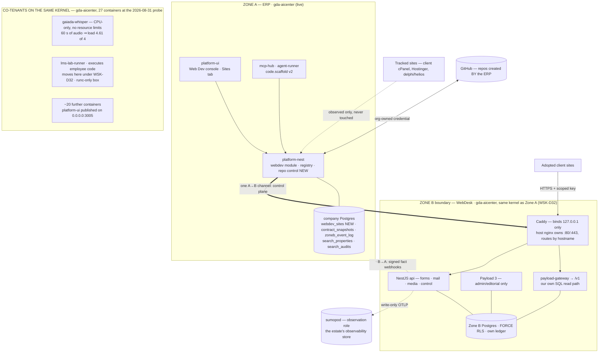

# WebDesk — Design v2.2 (the unified backend, the portfolio, and repo control)

> **Status:** AUTHORITATIVE. **Supersedes [`webdesk-design.md`](./webdesk-design.md) v1.1** and
> **[`provision-erp-seam-design.md`](./provision-erp-seam-design.md) v1.0** (§08 absorbs the seam).
> **Version:** v2.2 · **Date:** 2026-09-04 · **Author:** Claude, from owner rulings 2026-08-28/29,
> 2026-08-31 and 2026-09-04
> **Build from this file.** Where a section says *carried unchanged*, v1.1's text remains correct
> and is not reproduced — read it there. Everything else here overrides it.
>
> **v2.2 records the three owner rulings of 2026-09-04 (WSK-D34 · D35 · D36, §14):** the two-proof
> split — the P1 test suite runs on `sumopod`, the containment probes on `gda-aicenter` — resolving
> OQ-2.9; domain becomes the `search_properties` join key with `client_id` demoted to an attribute,
> enforced by an additive partial unique index (amends WSK-D31); and a sentinel internal-client row
> that makes internal sites first-class in the SEO/monitoring path. Amended for them: §01 evidence
> caveat · §03 (containment probe set, new) · §04 registry note + join subsection · §07 consent
> gate · §12 P1 · §13 (**OQ-2.9 resolved**) · §14 (D31 marked amended; D34–D36 new). Nothing v2.2
> adds is verified: the probes are unrun (P1, §12) and the index migration is unapplied — the
> migration, the ledger rework and the sentinel ticket are sibling work in flight on 2026-09-04.
>
> **v2.1 folds in the 2026-08-31 estate re-zoning (WSK-D32, §14):** hosts are zoned by role,
> superseding WSK-D27's two-tier rule and retiring Zone A/B as host nomenclature; WebDesk's host
> is `gda-aicenter`, not `sumopod`. Amended: §00 move 1 · §00a · §01 evidence caveat · §02 ·
> §03 (rewritten) · §10 lever 1 · §12 P1/P2 · §13 (OQ-2.2, OQ-2.7, new OQ-2.9; **OQ-2.6 resolved**) · §14 (WSK-D32, **WSK-D33** — the vault ruling of 2026-09-04).
> The `gda-aicenter` facts in §03 were probed read-only on 2026-08-31.
>
> **Ground-checked against the working tree and the live estate on 2026-08-28/29.** Every status
> claim below was read from source or probed read-only; none was taken from a tracker. Where a
> claim could not be verified, it says so.

---

## §00 · Executive summary

v1.1 was a good design for a platform with no ground under it. It assumed a dedicated Zone B box
that never arrived, assumed every site would be a full tenant, and assumed frontends would deploy
somewhere the team could reach. None of those held. v2.0 keeps the engineering — the tenancy wall,
the frozen contract, the codegen determinism gate, the rail — and replaces the assumptions with
what the estate actually is.

Six moves:

1. **The public delivery surface ("Zone B") lands on `gda-aicenter`, hardened in-box** — re-zoned
   2026-08-31 by WSK-D32 (§00a, §03, §14), which supersedes the `sumopod` placement this summary
   originally recorded. Not a dedicated box, so §03's containment claim is rewritten honestly
   rather than restated — the surface now shares a kernel with the ERP database itself, which the
   old text would have called disqualifying.
2. **Payload is the editorial layer, not the read path** (WSK-D24, folded in properly at §05).
   `/v1` is served by our own tenant-aware SQL route. This already shipped; v1.1 never said so.
3. **The portfolio becomes a first-class object** (§07). Most client sites will never be tenants,
   and must never be touched — they are *tracked*. Adoption is a ladder a site climbs by choice,
   per site, and adoption does **not** require owning the host.
4. **The ERP owns repo creation and scaffolding** (§08), across three project kinds —
   `static` · `wp` · `fullstack` — driven by a signed PRD or a staff button. This absorbs the
   provision⇄ERP seam and retires the external `provision` tool once parity is proven.
5. **Build cost is a design constraint, not an afterthought** (§10). Every job in the estate runs
   on metered GitHub compute today. The adoption ladder is itself the largest structural lever,
   because an adopted site stops rebuilding when content changes.
6. **The plan is re-cut around one internal proof** (§12), on a box we can actually reach, with the
   observe-only and reachability blockers moved off the critical path where they belong.

---

## §00a · The estate zoning rule (WSK-D27, 2026-08-29 — SUPERSEDED by WSK-D32, 2026-08-31)

> **SUPERSEDING RULING — WSK-D32 (owner, 2026-08-31; recorded §14).** Hosts are zoned by **role**,
> and Zone A / Zone B is retired as a way of naming hosts:
>
> | Role | Hosts |
> |---|---|
> | **Control plane — the ERP** | `gda-aicenter` ("system lives in aicenter"); expandable if needed |
> | **Client project delivery** | `delphi` (staging) · `helios` (production) · the Hostinger WP servers · client-owned servers. **Client projects only** |
> | **Observation** | `sumopod` — observability for the whole estate, including `helios`/`delphi`/WP/client/cPanel |
>
> **What this changes here:** "Zone B runs on `sumopod`" is **withdrawn**. WebDesk is
> ERP-operational, so it lands on `gda-aicenter` — as do the LMS lab-runner and Postiz.
> Observability **stays** on `sumopod`: a monitor co-located with what it monitors dies with it.
> Why the A/B tiers died as host names: A/B was a *trust tier* that needed a host to live on, and
> when `gda-s01` was decommissioned it had nowhere to go; role zoning maps to machines that
> actually exist. `sumopod` remains a personal VPS holding a company function, kept safe by one
> rule: **nothing on it is the only copy, and nothing whose loss blocks a company function** —
> backups *of* `gda-aicenter` may live there; backups of `sumopod`'s own workloads may not.
>
> **What survives from D27:** the corollary at the end of this section — headless WordPress is not
> a deferrable phase, because Hostinger is client-delivery under role zoning and WP stays there
> **permanently** — and "Milestone 0 stops being blocked", though for a different reason: its
> proof tenant is internal, and internal/ERP-operational now means `gda-aicenter`, not `sumopod`.
> The accepted cost of the move is stated in §03, not here.

The superseded v2.0 text follows, kept readable per this document's convention:

**Every host belongs to exactly one tier, decided by purpose, never by spare capacity.**

| Tier | Hosts | Carries |
|---|---|---|
| **Client project delivery** | `helios` (production) · `delphi` (staging) · Hostinger (WordPress) | Client deliverables — sites we built and operate for clients. Ours to reorganize; no customer negotiation needed. WordPress stays on Hostinger **permanently**. |
| **This ERP and everything operational to it** | `gda-aicenter` (live ERP) · `sumopod` | The ERP itself, and **WebDesk** — because WebDesk is our platform, an ERP capability, not a client deliverable. |

Three consequences, each of which settles a question this program kept re-litigating:

- **Zone B runs on `sumopod`.** By the rule, not by preference or by capacity.
- **WebDesk never installs on `helios`/`delphi`/Hostinger.** Those hold client deliverables only.
- **Milestone 0 stops being blocked.** Its proof tenant is an *internal* site, and an internal site
  is ERP-operational — so it lives on `sumopod` beside the backend. The observe-only ruling and the
  reachability problem on `delphi`/`helios` gate **first client delivery**, not the proof (§12).

**Corollary — headless WordPress is not a deferrable phase.** WP stays on Hostinger permanently,
so the PHP path is a permanent tier of the platform. v1.1's Phase 6 framing is wrong and §12
re-sequences it.

---

## §01 · Honest status audit (read from source, 2026-08-28/29)

**The build is far ahead of every document describing it.** `docs/modules/MODULES.md` still carries
`webdesk 0.0.0 PLANNED` for a component with ~11k lines of service code. That row is wrong and
fixing it is part of this design's landing (§12, step 0).

| Layer | Reality | Claimable status |
|---|---|---|
| Tenancy wall | Pooled-connection GUC stamping via a typed `pg.Pool` subclass + AsyncLocalStorage, **plus** an independent app-layer predicate. Mutual independence proven: each layer isolates with the other disabled. | **DEV-VERIFIED (provisional)** |
| Zone B schema | 8 migrations, own ledger, 15+ tables all FORCE RLS, owner/migrator/app split, all NOBYPASSRLS, CI integrity checker | **DEV-VERIFIED (provisional)** |
| `/v1` contract | Frozen. 8 primitives · 9 blocks · locale + `localizations` · cursor pagination · RFC 9457 errors · cache tags · redirects | **FROZEN** |
| Codegen | OpenAPI-first; TS + PHP SDKs and the Markdown contract derived; byte-identical double-run gate across two independent containers | **DEV-VERIFIED** |
| Services (`webdesk/api`) | 20 modules / 165 files: api-keys, forms, mail, media, control (18 commands), codegen, privacy/DSR, tenant-webhooks, promotion, schema-draft, events, audit, rate-limit, storage | **PROTOTYPED** |
| The rail | Zone A snapshot mirror with a DB-level immutability trigger; `code.scaffold` v2 proven never to execute snapshot-derived code; a real Astro proof-site rebuilt from generated types | **DEV-VERIFIED** |
| Console | Sites tab components + 4 read endpoints under the `webdev` module | **PROTOTYPED, honestly stale** |
| WordPress | PHP SDK generated from the same OpenAPI; headless theme + render-invariant probe | **PROTOTYPED** |
| Ops / deploy | Hardening runbook, backup + sentinel scripts, status page, SSH/rsync deploy driver | **PLANNED — nothing ever run** |

### The evidence caveat that governs every row above

A standing rule landed 2026-08-26: **tests count only on a Linux server, never the Windows laptop.**
Every green in this program predates it. The code is not in doubt; the *evidence* is. Under WSK-D32
the home is `gda-aicenter`, and v2.0's convenient identity — home box and test box being the same
machine — is gone: the home is now the live ERP kernel. Linux re-verification is still the first
item in §12 and the real content of the Milestone-0 gate. **Which** Linux box runs the greens was
OQ-2.9; WSK-D34 (2026-09-04) settled it as a split: the greens run on `sumopod` — the suite proves
the *code* — while the containment probes prove the *boundary* and can only run on `gda-aicenter`
(§03, §12). Home box and test box are different machines, this time by ruling rather than by
accident.

### Two gaps that block live operation, named because they are easy to miss

1. **The rail's demand end is unwired.** No hub tool reads a contract snapshot by id, downloads
   artifact bytes, or resolves a `pipeline_stages.artifact_ref`. §06 assumed all three. Until this
   closes, **PRD-driven anything cannot work live** — the scaffolder cannot fetch the PRD artifact
   it is handed a reference to.
2. **The control plane is write-mostly.** It ships **3** GET routes (`contract`, `jobs`, `jobs/:id`)
   against 15 write commands, so the console's registry/releases/submissions reads are built from
   Zone A's own facts and are honestly always `stale:true`. The read commands §09 needs were never
   scoped. This is correct behaviour over a confident empty list, and it is still a gap.

---

## §02 · System overview

**Reading it.** The structural fact (WSK-D32) is that the three boxes above share one kernel: the
public surface's neighbours are no longer `sumopod`'s tenants but the ERP itself — its live
Postgres, Keycloak and Cerbos — plus a code-execution sandbox and a neighbour with no resource
limits. `sumopod` drops out of the serving path entirely and keeps only the observation role.
That is what §03 now has to account for.

---

## §03 · Trust zones — the aicenter co-tenancy, stated in full

Zone definitions carry unchanged from v1.1. The channel table (one A→B, two B→A) carries
unchanged. **What changes is the containment statement**, again — v2.0 rewrote it for `sumopod`,
and WSK-D32 (2026-08-31) makes that rewrite obsolete. v1.1 explicitly ruled out arrangements of
exactly this shape:

> v1.1 §03: *"GDA-AI01 is NOT a candidate for the Zone B box … co-tenanting Zone B beside unrelated
> internet-facing services destroys the containment statement this whole section is built on — the
> blast-radius table becomes fiction the moment a neighbour on the same box is compromised."*

That reasoning was sound, it applied to `sumopod`, and it applies with more force to
`gda-aicenter`. The owner has weighed it and ruled — twice, the cost raised and reaffirmed both
times (WSK-D27, then WSK-D32). What a design owes an accepted risk is not a re-argument, but an
accurate statement of what was accepted and the cheapest available mitigation.

### Zone B is a boundary, not a place

Two host assignments in three days is the lesson: a hostname is not an architecture. What this
section defends is a **boundary** — the public multi-tenant content/forms/media surface: its own
compose project, its own Postgres/Redis/MinIO containers, its own docker network, zero ERP
credentials, loopback-only behind the host's nginx. A boundary survives the next host move; a
hostname does not. For new writing prefer **"the ERP control plane"** and **"the public delivery
surface"**; "Zone A"/"Zone B" stay only where carried sections already use them.

### What is actually on the box

**This repository is public, so the address map is deliberately not here.** Host identity detail,
the neighbour inventory and the published-port list live in the gitignored operator note
`docs/blueprints/webdesk-zoneb-box-detail.local.md` — measured read-only against `sumopod` on
2026-08-29, so it now needs **re-measuring against `gda-aicenter`** (a P1 item, §12). What follows
is the part an architecture reader needs, from a read-only probe of `gda-aicenter` on 2026-08-31.

The box is 4 vCPU / 15.6 GiB, running 27 containers at probe (~5 GiB RAM used, load ~2.1 of 4,
disk 46% of 99 GB), plus a host-tier service layer **outside Docker**: Postgres 15 + pgvector,
Redis, Ollama. nginx owns `:80`/`:443` on the host and routes by hostname. There is no GPU and
the machine family cannot take one. Sharing that kernel with the public surface are:

| Neighbour class | Why it matters to the public surface |
|---|---|
| **The ERP itself — its live Postgres (company data, IAM grants, payroll), Keycloak, Cerbos** | **The one that matters.** v2.0's worst neighbour was a tunnel endpoint offering a *path* toward this data; now the surface stands on the same kernel as the data. There is no "inward" left to defend a path to. |
| **The host-tier Postgres specifically** | `max_connections=100` with only ~10 in use — a shared ceiling that bites long before RAM does, and the reason the non-merge rule below is load-bearing. Estate-known failure: it binds before docker0 on reboot and 502s the whole ERP unaided. |
| **A neighbour that can take the whole box** | `gaiada-whisper-1` runs CPU-only with **no CPU or memory limit**; 60 s of audio drives load to 4.61 on 4 cores. One existing neighbour can already starve everything — why the limits below are acceptance criteria, not tuning. |
| **A pre-existing all-interfaces publish** | `platform-ui` is published on `0.0.0.0:3005` via docker-proxy, bypassing nginx. Not the surface's doing, and now its neighbourhood. On this estate the container runtime's NAT rules are evaluated *before* the host firewall, so an all-interfaces bind is internet-reachable even where the firewall reports deny. |
| **A sandbox that executes untrusted code — when it lands** | The LMS lab-runner also moves here under WSK-D32. The box has only the `runc` runtime — no gVisor, no Kata (AppArmor + seccomp on, Docker rootful) — so sandbox-grade isolation for it is a mitigation to **build**, not a fact to lean on. |

### The honest blast-radius statement

Every revision of this section has shrunk the claim; this one shrinks it furthest. v1.1 claimed a
Zone B compromise could not reach Zone A — dead since v2.0. v2.0-as-written claimed the exposure
was a network *path*: container escape could reach a mesh interface and therefore a route toward
Zone A, while the surface held no Zone A credential. **On `gda-aicenter` that claim is dead too,
and neither claim may be repeated anywhere:** the public surface shares a kernel with the ERP
database itself, so "no path inward" is not merely weakened — it is meaningless.

What remains true is narrower still, and still worth having: the public surface holds **no ERP
database password, no Keycloak secret, no deploy key**. A shared kernel is not an authorisation —
an attacker still needs an escape or a credential — but the geometry has changed: escape now lands
*on* the data rather than on a route to it. Containment moves from "separate machine" to **in-box
isolation**, which is weaker; the owner accepted exactly that cost, raised twice and reaffirmed
(WSK-D32). That is the containment claim v2.1 made and v2.2 carries unchanged — WSK-D34 adds its
verification, not its re-widening — and it is smaller than both of its predecessors'.

### Mandatory hardening (ACs, not aspirations)

1. **Its own compose project** (`name: webdesk`), so the estate's `--remove-orphans` trap cannot
   reach it and neighbours cannot reach it by project name.
2. **Caddy binds `127.0.0.1` and host nginx routes to it by hostname.** nginx owns `:80`/`:443`
   on this box, so v2.0's "Caddy is the only public listener" is impossible here and withdrawn.
   **No host ports at all** except that loopback bind — verified against the **resolved** config,
   never the overlay; see `webdesk/ops/README.md` for the `!reset`/`!override` mechanics and the
   failure mode where `docker compose config` exits 0 on a broken overlay.
3. **Payload admin reachable only through an SSH tunnel.** No vhost, no published port, ever.
4. **Own Postgres, own Redis, own MinIO containers, own docker network** — no reuse of any
   neighbour's instance, no shared volume.
5. **The surface's Postgres is never merged into the host-tier cluster.** Load-bearing, not
   hygiene: **(a)** RLS is bypassed by a table's owner and by any `BYPASSRLS` role, so one shared
   cluster lets the ERP's owner/migrator walk the surface's 15 `FORCE RLS` tables and vice versa —
   grants become the only wall, where a separate cluster makes "the public surface holds no ERP
   credential" a physical fact; **(b)** an internet-facing process's DB credential would then
   authenticate against the cluster holding company data, payroll, Keycloak and IAM grants, so a
   misgrant becomes cross-domain; **(c)** `max_connections=100` is a shared budget — Payload, the
   API, BullMQ workers and migrations all pool, so a form-spam or build spike exhausts it and the
   ERP 502s (the same coupling holds for shared_buffers, WAL, checkpoints and autovacuum); **(d)**
   "two ledgers, never mixed" (§04) stops being enforceable, and both ledgers define
   `app_current_tenants()` / `app_module_allowed()` — two tenancy models sharing GUC names on one
   cluster is the exact trap this estate has already been burned by; **(e)** backup, PITR and
   major-version upgrades are cluster-wide — restoring the public surface to a point in time would
   roll back the ERP. Estate precedent seals it: the host Postgres already 502s the ERP unaided on
   reboot; hanging an internet-facing dependent off it multiplies that blast radius.
6. **The surface's containers may not reach the host-tier Postgres — nor any other host service:
   the host Redis, Ollama, and the box's WireGuard interface toward `sumopod` included.** The only
   host process in front of them is nginx. Default deny, written down and re-verified at the gate;
   an explicit deny is cheaper than an argument later.
7. **Rootless Docker for the public surface's project.** The box's daemon is rootful and `runc` is
   its only runtime; rootless is the cheapest real reduction in what a container escape is worth,
   for the one project that faces the internet.
8. **Hard CPU, memory and pids limits on every service.** One existing neighbour with no limits
   can already take all 4 cores; the public surface must be neither the next such neighbour nor
   defenceless against the existing one.

### The containment probe set — the boundary's own verification (WSK-D34)

WSK-D34 (owner-ruled 2026-09-04, §14) split the P1 proof in two: the test suite proves the *code*
and runs on `sumopod`; the probes below prove the *boundary*, and a boundary can only be probed
where it stands — on `gda-aicenter`. This is a deploy-and-probe exercise with a change window and
a rollback plan, not `npm test`. It is the second half of the P1 gate (§12); execution authority
on the live ERP box is still OQ-2.2. **Status: PLANNED — specified here, none of it has been run.**

| Probe | Verifies |
|---|---|
| Resolved-config port audit: nothing published but the proxy on `127.0.0.1`, read from `docker compose config` output — never from the overlay | AC 2 |
| Host nginx routes by hostname to the loopback-bound Caddy, and `:80`/`:443` are still nginx's | AC 2 |
| A host-Postgres connection attempt from inside a webdesk container is **DENIED**, with a **negative control that would succeed if the deny were absent** — a deny probe that cannot fail proves nothing | AC 6 |
| Per-service CPU, memory and pids limits present on every service | AC 8 |
| `--remove-orphans` on the ERP compose project cannot reach the `webdesk` project | AC 1 |
| Egress sweep: no ERP credential anywhere in the surface, and no route from its containers to any ERP service | the blast-radius statement above; §11 |

The set as ruled verifies ACs 1, 2, 6 and 8 directly. A verification story for ACs 3–5 and 7 is
not specified by WSK-D34 and stays open — named here so the gap is visible, not papered over.

### Pre-existing exposures to raise separately

Pre-dating this program, on this box: `platform-ui` published on `0.0.0.0:3005` bypassing nginx;
`gaiada-whisper-1` with no CPU or memory limit; a rootful Docker daemon with `runc` as its only
runtime. They belong to other parts of the estate.
**The public surface must not depend on them being fixed, and must not fix them unilaterally.**
Raise them as their own item with the owner; noted here so a future reader does not mistake
silence for safety.

---

## §04 · Domain model

**Zone B schema: carried unchanged** from v1.1 §04 (8 migrations, own sequential ledger, FORCE RLS
everywhere, role split). **Two ledgers, never mixed** stands. Zone A migrations remain
timestamp-named (WSK-D21).

### New in Zone A — `webdev_sites`, the portfolio registry

One row per **site/domain**, not per project: a project routinely owns production, staging, and a
microsite, each with its own host, stack and adoption state.

| Column group | Fields | Notes |
|---|---|---|
| Identity | `id`, `tenant_id`, `project_id` → `projects`, `client_id` → `clients`, `domain` | `project_id` **and `client_id`** nullable — an internal site has no client project and no client; a NULL `client_id` is a delivery fact, not missing data (WSK-D35) |
| Hosting | `host_kind` (`our-box` · `client-cpanel` · `shared-hosting` · `external` · `unknown`), `host_ref`, `access` (`none` · `ftp` · `cpanel` · `ssh` · `full`) | **Independent of adoption.** Who owns the host and what access we hold are separate facts from how much of WebDesk the site uses |
| Delivery | `kind` (`static` · `wp` · `fullstack`), `repo_url`, `adoption` (`tracked` · `linked` · `adopted` · `mandated`), `contract_version` | `kind` is the §08 vocabulary — one word, mapped everywhere |
| Provenance | `origin` (`nexus-import` · `provisioned` · `manual`), `created_at`, `updated_at` | An imported row is a lead to verify, never a measurement |
| Credentials | **none — a `vault_ref` text pointer only** | See the rule below |

**Two hard rules on this table.**

- **It lives in Zone A and never in Zone B.** A tracked site must not require a Zone B tenant row.
  Otherwise the internet-facing content backend accumulates rows for sites it does not serve, and a
  Zone B compromise hands over an inventory of the entire client estate — including sites on
  clients' own infrastructure.
- **It references credentials; it never stores them.** Client cPanel and FTP credentials currently
  live in a gitignored `CREDENTIALS.local.md` on one laptop. That is not a system of record, and
  the fix is a vault with a pointer from this table — **not** a credentials column. Holding clients'
  hosting passwords in the ERP database is a custody decision that must be made deliberately or not
  at all.

### Join, do not duplicate — `search_properties` already exists

The SEO module owns the domain-level asset and its crawl consent, and its schema is applied:

| Existing asset | What it already provides |
|---|---|
| `search_properties` | tenant → client → **domain**, `UNIQUE (tenant_id, client_id, domain)` — kept, though it **permits one domain under two clients**; domain identity is WSK-D35's additive partial unique on `(tenant_id, lower(domain))`, in flight — and a **`verified_at` crawl-consent gate** |
| `search_audits` · `search_audit_findings` | per property × kind, idempotent ingest by `report_hash`, findings with severity/category/sample URLs and **regression diff between runs** |
| `search_engagements` | `audit_technical` / `audit_cwv` toggles with cadences, plus a budget stop-loss |
| `search-crawl-go` | a real crawler with its own `robots` and `egress` packages |
| `src/seed/nexus-import.ts` (SM-70, **built**) | seeds ~63 real client properties, idempotent by construction |

`webdev_sites.domain` joins `search_properties` on **`(tenant_id, domain)`** — amended 2026-09-04
by WSK-D35 from the `(tenant_id, client_id, domain)` this paragraph originally instructed. A domain
belongs to exactly one client, so `client_id` is a fact *about* a property, an attribute — never
part of its identity or of the join key. The old key was wrong twice over: the 3-column `UNIQUE`
permits the same domain under two different clients, so D31's "one property row" was asserted but
never enforced; and `webdev_sites.client_id` is nullable where `search_properties.client_id` is
NOT NULL, so a site with an unassigned client could never match its property row — live today for
the two Hostinger cPanel/WHM VPS rows imported with `client_id NULL`. A NULL
`webdev_sites.client_id` is a legitimate *delivery* fact — an internal site has no client — not
missing data to backfill away. Domain identity is enforced by WSK-D35's additive partial unique
index (§14; sequence diagnostic → migration → ledger; sibling work in flight, deliberately unnamed
here). WebDesk owns *delivery* facts; the SEO module keeps owning crawl, findings and consent.
**One domain, one property row, one consent gate, one crawler — under D35 enforced by the schema,
not asserted over it (index migration unapplied as of this writing).**

---

## §05 · The contract — carried, with D24 folded in

Vocabulary v1, the composition layer, the codegen chain, the versioning semantics and the
determinism gate all **carry unchanged** from v1.1 §05. The `/v1` envelope is **frozen** and this
document does not reopen it.

**What v1.1 never recorded, and is now true in shipped code (WSK-D24):**

> **Payload is the EDITORIAL layer, not the read path.** `/v1` content reads are served by our own
> tenant-aware SQL path (`payload/collections/*` + `app/(payload)/v1/[...slug]/route.ts`). Payload
> owns the admin panel, authoring, and the schema.

The reason is structural, not stylistic: Payload's REST dispatcher only consults `config.endpoints`
under `routes.api`, so `/v1` could only have been served as `/api/v1/…`; re-pointing `routes.api` at
`/v1` would have put Payload's **unscoped automatic collection REST** on the public prefix — exactly
the leak WSK-D20 exists to prevent. Serving reads ourselves closes it by construction and gives us
byte control of the frozen envelope.

**Accepted costs, restated so they are not rediscovered:** we own the read side of localization,
drafts and versions rather than inheriting Payload's; and the API-key hash algorithm is duplicated
in two services and must change in both.

**Payload's own open item (WSK-D25, partially closed).** The app-layer predicate fires on REST but
is **skipped on the default Local API path**, because Payload runs an `access` function only when
`overrideAccess` is false and the Local API defaults it true. Client reads are unaffected (`/v1`
never traverses Payload), so the residue is staff/admin/seed code running on RLS alone.
**Required, and still unbuilt: a lint forcing project Local API callers to pass
`overrideAccess: false`.** Without it a future author silently reopens the gap.

---

## §06 · The one rail — carried, with its blocker named

Both ends carry unchanged from v1.1 §06: Zone B serves the contract; Zone A mirrors it into
`webdev_contract_snapshots`, immutable and content-addressed, enforced by a **database trigger** so
a direct UPDATE/DELETE is refused; `code.scaffold` v2 pins a snapshot id, emits `CONTRACT.lock`, and
never executes snapshot-derived code in Zone A (WSK-D6, proven not asserted).

**The blocker, restated from §01 because it gates §08:** nothing can fetch an artifact's bytes or a
snapshot by id from the hub. The scaffold envelope carries `prdArtifact` and `contractSnapshotId`
as references into a system that cannot yet dereference them. **This is the first build item in
§12's automation phase**, because PRD-driven provisioning is impossible without it.

---

## §07 · The portfolio — tracking, and the adoption ladder

**The requirement, in the owner's terms (2026-08-29):** future projects must correctly use the
unified backend; past and current projects must never be changed — they are already in production,
some on our servers and some on the clients' own — but they must at least be **tracked**, and may
adopt later.

v1.1 had no concept of a site we merely know about. This section is that concept.

### The ladder

| State | Means | What WebDesk does to the site |
|---|---|---|
| `tracked` | We know it exists: domain, host, stack, client, project. **Everything currently live starts here.** | **Nothing.** Inventory, plus zero-touch external observation where consent exists. |
| `linked` | Keeps its own frontend and hosting; uses exactly one WebDesk service. **Forms first** — it kills web3forms with no rebuild. | One endpoint. No content, no deploy, no schema. |
| `adopted` | Content served from `/v1`. A real Zone B tenant. | Full platform. |
| `mandated` | Every new project, from birth. | Enforced at both gates (§08). |

**Adoption does not require owning the host.** `/v1` is HTTPS with a scoped key. A site on a
client's own cPanel can be `linked` (its forms POST to WebDesk) or fully `adopted` (built static
uploaded over FTP, content read from `/v1`). What a client-owned host costs us is *deploy
automation* — not the platform. This materially widens who can adopt, and it is the reason
`host_kind`/`access` are modelled independently of `adoption` in §04.

**Adoption is realistic for the current portfolio.** The live sites on `delphi` and `helios` are
**static / Astro / Vite / Next** — already frontend-only or close to it. Adoption there is a
re-point, not a rebuild.

### Observation, and its consent gate

Where `access = none` — every client-owned cPanel, and Hostinger — observation is **zero-touch and
external only**: uptime, TLS expiry, DNS, HTTP headers, CMS fingerprint. That is already designed
and it reuses the estate's own stack rather than building a probe harness:

| Ticket | What it is | State |
|---|---|---|
| **SM-70** | the Nexus importer — lands ~63 client properties into `search_properties` | ✅ **built** (inert, opt-in) |
| **SM-74** | *"property hosting topology field set on `search_properties` — host, **control panel**, stack, plugin surface"* | ⬜ designed, `junior` |
| **MON-01** | blackbox-exporter extended to client properties: `targets.yml` generated from `search_properties` (**verified rows only**), `http_2xx` + `ssl_expiry` | ⬜ designed |
| **MON-04** | Grafana "Client Properties" dashboard — uptime, cert days remaining, per-property drill-down | ⬜ designed |

**Consent is not optional and not implied.** `search_properties.verified_at` exists because
scheduled requests to someone else's server is a permissions question. MON-01's "verified rows
only" rule is load-bearing: **an unverified property is not probed.** Scheduled auditing of
client-owned infrastructure also needs an egress entry and a per-client answer on whether the
engagement covers it (OQ-2.4).

**Internal sites pass through the same gate, not around it (WSK-D36, 2026-09-04).** The paragraph
above reads as if consent were only a question about client-owned infrastructure; under D36 the
gate is the gate for *every* property, ours included. `search_properties.client_id` is NOT NULL,
so without D36's **sentinel internal-client row** our own sites could not have a property row at
all — and MON-01's "verified rows only" rule would leave the platform's own sites unmonitorable
while client sites are watched. Internal properties therefore enter the **same table and the same
gate**, handled by the sentinel rather than by an exception: their consent is trivially ours, so
`verified_at` may be set immediately — which is precisely what makes MON-01 probe them at all —
and they are **distinguishable, not merely present**: they belong to the sentinel client, which is
exactly what any client-facing monitoring surface must exclude, because internal properties must
never appear there. This matters now, not later — our own sites are the safe first adoption wave
(§12), so they must be monitorable before any client site is. The sentinel row is a data change to
a live tenant-scoped table under RLS, so it ships as a ticket in the ledger plan (sibling work),
never inside a migration.

**One nuance carried from the 2026-08-23 owner ruling:** Gaia Nexus is evidence, not specification.
Import it for the **domain list and hosting facts**; measure everything fresh through MON-01. A
2025 audit must never render as today's status.

---

## §08 · Repo control and scaffolding — the ERP owns provisioning

**Supersedes [`provision-erp-seam-design.md`](./provision-erp-seam-design.md) v1.0.** That design
made the external `provision` tool an ERP capability behind a contract. The owner has ruled instead
that **provisioning is rebuilt inside the ERP** and `provision` retired once parity is proven —
because it is internet-facing with demo credentials printed on its own login page, and because
repo creation currently depends on an individual's personal PAT.

### What the ERP must produce

A signed PRD (automation) or a staff button (manual) yields: a **private GitHub repo from a
per-kind template**, the right folder structure inside it, a `webdev_sites` row, and a Zone B tenant
with a pinned contract — with idempotency and crash-resume, both of which `provision` already
demonstrates in live code and neither of which may regress.

### One kind vocabulary, mapped everywhere (WSK-D28)

Four places currently disagree about what a "kind" is, which is why a button labelled *static*
would mean three different things. The canonical vocabulary is **`static` · `wp` · `fullstack`**:

| Kind | Template | `code.scaffold` `siteKind` | `webdev_provisioned_sites.framework` | Today |
|---|---|---|---|---|
| `static` | template-static (from `-nonssg`) | `astro` | widen CHECK | works as `vite`/`astro` |
| `fullstack` | template-fullstack (from `-nextjs`) | `node` | widen CHECK | works as `nextjs`/`node` |
| `wp` | **template-wp (new)** — theme exists at `webdesk/wordpress/scaffold-template/` | lift `rejected_site_kind`, wire the PHP SDK path | widen CHECK | **refused in 4 places** |

**Lifting the refusals is a ruling, not a code tweak.** WordPress and full-stack are refused
deliberately at four points — `webdev_provisioned_sites.framework CHECK`, the tool's `framework`
enum, the tool's `stack` hint (`unsupported_stack`, never silently downgraded), and the
scaffolder's `rejected_site_kind`. v1.1's D-P7 stands until this design lands; then the `stack`
hint stops being a refusal and becomes the selector. One migration widens the CHECK; all four must
agree in the same change or the console and the scaffolder disagree silently.

### Two scaffolders, one job each

| | Produces | Owns |
|---|---|---|
| **ERP repo control** (new, replaces `provision`) | the repo from a per-kind template + the `webdev_sites` row + the Zone B tenant | structure |
| **`code.scaffold` v2** (exists) | the source *inside* that repo — pages from the prototype, the pinned contract, `CONTRACT.lock`, TODO stubs plus schema-proposal drafts for vocabulary gaps | content wiring |

### Credentials and deploy — what Zone A may and may not hold (amends D-P4)

v1.1's seam design kept the GitHub PAT and the fleet SSH key **out of Zone A** because provisioning
shelled into a web server with `sudo`. Rebuilding inside the ERP inverts half of that, so v2.0
splits it:

- **Zone A holds an org-owned GitHub credential** — a machine account or fine-grained token, never a
  personal PAT. Repo creation is an API call; it needs nothing else. **This amends D-P4 and is a
  deliberate widening of what a Zone A compromise reaches.**
- **Zone A holds no SSH key and deploys nothing.** Each provisioned repo's own Actions workflow
  deploys itself, exactly as `provision`'s template already does — but the three deploy secrets move
  to **org-level Actions secrets with selected-repository access**. The ERP grants a new repo access
  to a secret it never possesses. The fleet key never enters Zone A, which preserves the half of
  D-P4 that actually matters.

### The two gates that make "future projects" structural

1. **Scaffold.** A new site repo comes into being *only* through this path, which pins a contract
   snapshot and emits `CONTRACT.lock`. `github.createRepo` — the generic tool — **stays fail-closed
   forever** (D-P6); this scoped, template-only, WS4-gated path is the alternative, not an
   enablement. Ratifying that is OQ-2.1.
2. **Deploy.** Refuse to deploy a site with no `webdev_sites` row and no contract lock. Bypassing
   then requires deliberately working around tooling, which is visible and recorded as an exception
   with a reason.

### Automation vs manual — already built, do not rebuild

The distinction the owner described already exists in tested code: *"the automation path requires a
DECIDED `prd_sign` gate; the staff path does not."* Automation fires only on a signed PRD; a human
clicking the button does not need one. The scaffold envelope's `prdArtifact` is the artifact ref of
the **signed** PRD stage. Keep both paths and keep that asymmetry.

---

## §09 · Console surfaces

Carried from v1.1 §08 (dept-interface-template, the Build group, the button capability matrix),
with three additions and one correction:

- **NEW — Portfolio.** The registry: every site, its host, its access level, its adoption state,
  its audit status. The ergonomic requirement named in the harvest plan holds: *an account manager
  adds a client site in the UI, with no deploy.*
- **NEW — Provision.** The staff button: kind picker (`static`/`wp`/`fullstack`), slug override,
  WS4-in-flight state, failure reason surfaced.
- **NEW — Adoption.** Per-site promotion up the ladder, each step an explicit, audited action.
- **CORRECTION — staleness must be visible.** Registry, releases and submissions reads are
  `stale:true` by construction until the control plane grows read commands (§01). The console must
  say so rather than render a confident empty list.

---

## §10 · Build cost as a design constraint

**Owner goal, 2026-08-29: reduce GitHub build billing.** It belongs in the design because the
largest lever is architectural, not operational.

**Measured facts:** all **17 jobs** across the estate's 4 workflows run `runs-on: ubuntu-latest` —
GitHub-hosted, metered. **Zero self-hosted runners.** The ERP repo is a **personal-account** repo
(`hansel-gaiada/gaiada-system`); the operator token sees **no orgs**, so the client repos in
`Gaia-Digital-Agency` bill against a different account entirely. **Two billing buckets.** The actual
figures could not be read (billing endpoints need `admin:org`) — OQ-2.5.

Levers, in size order:

1. **Self-hosted runner.** Actions minutes are billed only for GitHub-hosted runners; self-hosted
   compute is unmetered, and for **private** repos this is the sanctioned pattern (the fork-PR
   hazard applies to public repos). **Placement is a security decision:** a runner executes
   arbitrary repo code, so it must **not** go on `sumopod` (WireGuard hub, the estate's observation
   role) or on `gda-aicenter` — which WSK-D32 makes *more* true, not less: that kernel now carries
   the ERP and the public surface together. It needs its own isolation — the argument v1.1 made
   for Zone B; for a CI runner, no ruling has overridden it.
2. **Adoption removes content-driven rebuilds.** Today a content edit is a build. On an `adopted`
   site content comes from `/v1`, so **content changes stop being builds**. Twenty edits a month
   becomes twenty builds today and zero after adoption. This gives the §07 ladder a hard-dollar ROI
   and answers "why would this site adopt" with a number instead of an argument.
3. **Build hygiene** — path filters so docs-only pushes do not rebuild, concurrency cancellation for
   superseded runs, dependency caching, and consolidating the ERP's 4 shards.
4. **Move builds off Actions entirely** — WebDesk's own pipeline (`webdesk/deploy`'s rsync driver
   exists). Only worth it after 1–3.

---

## §11 · Security deltas beyond §03

Carried from v1.1 §11: key hashing with a pepper, the egress allowlist, immutable audit, structural
anti-injection, the data-protection posture (WSK-D22 — processor role, WS4-gated DSR commands,
per-submission consent records, residency statement).

New in v2.0:

- **The registry is an asset inventory of the whole client estate.** It is exactly what an attacker
  would want first. Zone A only (§04), normal RBAC, and no credentials in it.
- **Scheduled outbound requests to client infrastructure** are a new egress class, gated on
  `verified_at`, rate-limited, and denied for private IP ranges (the SEO module's existing rule).
- **An org-owned GitHub credential now lives in Zone A** (§08). Fine-grained, repo-creation scoped,
  rotatable, and **never** the fleet SSH key.
- **A CI runner is a code-execution surface** and is placed accordingly (§10).

---

## §12 · Rollout, re-cut

The gate that could not close (Milestone 0 needing a frontend on an unreachable, observe-only box)
is dissolved by the estate zoning rule (§00a — the dissolution survives WSK-D32: the proof tenant
is internal, and internal now means `gda-aicenter`). The sequence below replaces v1.1 §12's six
phases.

**Step 0 — reconcile the record** (hours, not days). `MODULES.md` off `0.0.0 PLANNED`; D24/D25/D27
and now D32 and this document into the tracker; the tracker's stale "what's next" rewritten. The
drift is why the program's direction became unreadable — and D32 itself sat unrecorded for four
days, so step 0 has already failed once and is not optional.

| Phase | Contents | Gate |
|---|---|---|
| **P1 · Ground** | Harden `gda-aicenter` per §03 and deploy the public surface there (WSK-D32); re-measure the §03 operator note against the box. Re-run all 34 provisional greens on Linux — on `sumopod`, per WSK-D34. | **Both halves of the WSK-D34 split, neither substituting for the other:** every green is Linux-verified on `sumopod` (the suite proves the code), **and** §03's containment probe set passes on `gda-aicenter` (the probe proves the boundary). `webdesk` appears in a CI workflow (today: zero hits). |
| **P2 · The proof** | One **internal** site on `gda-aicenter`, content from `/v1`, built from generated types. | The rail works end to end, on a box we can reach, with no client and no DNS move. |
| **P3 · Portfolio** | SM-70 import → SM-74 hosting topology → MON-01 probes → registry + console surface. | ~63 properties tracked, consent honoured, nothing on any client server touched. |
| **P4 · Repo control** | §08: the three kinds, all four refusals lifted together, org credential, both gates, staff button. Go live **once**, with every kind supported. | A staff click and a signed PRD each produce a correct repo, for each of the three kinds. |
| **P5 · WordPress** | Headless WP — permanent tier, not a deferred phase. PHP SDK is already generated. | A WP site renders entirely from `/v1`. |
| **P6 · Client delivery** | Only now: the observe-only ruling, reachability, and deploy identity for `delphi`/`helios`. | Requested with a working platform behind it, not a plan. |

**Build-cost work (§10) runs alongside P1** — the self-hosted runner is independent of everything
else and pays for itself immediately.

---

## §13 · Open questions

| # | Question | Default if unanswered |
|---|---|---|
| OQ-2.1 | Ratify: repo creation stays manual **except** through the scoped, template-only, WS4-gated ERP path; `github.createRepo` stays fail-closed forever | Adopt as written (§08) |
| OQ-2.2 | Authority to configure `gda-aicenter` for the public surface — direct, or runbook-for-owner-to-execute. Heavier than the `sumopod` version it replaces: this is the live ERP box | Runbook only; nothing executed |
| OQ-2.3 | The internal proof site's hostname — a real subdomain on `gaiada.online`, or close P2 on host:port | Real subdomain |
| OQ-2.4 | Do client engagements permit scheduled auditing of their sites? | **Unverified per client** — `verified_at` stays false, nothing is probed |
| OQ-2.5 | The monthly Actions figure, and which account owns the client repos | Assume the ERP monorepo dominates; act on lever 1 regardless |
| ~~OQ-2.6~~ | **RESOLVED 2026-09-04 — see WSK-D33.** There was no vault to choose: `integration_connections` (`0033`) already is one. Widen it; keep the existing key. | — |
| OQ-2.7 | Per-tenant cost and quotas (v1.1's A-10, still open) | Deferred; `gda-aicenter` capacity in §03 is the interim ceiling |
| OQ-2.8 | Payload trademark check on the rebrand (v1.1's A-11, still open) | Ship unbranded internally until answered |
| ~~OQ-2.9~~ | **RESOLVED 2026-09-04 — see WSK-D34.** Split: the test suite runs on `sumopod`; the containment probes run on `gda-aicenter` (§03), where alone a boundary probe means anything. A suite proves the code; a probe proves the boundary — conflating them is what made this look like one question for four days. | — |

---

## §14 · Decision log (v2.2)

Decisions **WSK-D1…D26 carry** from v1.1 §14 except where amended below.

| # | Decision | Why |
|---|---|---|
| **WSK-D27** | **SUPERSEDED by WSK-D32 (below).** **The two-tier estate rule; Zone B lands on `sumopod`, hardened.** The undocumented 2026-08-27 helios direction is **withdrawn** — its compose overlay and vhost template were deleted, their mechanics preserved in `webdesk/ops/README.md`. Nothing was ever run against helios. D26's client-frontend routing is unaffected. | One principle replaces per-question host haggling. It also resolves a live contradiction: that overlay deployed Zone B beside 23 live third-party client sites while §03 forbade exactly that. **Standing rule earned here: no ruling exists outside this log** — the overlay's only record was a comment on line 1 of the file it justified. |
| **WSK-D28** | **One project-kind vocabulary — `static` · `wp` · `fullstack` — mapped through all four places, and the WP/full-stack refusals lifted together in one change.** | Four components currently disagree about what a kind is. Lifting the refusals piecemeal makes the console and the scaffolder disagree silently, which is worse than refusing. |
| **WSK-D29** | **Provisioning is rebuilt inside the ERP; `provision` is retired once parity is proven.** Zone A holds an **org-owned** GitHub credential (never a personal PAT); it holds **no SSH key** and deploys nothing — repos self-deploy via org-level Actions secrets they are granted access to. **Amends D-P4.** | The external tool is internet-facing with demo credentials on its login page, and repo creation depended on one person's token. The split keeps the half of D-P4 that matters (no fleet key in Zone A) while removing the dependency. |
| **WSK-D30** | **The portfolio registry is Zone A only, one row per site/domain, and stores no credentials — only a `vault_ref`.** Tracking never requires a Zone B tenant. | The registry is an inventory of the whole client estate — the first thing an attacker would want, and the last thing an internet-facing backend should hold. |
| **WSK-D31** | **AMENDED by WSK-D35 (below) — the join key and the missing constraint, not the intent.** **Join `search_properties`; do not duplicate it.** One domain, one property row, one consent gate, one crawler. | The SEO module already owns domain identity, crawl consent, audit history with regression diffs, and a crawler. A second registry would fork consent — the one thing that must never be ambiguous. |
| **WSK-D32** | **Role-based estate zoning (owner-ruled 2026-08-31) — supersedes WSK-D27 and retires Zone A/Zone B as host nomenclature.** Hosts are zoned by role: **control plane** = `gda-aicenter` (the ERP — "system lives in aicenter"; expandable if needed); **client project delivery** = `delphi` (staging) · `helios` (production) · the Hostinger WP servers · client-owned servers, client projects **only**; **observation** = `sumopod`, observability for the whole estate — which stays there, because a monitor co-located with what it monitors dies with it. **WebDesk's host is therefore `gda-aicenter`**, alongside the LMS lab-runner and Postiz. Accepted cost, raised twice and reaffirmed: the ERP's kernel now also carries a public listener and untrusted code execution, so containment weakens from separate-machine to in-box isolation (§03). `sumopod`, a personal VPS holding a company function, is kept safe by one rule: nothing on it is the only copy, and nothing whose loss blocks a company function — backups *of* `gda-aicenter` may live there; backups of `sumopod`'s own workloads may not. | A/B was a *trust tier* that needed a host to live on; when `gda-s01` was decommissioned it had nowhere to go. Role zoning maps to machines that actually exist. **This entry is also D27's own lesson enforced late: the ruling lived four days (2026-08-31 → 2026-09-04) in no design doc — the second time this program produced exactly that drift. "No ruling exists outside this log" stands; the lateness is recorded so the pattern stays visible rather than silently repaired.** |
| **WSK-D33** | **The credential vault is `integration_connections` (`0033`), widened — not a new store; and it keeps its **current** key (owner-ruled 2026-09-04). Resolves OQ-2.6.** There was never a vault to choose: `0033` already provides AES-256-GCM at rest (`enc:v1:`, `secret-box.ts`), `hasToken`-only reads so plaintext never serialises, third-wall RLS, and an `owner_kind` that already admits `'client'`. Client hosting credentials enter it by widening the `provider` CHECK (`cpanel` · `ftp` · `ssh` · `wp_admin`); `webdev_sites` still stores only a `vault_ref` pointer, so **WSK-D30 is untouched**. **OpenBao is explicitly NOT a precondition** — `INTEGRATION_TOKEN_KEY` stays a box env var and that custody is accepted, deliberately, in the knowledge that a box compromise decrypts the whole vault. Custody model for the credentials themselves: hold only principals **we** create (a per-site scoped deploy user), never a client's master panel login. Tickets: `VLT-1`…`VLT-7`. | A second secret store would fork custody, which is the one thing that must never be ambiguous — the same argument D31 makes for consent. **The accepted risk must be read together with a defect this ruling does NOT fix:** `token_key_version` is written as a constant `"v1"` and never read back by `decryptSecret()`, which always resolves the single current key — so **rotating `INTEGRATION_TOKEN_KEY` today silently makes every sealed row undecryptable**, surfacing later as a provider call failing rather than as a rotation error. "Use the current key" is therefore a decision to **not rotate**, not a decision that rotation is safe. A DO-NOT-ROTATE tripwire (a startup assertion, or at minimum a `rotate-before-staging` register entry) is a precondition of VLT-4's import, because after the import that key protects ~78 clients' hosting access. |
| **WSK-D34** | **The two-proof split (owner-ruled 2026-09-04) — the P1 test suite runs on `sumopod`; the containment probes run on `gda-aicenter`. Resolves OQ-2.9.** The suite goes to the estate's proven containerised gate: a `node:22-bookworm` runner with `postgres:17-alpine` + `redis:7-alpine` + `cerbos` on a per-run docker network, publishing **no host ports** — container DNS lets several gates coexist without collision. Ephemeral test containers satisfy `sumopod`'s own safety rule (nothing on it is the only copy), so a transient gate does not violate its WSK-D32 observation role; nor does it reopen §10's runner placement — a standing self-hosted runner executing whatever is pushed stays banned from that box, and a transient operator-driven gate is not that. The probes — §03's containment probe set: resolved-config port audit, nginx→loopback-Caddy routing with `:80`/`:443` still nginx's, a host-Postgres connection from inside a webdesk container **denied with a negative control**, per-service cpu/mem/pids limits, `--remove-orphans` isolation, egress sweep — are a deploy-and-probe exercise with a change window and a rollback plan, NOT `npm test`, and can only be meaningful on `gda-aicenter`: a boundary can only be probed where it stands. | **A suite proves the code; a probe proves the boundary. Conflating the two proofs was the trap — it is what made "which box?" look like one question for four days.** The owner offered `gda-aicenter`; the suite still cannot move there: platform-nest alone is ~497 files / ~7004 tests / ~386 s, and the box is 4 vCPU / 15.6 GiB at load ~2.1 with host Postgres capped at `max_connections=100` and one neighbour (`gaiada-whisper-1`, no resource limit) already able to drive load to 4.61 on four cores — a harness there competes with the live ERP for the last core, and this estate's precedent for Postgres contention on that box is a whole-ERP 502. |
| **WSK-D35** | **Domain is the key; `client_id` is an attribute (owner-ruled 2026-09-04). Amends WSK-D31 — the intent stands; the join key and the missing constraint were wrong.** `webdev_sites` joins `search_properties` on **`(tenant_id, domain)`**: a domain belongs to exactly one client, so `client_id` is a fact *about* the property, never part of its identity. Enforced by an **additive partial unique index on `(tenant_id, lower(domain)) WHERE deleted_at IS NULL`** — partial because NULL defeats UNIQUE here, `lower()` because `webdev_sites` CHECKs lowercase domains and the property table may not. The existing 3-column `UNIQUE` is **left alone and never re-declared**: this estate has a production incident where a DROP+ADD on a shared constraint silently deleted a value another migration had added. The index cannot be created while duplicates exist, so a **duplicate-domain diagnostic run on the server is a hard precondition of the migration**; the sequence is diagnostic → migration → ledger. The migration and the ledger rework are sibling work in flight (2026-09-04), deliberately not named here, and unapplied as of this writing. | The defect: `UNIQUE (tenant_id, client_id, domain)` **permits the same domain under two different clients**, so D31's own words — "one domain, one property row, one consent gate, one crawler" — were asserted by the design and not enforced by the schema. The symptom that surfaced it: §04 instructed joining on `(tenant_id, client_id, domain)` while `webdev_sites.client_id` is nullable (an internal site has no client) and `search_properties.client_id` is NOT NULL — so a site with an unassigned client can never match its property row, live today for the two Hostinger cPanel/WHM VPS rows imported with `client_id NULL`. |
| **WSK-D36** | **Internal sites get a sentinel internal-client row in `search_properties` (owner-ruled 2026-09-04) — our own sites become first-class in the existing SEO/monitoring path, not a second path.** `search_properties.client_id` is NOT NULL, so without the sentinel an internal site cannot have a property row at all and MON-01 ("verified rows only") can never probe it. Two conditions are part of the ruling, both binding: **(a)** internal consent is trivially ours, so `verified_at` may be set immediately — which is exactly what makes MON-01 probe internal rows at all; **(b)** internal properties must be **distinguishable, not merely present** — they belong to the sentinel client, and a client-facing monitoring surface must never show them. The sentinel row is a data change to a live tenant-scoped table under RLS, so it is **specified as a ticket, never executed inside a migration**; the ticket is being written into the ledger plan as sibling work (2026-09-04) and is deliberately not written here. | It preserves D31's actual intent — one crawler, one consent gate, one property table — and needs no new code, where a second monitoring path for our own sites would fork exactly what D31 keeps singular. And it matters now rather than later: our own sites are the safe first adoption wave (§07, §12), so they must be monitorable before any client site is. |

---

*Cross-references:* [v1.1 (superseded, still the source for carried sections)](./webdesk-design.md) ·
[reassessment](./webdesk-design-reassessment.md) ·
[provision seam v1.0 (superseded by §08)](./provision-erp-seam-design.md) ·
[PROGRESS tracker](../plans/2026-08-26-webdesk-PROGRESS.md) ·
[SEO audit capability](../plans/2026-08-23-seo-audit-capability.md) ·
[Nexus harvest](../plans/2026-08-13-gaia-nexus-harvest.md) ·
[box hardening runbook](../../infra/runbooks/webdesk-zoneb-box-hardening.md) ·
[ops overlay lessons](../../webdesk/ops/README.md) ·
[MODULES registry](../modules/MODULES.md)
