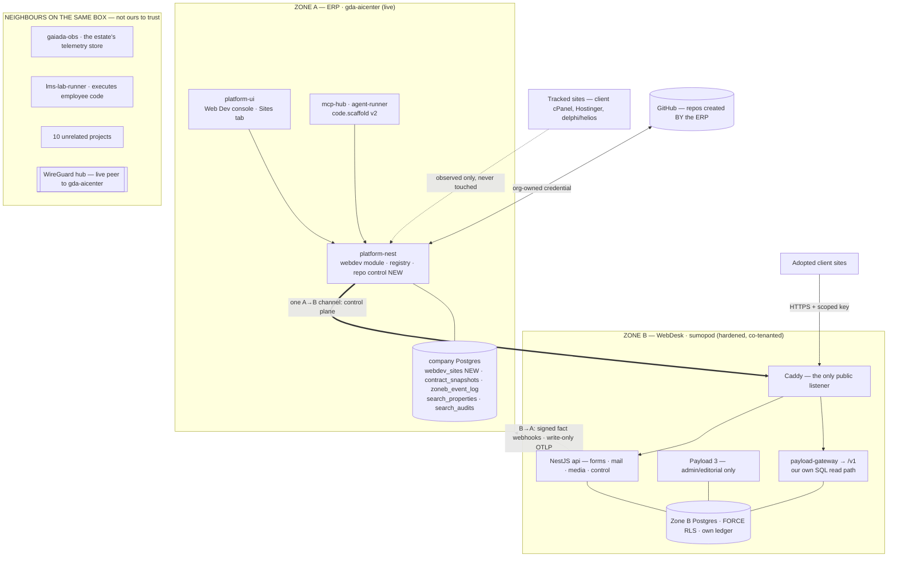

# WebDesk — Design v2.0 (the unified backend, the portfolio, and repo control)

> **Status:** AUTHORITATIVE. **Supersedes [`webdesk-design.md`](./webdesk-design.md) v1.1** and
> **[`provision-erp-seam-design.md`](./provision-erp-seam-design.md) v1.0** (§08 absorbs the seam).
> **Version:** v2.0 · **Date:** 2026-08-29 · **Author:** Claude, from owner rulings 2026-08-28/29
> **Build from this file.** Where a section says *carried unchanged*, v1.1's text remains correct
> and is not reproduced — read it there. Everything else here overrides it.
>
> **Ground-checked against the working tree and the live estate on 2026-08-28/29.** Every status
> claim below was read from source or probed read-only; none was taken from a tracker. Where a
> claim could not be verified, it says so.

---

## §00 · Executive summary

v1.1 was a good design for a platform with no ground under it. It assumed a dedicated Zone B box
that never arrived, assumed every site would be a full tenant, and assumed frontends would deploy
somewhere the team could reach. None of those held. v2.0 keeps the engineering — the tenancy wall,
the frozen contract, the codegen determinism gate, the rail — and replaces the assumptions with
what the estate actually is.

Six moves:

1. **Zone B lands on `sumopod`, hardened**, under a new estate rule that assigns every host to a
   tier by purpose (§00a, §03). Not a dedicated box, so §03's containment claim is rewritten
   honestly rather than restated — including a standing private path toward Zone A that the old
   text would have called disqualifying.
2. **Payload is the editorial layer, not the read path** (WSK-D24, folded in properly at §05).
   `/v1` is served by our own tenant-aware SQL route. This already shipped; v1.1 never said so.
3. **The portfolio becomes a first-class object** (§07). Most client sites will never be tenants,
   and must never be touched — they are *tracked*. Adoption is a ladder a site climbs by choice,
   per site, and adoption does **not** require owning the host.
4. **The ERP owns repo creation and scaffolding** (§08), across three project kinds —
   `static` · `wp` · `fullstack` — driven by a signed PRD or a staff button. This absorbs the
   provision⇄ERP seam and retires the external `provision` tool once parity is proven.
5. **Build cost is a design constraint, not an afterthought** (§10). Every job in the estate runs
   on metered GitHub compute today. The adoption ladder is itself the largest structural lever,
   because an adopted site stops rebuilding when content changes.
6. **The plan is re-cut around one internal proof** (§12), on a box we can actually reach, with the
   observe-only and reachability blockers moved off the critical path where they belong.

---

## §00a · The estate tier rule (WSK-D27 — owner-ruled 2026-08-29)

**Every host belongs to exactly one tier, decided by purpose, never by spare capacity.**

| Tier | Hosts | Carries |
|---|---|---|
| **Client project delivery** | `helios` (production) · `delphi` (staging) · Hostinger (WordPress) | Client deliverables — sites we built and operate for clients. Ours to reorganize; no customer negotiation needed. WordPress stays on Hostinger **permanently**. |
| **This ERP and everything operational to it** | `gda-aicenter` (live ERP) · `sumopod` | The ERP itself, and **WebDesk** — because WebDesk is our platform, an ERP capability, not a client deliverable. |

Three consequences, each of which settles a question this program kept re-litigating:

- **Zone B runs on `sumopod`.** By the rule, not by preference or by capacity.
- **WebDesk never installs on `helios`/`delphi`/Hostinger.** Those hold client deliverables only.
- **Milestone 0 stops being blocked.** Its proof tenant is an *internal* site, and an internal site
  is ERP-operational — so it lives on `sumopod` beside the backend. The observe-only ruling and the
  reachability problem on `delphi`/`helios` gate **first client delivery**, not the proof (§12).

**Corollary — headless WordPress is not a deferrable phase.** WP stays on Hostinger permanently,
so the PHP path is a permanent tier of the platform. v1.1's Phase 6 framing is wrong and §12
re-sequences it.

---

## §01 · Honest status audit (read from source, 2026-08-28/29)

**The build is far ahead of every document describing it**, and `docs/modules/MODULES.md` says so
twice, inconsistently: its **registry table** carries `webdesk 0.1.0 PROTOTYPED` while its own
**section heading** still says `0.0.0 PLANNED`. That is v1.1's F-1 heading-vs-table drift, on the
component this document governs. Per F-1 the table is the number of record, so `0.1.0 PROTOTYPED`
is the live claim — the heading is the stale half, and reconciling both is part of this design's
landing (§12, step 0).

*(Corrected 2026-08-29: an earlier revision of this section asserted the registry read
`0.0.0 PLANNED`. That was read from a checkout 71 commits behind `main` — the exact staleness
hazard §01 warns about, demonstrated on this document. Verify current-state claims against
`origin/main`, never against a local tree.)*

| Layer | Reality | Claimable status |
|---|---|---|
| Tenancy wall | Pooled-connection GUC stamping via a typed `pg.Pool` subclass + AsyncLocalStorage, **plus** an independent app-layer predicate. Mutual independence proven: each layer isolates with the other disabled. | **DEV-VERIFIED (provisional)** |
| Zone B schema | 8 migrations, own ledger, 15+ tables all FORCE RLS, owner/migrator/app split, all NOBYPASSRLS, CI integrity checker | **DEV-VERIFIED (provisional)** |
| `/v1` contract | Frozen. 8 primitives · 9 blocks · locale + `localizations` · cursor pagination · RFC 9457 errors · cache tags · redirects | **FROZEN** |
| Codegen | OpenAPI-first; TS + PHP SDKs and the Markdown contract derived; byte-identical double-run gate across two independent containers | **DEV-VERIFIED** |
| Services (`webdesk/api`) | 20 modules / 165 files: api-keys, forms, mail, media, control (18 commands), codegen, privacy/DSR, tenant-webhooks, promotion, schema-draft, events, audit, rate-limit, storage | **PROTOTYPED** |
| The rail | Zone A snapshot mirror with a DB-level immutability trigger; `code.scaffold` v2 proven never to execute snapshot-derived code; a real Astro proof-site rebuilt from generated types | **DEV-VERIFIED** |
| Console | Sites tab components + 4 read endpoints under the `webdev` module | **PROTOTYPED, honestly stale** |
| WordPress | PHP SDK generated from the same OpenAPI; headless theme + render-invariant probe | **PROTOTYPED** |
| Ops / deploy | Hardening runbook, backup + sentinel scripts, status page, SSH/rsync deploy driver | **PLANNED — nothing ever run** |

### The evidence caveat that governs every row above

A standing rule landed 2026-08-26: **tests count only on a Linux server, never the Windows laptop.**
Every green in this program predates it. The code is not in doubt; the *evidence* is. Under §00a
`sumopod` is now both the home and the test host, which is what makes re-verification possible at
all — it is the first item in §12 and the real content of the Milestone-0 gate.

### Two gaps that block live operation, named because they are easy to miss

1. **The rail's demand end is unwired.** No hub tool reads a contract snapshot by id, downloads
   artifact bytes, or resolves a `pipeline_stages.artifact_ref`. §06 assumed all three. Until this
   closes, **PRD-driven anything cannot work live** — the scaffolder cannot fetch the PRD artifact
   it is handed a reference to.
2. **The control plane is write-mostly.** It ships **3** GET routes (`contract`, `jobs`, `jobs/:id`)
   against 15 write commands, so the console's registry/releases/submissions reads are built from
   Zone A's own facts and are honestly always `stale:true`. The read commands §09 needs were never
   scoped. This is correct behaviour over a confident empty list, and it is still a gap.

---

## §02 · System overview

**Reading it.** The only structural change from v1.1 is the middle-right box: Zone B no longer sits
alone on a dedicated machine. It has neighbours, one of which is a code-execution sandbox and one of
which is a tunnel endpoint into Zone A. That is what §03 now has to account for.

---

## §03 · Trust zones — the sumopod exception, stated in full

Zone definitions carry unchanged from v1.1. The channel table (one A→B, two B→A) carries
unchanged. **What changes is the containment statement**, and it must be rewritten rather than
repeated, because v1.1 explicitly ruled out this exact arrangement:

> v1.1 §03: *"GDA-AI01 is NOT a candidate for the Zone B box … co-tenanting Zone B beside unrelated
> internet-facing services destroys the containment statement this whole section is built on — the
> blast-radius table becomes fiction the moment a neighbour on the same box is compromised."*

That reasoning was sound and it applies to `sumopod` too. The owner has weighed it and ruled
(WSK-D27). What a design owes an accepted risk is not a re-argument, but an accurate statement of
what was accepted and the cheapest available mitigation.

### What is actually on the box

**This repository is public, so the address map is deliberately not here.** Host identity, the
neighbour inventory, the mesh addressing and the published-port list live in the gitignored
operator note `docs/blueprints/webdesk-zoneb-box-detail.local.md` — measured
read-only 2026-08-29 and kept current there. What follows is the part an architecture reader
needs, and it is complete on its own terms.

Zone B does **not** have the box to itself. Sharing that kernel are:

| Neighbour class | Why it matters to Zone B |
|---|---|
| **The estate's private-mesh endpoint** | **The one that matters.** An internet-facing service now shares a kernel with the tunnel endpoint into Zone A. The design's whole premise was that Zone B has no path inward. |
| **The estate's observability store** | It holds telemetry for the whole estate, Zone A included. Reading it is reading a map. |
| **A sandbox that executes untrusted code** | A hostile-workload neighbour by design. Sandbox escape and Zone B compromise become adjacent problems. |
| **~10 unrelated third-party projects** | Ten projects' worth of attack surface and ten projects' worth of patching we do not control. |
| **Pre-existing services published on all interfaces, one of them a database** | Not Zone B's doing, and now Zone B's neighbourhood. On this estate the container runtime's NAT rules are evaluated *before* the host firewall, so an all-interfaces bind is internet-reachable even where the firewall reports deny. |

Capacity is shared and finite — roughly half the RAM and all four cores are contended — which is
why the resource limits in the hardening list below are acceptance criteria, not tuning.

### The honest blast-radius statement

**A Zone B compromise on this box can reach**, at minimum: every other container's published port
on the host; the observability store; and — subject to container escape — the mesh interface, and
therefore a network path toward Zone A. **v1.1's claim that a Zone B compromise cannot
reach Zone A no longer holds and must not be repeated anywhere.** What remains true is narrower and
still worth having: Zone B holds **no Zone A credential**, no Keycloak secret, no ERP database
password, and no deploy key. A path is not an authorisation; an attacker on that path still faces
Zone A's own authentication. That is the containment claim v2.0 makes, and it is smaller than v1.1's.

### Mandatory hardening (ACs, not aspirations)

1. **Its own compose project** (`name: webdesk`), so the estate's `--remove-orphans` trap cannot
   reach it and neighbours cannot reach it by project name.
2. **No host ports at all** except the proxy, bound to `127.0.0.1`. Verify against the **resolved**
   config, never the overlay — see `webdesk/ops/README.md` for the `!reset`/`!override` mechanics
   and the failure mode where `docker compose config` exits 0 on a broken overlay.
3. **Payload admin reachable only through an SSH tunnel.** No vhost, no published port, ever.
4. **Own Postgres, own Redis, own MinIO** — no reuse of any neighbour's instance, no shared volume.
5. **CPU and memory limits on every Zone B service**, so a Zone B spike cannot degrade the
   observability hub the whole estate depends on, and a neighbour spike is survivable.
6. **A written statement, re-verified at the gate, of what the mesh peering means** — including a
   deliberate decision on whether Zone B's containers may route to the private mesh at all.
   Default: **they may not**; an explicit deny is cheaper than an argument later. The addresses
   are in the operator note, not here.

### Pre-existing exposures to raise separately

The all-interfaces binds that predate this program — one of them a database — belong to other
projects (enumerated in the operator note). **Zone B must not depend on them being fixed, and must not fix them unilaterally.**
Raise them as their own item with the owner; note here so a future reader does not mistake silence
for safety.

---

## §04 · Domain model

**Zone B schema: carried unchanged** from v1.1 §04 (8 migrations, own sequential ledger, FORCE RLS
everywhere, role split). **Two ledgers, never mixed** stands. Zone A migrations remain
timestamp-named (WSK-D21).

### New in Zone A — `webdev_sites`, the portfolio registry

One row per **site/domain**, not per project: a project routinely owns production, staging, and a
microsite, each with its own host, stack and adoption state.

| Column group | Fields | Notes |
|---|---|---|
| Identity | `id`, `tenant_id`, `project_id` → `projects`, `client_id` → `clients`, `domain` | `project_id` nullable — an internal site has no client project |
| Hosting | `host_kind` (`our-box` · `client-cpanel` · `shared-hosting` · `external` · `unknown`), `host_ref`, `access` (`none` · `ftp` · `cpanel` · `ssh` · `full`) | **Independent of adoption.** Who owns the host and what access we hold are separate facts from how much of WebDesk the site uses |
| Delivery | `kind` (`static` · `wp` · `fullstack`), `repo_url`, `adoption` (`tracked` · `linked` · `adopted` · `mandated`), `contract_version` | `kind` is the §08 vocabulary — one word, mapped everywhere |
| Provenance | `origin` (`nexus-import` · `provisioned` · `manual`), `created_at`, `updated_at` | An imported row is a lead to verify, never a measurement |
| Credentials | **none — a `vault_ref` text pointer only** | See the rule below |

**Two hard rules on this table.**

- **It lives in Zone A and never in Zone B.** A tracked site must not require a Zone B tenant row.
  Otherwise the internet-facing content backend accumulates rows for sites it does not serve, and a
  Zone B compromise hands over an inventory of the entire client estate — including sites on
  clients' own infrastructure.
- **It references credentials; it never stores them.** Client cPanel and FTP credentials currently
  live in a gitignored `CREDENTIALS.local.md` on one laptop. That is not a system of record, and
  the fix is a vault with a pointer from this table — **not** a credentials column. Holding clients'
  hosting passwords in the ERP database is a custody decision that must be made deliberately or not
  at all.

### Join, do not duplicate — `search_properties` already exists

The SEO module owns the domain-level asset and its crawl consent, and its schema is applied:

| Existing asset | What it already provides |
|---|---|
| `search_properties` | tenant → client → **domain**, `UNIQUE (tenant_id, client_id, domain)`, and a **`verified_at` crawl-consent gate** |
| `search_audits` · `search_audit_findings` | per property × kind, idempotent ingest by `report_hash`, findings with severity/category/sample URLs and **regression diff between runs** |
| `search_engagements` | `audit_technical` / `audit_cwv` toggles with cadences, plus a budget stop-loss |
| `search-crawl-go` | a real crawler with its own `robots` and `egress` packages |
| `src/seed/nexus-import.ts` (SM-70, **built**) | seeds ~63 real client properties, idempotent by construction |

`webdev_sites.domain` joins `search_properties` on `(tenant_id, client_id, domain)`. WebDesk owns
*delivery* facts; the SEO module keeps owning crawl, findings and consent. **One domain, one
property row, one consent gate, one crawler.**

---

## §05 · The contract — carried, with D24 folded in

Vocabulary v1, the composition layer, the codegen chain, the versioning semantics and the
determinism gate all **carry unchanged** from v1.1 §05. The `/v1` envelope is **frozen** and this
document does not reopen it.

**What v1.1 never recorded, and is now true in shipped code (WSK-D24):**

> **Payload is the EDITORIAL layer, not the read path.** `/v1` content reads are served by our own
> tenant-aware SQL path (`payload/collections/*` + `app/(payload)/v1/[...slug]/route.ts`). Payload
> owns the admin panel, authoring, and the schema.

The reason is structural, not stylistic: Payload's REST dispatcher only consults `config.endpoints`
under `routes.api`, so `/v1` could only have been served as `/api/v1/…`; re-pointing `routes.api` at
`/v1` would have put Payload's **unscoped automatic collection REST** on the public prefix — exactly
the leak WSK-D20 exists to prevent. Serving reads ourselves closes it by construction and gives us
byte control of the frozen envelope.

**Accepted costs, restated so they are not rediscovered:** we own the read side of localization,
drafts and versions rather than inheriting Payload's; and the API-key hash algorithm is duplicated
in two services and must change in both.

**Payload's own open item (WSK-D25, partially closed).** The app-layer predicate fires on REST but
is **skipped on the default Local API path**, because Payload runs an `access` function only when
`overrideAccess` is false and the Local API defaults it true. Client reads are unaffected (`/v1`
never traverses Payload), so the residue is staff/admin/seed code running on RLS alone.
**Required, and still unbuilt: a lint forcing project Local API callers to pass
`overrideAccess: false`.** Without it a future author silently reopens the gap.

---

## §06 · The one rail — carried, with its blocker named

Both ends carry unchanged from v1.1 §06: Zone B serves the contract; Zone A mirrors it into
`webdev_contract_snapshots`, immutable and content-addressed, enforced by a **database trigger** so
a direct UPDATE/DELETE is refused; `code.scaffold` v2 pins a snapshot id, emits `CONTRACT.lock`, and
never executes snapshot-derived code in Zone A (WSK-D6, proven not asserted).

**The blocker, restated from §01 because it gates §08:** nothing can fetch an artifact's bytes or a
snapshot by id from the hub. The scaffold envelope carries `prdArtifact` and `contractSnapshotId`
as references into a system that cannot yet dereference them. **This is the first build item in
§12's automation phase**, because PRD-driven provisioning is impossible without it.

---

## §07 · The portfolio — tracking, and the adoption ladder

**The requirement, in the owner's terms (2026-08-29):** future projects must correctly use the
unified backend; past and current projects must never be changed — they are already in production,
some on our servers and some on the clients' own — but they must at least be **tracked**, and may
adopt later.

v1.1 had no concept of a site we merely know about. This section is that concept.

### The ladder

| State | Means | What WebDesk does to the site |
|---|---|---|
| `tracked` | We know it exists: domain, host, stack, client, project. **Everything currently live starts here.** | **Nothing.** Inventory, plus zero-touch external observation where consent exists. |
| `linked` | Keeps its own frontend and hosting; uses exactly one WebDesk service. **Forms first** — it kills web3forms with no rebuild. | One endpoint. No content, no deploy, no schema. |
| `adopted` | Content served from `/v1`. A real Zone B tenant. | Full platform. |
| `mandated` | Every new project, from birth. | Enforced at both gates (§08). |

**Adoption does not require owning the host.** `/v1` is HTTPS with a scoped key. A site on a
client's own cPanel can be `linked` (its forms POST to WebDesk) or fully `adopted` (built static
uploaded over FTP, content read from `/v1`). What a client-owned host costs us is *deploy
automation* — not the platform. This materially widens who can adopt, and it is the reason
`host_kind`/`access` are modelled independently of `adoption` in §04.

**Adoption is realistic for the current portfolio.** The live sites on `delphi` and `helios` are
**static / Astro / Vite / Next** — already frontend-only or close to it. Adoption there is a
re-point, not a rebuild.

### Observation, and its consent gate

Where `access = none` — every client-owned cPanel, and Hostinger — observation is **zero-touch and
external only**: uptime, TLS expiry, DNS, HTTP headers, CMS fingerprint. That is already designed
and it reuses the estate's own stack rather than building a probe harness:

| Ticket | What it is | State |
|---|---|---|
| **SM-70** | the Nexus importer — lands ~63 client properties into `search_properties` | ✅ **built** (inert, opt-in) |
| **SM-74** | *"property hosting topology field set on `search_properties` — host, **control panel**, stack, plugin surface"* | ⬜ designed, `junior` |
| **MON-01** | blackbox-exporter extended to client properties: `targets.yml` generated from `search_properties` (**verified rows only**), `http_2xx` + `ssl_expiry` | ⬜ designed |
| **MON-04** | Grafana "Client Properties" dashboard — uptime, cert days remaining, per-property drill-down | ⬜ designed |

**Consent is not optional and not implied.** `search_properties.verified_at` exists because
scheduled requests to someone else's server is a permissions question. MON-01's "verified rows
only" rule is load-bearing: **an unverified property is not probed.** Scheduled auditing of
client-owned infrastructure also needs an egress entry and a per-client answer on whether the
engagement covers it (OQ-2.4).

**One nuance carried from the 2026-08-23 owner ruling:** Gaia Nexus is evidence, not specification.
Import it for the **domain list and hosting facts**; measure everything fresh through MON-01. A
2025 audit must never render as today's status.

---

## §08 · Repo control and scaffolding — the ERP owns provisioning

**Supersedes [`provision-erp-seam-design.md`](./provision-erp-seam-design.md) v1.0.** That design
made the external `provision` tool an ERP capability behind a contract. The owner has ruled instead
that **provisioning is rebuilt inside the ERP** and `provision` retired once parity is proven —
because it is internet-facing with demo credentials printed on its own login page, and because
repo creation currently depends on an individual's personal PAT.

### What the ERP must produce

A signed PRD (automation) or a staff button (manual) yields: a **private GitHub repo from a
per-kind template**, the right folder structure inside it, a `webdev_sites` row, and a Zone B tenant
with a pinned contract — with idempotency and crash-resume, both of which `provision` already
demonstrates in live code and neither of which may regress.

### One kind vocabulary, mapped everywhere (WSK-D28)

Four places currently disagree about what a "kind" is, which is why a button labelled *static*
would mean three different things. The canonical vocabulary is **`static` · `wp` · `fullstack`**:

| Kind | Template | `code.scaffold` `siteKind` | `webdev_provisioned_sites.framework` | Today |
|---|---|---|---|---|
| `static` | template-static (from `-nonssg`) | `astro` | widen CHECK | works as `vite`/`astro` |
| `fullstack` | template-fullstack (from `-nextjs`) | `node` | widen CHECK | works as `nextjs`/`node` |
| `wp` | **template-wp (new)** — theme exists at `webdesk/wordpress/scaffold-template/` | lift `rejected_site_kind`, wire the PHP SDK path | widen CHECK | **refused in 4 places** |

**Lifting the refusals is a ruling, not a code tweak.** WordPress and full-stack are refused
deliberately at four points — `webdev_provisioned_sites.framework CHECK`, the tool's `framework`
enum, the tool's `stack` hint (`unsupported_stack`, never silently downgraded), and the
scaffolder's `rejected_site_kind`. v1.1's D-P7 stands until this design lands; then the `stack`
hint stops being a refusal and becomes the selector. One migration widens the CHECK; all four must
agree in the same change or the console and the scaffolder disagree silently.

### Two scaffolders, one job each

| | Produces | Owns |
|---|---|---|
| **ERP repo control** (new, replaces `provision`) | the repo from a per-kind template + the `webdev_sites` row + the Zone B tenant | structure |
| **`code.scaffold` v2** (exists) | the source *inside* that repo — pages from the prototype, the pinned contract, `CONTRACT.lock`, TODO stubs plus schema-proposal drafts for vocabulary gaps | content wiring |

### Credentials and deploy — what Zone A may and may not hold (amends D-P4)

v1.1's seam design kept the GitHub PAT and the fleet SSH key **out of Zone A** because provisioning
shelled into a web server with `sudo`. Rebuilding inside the ERP inverts half of that, so v2.0
splits it:

- **Zone A holds an org-owned GitHub credential** — a machine account or fine-grained token, never a
  personal PAT. Repo creation is an API call; it needs nothing else. **This amends D-P4 and is a
  deliberate widening of what a Zone A compromise reaches.**
- **Zone A holds no SSH key and deploys nothing.** Each provisioned repo's own Actions workflow
  deploys itself, exactly as `provision`'s template already does — but the three deploy secrets move
  to **org-level Actions secrets with selected-repository access**. The ERP grants a new repo access
  to a secret it never possesses. The fleet key never enters Zone A, which preserves the half of
  D-P4 that actually matters.

### The two gates that make "future projects" structural

1. **Scaffold.** A new site repo comes into being *only* through this path, which pins a contract
   snapshot and emits `CONTRACT.lock`. `github.createRepo` — the generic tool — **stays fail-closed
   forever** (D-P6); this scoped, template-only, WS4-gated path is the alternative, not an
   enablement. Ratifying that is OQ-2.1.
2. **Deploy.** Refuse to deploy a site with no `webdev_sites` row and no contract lock. Bypassing
   then requires deliberately working around tooling, which is visible and recorded as an exception
   with a reason.

### Automation vs manual — already built, do not rebuild

The distinction the owner described already exists in tested code: *"the automation path requires a
DECIDED `prd_sign` gate; the staff path does not."* Automation fires only on a signed PRD; a human
clicking the button does not need one. The scaffold envelope's `prdArtifact` is the artifact ref of
the **signed** PRD stage. Keep both paths and keep that asymmetry.

---

## §09 · Console surfaces

Carried from v1.1 §08 (dept-interface-template, the Build group, the button capability matrix),
with three additions and one correction:

- **NEW — Portfolio.** The registry: every site, its host, its access level, its adoption state,
  its audit status. The ergonomic requirement named in the harvest plan holds: *an account manager
  adds a client site in the UI, with no deploy.*
- **NEW — Provision.** The staff button: kind picker (`static`/`wp`/`fullstack`), slug override,
  WS4-in-flight state, failure reason surfaced.
- **NEW — Adoption.** Per-site promotion up the ladder, each step an explicit, audited action.
- **CORRECTION — staleness must be visible.** Registry, releases and submissions reads are
  `stale:true` by construction until the control plane grows read commands (§01). The console must
  say so rather than render a confident empty list.

---

## §10 · Build cost as a design constraint

**Owner goal, 2026-08-29: reduce GitHub build billing.** It belongs in the design because the
largest lever is architectural, not operational.

**Measured facts:** all **17 jobs** across the estate's 4 workflows run `runs-on: ubuntu-latest` —
GitHub-hosted, metered. **Zero self-hosted runners.** The ERP repo is a **personal-account** repo
(`hansel-gaiada/gaiada-system`); the operator token sees **no orgs**, so the client repos in
`Gaia-Digital-Agency` bill against a different account entirely. **Two billing buckets.** The actual
figures could not be read (billing endpoints need `admin:org`) — OQ-2.5.

Levers, in size order:

1. **Self-hosted runner.** Actions minutes are billed only for GitHub-hosted runners; self-hosted
   compute is unmetered, and for **private** repos this is the sanctioned pattern (the fork-PR
   hazard applies to public repos). **Placement is a security decision:** a runner executes
   arbitrary repo code, so it must **not** go on `sumopod` (WireGuard hub, telemetry store, code
   sandbox) or on `gda-aicenter`. It needs its own isolation — the same argument as Zone B, reached
   independently.
2. **Adoption removes content-driven rebuilds.** Today a content edit is a build. On an `adopted`
   site content comes from `/v1`, so **content changes stop being builds**. Twenty edits a month
   becomes twenty builds today and zero after adoption. This gives the §07 ladder a hard-dollar ROI
   and answers "why would this site adopt" with a number instead of an argument.
3. **Build hygiene** — path filters so docs-only pushes do not rebuild, concurrency cancellation for
   superseded runs, dependency caching, and consolidating the ERP's 4 shards.
4. **Move builds off Actions entirely** — WebDesk's own pipeline (`webdesk/deploy`'s rsync driver
   exists). Only worth it after 1–3.

---

## §11 · Security deltas beyond §03

Carried from v1.1 §11: key hashing with a pepper, the egress allowlist, immutable audit, structural
anti-injection, the data-protection posture (WSK-D22 — processor role, WS4-gated DSR commands,
per-submission consent records, residency statement).

New in v2.0:

- **The registry is an asset inventory of the whole client estate.** It is exactly what an attacker
  would want first. Zone A only (§04), normal RBAC, and no credentials in it.
- **Scheduled outbound requests to client infrastructure** are a new egress class, gated on
  `verified_at`, rate-limited, and denied for private IP ranges (the SEO module's existing rule).
- **An org-owned GitHub credential now lives in Zone A** (§08). Fine-grained, repo-creation scoped,
  rotatable, and **never** the fleet SSH key.
- **A CI runner is a code-execution surface** and is placed accordingly (§10).

---

## §12 · Rollout, re-cut

The gate that could not close (Milestone 0 needing a frontend on an unreachable, observe-only box)
is dissolved by §00a. The sequence below replaces v1.1 §12's six phases.

**Step 0 — reconcile the record** (hours, not days). `MODULES.md` off `0.0.0 PLANNED`; D24/D25/D27
and this document into the tracker; the tracker's stale "what's next" rewritten. The drift is why
the program's direction became unreadable.

| Phase | Contents | Gate |
|---|---|---|
| **P1 · Ground** | Harden `sumopod` per §03 and deploy Zone B there. Re-run all 34 provisional greens on it. | Every green is Linux-verified. `webdesk` appears in a CI workflow (today: zero hits). |
| **P2 · The proof** | One **internal** site on `sumopod`, content from `/v1`, built from generated types. | The rail works end to end, on a box we can reach, with no client and no DNS move. |
| **P3 · Portfolio** | SM-70 import → SM-74 hosting topology → MON-01 probes → registry + console surface. | ~63 properties tracked, consent honoured, nothing on any client server touched. |
| **P4 · Repo control** | §08: the three kinds, all four refusals lifted together, org credential, both gates, staff button. Go live **once**, with every kind supported. | A staff click and a signed PRD each produce a correct repo, for each of the three kinds. |
| **P5 · WordPress** | Headless WP — permanent tier, not a deferred phase. PHP SDK is already generated. | A WP site renders entirely from `/v1`. |
| **P6 · Client delivery** | Only now: the observe-only ruling, reachability, and deploy identity for `delphi`/`helios`. | Requested with a working platform behind it, not a plan. |

**Build-cost work (§10) runs alongside P1** — the self-hosted runner is independent of everything
else and pays for itself immediately.

---

## §13 · Open questions

| # | Question | Default if unanswered |
|---|---|---|
| OQ-2.1 | Ratify: repo creation stays manual **except** through the scoped, template-only, WS4-gated ERP path; `github.createRepo` stays fail-closed forever | Adopt as written (§08) |
| OQ-2.2 | Authority to configure `sumopod` for Zone B — direct, or runbook-for-owner-to-execute | Runbook only; nothing executed |
| OQ-2.3 | The internal proof site's hostname — a real subdomain on `gaiada.online`, or close P2 on host:port | Real subdomain |
| OQ-2.4 | Do client engagements permit scheduled auditing of their sites? | **Unverified per client** — `verified_at` stays false, nothing is probed |
| OQ-2.5 | The monthly Actions figure, and which account owns the client repos | Assume the ERP monorepo dominates; act on lever 1 regardless |
| OQ-2.6 | Vault choice for client hosting credentials (`vault_ref` target) | Blocked — no credentials enter the registry until answered |
| OQ-2.7 | Per-tenant cost and quotas (v1.1's A-10, still open) | Deferred; `sumopod` capacity in §03 is the interim ceiling |
| OQ-2.8 | Payload trademark check on the rebrand (v1.1's A-11, still open) | Ship unbranded internally until answered |

---

## §14 · Decision log (v2.0)

Decisions **WSK-D1…D26 carry** from v1.1 §14 except where amended below.

| # | Decision | Why |
|---|---|---|
| **WSK-D27** | **The two-tier estate rule; Zone B lands on `sumopod`, hardened.** The undocumented 2026-08-27 helios direction is **withdrawn** — its compose overlay and vhost template were deleted, their mechanics preserved in `webdesk/ops/README.md`. Nothing was ever run against helios. D26's client-frontend routing is unaffected. | One principle replaces per-question host haggling. It also resolves a live contradiction: that overlay deployed Zone B beside 23 live third-party client sites while §03 forbade exactly that. **Standing rule earned here: no ruling exists outside this log** — the overlay's only record was a comment on line 1 of the file it justified. |
| **WSK-D28** | **One project-kind vocabulary — `static` · `wp` · `fullstack` — mapped through all four places, and the WP/full-stack refusals lifted together in one change.** | Four components currently disagree about what a kind is. Lifting the refusals piecemeal makes the console and the scaffolder disagree silently, which is worse than refusing. |
| **WSK-D29** | **Provisioning is rebuilt inside the ERP; `provision` is retired once parity is proven.** Zone A holds an **org-owned** GitHub credential (never a personal PAT); it holds **no SSH key** and deploys nothing — repos self-deploy via org-level Actions secrets they are granted access to. **Amends D-P4.** | The external tool is internet-facing with demo credentials on its login page, and repo creation depended on one person's token. The split keeps the half of D-P4 that matters (no fleet key in Zone A) while removing the dependency. |
| **WSK-D30** | **The portfolio registry is Zone A only, one row per site/domain, and stores no credentials — only a `vault_ref`.** Tracking never requires a Zone B tenant. | The registry is an inventory of the whole client estate — the first thing an attacker would want, and the last thing an internet-facing backend should hold. |
| **WSK-D31** | **Join `search_properties`; do not duplicate it.** One domain, one property row, one consent gate, one crawler. | The SEO module already owns domain identity, crawl consent, audit history with regression diffs, and a crawler. A second registry would fork consent — the one thing that must never be ambiguous. |

---

*Cross-references:* [v1.1 (superseded, still the source for carried sections)](./webdesk-design.md) ·
[reassessment](./webdesk-design-reassessment.md) ·
[provision seam v1.0 (superseded by §08)](./provision-erp-seam-design.md) ·
[PROGRESS tracker](../plans/2026-08-26-webdesk-PROGRESS.md) ·
[SEO audit capability](../plans/2026-08-23-seo-audit-capability.md) ·
[Nexus harvest](../plans/2026-08-13-gaia-nexus-harvest.md) ·
[box hardening runbook](../../infra/runbooks/webdesk-zoneb-box-hardening.md) ·
[ops overlay lessons](../../webdesk/ops/README.md) ·
[MODULES registry](../modules/MODULES.md)
