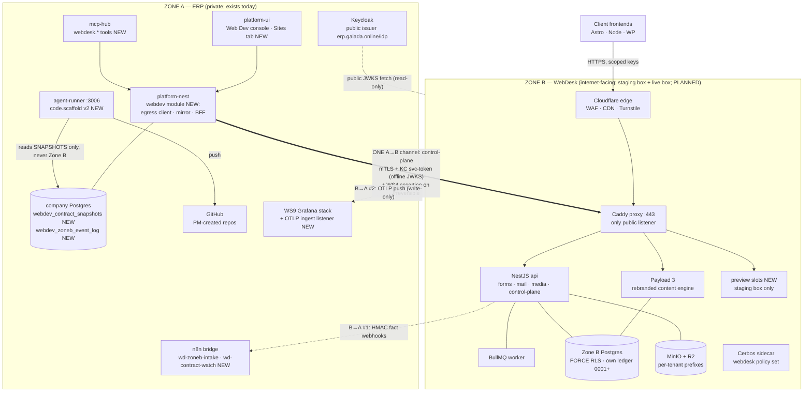
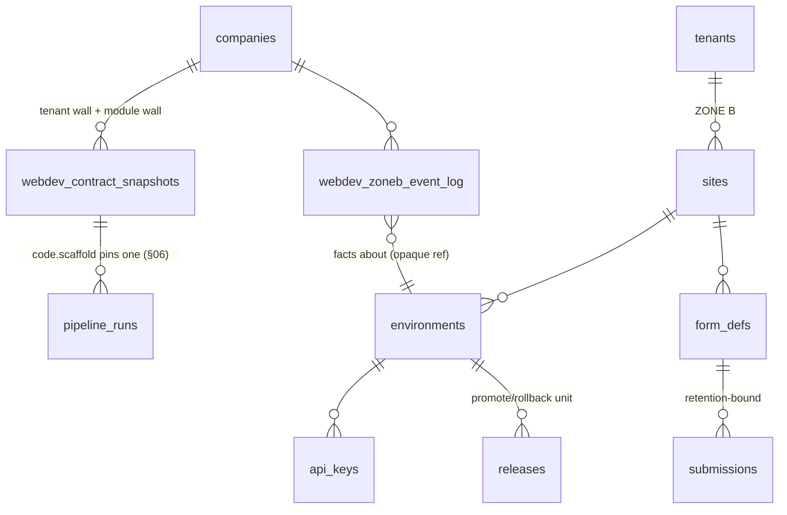

# WebDesk — Architect Design (Zone B Website Platform · the One Rail, Supply Side)

> **Status:** Design blueprint — turns the approved WebDesk Engineering Blueprint (v1.2) into an
> operational design + /army-ready ticket program. **webdesk stays `0.0.0 · PLANNED` in
> [`../modules/MODULES.md`](../modules/MODULES.md) until the first ticket merges** (status-language
> rule: the first merged ticket flips it `IN PROGRESS` + CHANGELOG; approving this doc bumps
> nothing).
> **Version:** v1.0 · **Date:** 2026-08-07 · **Author:** System Architect (Claude)
> **Primary inputs:**
> [`webdesk-blueprint.html`](./webdesk-blueprint.html) (**v1.2 HTML is authoritative** — the PDF
> sibling and hosted artifact are stale at v1.0, per [`../BLUEPRINTS.md`](../BLUEPRINTS.md) §2; the
> 2026-08-04 C-02/C-03 mail amendments + D14 exist only in the HTML) ·
> [`webdev-design.md`](./webdev-design.md) — its **§05 scaffold job envelope is FROZEN** and both
> sides of the rail build to it; its D-5/D-8/D-9/D-10 and OQ-5/OQ-6 defaults are carried, not
> reinvented · [`webdev-foundation.md`](./webdev-foundation.md) — the 6 locked 2026-07-24 decisions
> (this doc serves lock 3, "one rail", and lock 6's Phase-4 slot) ·
> [`../superpowers/specs/2026-08-04-zone-a-mail-design.md`](../superpowers/specs/2026-08-04-zone-a-mail-design.md)
> (v3 — Zone A mail doctrine; constrains C-03's activation timing).
> **Sibling deliverables:** [`webdev-design.md`](./webdev-design.md) ·
> [`seo-sem-design.md`](./seo-sem-design.md) · [`smm-design.md`](./smm-design.md) ·
> [`creative-design.md`](./creative-design.md) — same section map, same rigor. Where Web Dev's
> defining hazards are client-facing irreversibility and the zone wall, **WebDesk IS the other side
> of that wall**: an internet-facing multi-client platform whose defining hazards are
> **cross-tenant leakage** (many clients, one database, public surface) and **the boundary itself**
> (it must be useful to the ERP without ever becoming a path into it).

---

## §00 · Executive summary

WebDesk needs **standing up, not welding** — it is the estate's first genuinely new deployable
since the render gateway was blueprinted, and the largest unbuilt program in the Web Dev
department. The architecture in six moves:

1. **A standalone Zone B project with its own everything.** `webdesk/` joins the repo as a
   separate component project (per the estate rule: separate projects, not a monorepo package):
   its own compose stack (proxy · Payload 3 · NestJS api · BullMQ worker · Postgres · MinIO ·
   Redis · ClamAV · otel), its own Postgres with its **own migration ledger starting `0001`**, its
   own Cerbos sidecar and policy set. Only the Zone A mirror tables (§04) enter the platform-nest
   ledger — at **next-unused at merge time** (head was `0087` when this was written; it drifts
   fast and is racing with concurrent programs).
2. **Dev-first, procurement-honest.** The two KVM8 boxes (staging + live) do not exist yet. This
   design is cut so that **29 of 36 tickets are fully buildable today** on the dev estate (the
   whole of P1–P3 + the rail, P5, P6, and most of P4's logic), 4 more build now with a live-fire
   leg deferred, and only **3 tickets are hard procurement-gated** (preview slots, custom
   domains/TLS, box ops baseline) plus the full P4 QA gate. The trust boundary is *logical* until
   the boxes land; every zone-split QA item re-runs at procurement (D-2). Recommended owner
   action: order the **staging box at P3 exit**, the live box before the P4 gate (OQ-W1).
3. **The trust boundary made operational (§03).** Exactly one channel crosses A→B (the
   control-plane call: mTLS from the synccert internal CA + a Keycloak client-credentials token
   verified **offline** in Zone B against the public issuer JWKS, + a single-use WS4 approval
   assertion on irreversible commands). Exactly two channels cross B→A (HMAC-signed fact webhooks
   into the n8n bridge, and **write-only OTLP telemetry push** — an explicit amendment this design
   makes to the blueprint's containment wording, which contradicted its own §12). §03 enumerates
   what a Zone B compromise can and cannot reach, and removes the blueprint's implied standing
   staging→live credentials (D-13).
4. **The uniform content contract, versioned for real (§05).** Vocabulary v1 is pinned (8 field
   primitives, 9 block types, one `/v1` envelope — frozen path, never mutated); flexibility is
   per-tenant composition-as-data; determinism is codegen with a **byte-identical double-run CI
   gate**. §05 defines semver for the vocabulary and for each tenant's contract, and enumerates
   exactly what makes a change breaking. The renderer carries the compensating invariant: an
   unknown block type renders nothing and reports, so additive changes never crash an older FE.
5. **The one rail, both ends (§06).** Zone B's P3 codegen serves
   `GET /control/v1/tenants/:slug/contract` (an extension this design adds to C-05's command
   list); Zone A mirrors it into `webdev_contract_snapshots` — immutable, content-addressed, a
   re-fetch of the same version with a different hash refused loudly; `code.scaffold` v2 pins a
   snapshot id, emits `CONTRACT.lock`, and **never reads Zone B live and never executes
   snapshot-derived code in Zone A** (D-6). The webdev-design §05 job envelope is frozen and
   restated here (§06) so a reader of this doc alone can build to it. The mirror and the
   scaffolder keep their pre-flagged **opus·medium** ratings.
6. **36 tickets, 6 phases + the rail, 4 Opus flags, a QA gate on every Zone-B-touching ticket
   (§12).** P1 Foundation (9) → P2 Forms & Mail (4) → P3 Contract/codegen + rail (7) → P4 Control
   plane + environments (10) → P5 AI + approvals (3) → P6 WordPress headless (3). Opus flags:
   WSK-04 **opus·high** (RLS/tenancy under Payload's query layer — the single place a mistake is a
   client-data breach), WSK-19/WSK-20 **opus·medium** (the pre-flagged mirror + scaffolder),
   WSK-25 **opus·medium** (promotion engine — cross-box data movement with rollback correctness on
   live client sites). Everything else rides seat defaults.

---

## §01 · Scope & honest status audit

### What WebDesk is (blueprint §00, unchanged)

A centralized, multi-tenant **Website-Backend-as-a-Service** operated in-house: rebranded
self-hosted **Payload 3** as the content engine + purpose-built NestJS services for forms, mail,
media, and the control plane, so every client site (Astro/Node/WordPress, all full-headless)
consumes one uniform, versioned, codegen'd contract. It is a separate internet-facing trust zone
(**Zone B**), physically split from the ERP (Zone A) across staging + live boxes, controlled
one-way by the ERP. FE devs (and the code specialist) build only frontends.

### Status audit (verified against the repo 2026-08-07 — code, not docs)

- **webdesk is genuinely `0.0.0 PLANNED` — zero code.** No `webdesk/` directory exists at the repo
  root; no `webdesk`/`webdev_*` Cerbos policies exist in `platform-nest/cerbos/policies/`; no
  `webdev` module directory exists in `platform-nest/src/modules/` (the module named in
  webdev-design §09 was Phase-5 work there and has not landed); **zero hits for
  `contract_snapshots` and zero `webdev_*` module-wall tables across all 87 migrations.** The
  rail's Zone A end therefore starts from nothing but shipped core substrate.
- **The Zone A substrate the rail needs IS shipped:** pipeline/meetings/portal controllers, the
  files subsystem, WS4 approvals, the n8n bridge (`wd-digests.json` / `wd-stale-nag.json` landed
  in `automation/workflows/`; `wd-contract-watch` / `wd-qa-intake` do not exist yet), the
  agent-runner service (:3006), the synccert internal CA, and a **publicly reachable Keycloak
  issuer** on the deployed stack (`https://erp.gaiada.online/idp/...`) — which is what makes
  offline JWT verification in Zone B possible with no Zone A credential (§03).
- **Migration ledger head = `0087_pm_task_assignment_events.sql`** (on disk 2026-08-07; itself
  uncommitted work from a concurrent PM session). The ledger has moved ~38 numbers in five weeks
  across racing programs. **No number in this doc is an allocation** — every Zone A DDL ticket
  takes next-unused at merge per `platform-nest/migrations/README.md` rule 5.

### Findings register (stale/conflicting claims found while grounding this design — annotate, don't silently rewrite)

| # | Finding | Where | Disposition |
|---|---|---|---|
| F-1 | **MODULES.md webdev section heading says `0.8.1` while the registry table says `0.11.0`**; the section body narrates only "Phase 3 — 1 of 10 tickets landed" while later work has landed. The same heading-vs-table drift affects other sections (platform-nest `0.6.3` vs `0.17.0`, platform-ui `0.6.5` vs `0.20.0`, mcp-hub `0.9.0` vs `0.10.0`). | [`../modules/MODULES.md`](../modules/MODULES.md) | Reported here; a `junior` docs-truth pass belongs to the webdev program (its WD-07 class), not this one. The registry **table** is the number of record. |
| F-2 | **The committed WebDesk PDF + hosted artifact are v1.0; the HTML is v1.2.** The C-02/C-03 mail amendments and decision D14 exist only in the HTML. | [`../BLUEPRINTS.md`](../BLUEPRINTS.md) §2 (self-declared) | HTML treated as authoritative throughout this design. PDF re-render is a chore ticket for whoever next runs `render-pdf.js`. |
| F-3 | **webdev-design §09 claims "this design adds no new Zone-B surface" — contradicted by its own §02/§12/D-8**, which require per-branch preview slots, a contract-serving endpoint, and Zone-B fact webhooks, none of which appear in the webdesk blueprint's component specs or container inventory. | [`webdev-design.md`](./webdev-design.md) §09 vs §02/§12 | Resolved by ownership: **this doc owns those three Zone B surfaces** (C-05 contract read §06, preview slots WSK-26, event emitter WSK-12). The §09 sentence should be read as "no Zone-B surface beyond what the webdesk design doc owns". |
| F-4 | **The webdesk blueprint contradicts itself on the containment invariant:** §03 says "the only Zone B → Zone A path is a signed, schema-validated webhook", while §12 ships an otel-collector "exporting to the Zone-A Grafana stack" — a second B→A path. | [`webdesk-blueprint.html`](./webdesk-blueprint.html) §03 vs §12 | Resolved by amendment **D-12**: exactly two enumerated B→A channels (signed webhooks + write-only OTLP push to a dedicated ingest listener). §03 below carries the amended wording. |
| F-5 | **Blueprint FIG. 09-3 draws a direct staging→live sync arrow**, which implies standing cross-box credentials — a staging-box compromise would then reach live. | [`webdesk-blueprint.html`](./webdesk-blueprint.html) §09.3 | Resolved by **D-13**: promotion is Zone-A-mediated; the only cross-box data movement uses per-promotion short-lived pre-signed URLs. No standing S→L credentials exist. |
| F-6 | Blueprint gantt pencils P1 at 2026-08-01 — already past. | blueprint §13 | Cosmetic; the blueprint itself says durations are estimates and only sequencing is fixed. This doc supplies no dates, only dependency order + the procurement split. |
| F-7 | webdev-design §04's snapshot sketch lists `sdkPhp` as an always-present artifact; the PHP SDK is P6 work. | [`webdev-design.md`](./webdev-design.md) §04 | Resolved: `artifacts.sdkPhp` is **nullable until P6** (D-10). The frozen scaffold envelope is unaffected (it references only `contractSnapshotId`). |

### Non-goals (v1 — blueprint's four, plus three this design adds)

- Not a public self-serve SaaS; not a client-facing page builder; **no zero-deploy runtime schema
  authoring** (new structured collections ride an approved, versioned deploy); no Kubernetes
  (compose per box; K8s is the documented future path).
- **No content-editor rebuild inside the ERP** (D-5): the ERP console is the *control* surface
  (registry, provisioning, keys, releases, submissions); editorial work uses the rebranded,
  staff-gated Payload admin. Rebuilding Payload's editor in platform-ui would be months of
  invention with no trust-boundary gain.
- **sync-engine-go is NOT reused for content sync.** It reconciles the ERP's outbox schema with
  HLC ordering; Payload's content tables are a different shape entirely. Promotion uses
  export/import through the control plane (D-4/D-13).
- **No second delivery pipeline.** The build/QA/review lifecycle of a client site stays in the Web
  Dev delivery rail (webdev-design); this platform supplies content, hosting, previews, and the
  contract — the couplings, not a parallel process.

---

## §02 · System overview



**Reading the diagram.** Client sites only ever reach Zone B, through Cloudflare, with scoped
per-tenant keys. Zone A drives Zone B through exactly one authenticated outbound channel; Zone B
reports facts back through exactly two constrained channels. The rail's Zone A end (mirror +
scaffolder) touches only Zone A rows — the bold "reads snapshots only" edge is the doctrine that
keeps builds reproducible and the boundary one-way. Components C-01…C-08 are specified in the
blueprint (§05 there) and not re-specced here; this design **adds** three Zone B surfaces the
blueprint lacked: the contract read on C-05 (§06), preview slots on the staging box (WSK-26,
gate-scoped per D-8), and the signed event emitter discipline (WSK-12).

---

## §03 · Trust zones & network — the boundary, made operational

Zone definitions and the containment goal are the blueprint's (§03 there). This section is the
operational contract: **every flow that crosses the boundary, its direction, its authentication,
and the blast radius if either side of it is stolen.** Anything not in these tables does not
cross. Amended per F-4/F-5.

### A→B — the control channel (the ONE inbound path to Zone B from the ERP)

| Property | Specification |
|---|---|
| Transport | HTTPS to the Zone B proxy `:443` (the only public listener), dedicated control vhost |
| Layer 1 — mTLS | Client cert issued by the **synccert internal CA** (the gateway/sync-engine CA, reused; `cmd/synccert` issues a `platform-nest-webdesk` client cert). Zone B proxy requires + pins the CA; a stolen bearer token alone is useless without the cert. Zone B holds only its own server cert + the CA public — it can never impersonate the ERP. |
| Layer 2 — service token | Keycloak **client-credentials** client `webdesk-control` (confidential, Zone A custody), audience `webdesk-control-plane`, short TTL. Zone B verifies **offline**: JWKS fetched from the public issuer (`https://erp.gaiada.online/idp/realms/<realm>`), cached + kid-pinned. No Zone A credential is needed to verify — the JWKS is public key material. |
| Layer 3 — command authz | Zone B Cerbos sidecar (own policy set, D-11) authorizes every command against the token's scopes (`webdesk:read`, `webdesk:operate`, `webdesk:promote`, `webdesk:keys`) regardless of caller. Defense in depth — the authoritative human gate is Layer 4. |
| Layer 4 — WS4 assertion (irreversible commands only) | `promote`, `rollback`, `setDomain`, `revokeKey`, `archiveSite`, `applySchema` additionally carry `x-ws4-assertion`: `{approvalId, commandHash, exp}` HMAC'd with a dedicated shared key (`WEBDESK_APPROVAL_ASSERTION_KEY`, held by platform-nest + Zone B api only). Zone B verifies the MAC, matches `commandHash` = sha256(command+args), and enforces **single use** (dedup by approvalId in its audit store). Zone A enforces WS4 *before* egress; Zone B refuses a call that skipped it. This is the D14 lesson applied at the zone boundary: **the impact gate lives in two places.** |
| What crosses | Tenant/site lifecycle · `proposeSchema`/`applySchema` · key mint/rotate/revoke · `deploy`/`promote`/`rollback`/`triggerRebuild` · **contract fetch** (§06) · editorial/status/submission reads proxied for the console. Nothing else. |
| Custody | Client cert+key, KC client secret, assertion key: platform-nest env → OpenBao target-state. **The ERP is the only holder of Zone B control credentials.** The browser never touches Zone B (C-06). |

### B→A — exactly two channels (amended wording, D-12)

| # | Channel | Authentication | May cause, at most | May never cause |
|---|---|---|---|---|
| 1 | **Signed fact webhooks** → n8n bridge trigger URL (public, deliberately outside the `/n8n/` basic-auth gate, per the standing n8n exposure doctrine) | HMAC-SHA256 over the **raw request bytes** with `WEBDESK_EVENT_SECRET` (Zone B + n8n/platform custody), event id + timestamp, verified before parse; schema-validated; idempotent by `(tenant, event_id)` via `webdev_zoneb_event_log` (§04) | Notification rows, `webdev_zoneb_event_log` rows, console read-model refresh, later `webdev_qa_runs` rows (webdev P5) | **Any privileged transition.** Deploy/promote/key/schema decisions originate only in Zone A behind WS4. A forged fact is noise, not authority. |
| 2 | **OTLP telemetry push** → a dedicated Zone A collector listener (new, WSK-28) | Write-only bearer + TLS; rate-limited; fail-soft `OTEL_ENABLED` on the Zone B side | Telemetry spam / metric poisoning (alert-fatigue attack — bounded by rate limit + per-source labels) | Reads of any kind; the listener exposes no query surface |

Adjacent for completeness: **GitHub Actions QA-results webhooks** (repo CI → the same bridge, own
secret — webdev-design D-9) are third-party inbound to Zone A, not a Zone B path. Zone B's public
JWKS fetch from the issuer is read-only public key material.

### Zone B egress allowlist (everything else is denied at the proxy/firewall)

| Destination | Purpose | Credential in Zone B | If stolen |
|---|---|---|---|
| Brevo (SMTP/API) | C-03 forms mail stream | `forms.gaiada.online` stream key **only** (D14: per-stream keys) | Burns the forms sending identity — **cannot** touch `notify.`/`auth.gaiada.com` (Zone A streams, separate keys/relay) |
| R2/B2 | Encrypted backups + video | Backup-writer creds to **versioned/immutable** buckets (WSK-28) | Can write garbage versions; cannot destroy history (bucket versioning + separate lifecycle admin held in Zone A) |
| Cloudflare API | Cache purge by tag | **Purge-scoped** token only | Cache thrash. DNS/zone-level tokens live in Zone A only (WSK-27) |
| ACME | Cert issuance (Caddy) | — | — |
| GHCR / release artifacts | Pull **signed** FE/site builds for deploy (WS10 pipeline) | Read-only pull token | Read of our published artifacts; Zone B holds **no GitHub write credential** — it cannot push code |
| Public Keycloak issuer | JWKS fetch | none | — |

### What a Zone B compromise can and cannot reach (the containment statement, concrete)

**CAN reach (the accepted blast radius):** all Zone B tenant content, media, and form submissions
(client-site data incl. form PII — hence the retention policy, §11); Zone B tenant API keys
(deface/rewrite client sites — recoverable via releases + backups); the event-webhook HMAC secret
(forge *facts* — bounded per the table above); the telemetry token; the egress credentials above,
each individually blast-limited by construction. A **staging-box** compromise additionally reaches
preview slots and staging content — but **not the live box**: there are no standing cross-box
credentials (D-13); promotion transfers use per-promotion short-lived pre-signed URLs minted under
Zone A orchestration.

**CANNOT reach:** the company database or any Zone A API (no credential, no route — Zone B knows
only public endpoints of Zone A: the bridge trigger and the OTLP listener, both write-only); token
*minting* (Keycloak admin/client secrets are Zone A custody; JWKS is verify-only); the control
channel as a caller (no client cert); WS4 decisions or their execution; GitHub pushes; the Zone A
mail streams; DNS. **The scaffolder never executes Zone-B-derived code in Zone A** (D-6):
snapshot artifacts are unpacked as files into the generated repo; `npm install`/test execution
happens only in the repo's GitHub CI and on Zone B previews — a poisoned SDK can therefore attack
the built site (caught by Submission review + conformance tests + CI), never the ERP process.

### Dev-topology honesty (D-2)

Until the KVM8 boxes exist, Zone B runs as a compose project on the dev estate: the boundary is
**logical** (separate compose networks, separate Postgres/Redis/MinIO instances, all three auth
layers real) but not physical. That is sufficient to build and dev-verify every mechanism above —
and insufficient to *claim* the containment invariant. Every probe in this section re-runs on the
real boxes as part of WSK-30 (the P4 gate). No status above `PROTOTYPED` may be claimed for any
zone-boundary behavior before that gate.

---

## §04 · Domain model & schema

### D-1 · Two ledgers, never mixed

- **Zone B owns its own migration ledger** — `webdesk/migrations/0001_*.sql` onward, applied by
  its own migrator role against the Zone B Postgres. Platform-nest's ledger, lints, and README
  rules do not govern it (Zone B replicates the *patterns*: FORCE RLS, owner/migrator/runtime role
  split per the estate DB-topology doctrine, NOBYPASSRLS runtime).
- **Zone A mirror tables enter the platform-nest ledger** at **next-unused at merge time**
  (README rule 5). Head was `0087` on 2026-08-07 (itself an uncommitted concurrent-session file) —
  **never inherit a number from this doc**; the D-12 lesson in webdev-design (its `0041+`
  assumption went stale in six days, twice) is standing policy.

### Zone B schema (own ledger; DDL sketch — refined at WSK-03/04)

Blueprint §06's entity map is the source; the sketch below adds the enforcement shape. All
tenant-scoped tables: `tenant_id uuid NOT NULL`, **FORCE RLS** keyed on a `webdesk.tenant_ctx`
session GUC set by the api/Payload adapter per request (fail-closed: no GUC ⇒ zero rows), roles
`webdesk_owner` / `webdesk_migrator` / `webdesk_app` (NOBYPASSRLS).

```sql
-- webdesk/migrations/0001_platform_core.sql (Zone B ledger — sketch)
CREATE TABLE tenants (
  id uuid PRIMARY KEY, slug text NOT NULL UNIQUE,
  company_ref uuid NOT NULL,              -- Zone A companies.id, opaque here (no FK across zones)
  status text NOT NULL DEFAULT 'active' CHECK (status IN ('active','archived')),
  created_at timestamptz NOT NULL DEFAULT now()
);
CREATE TABLE sites (
  id uuid PRIMARY KEY, tenant_id uuid NOT NULL REFERENCES tenants(id),
  kind text NOT NULL CHECK (kind IN ('astro','node','wp')),
  name text NOT NULL, created_at timestamptz NOT NULL DEFAULT now()
);
CREATE TABLE environments (               -- staging env rows live on the staging box, production on live
  id uuid PRIMARY KEY, site_id uuid NOT NULL REFERENCES sites(id),
  tenant_id uuid NOT NULL REFERENCES tenants(id),
  name text NOT NULL CHECK (name IN ('staging','production')),
  domain text, status text NOT NULL DEFAULT 'provisioning',
  UNIQUE (site_id, name)
);
CREATE TABLE api_keys (
  id uuid PRIMARY KEY, env_id uuid NOT NULL REFERENCES environments(id),
  tenant_id uuid NOT NULL REFERENCES tenants(id),
  key_hash text NOT NULL,                 -- sha256(key + server pepper); plaintext shown ONCE at mint
  scope text NOT NULL CHECK (scope IN ('read','write')),
  revoked_at timestamptz, created_at timestamptz NOT NULL DEFAULT now()
);
CREATE TABLE releases (
  id uuid PRIMARY KEY, env_id uuid NOT NULL REFERENCES environments(id),
  tenant_id uuid NOT NULL REFERENCES tenants(id),
  version text NOT NULL,                  -- monotonic per env; the promote/rollback unit
  kind text NOT NULL CHECK (kind IN ('deploy','promote','rollback')),
  snapshot_ref jsonb NOT NULL DEFAULT '{}',  -- {contentDump, mediaManifest, feArtifact, contractVersion}
  created_by text NOT NULL,               -- Zone A principal id (opaque string; attribution, not authz)
  created_at timestamptz NOT NULL DEFAULT now(),
  UNIQUE (env_id, version)
);
CREATE TABLE audit_entries (
  id uuid PRIMARY KEY, tenant_id uuid REFERENCES tenants(id),  -- nullable: platform-level commands
  actor text NOT NULL, action text NOT NULL, args_hash text,
  ws4_approval_id text,                   -- single-use dedup for Layer-4 assertions (§03)
  at timestamptz NOT NULL DEFAULT now()
);
-- 0002_content.sql: collections(schema jsonb) · content_items(blocks jsonb, publish_state,
--   preview_token) · content_versions · media_assets(bucket_key, mime, size, scan_status)
-- 0003_forms.sql: form_defs(site_id, schema jsonb, notify jsonb, retention_days int NOT NULL
--   DEFAULT 180) · submissions(payload jsonb, status, expires_at — the retention axis, §11)
-- 0004_mail.sql: mail_templates · mail_log · suppressions (C-03; Zone B stream only)
```

Payload's own tables (its collections runtime) ride the same database; WSK-04's whole job is
making Payload's every query carry the tenant GUC (opus·high — see §12).

### Zone A schema (platform-nest ledger; the mirror side — full sketch)

```sql
-- platform-nest migration: number = NEXT-UNUSED AT MERGE TIME (README rule 5; head 0087 on
-- 2026-08-07 and racing). Ships as part of WSK-19 together with the webdev ModuleContract
-- registration (verified absent from src/modules/ today) and the automation_approvals.origin
-- widen-only DO-block adding 'webdev' (byte-pattern of 0028_module_hr.sql; include the origin
-- set current at merge). Third-wall RLS on all webdev_* tables, byte-identical in shape to
-- 0028: tenant_id = ANY(app_current_tenants()) AND app_module_allowed('webdev').
-- NOTE the two-sided handshake: app_module_allowed reads the request-declared app.scopes GUC,
-- so every read path must call withTenants(tenants, { modules: ['webdev'] }).
-- Both tables ship EMPTY — zero backfill DML, so the owner-runs-without-BYPASSRLS backfill trap
-- cannot occur here; the CI RLS lint (0052+) applies regardless.

CREATE TABLE webdev_contract_snapshots (   -- the ONE-RAIL pin (§06; webdev-design D-5)
  id uuid PRIMARY KEY,
  tenant_id uuid NOT NULL REFERENCES companies(id),
  webdesk_tenant_slug text NOT NULL,       -- Zone B tenants.slug this contract belongs to
  contract_version text NOT NULL,          -- semver per §05 rules
  vocabulary_version text NOT NULL,        -- vocabulary semver the codegen ran against
  content_hash text NOT NULL,              -- sha256 over the canonical artifact manifest (§06)
  artifacts jsonb NOT NULL,                -- { sdkTs: <filesId>, sdkPhp: <filesId>|null (P6, D-10),
                                           --   openapi: <filesId>, contractMd: <filesId>,
                                           --   hashes: {perArtifact sha256},
                                           --   blockLibrary: {package, version, range} }
  fetched_by uuid REFERENCES users(id),
  fetched_at timestamptz NOT NULL DEFAULT now(),
  origin_site text NOT NULL,
  UNIQUE (tenant_id, webdesk_tenant_slug, contract_version)
);
-- IMMUTABLE by construction: the controller exposes no UPDATE; supersession = a newer
-- contract_version row. A re-fetch of an existing version whose recomputed hash differs is
-- REFUSED with a loud, alerting error — that is the codegen-determinism tripwire (§06).

CREATE TABLE webdev_zoneb_event_log (      -- B→A fact dedup ledger (§03 channel 1 consumer)
  id uuid PRIMARY KEY,
  tenant_id uuid NOT NULL REFERENCES companies(id),
  event_id text NOT NULL,                  -- Zone B event id — the idempotency key
  kind text NOT NULL,                      -- form.received | deploy.done | promote.done |
                                           -- rollback.done | contract.published | alert.raised
  payload jsonb NOT NULL DEFAULT '{}',     -- schema-validated SLIM projection, never the raw blob
  received_at timestamptz NOT NULL DEFAULT now(),
  origin_site text NOT NULL,
  UNIQUE (tenant_id, event_id)
);
```

**What this deliberately does NOT create:** `webdev_qa_runs`, `webdev_estimates`,
`webdev_rate_cards`, `webdev_change_requests` — those stay owned by
[`webdev-design.md`](./webdev-design.md) §04 (its P5), sharing the same module wall when they
land. The Sites-tab read model needs no table in v1: C-06 owns nothing authoritative, so the BFF
serves live proxy reads with a short in-process cache and degrades to the last
`webdev_zoneb_event_log` facts when Zone B is unreachable (WSK-23).

### Entity map (rail + mirror)



---

## §05 · The uniform content contract (vocabulary · composition · codegen · versioning)

The blueprint's three layers (§07/§08 there) are locked; this section makes them buildable by
pinning v1 and defining the change rules — the part both the mirror's hash discipline and every
FE's compile depend on.

### Layer 1 — vocabulary v1 (fixed; the shared code)

- **Field primitives (8):** `text`, `richtext`, `media`, `relation`, `number`, `date`, `select`,
  `geo`.
- **Block types (9):** `hero`, `richText`, `gallery`, `cta`, `featureGrid`, `form`,
  `testimonial`, `faq`, `logoCloud` — each with a typed `props` schema defined once, in the
  vocabulary package, consumed by Payload config, codegen, and the block-renderer library.
- **One response envelope**, identical for every tenant and collection (frozen at the `/v1` path):

```jsonc
{ "collection": "case-study", "slug": "acme-rebrand",
  "seo":  { "title": "…", "description": "…", "ogImage": "…" },
  "meta": { "publishedAt": "…", "updatedAt": "…" },
  "blocks": [ { "type": "hero", "props": { } }, { "type": "richText", "props": { } } ] }
```

### Layer 2 — composition (per-tenant; data, not code)

A tenant's collections are arrangements of Layer-1 primitives stored as schema data
(`collections.schema` jsonb), validated by the **composition validator** (WSK-14) against the
vocabulary version. The blueprint's deploy matrix holds: new page / new arrangement = data only;
new structured collection or new block type = approved, versioned deploy.

### Layer 3 — codegen (deterministic; the contract artifacts)

Per tenant, the pipeline (WSK-15) compiles composition × vocabulary into: **TS SDK** ·
**`openapi.v1.json`** · **`CONTENT-CONTRACT.md`** (PHP SDK joins at P6, D-10). Determinism is a
tested property, not an aspiration: canonical serialization (sorted keys, no timestamps in
artifact bodies, toolchain versions pinned in the generator image — which ships through the WS10
signed-image pipeline), and a **CI gate that runs codegen twice and fails on any byte
difference**. `contentHash` = sha256 over a canonical manifest of per-artifact hashes. This is
what the Zone A mirror pins and what makes a scaffolded repo reproducible.

### Versioning & what makes a change breaking

| Version | Governs | MAJOR (breaking) | MINOR (additive) | PATCH |
|---|---|---|---|---|
| **Vocabulary semver** (one, platform-wide) | primitives, block types + their `props` shapes, envelope | remove/rename a primitive or block type; change a block's `props` non-additively; any envelope shape change | new block type; new optional prop on an existing block; new primitive | docs/descriptions |
| **Tenant contract semver** (`contract@X.Y.Z`, per tenant — what sites pin) | that tenant's collections/fields as compiled | remove/rename a collection or field; narrow a type; flip optional→required; a vocabulary MAJOR reaching a block the tenant uses | add a collection/field/optional prop; vocabulary MINOR | descriptive only |
| **Block-renderer library semver** | the FE components | a rendered block's markup contract in a way that breaks styling/slots | new block components | fixes |

**Hard rules.** (1) The `/v1` envelope is frozen — envelope evolution means `/v2` as a new path,
never a mutation. (2) **Renderer invariant:** an unknown block type renders *nothing* and reports
(console + QA), so vocabulary-MINOR content can flow to a site pinned to an older renderer without
crashing it — the gap surfaces as a visible QA/console signal instead of a runtime error.
(3) A contract MAJOR against a pinned site is never applied silently: it surfaces via
`wd-contract-watch` as "contract X available — site pinned to Y", and the upgrade is a maintenance
change request (webdev-design D-5 carried). (4) **Governance (blueprint open item resolved,
OQ-W5):** admitting a new block type to the vocabulary = build once → architect design-review on
the vocabulary diff + web-dev-lead approval recorded through WS4 → vocabulary MINOR + renderer
release. Snapshot rows carry `vocabulary_version` so every pin is auditable against both axes.

### The other three blueprint open items (resolved here; overturn at ticket time only with cause)

| Open item (blueprint §14) | Resolution |
|---|---|
| Headless preview/draft (P3) | Payload draft mode + per-item `preview_token`; bespoke FEs implement a `/preview/:token` route resolving drafts through the same envelope with `draft: true` meta. Client-visible previews remain gate-scoped (D-8). |
| Cache invalidation (P3) | Cache-tag scheme `t:<tenant>` + `c:<tenant>:<collection>` + `i:<tenant>:<itemId>` on every content response; publish purges the affected tags via the purge-scoped CF token; static sites additionally rebuild (flow 9.4). |
| Custom domains + TLS (P4) | `setDomain` (WS4-gated) writes the env's domain; Caddy **on-demand TLS** with an allowlist callback to the control plane (issues only for registered domains); DNS instructions surfaced in the console; CF zone/DNS tokens stay Zone A (WSK-27). |
| Staging→live content sync (P4) | **D-4:** promotion copies content/media only on first launch or with an explicit `--with-content` flag; after launch, editorial work happens directly on the target environment (publish → rebuild). Mechanism: tenant-scoped logical export through Payload's Local API → import on the target, A-mediated (D-13) — not raw DB sync, not sync-engine-go. |

---

## §06 · The one rail — both ends (supply side operational; envelope FROZEN)

[`webdev-design.md`](./webdev-design.md) §05 defined the demand side and froze the seam. This
section specs the supply side so webdesk P3 emits exactly what the rail consumes, and restates the
frozen pieces so this doc stands alone. **Nothing here re-opens the envelope.**

### Zone B end — contract serving (extends C-05; lands with WSK-15)

```
GET /control/v1/tenants/:slug/contract          (mTLS + svc-token, like every control call)
→ { "version": "1.4.0",                          // tenant contract semver (§05)
    "vocabularyVersion": "1.2.0",
    "blockLibrary": { "package": "@gaiada/webdesk-blocks", "version": "1.3.2", "range": "^1.3" },
    "artifacts": { "sdkTsUrl": "…", "sdkPhpUrl": null,     // null until P6 (D-10)
                   "openapiUrl": "…", "contractMdUrl": "…" },   // short-lived pre-signed GETs
    "contentHash": "sha256:…", "generatedAt": "…" }
```

Every `applySchema` (and every vocabulary release reaching the tenant) regenerates artifacts,
bumps the contract version per §05 rules, stores the bundle in MinIO under the tenant prefix, and
emits a `contract.published` fact (B→A channel 1).

### Zone A end — the mirror (WSK-19, **opus·medium**)

`POST /api/:t/modules/webdev/contracts/refresh {slug}` → fetches the bundle over the control
channel, **recomputes and verifies `contentHash`**, stores each artifact via the files subsystem,
writes one immutable `webdev_contract_snapshots` row (§04). Refuses loudly on: hash mismatch
against Zone B's claim (transport corruption), or an existing `(tenant, slug, version)` row with a
different hash (**determinism breach — alerting, not just 4xx**). Exposed to automation as
`webdev.refreshContract` (WS4-gated for automation principals). The scaffolder consumes snapshots
only; even a fully compromised staging box cannot make a build unreproducible — it can only
corrupt its own codegen output, which the mirror pins and audits.

**Hash-discipline honesty:** content-addressing gives *determinism and audit*, not malice
detection — a compromised Zone B can serve a consistently poisoned SDK. The mitigations are
structural: the generator ships as a WS10-signed image; the scaffolder never executes
snapshot-derived code in Zone A (D-6); the generated repo passes human 3-beat Submission review;
and the conformance test + QA harness run in repo CI/Zone B, where a poisoned SDK can only attack
the site it ships in.

### The scaffold job envelope — FROZEN (verbatim from webdev-design §05; do not modify)

```jsonc
// hub tool code.scaffold — async job (agent-runner goal), impact: medium write (repo push)
{
  "runId": "…",                      // pipeline run (stage claude_code)
  "repoUrl": "https://github.com/<org>/<repo>",   // PM-created (github.repoStatus gates, unchanged)
  "siteKind": "astro" | "node" | "wp",
  "prdArtifact": "pipeline_stages.artifact_ref of the SIGNED prd stage",
  "prototypeArtifact": "artifact_ref of the accepted design stage",
  "contractSnapshotId": "webdev_contract_snapshots.id",   // THE pin
  "constraints": { "blockLibraryVersion": "from the snapshot", "maxRevise": 3 }
}
```

### The scaffolder (WSK-20, **opus·medium**) — what it generates, restated + tightened

Per `siteKind` template: app skeleton with the pinned SDK installed **from the snapshot tarball**
(files storage — OQ-6 default, no registry infra) + the pinned block-renderer version; pages
composed **exclusively** from block-library components fed by typed SDK calls (vocabulary gaps →
flagged TODO + a `proposeSchema` draft, never hand-rolled fetch code); **`CONTRACT.lock`**
(`{snapshotId, contractVersion, vocabularyVersion, contentHash, blockLibraryVersion}`) at repo
root; the **generated conformance test** (compile-time: SDK types satisfy every referenced
block/collection; runtime probe: each referenced collection returns the `/v1` envelope against the
target env); the QA-harness CI workflow pre-wired (a stub until webdev P5 ships the harness — the
workflow file + signed-webhook target land now so the harness drops in without a repo change).
Tightened rule (D-6): the scaffolder composes files and pushes; **it never runs `npm install`,
never executes SDK or template code in the agent-runner process** — execution belongs to repo CI
and Zone B previews.

**Versioning rule (carried verbatim in effect):** a site pins `contract@X.Y` until a maintenance
change request upgrades it; bumps surface via `wd-contract-watch`; the upgrade is a mini-run with
the QA harness as its gate. No silent regeneration.

---

## §07 · AI design

### Task → model routing (all via ai-gateway-go; no direct vendor calls; Ollama-Cloud-as-brain is dev-tier, never a prod hard dependency)

| Task | Where it runs | Trigger | Notes |
|---|---|---|---|
| Schema drafting from PRD | `llm.extract(kind=webdesk_schema)` → composition draft validated by WSK-14's validator | provisioning flow 9.1 / WSK-32 | Output is a **proposal object**, never applied; human approves via WS4 (blueprint D5). Draft quality is dev-grade on the shared key — fine, a human gates it. |
| Proposal diff summarizer | `llm.summarize` | proposal review UI | Renders "what this schema change means" beside the raw diff; advisory. |
| Frontend scaffold | WS8 code specialist v2 consuming the §06 envelope | webdev rail | Owned by WSK-20; deterministic inputs (signed PRD + accepted prototype + pinned snapshot). |
| Content drafting (per-tenant copy) | explicitly **out of v1** | — | The SMM/Creative programs own generative content; webdesk serves what humans/those pipelines put in it. |
| Change-request classification | inherited from webdev-design §07 | portal intake | Unchanged. |

**Prompt-injection posture (blueprint's "non-obvious one", operationalized):** PRDs and site
content are untrusted model input. Defense is structural, never prompt-side — the model can only
*propose*; every command executes through the control plane, which re-checks Cerbos scopes and the
WS4 assertion regardless of what any model decided (§03 layers 3–4); the scaffolder composes only
the pinned vocabulary; there is no arbitrary-command tool on this rail. WSK-33 probes this
adversarially (a hostile PRD that "instructs" the agent to mint keys or promote must die
server-side, not prompt-side).

### MCP tools (module-aggregated via `ModuleContract.mcpTools`; scoped to a new `wf:webdesk` account via `AUTOMATION_ALLOWLIST`)

| Tool | Impact | Phase | Gate |
|---|---|---|---|
| `webdesk.listSites` / `webdesk.siteStatus` / `webdesk.listSubmissions` | read | P4 | Cerbos read |
| `webdev.refreshContract` | medium write | P3 (rail) | WS4 when automation-initiated (carried) |
| `webdesk.schema.propose` | LOW write (draft) | P5 | draft-only by construction |
| `webdesk.schema.apply` · `webdesk.site.provision` · `webdesk.deploy.staging` | medium write | P5 | WS4 for automation principals |
| `webdesk.site.promote` · `rollback` · `setDomain` · `key.mint/rotate/revoke` · `archive` | **HIGH write** | P5 | **always WS4**, every principal class (blueprint C-05 rule) + §03 Layer-4 assertion |

D14 semantics apply as shipped: approving **executes** for registry-listed tools as the original
principal; registry entries + Cerbos policies must be written together (the impact gate lives in
two places — write the `approvalId` ALLOW arms explicitly, per the standing D14 lesson).

---

## §08 · Console UX (dept-interface-template; grows the Web Dev **Build** group)

The **Sites** tab specced in webdev-design §08 is this program's Zone A face (WSK-24), landing
under `/departments/[deptId]/sites` when P4 makes it real (toolkit rule: a tab registers only when
its route exists):

- **Registry:** per-tenant site list — kind, envs, domains, status chips (live proxy read;
  degrades to last-known facts with a staleness banner when Zone B is unreachable).
- **Contract card:** pinned `contract@X.Y` vs latest published, per site (snapshot rows ×
  `contract.published` facts); "refresh snapshot" action.
- **Provisioning flow:** PRD-drafted proposal → diff + summary → WS4 approve → progress from
  tracked control-plane jobs.
- **Keys:** mint/rotate/revoke (shown-once modal, never re-displayable — hash-only at rest).
- **Releases:** version history per env; deploy → staging; **promote/rollback buttons are
  WS4-gated** and render the approval state inline.
- **Submissions:** per-form recent submissions (read-only projection; PII-aware — respects
  retention).

### Button capability matrix

**Legend:** 🟢 local/$0 · 🔵 metered AI · 🔴 WS4 / human gate · 🌐 Zone-B / public-facing consequence.

| Console action | Needs | Gate |
|---|---|---|
| View site registry / env status / submissions | 🟢 | `webdesk:read` (Cerbos) |
| Refresh contract snapshot | 🌐 read | `webdev:contract:refresh`; 🔴 when automation-initiated |
| Draft schema from PRD | 🔵 | proposal only; cannot apply |
| Apply schema / provision site | 🌐 | 🔴 WS4 (approved deploy) |
| Mint / rotate / revoke API key | 🌐 | `webdesk:keys`; revoke + rotate 🔴 WS4 |
| Deploy to staging | 🌐 | Submission-approved + QA green-or-override (webdev D-9, when harness lands) |
| **Promote to live / rollback** | 🌐 | **always 🔴 WS4** + §03 Layer-4 assertion |
| Set custom domain | 🌐 | 🔴 WS4 (irreversible-adjacent: DNS/TLS) |
| Attach preview URL to a client gate | 🌐 | gate machinery (D-8); clients never get a free-browse list |

---

## §09 · ERP integration points

| Subsystem | Integration (concrete) |
|---|---|
| **platform-nest** | NEW `webdev` `ModuleContract` (key `webdev`, `@Controller("api/:tenantId/modules/webdev")`, `ModuleEnabledGuard`) — **registered by WSK-19** (verified absent today) — owning contracts (mirror) + the webdesk BFF proxy (WSK-23). The control egress client (mTLS + KC client-credentials + assertion minting) lives in this module. Bridge-consumer writes ride core services via the event log table. |
| **BFF contract doc** | New §-block in [`../FRONTEND-BFF-CONTRACT.md`](../FRONTEND-BFF-CONTRACT.md) at the next free § (the §15+ region is racing — claim at ticket time, same rule as migration numbers): contracts refresh/read, sites/status/submissions proxy reads, releases, keys. Shapes canonical in a new `platform-ui/src/lib/webdesk.ts`. |
| **mcp-hub** | §07 tool table, aggregated via `GET /mcp/tool-defs` (nothing hub-side hardcoded); `wf:webdesk` account + allowlist entry. |
| **ai-gateway-go** | `llm.extract(kind=webdesk_schema)` + summaries; no new capability classes. |
| **Keycloak** | NEW confidential client `webdesk-control` (client-credentials, audience-pinned, no user grants) — mirrors the shipped `gaiada-provisioner` precedent (scoped service account, escalation-probed). Owner action at WSK-22. |
| **synccert CA** | Issues the control-channel client cert (Zone A) + Zone B server certs; rotation rides the existing deferred cert-rotation item (gateway parity). |
| **n8n** | §10 flows; the bridge trigger URL + `WEBDESK_EVENT_SECRET` custody; triggers stay outside the basic-auth gate (standing doctrine). |
| **Event backbone (Zone A)** | NEW events: `webdev.contract.snapshotted`, `webdesk.site.provisioned`, `webdesk.deploy.completed`, `webdesk.promote.completed`, `webdesk.form.received` → bell + flows. |
| **WS4 approvals** | `automation_approvals.origin` widened with `'webdev'` (WSK-19, widen-only DO-block per `0028` precedent); HIGH-impact webdesk commands route here for every principal class. |
| **Cerbos (Zone A)** | NEW `resource_webdesk_site` (read/operate/promote), `resource_webdev_contract` (read/refresh); `lib/rbac.ts` mirrors (defense-in-depth; Cerbos authoritative). **Restart the test Cerbos container after adding policies** — unlisted kind = silent DENY that reads like a logic bug (standing trap). |
| **Cerbos (Zone B)** | Own sidecar + policy set (D-11): command-level scopes only, no Zone A reads, no cross-zone policy dependency. |
| **observability (WS9)** | Zone B services adopt the fail-soft `OTEL_ENABLED` bootstrap; NEW Zone A OTLP ingest listener (write-only bearer) — WSK-28; SLO candidates: form-submit p95, publish→rebuild latency, promote duration, control-channel error rate. |
| **WS10 pipeline** | Zone B service images + the codegen generator image build/sign/scan through the existing release pipeline; deploys pull signed images (Zone B has no build credentials). |
| **infra** | NEW `webdesk/` compose project (dev profile now; per-box compose at procurement). It must be its own compose **project** so the deploy `--remove-orphans` trap cannot delete it (n8n precedent), and the compose-env passthrough trap applies to every new `environment:` block. |

---

## §10 · Automation flows (n8n; thin orchestrations over MCP tools, zero logic in workflows)

| Flow | Trigger | Phase | Notes |
|---|---|---|---|
| `wd-zoneb-intake` | Zone B signed webhook (bridge) | P2 (WSK-12) | Verify HMAC → schema-check → dedup (`webdev_zoneb_event_log`) → route: `form.received` → notification (+ optional inbound-lead seed, reusing `on-inbound-lead.json` shape); deploy/promote facts → notify + read-model refresh. |
| `wd-contract-watch` | `contract.published` fact | P3/P4 | Surfaces "site pinned older contract" console notice per affected site; **never auto-upgrades** (webdev D-5). |
| `wd-qa-intake` | repo-CI signed webhook | webdev P5 (referenced) | Owned by webdev-design; the scaffolder pre-wires the repo side (WSK-20). |
| `wd-backup-sentinel` | schedule (daily) | P4 (WSK-28) | Checks backup freshness facts; alerts on staleness — backups that silently stop are the failure mode that matters. |
| `wd-digests` / `wd-stale-nag` | shipped (verified on disk) | — | Untouched; webdesk facts enrich the same activity surface later. |

---

## §11 · Trust & security (deltas beyond §03)

- **Secrets custody map (what lives where — full table):** Zone A/platform-nest env → OpenBao
  target-state: control client cert+key, `webdesk-control` KC secret,
  `WEBDESK_APPROVAL_ASSERTION_KEY`, CF DNS/zone token. Zone B env: its server certs,
  `WEBDESK_EVENT_SECRET`, Brevo forms-stream key, backup-writer creds, CF purge-scoped token,
  GHCR read token, MinIO per-tenant creds, API-key pepper. n8n: `WEBDESK_EVENT_SECRET`
  (verify-side). Nothing in git; keys shown once; the **rotate-before-staging register** gains
  every one of these rows the day they mint.
- **Promotion credential model (D-13):** Zone A orchestrates; content export/import runs through
  each box's own control plane; bulk media moves via per-promotion short-lived pre-signed URLs.
  **No standing staging→live credential exists.** Snapshot-first is mandatory (release row +
  content dump + media manifest) — rollback restores it one-click; WSK-30 rehearses rollback as a
  gate item, not a hope.
- **Backups:** PG logical dump + WAL and MinIO replication to **versioned/immutable** external
  buckets (Zone B holds writer creds only; lifecycle/delete admin is Zone A custody); quarterly
  restore drill per the estate's drill precedent. Single-disk MinIO means the external replica IS
  the redundancy (blueprint caveat carried).
- **Form-submission PII retention:** `form_defs.retention_days` (default 180) + a worker purge
  job + `submissions.expires_at`; submission payloads are schema-validated and size-capped at
  intake; exports to Zone A carry only the slim projection. The day-one-scrub doctrine applies to
  anything that later crosses into Zone A processing.
- **Payload admin exposure (D-5):** never public. `/admin` vhost is proxy-allowlisted (office
  egress IP now; tailnet later) + Payload's own auth; live-box admin stays enabled for post-launch
  editorial (D-4) under the same allowlist. Keycloak-OIDC-into-Payload is deferred (revisit with
  real editor headcount).
- **Public-surface hygiene:** forms are the highest-abuse surface — Turnstile + honeypot + per-IP
  and per-form rate limits + strict per-tenant CORS origin allowlist + zod validation + size caps,
  all mandatory (WSK-10); media uploads are auth-only, allowlisted, ClamAV-scanned, served
  cookieless (WSK-07). Previews are Zone B surfaces with the same edge protections and **no Zone A
  credentials in any preview** (D-8).
- **RLS:** Zone B FORCE RLS fail-closed on every tenant table (WSK-04, probed cross-tenant in
  every phase gate); Zone A mirror tables take the third wall (§04). Migration-backfill trap: both
  Zone A tables ship empty; Zone B's ledger adopts the same lint rule from day one (WSK-01).
- **Audit:** Zone B immutable `audit_entries` on every command (actor, args-hash, ws4 id) +
  Cerbos decision audit both zones + hub JSONL + WS4 rows + outbox events. The promotion story is
  reconstructable end-to-end from Zone A alone (approval → egress call → facts).

---

## §12 · Rollout & ticket decomposition (/army-ready)

**Build classification** — the owner's scheduling lever:
- **[NOW]** — fully buildable + dev-verifiable today on the dev estate (Zone B as a compose
  project; boundary logical per D-2).
- **[NOW→PROC]** — build + dev-verify now; a named live-fire leg re-runs at procurement.
- **[PROC]** — cannot meaningfully start before the KVM8 boxes / DNS / Cloudflare exist.

**Totals: 36 tickets** — P1: 9 · P2: 4 · P3: 7 (incl. both rail tickets) · P4: 10 · P5: 3 ·
P6: 3. **[NOW] 29 · [NOW→PROC] 4 (WSK-11, 25, 29, 30) · [PROC] 3 (WSK-26, 27, 28).**
**Opus flags: 4** — WSK-04 opus·high; WSK-19, WSK-20 (pre-flagged, carried), WSK-25 opus·medium.
All other tickets ride seat defaults (agent-army standard: seniors Sonnet·high, medior
Sonnet·medium, junior Haiku, qa Sonnet·medium). ⚡ = QA gate + architect design-review on the
diff; **by rule, every Zone-B-touching ticket carries a QA gate** (webdev-design §12 P4 rule made
standing here) — the ⚡ marks below additionally require the architect review. Concurrency cap
1–2 per the standard; each phase's QA-gate ticket runs alone, last.

Registry rule: first merged ticket flips `webdesk` → `IN PROGRESS` + CHANGELOG entry; per-phase
gates are the version-bump moments. **This doc's approval changes no version.**

### Phase 1 — FOUNDATION (all [NOW]; gate: a real page renders from the central API through a scoped key)

| # | Ticket | Tier | Model | Build | Deps | Done when (AC) |
|---|---|---|---|---|---|---|
| WSK-01 | **Zone B project skeleton:** `webdesk/` standalone project — compose stack (proxy · payload · api · worker · postgres · minio · redis · clamav · otel), own migration ledger (`webdesk/migrations/0001+`) + runner + the RLS/backfill lint adopted from platform-nest, `.env.example`, README, dev profile | medior | default | [NOW] | — | `docker compose up` green on the dev box; ledger applies from scratch; **zero Zone A credentials or hostnames anywhere in the project** (grep-proven); lint wired into the project's test script |
| WSK-02 | **Payload 3 vendored + rebranded:** PG adapter onto the Zone B DB, tenancy columns on all content tables, telemetry off, admin bound internal-only | senior-be | default | [NOW] | WSK-01 | Payload boots against Zone B PG; a collection defined from vocabulary primitives stores/serves items; no external calls (egress log clean); admin unreachable from the public listener |
| WSK-03 | **Platform-core schema + roles:** §04 Zone B sketch (tenants/sites/environments/api_keys/releases/audit) + `webdesk_owner`/`migrator`/`app` role split (NOBYPASSRLS runtime) | senior-db | default | [NOW] | WSK-01 | Migrations apply as migrator; app role cannot DDL; audit insert path proven; role probes in tests |
| WSK-04 ⚡ | **RLS under Payload (the tenancy wall):** FORCE RLS on every tenant table incl. Payload's; `webdesk.tenant_ctx` GUC plumbed through the api AND Payload Local/REST access; fail-closed empty-set | senior-db | **opus·high** — tenancy enforcement threaded under a third-party query layer on an internet-facing multi-client store; a miss is a client-data breach, and Payload was not built expecting RLS underneath it | [NOW] | WSK-02, 03 | Cross-tenant probes read ZERO rows via **every** access path (api, Payload Local API, Payload REST, raw SQL as app role with wrong/absent GUC); no-GUC ⇒ zero rows not error-500s; write probes refused; probes committed as the permanent Zone B RLS suite |
| WSK-05 ⚡ | **API keys:** mint (shown-once) / rotate / revoke; sha256+pepper at rest; scope read/write × env; scoped-read middleware on all content routes | senior-be | default | [NOW] | WSK-03 | Key grants exactly its scope/env/tenant (matrix-tested); revoked key dies immediately; plaintext appears in exactly one response ever; DB holds hashes only (dump-grep proven) |
| WSK-06 ⚡ | **Envelope `/v1` + vocabulary v1 in Payload:** the 9 block types + 8 primitives as shared config; every content read returns the frozen envelope; cache-tag headers (§05 scheme) | senior-be | default | [NOW] | WSK-02 | Envelope byte-shape contract-tested for two differently-composed tenants; block props validate against the vocabulary package; tags emitted per response; `/v1` path pinned |
| WSK-07 | **Media path:** MinIO adapter, auth-only upload, type allowlist + size caps, ClamAV hook, per-tenant prefix + scoped creds, responsive variants, cookieless serving | medior | default | [NOW] | WSK-01, 02 | EICAR upload refused + logged; oversize/wrong-type refused; tenant A's creds cannot touch tenant B's prefix; variants generate; public GET only via the serving route |
| WSK-08 | **Proof site (tenant zero):** minimal Astro site reading real content via a scoped key against the dev stack — hand-written calls allowed (pre-SDK; replaced at WSK-17) | junior | default | [NOW] | WSK-05, 06 | The page renders real multi-block content end-to-end through proxy + key auth; documented as the P1 gate evidence |
| WSK-09 | **P1 QA gate:** cross-tenant battery (RLS × key scope × storage prefix), envelope contract suite, upload abuse, fail-closed probes (no GUC / no key / revoked key), egress sweep | qa | default | [NOW] | all P1 | Written evidence per check; zero critical findings open; regressions filed as tickets, not fixed ad hoc |

### Phase 2 — FORMS & MAIL (the web3forms kill; gate's dev leg [NOW], first-production-form leg at procurement)

| # | Ticket | Tier | Model | Build | Deps | Done when (AC) |
|---|---|---|---|---|---|---|
| WSK-10 ⚡ | **Forms service:** public `POST /v1/forms/:formId/submit` — per-tenant CORS origin allowlist, Turnstile verify (env-swappable dev stub, real keys at procurement), honeypot, per-IP/per-form rate limits, size caps, zod-from-`form_defs.schema`, sanitize, persist under RLS, autoresponder flag, `retention_days` honored | senior-be | default | [NOW] | WSK-04, 05 | Abuse battery: wrong origin 403, missing/bad Turnstile 403 (stub mode proves the seam), honeypot silently dropped, rate limit trips, oversize refused, hostile payload stored inert; valid submit persists + enqueues notify |
| WSK-11 | **Mail service (C-03):** provider adapter + BullMQ queue/retry/backoff, per-tenant templates, suppression list, delivery status; identity rules per D14 (`From:` forms.gaiada.online, `Reply-To:` human; per-tenant own-domain upgrade as schema+adapter seam, not activated); dev sink = Mailpit (Zone A mail v3 doctrine) | senior-be | default | [NOW→PROC] — Brevo key activation sits on the **Staging Reopen Register**, not this ticket | WSK-01 | Notification + autoresponder render/queue/send to Mailpit with correct identity headers; retry/backoff on sink-down proven; suppression honored; the forms stream config cannot reference Zone A streams (test-pinned) |
| WSK-12 ⚡ | **Zone B→A signed events, both halves:** emitter (HMAC raw-bytes, event id + ts) firing `form.received` first; Zone A: `wd-zoneb-intake` flow + `webdev_zoneb_event_log` migration (**platform-nest next-unused at merge**) + schema validation + notification fan-in | senior-integrator | default | [NOW] | WSK-10 | Forged/replayed/mutated webhooks refused before parse (evidence per case); duplicate event id lands exactly one row; a real submit on the dev stack produces exactly one Zone A notification; secret never appears Zone-B-response-side |
| WSK-13 | **P2 QA gate:** full abuse battery re-run, forgery/replay suite, mail-isolation probes (stream-key separation), retention purge walk, RLS re-probe on `submissions` | qa | default | [NOW] | all P2 | Evidence per check; the blueprint's P2 gate ("live client form migrated off web3forms") explicitly split: dev leg proven now, production leg logged as the procurement re-run item |

### Phase 3 — CONTRACT & CODEGEN + BLOCK LIBRARY + **THE RAIL** (all [NOW]; gate: a site built purely from generated types + shared blocks)

| # | Ticket | Tier | Model | Build | Deps | Done when (AC) |
|---|---|---|---|---|---|---|
| WSK-14 ⚡ | **Vocabulary contract + composition validator:** the vocabulary package (block prop schemas, primitives, envelope types), semver + breaking-change rules (§05) encoded as a checkable ruleset, composition validator used by provisioning | senior-be | default | [NOW] | WSK-06 | Validator accepts the two P1 tenants' compositions; rejects out-of-vocabulary constructs with actionable errors; a scripted breaking-vs-additive change matrix classifies correctly (the §05 table as tests) |
| WSK-15 ⚡ | **Codegen pipeline:** composition × vocabulary → TS SDK + `openapi.v1.json` + `CONTENT-CONTRACT.md`; canonical serialization; per-artifact hashes + `contentHash` manifest; artifact store (MinIO, tenant prefix); `GET /control/v1/tenants/:slug/contract` (pre-signed URLs); `contract.published` event; generator image through WS10 | senior-be | default | [NOW] | WSK-14 | **Byte-identical double-run CI gate green** (same input twice AND on a second machine/container); generated SDK compiles against the P1 tenant; OpenAPI validates; contract endpoint serves the §06 shape; URLs expire (probed) |
| WSK-16 | **Block-renderer library v0 (Astro/TS):** one component per block type (1:1), the unknown-block invariant (render nothing + report), versioned package, tarball distribution (OQ-6) | senior-fe | default | [NOW] | WSK-14 | Every vocabulary block renders from envelope fixtures; unknown-type fixture renders nothing + emits the report hook; package builds as an installable tarball with a version stamp |
| WSK-17 | **Proof rebuild:** WSK-08's site rebuilt **purely** from the generated SDK + shared blocks — zero hand-written backend calls — plus its generated conformance test | medior | default | [NOW] | WSK-15, 16 | `grep`-proven absence of hand-rolled fetches; conformance test green against the dev stack; visual parity with WSK-08 |
| WSK-18 | **P3 QA gate:** determinism re-verification (double-run + cross-machine), SDK↔OpenAPI↔CONTENT-CONTRACT coherence against a mutated composition, unknown-block probe, artifact-URL expiry, envelope regression | qa | default | [NOW] | WSK-14–17 | Evidence per check; the P3 platform gate is the rail's activation trigger |
| WSK-19 ⚡ | **Zone A contract-snapshot mirror** (rail, Zone A end): `webdev` ModuleContract registration (absent today), migration **next-unused at merge** (`webdev_contract_snapshots` per §04 + `automation_approvals.origin` widen `'webdev'`), refresh endpoint + hash verify + immutability + refuse-on-mismatch alerting, files storage, `webdev.refreshContract` MCP tool, Cerbos `resource_webdev_contract` (+ container restart), BFF rows | senior-be | **opus·medium** — hash/custody discipline across the zone boundary; a wrong pin silently poisons every downstream build | [NOW] | WSK-15 | Refresh of a real dev-stack tenant lands an immutable snapshot with verified hashes; same-version-different-hash re-fetch refused **loudly** (alert asserted); RLS third-wall probes (incl. the `app.scopes` two-sided handshake); WS4 path proven for an automation principal; migration lint green |
| WSK-20 ⚡ | **`code.scaffold` v2** (rail, demand end): agent-runner async goal consuming the FROZEN §06 envelope; astro + node templates (wp = P6); SDK install from snapshot tarball; `CONTRACT.lock`; conformance-test emission; QA-harness CI stub + signed-webhook target pre-wired; D-6 never-execute rule; push to the PM-created repo; `design.prototype`-style job/result shape preserved (webdev D-10) | senior-be | **opus·medium** — deterministic codegen consumption on an untrusted-input rail (PRD/prototype are model inputs; the output is client-shipping code) | [NOW] | WSK-16, 19 | A scaffold job against a real snapshot + a signed PRD produces a repo that compiles, passes its own conformance test in CI, contains a correct `CONTRACT.lock`, and composes **only** block-library components (lint-proven); vocabulary-gap input yields TODO + `proposeSchema` draft, never hand-rolled fetch; agent-runner process provably never executed snapshot code (no install/exec in the goal trace) |

### Phase 4 — CONTROL PLANE · ERP · ENVIRONMENTS (where procurement bites; gate: provision→deploy→promote→rollback from ERP clicks on real boxes)

| # | Ticket | Tier | Model | Build | Deps | Done when (AC) |
|---|---|---|---|---|---|---|
| WSK-21 ⚡ | **Control-plane API v1 (Zone B):** the C-05 command set (lifecycle · schema · keys · release · rebuild) as idempotent commands / tracked jobs; immutable audit; Zone B Cerbos sidecar + policy set (D-11) | senior-be | default | [NOW] | WSK-03 | Every command idempotent (double-fire proven); long-running commands job-tracked + queryable; each writes an audit row; Cerbos scope matrix enforced per command class |
| WSK-22 ⚡ | **Control-channel auth (§03 layers 1–4):** Keycloak `webdesk-control` client (owner action folded in), offline JWKS verify (issuer-pinned, kid-cached), synccert mTLS both ends, WS4 assertion mint (Zone A) + verify/single-use (Zone B) | senior-integrator | default | [NOW] | WSK-21 | Adversarial matrix ALL refused: no cert / valid-token-no-cert / valid-cert-no-token / wrong-audience / expired / replayed assertion / assertion-command mismatch; a full valid call succeeds; Zone B verifies with **zero** Zone A credentials (env-grep proven) |
| WSK-23 ⚡ | **ERP module egress client + BFF (Zone A):** control client in the `webdev` module; proxy reads (registry/status/submissions/releases) with short cache + degrade-to-facts; command endpoints with WS4 wiring; Cerbos `resource_webdesk_site` (+ restart); BFF contract rows | senior-be | default | [NOW] | WSK-19, 22 | Console-shaped reads serve live data on the dev stack and degrade cleanly (staleness-banner state) with Zone B down; commands refuse without WS4 where required; browser provably never reaches Zone B (network assertion in e2e) |
| WSK-24 | **Sites tab (platform-ui):** §08 surface — registry, env chips, contract pin-vs-latest, provisioning flow w/ proposal diff review, shown-once keys, WS4-gated release buttons, submissions; DEMO fixtures | senior-fe | default | [NOW] | WSK-23 | Every §08 row rendered + wired; WS4 states render inline; DEMO_MODE walk green; tsc + unit + e2e green; degraded state visibly honest |
| WSK-25 ⚡ | **Promotion engine:** `promote(site)` ordered steps (snapshot-first → migrate → content export/import per D-4 → media via per-promotion pre-signed URLs per D-13 → deploy signed FE artifact → domain/TLS activate → purge/warm) + `rollback(site)` one-click restore; version tags; dev-verified on a simulated two-env topology (two compose projects, one box) | senior-be | **opus·medium** — cross-box data movement with rollback correctness on live client sites; the snapshot/restore path is a data-integrity hazard by definition | [NOW→PROC] live-fire on real boxes re-runs at WSK-30 | WSK-21, 22 | On the simulated topology: promote is atomic-or-aborted at each step, produces a release row + rollback point, **rollback actually restores** (content + media + FE byte-verified); a mid-step failure leaves live untouched; no standing cross-env credential exists (grep + runtime assert) |
| WSK-26 ⚡ | **Preview slots (staging box):** per-branch static-first previews under the staging wildcard, 2 non-static slot cap, TTL 7d post-decision, edge protections, **no Zone A creds in any preview**, URLs attached to `customer_feedback` gate rows only (D-8/OQ-5) | devops | default | **[PROC]** — needs the staging box + wildcard DNS | WSK-25 + procurement | A branch preview builds, serves on its URL, expires on TTL, respects the slot cap; a client sees it only through a gate row; credential sweep of preview images/env clean |
| WSK-27 | **Custom domains + TLS:** `setDomain` (WS4) → Caddy on-demand TLS w/ allowlist callback; CF zone/DNS tokens Zone-A-held; console DNS instructions | devops | default | **[PROC]** — real DNS/certs | WSK-21 + procurement | A test domain onboards end-to-end (DNS → cert issued → serving); an unregistered domain is refused certs (callback probed); no DNS-capable token in Zone B (sweep) |
| WSK-28 | **Zone B ops baseline:** box provisioning runbook (hardening: key-only SSH, firewall :443-only, fail2ban, unattended upgrades) + secrets layout + synccert issuance; backups (PG dump+WAL, MinIO replication → versioned/immutable external buckets, restore-drill script) + `wd-backup-sentinel`; OTel export + the Zone A write-only OTLP listener (D-12) + golden-signal alerts | devops | default | **[PROC]** — runbook + scripts draftable early, execution needs the boxes | WSK-01 + procurement | Both boxes provisioned per runbook (evidence per hardening item); a restore drill from external backup succeeds (timed); telemetry from Zone B lands in Zone A Grafana through the write-only listener; backup-staleness alert fires when forced |
| WSK-29 ⚡ | **Deploy-tool wiring (Zone A):** `deploy.staging` / `deploy.production` hub tools pointed at the control plane (URLs finally set — OQ-8 closes here); promote path WS4-shaped end-to-end; `wd-contract-watch` flow live | senior-integrator | default | [NOW→PROC] fail-soft/dev now, live-fire at WSK-30 | WSK-21–23 | Dev stack: tools drive the control plane end-to-end; without URLs they stay fail-closed (regression-pinned); `contract.published` on the dev stack raises the console notice; n8n JSON re-imports clean |
| WSK-30 ⚡ | **P4 QA gate (the boundary gate):** full ERP-click walk on **real boxes** — provision → deploy → promote → rollback; §03 adversarial matrix re-run cross-box; **boundary sweep** (no Zone A creds/routes in Zone B — env, images, network policy); preview isolation; backup/restore evidence; dev-subset runs earlier, the full gate only at procurement | qa | default | [NOW→PROC] — the *full* gate is procurement-gated by definition | all P4 | Written evidence per §03 table row; zero critical findings; **this gate is the precondition for any zone-boundary claim above PROTOTYPED** (D-2) and for P5 tools going live against real boxes |

### Phase 5 — AI EXECUTION + APPROVALS (all [NOW] against the dev stack; gate: an agent provisions a site from a PRD, human-approved, fully audited)

| # | Ticket | Tier | Model | Build | Deps | Done when (AC) |
|---|---|---|---|---|---|---|
| WSK-31 ⚡ | **MCP tool set over the command surface** (§07 table): `wf:webdesk` account + allowlist, impact classes, WS4 routing (HIGH always; medium for automation principals), module-aggregated tool defs, D14 registry entries + Cerbos `approvalId` arms written together | senior-integrator | default | [NOW] | WSK-21–23 | Tool matrix: reads free, medium suspends for automation, HIGH suspends for everyone; approve-executes as original principal (D14 semantics probed); tools invisible to other `wf:*` accounts; hub JSONL audit rows complete |
| WSK-32 | **AI schema drafting:** PRD → `llm.extract(kind=webdesk_schema)` → validated composition proposal + diff summary → WS4 review → `applySchema` on approve (flow 9.1) | medior | default | [NOW] | WSK-15, 31 | A real PRD yields a valid proposal (validator-clean) with a human-readable diff; nothing applies without the approval; a rejected proposal leaves zero side effects |
| WSK-33 | **P5 QA gate:** the blueprint's P5 gate walked end-to-end (agent provisions from PRD, human-approved, fully audited) + the **hostile-PRD injection battery** (embedded instructions attempting key-mint/promote/schema-apply die server-side with evidence) + D14 two-place gate probe | qa | default | [NOW] | all P5 | Evidence per check; injection attempts refused at Cerbos/WS4/assertion layers — never reliant on prompt behavior |

### Phase 6 — WORDPRESS FULL-HEADLESS (all [NOW]; gate: a WP site renders entirely from the central API)

| # | Ticket | Tier | Model | Build | Deps | Done when (AC) |
|---|---|---|---|---|---|---|
| WSK-34 | **PHP SDK generator:** same contract in PHP idioms; joins the determinism gate; `artifacts.sdkPhp` fills in (D-10 → snapshots carry it from here) | senior-be | default | [NOW] | WSK-15 | Double-run determinism green incl. PHP; SDK consumes the envelope for a real tenant; contract endpoint serves `sdkPhpUrl` non-null; mirror stores it (WSK-19 regression) |
| WSK-35 | **Headless WP theme pattern:** theme skeleton consuming the PHP SDK + block rendering parity with the shared library's contract; `siteKind:"wp"` scaffold template joins WSK-20 | senior-fe | default | [NOW] | WSK-16, 34 | A WP site renders vocabulary content byte-equivalently (envelope-wise) to the Astro consumer; no hand-written backend calls (lint); scaffold template emits a compiling WP repo |
| WSK-36 | **P6 QA gate:** WP renders entirely from the central API; Astro↔WP parity probes; envelope conformance; unknown-block behavior on the PHP side | qa | default | [NOW] | all P6 | Evidence per check; program-level close-out summary written against all six blueprint gates |

### Waves (1–2 concurrency, per the standard)

W1 `01` → W2 `02 ∥ 03` → W3 `04` **alone** (opus·high) → W4 `05 ∥ 06` → W5 `07 ∥ 08` → W6 `09`
(gate) → W7 `10 ∥ 11` → W8 `12` → W9 `13` (gate) → W10 `14` → W11 `15 ∥ 16` → W12 `17` → W13
`18` (gate) → W14 `19` → W15 `20` → W16 `21` → W17 `22` → W18 `23 ∥ 24` → W19 `25` → W20 `29` →
**[procurement joins]** W21 `26 ∥ 27` → W22 `28` → W23 `30` (gate, alone) → W24 `31` → W25 `32` →
W26 `33` (gate) → W27 `34` → W28 `35` → W29 `36` (gate). P5/P6 [NOW] tickets may be pulled ahead
of W21–W23 against the dev stack if procurement stalls — the dependency is real boxes for
WSK-26/27/28/30 only.

---

## §13 · Open questions (owner decisions — each with a default; OQ-5/OQ-6 carried, not reinvented)

| # | Question | Blocks | Default if unanswered |
|---|---|---|---|
| OQ-5 *(carried from webdev-design §13)* | Preview visibility: previews only via gate rows; TTL 7d post-decision; 2 concurrent non-static slots — confirm clients never get a free-browse preview list | WSK-26 | **Adopt D-8 as proposed** |
| OQ-6 *(carried)* | SDK distribution: pinned tarballs out of files storage vs a private npm registry on Zone B | WSK-16/20 | **Tarballs from the snapshot; revisit at >10 active sites** |
| OQ-W1 | **KVM8 procurement timing** — the single hard gate on WSK-26/27/28 + the full WSK-30 gate. Two boxes per the blueprint topology (staging + live) | the 3 [PROC] tickets + the P4 gate | **Order the staging box at P3 exit** (previews + real-boundary verification start), **the live box before WSK-30** — staggered spend, nothing idle |
| OQ-W2 | Zone B domain scheme + Cloudflare: staging wildcard + Turnstile keys + zone ownership (owner actions at procurement) | WSK-26/27; real-Turnstile leg of WSK-10 | **`*.stg.gaiada.online` wildcard on the staging box**; client production domains onboard via `setDomain`; existing CF account, new zone entries; `forms.gaiada.online` stays the C-03 identity (locked D14) |
| OQ-W3 | Content-sync doctrine (blueprint §14 open item) | WSK-25 | **Adopt D-4:** first-launch/explicit-flag copy at promote; post-launch authoring directly on the target env |
| OQ-W4 | Payload admin exposure | WSK-02 (bind), WSK-28 (allowlist) | **Adopt D-5:** never public; proxy allowlist + Payload auth; OIDC-into-Payload deferred |
| OQ-W5 | Block-library governance — who admits a new block to the vocabulary | WSK-14 (encodes the process) | **Web-dev lead approves via WS4 + architect design-review on the vocabulary diff**; MINOR-only between majors |
| OQ-W6 | Tenant zero — which real site dogfoods P1–P3 | WSK-08/17 fixtures; the P2 production leg | **gaiada.com's own site** (its contact form is the first web3forms kill; zero client risk while the platform hardens) |

---

## §14 · Decision log

**Locked upstream (not relitigated):** the WebDesk blueprint's D1–D14 (Payload 3 rebranded ·
vocabulary/composition/codegen · bespoke FE from shared blocks · AI-drafts/human-approves ·
shared instance + RLS + per-tenant keys · TS end-to-end · MinIO+R2+CDN · two hard zones · 3 boxes
· KC client-credentials + mTLS · one-way control/signed events · versioned reversible promotion ·
D14 mail identities incl. `forms.gaiada.online`-on-Brevo and "Zone A mail never routes through
C-03"). The webdev-foundation 2026-07-24 locks (one rail · Entry→Console→Webdesk). webdev-design
D-5 (snapshot doctrine + frozen envelope), D-8 (gate-scoped previews), D-9 (QA
green-or-override), D-10 (tool-contract preservation), and its §13 OQ-5/OQ-6 defaults — carried.

**New decisions made by this design (overturn only with cause):**

| # | Decision | Why |
|---|---|---|
| WSK-D1 | **`webdesk/` is a standalone project with its own compose project and its own migration ledger (`0001+`); only Zone A mirror tables enter the platform-nest ledger, at next-unused-at-merge** | Separate-projects estate rule; two databases must never share one ledger; own compose *project* also sidesteps the deploy `--remove-orphans` trap by construction |
| WSK-D2 | **Dev-first topology:** the full Zone B stack builds and dev-verifies on the dev estate before any box exists; the boundary is logical until procurement; **every zone-split claim caps at PROTOTYPED until WSK-30 re-runs the §03 probes on real boxes** | Unblocks 29 of 36 tickets today without ever letting a compose-network test masquerade as the containment invariant — the scripted-tests-miss-real-inputs lesson applied to infrastructure |
| WSK-D3 | **Control-channel auth concretized:** synccert-CA mTLS + `webdesk-control` client-credentials verified **offline** via the public issuer JWKS + a single-use HMAC **WS4 assertion** on irreversible commands — the impact gate deliberately lives in BOTH zones | Zone B must verify without holding any Zone A credential (the public JWKS makes that possible); the assertion applies the D14 two-place-gate lesson at the zone boundary, so "Zone A forgot to gate" cannot silently execute |
| WSK-D4 | **Content-sync doctrine:** promotion copies content only at first launch or explicit flag; post-launch editorial happens on the target environment; mechanism = tenant-scoped Payload-Local-API export/import, A-mediated | Resolves the blueprint's open item with the smallest correct mechanism; a typo fix must not require a full promotion; raw DB sync and sync-engine-go are the wrong shape for Payload's tables |
| WSK-D5 | **Payload admin is never public:** proxy-allowlisted + Payload auth on both boxes; the ERP console is the control surface, not a rebuilt editor | Preserves the blueprint's "admin not primary" intent without months of editor re-invention; the trust boundary concerns control, and control stays in Zone A |
| WSK-D6 | **The scaffolder never executes snapshot-derived code in Zone A** — it composes files and pushes; install/test execution happens only in repo CI and Zone B previews | Converts "poisoned SDK" from an ERP-compromise vector into a site-level defect caught by Submission review + conformance tests; the single cheapest rule with the largest blast-radius reduction on the rail |
| WSK-D7 | **Versioning semantics pinned (§05):** vocabulary/contract/renderer semver with an enumerated breaking-change definition; `/v1` envelope frozen (evolution = `/v2`); **unknown block types render nothing + report** | The rail's determinism is only as good as the definition of "breaking"; the renderer invariant makes additive evolution safe for pinned sites instead of a runtime gamble |
| WSK-D8 | **Zone B runs its own Cerbos sidecar with its own policy set; it never calls Zone A's Cerbos** | Command-level defense-in-depth inside Zone B without creating a cross-zone authz dependency or a new B→A path |
| WSK-D9 | **Exactly two B→A channels, enumerated:** signed fact webhooks + write-only OTLP telemetry push — amending the blueprint's "only a signed webhook" wording, which its own §12 contradicted (F-4) | An undeclared boundary crossing is how invariants rot; better to enumerate and constrain the telemetry path than pretend it isn't one |
| WSK-D10 | **No standing staging→live credentials (supersedes FIG. 09-3's direct-sync arrow, F-5):** promotion is Zone-A-orchestrated; bulk media moves via per-promotion short-lived pre-signed URLs | Otherwise a staging compromise (the box that runs previews and takes more churn) silently owns live |
| WSK-D11 | **PHP SDK deferred whole to P6; `artifacts.sdkPhp` nullable until then** (F-7) | Matches the blueprint's WP-last sequencing; the frozen scaffold envelope never references sdkPhp, so nothing downstream bends |
| WSK-D12 | **Zone B replicates the estate's DB-topology doctrine** (owner/migrator/runtime, NOBYPASSRLS, fail-closed GUC tenancy) and adopts the RLS/backfill migration lint from day one | The platform-nest scars (backfill-under-RLS no-ops, role-split regressions) are cheap to inherit as rules and expensive to rediscover on an internet-facing database |
| WSK-D13 | **Every Zone-B-touching ticket carries a QA gate by rule** (webdev-design §12's P4 rule made standing for this program); phase gates run alone, last | The blast radius of this platform is client-facing by definition; the gate rule is what keeps 36 tickets honest at 1–2 concurrency |
| WSK-D14 | **Backup buckets are versioned/immutable with Zone B holding writer-only creds; lifecycle admin stays Zone A** | Backups a compromised host can delete are not backups; this is the ransomware-shaped corollary of the containment invariant |
| WSK-D15 | **Tickets carry [NOW] / [NOW→PROC] / [PROC] build classification; procurement default = staging box at P3 exit, live box before WSK-30** (OQ-W1) | The two KVM8 boxes are the program's only hard external gate; making the split explicit per ticket is what lets the owner spend at the moment the spend unblocks something |

---

*Cross-references:* [WebDesk blueprint (HTML, v1.2 — authoritative)](./webdesk-blueprint.html) ·
[BLUEPRINTS index](../BLUEPRINTS.md) · [webdev design](./webdev-design.md) ·
[webdev foundation](./webdev-foundation.md) ·
[Zone A mail design v3](../superpowers/specs/2026-08-04-zone-a-mail-design.md) ·
[MODULES registry](../modules/MODULES.md) · [BFF contract](../FRONTEND-BFF-CONTRACT.md) ·
[migrations numbering protocol](../../platform-nest/migrations/README.md) ·
[phase-3 ticket-doc pattern](../superpowers/plans/2026-07-30-webdev-phase3-tickets.md) ·
[agent-runner](../../ai-agents/) · [synccert](../../sync-engine-go/) ·
[n8n workflows](../../automation/workflows/) · [hub delivery tools](../../mcp-hub/src/delivery-tools.ts)
