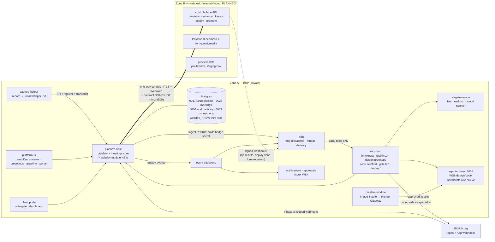
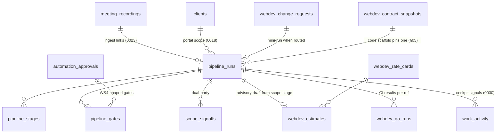

# Web Dev Department — Architect Design (Delivery Rail · Cockpit · WebDesk)

> **Status:** Design blueprint — welds three existing programs + one planned platform into ONE
> department. Unlike the siblings, most of what this doc governs **already exists as code**:
> the WS11 delivery pipeline (`PROTOTYPED`, ran live 2026-07-16/17), the capture edge
> (`IN PROGRESS` 0.2.0 — further along than the foundation recorded, see §01), the
> webdev-integrations Phase-1 console/work-detection surface (**landed in the repo** — see the
> honest status audit in §01), and **webdesk** (`PLANNED` 0.0.0, blueprint approved 2026-07-23).
> Register a **`webdev` module, `0.0.0 · PLANNED`** in [`../modules/MODULES.md`](../modules/MODULES.md)
> on approval of this doc (the pipeline/capture pieces keep their existing registry entries).
> **Version:** v1.0 · **Date:** 2026-07-24 · **Author:** System Architect (Claude)
> **Primary input:** [`webdev-foundation.md`](./webdev-foundation.md) — the **6 LOCKED decisions
> (2026-07-24, user)**: (1) scope = productivity + webdesk **unified**; (2) capture entry = both,
> **manual first** (in-ERP record/upload → dispatcher now; auto-join bot = phase-2 seam);
> (3) build↔webdesk = **one rail** (`code.scaffold` targets the webdesk codegen'd contract);
> (4) design stage = **in-house** (WS8 design specialist + Creative Image Studio, no Figma v1);
> (5) QA v1 = **full** (preview envs + Unlighthouse/Lighthouse-budgets/axe + Playwright E2E/visual);
> (6) build sequence = **Entry → Console → Webdesk**. This design conforms to those locks and does
> not relitigate them.
> **Sibling deliverables:** [`seo-sem-design.md`](./seo-sem-design.md) ·
> [`smm-design.md`](./smm-design.md) · [`creative-design.md`](./creative-design.md) — same rigor,
> same section map. Where SEO is *data + judgment*, SMM is *judgment + publication*, and Creative
> is *production + supply*, Web Dev is the **delivery** subsystem: its defining hazards are
> **client-facing irreversibility** (a signed artifact, a live deploy) and the **Zone A / Zone B
> trust wall** (an internet-facing site platform must never become a path into company data).

---

## §00 · Executive summary

Web Dev needs **welding, not invention**. The architecture in six moves:

1. **The delivery spine is already running — Phase 1 makes it a tool, not a demo.** The full
   audio→MOM→PRD/Report/Scope→sign-gates→design→3-beat-Submission→code→staging→prod-gate chain
   exists (`0017`/`0018` pipeline tables, `PipelineController` + `PortalController`, 13 hub tools,
   3 n8n workflows, client portal). The capture edge also exists end-to-end (`0023
   meeting_recordings`, the BFF **ingest proxy** that keeps `N8N_BRIDGE_SECRET` server-side, the
   `capture-helper` local record→whisper→register→ingest loop, the `/meetings` registry + PRD
   Studio tab). What Phase 1 adds is the missing **last mile**: a per-run workspace in the ERP,
   **editable artifacts with a signature lock**, an in-browser audio-upload fallback (no helper
   required), a real AI key on the stack, the two unbuilt n8n tails (bounded revise loop, prod
   gate wiring), and a designed report sink. Eight tight tickets, six of them deltas on shipped
   code (§12).
2. **The cockpit is landed code awaiting verification, then external wiring.** The
   webdev-integrations Phase-1 program (console template + work-activity spine + connections
   vault + Claude seat registry) is **in the repo** — migrations `0029/0030/0033`, the
   work-activity controller/linker/consumer, `secret-box` + `integrations.controller`, the
   `components/departments/*` template set, all nine console tabs. Phase 2 of this design =
   close out that program against its own P1-11 QA gate (one ticket), then Phase 3 wires the
   externals it deliberately deferred: GitHub org App + webhook receiver, per-user Drive OAuth
   (two-way), Anthropic Admin usage, AI digests.
3. **One rail, structurally (locked decision 3):** the pipeline's `code.scaffold` consumes a
   **pinned, content-addressed contract snapshot** of the target tenant's webdesk codegen output
   (TS/PHP SDK + `openapi.v1.json` + `CONTENT-CONTRACT.md` + block-library version), mirrored
   into Zone A by platform-nest — the scaffolder **never reaches into Zone B**. A scaffolded
   frontend pins `contract@X.Y` and ships with a generated conformance test; contract bumps
   surface as maintenance change requests, never silent drift. §05 specs the snapshot shape, the
   scaffold job envelope, and the generated-repo layout — the pivotal engineering detail.
4. **Design stays in-house (locked decision 4):** `design.prototype` matures from a synchronous
   stub into an **async agent-runner goal** (the WS8 runner service already exists on :3006 with
   queue + approval suspension) producing a *viewable* self-contained HTML prototype stored via
   the files subsystem, with imagery drawn from the Creative dept (Image Studio now, Render
   Gateway assets when CR-* lands). The hub tool contract (`design.prototype` → job) is preserved
   so the n8n workflow does not change shape.
5. **QA v1 is full but assembled, not invented (locked decision 5):** a reusable **dept QA
   harness** — Playwright E2E + visual regression (AI-authored from the PRD's acceptance list) +
   axe + Lighthouse budgets + Unlighthouse crawl — emitted into every scaffolded repo as CI,
   reporting back over the signed Zone-B→A webhook path into `webdev_qa_runs`. The staging
   Submission gate requires **green-or-explicit-override**. Preview environments ride the
   webdesk staging box (static-first, capped containers) and are shown to clients **only through
   gate rows**, never as a free-browse surface.
6. **Money and risk get the platform's standard gates.** Estimates are **advisory-only** AI
   drafts against a rate card (the dual-signed Scope Agreement remains the authoritative
   commercial document); every public/irreversible action — repo creation, deploy-to-live,
   domain/key operations, client-facing gate artifacts — is WS4-gated exactly like SMM's
   publish wall. New `webdev_*` tables take the third-wall RLS of the newest verticals; the
   shipped core pipeline/meetings tables deliberately stay core (§04). Build order: **Phase 1
   Entry (8 tickets) → Phase 2 Console close-out (1 + the landed P1 set) → Phase 3 external
   wiring → Phase 4 webdesk + the rail → Phase 5 specialists/QA-harness/estimates/maintenance.**

---

## §01 · Scope & the delivery spine (with an honest status audit)

### The department in one map (foundation §4, unchanged)

Two axes over one platform: the **delivery spine** (client-facing lifecycle), the **team
workspace** (console + work-detection), and **webdesk** (the client-site platform underneath).
Platform = product, spine = process, console = cockpit — separate concerns, wired.

| # | Stage | v1 mechanism | Status of the mechanism |
|---|---|---|---|
| 1 | Discovery | capture edge → dispatcher → MOM + 3 extractions | code exists; needs last-mile (§12 P1) |
| 2 | Scope | scope track + dual sign + portal (exists) · estimate helper (new) | PROTOTYPED · PLANNED (P5) |
| 3 | Design | WS8 design specialist + Creative assets | sync stub today; async v2 in P5 |
| 4 | Build | `code.scaffold` → repo against the webdesk contract | stub today; rail lands with webdesk (P4) |
| 5 | Content | webdesk Payload headless | PLANNED (webdesk P1–P3) |
| 6 | QA | dept QA harness + preview envs | PLANNED (P5; previews need Zone B) |
| 7 | Deploy | `deploy.staging`/`deploy.production` → webdesk control plane + WS10 | tools exist fail-closed; wiring P4 |
| 8 | Client review | WS11 client portal (role-gated dashboard) | PROTOTYPED |
| 9 | Maintenance | change-request intake → triage → mini-run / control-plane op | PLANNED (P5, design §06) |

### Honest status audit (things the foundation under- or over-stated — verified against code 2026-07-24)

- **The capture edge is further along than foundation §3B says.** The foundation records
  "capture-helper lands a transcript in a Drive, *not* into the pipeline dispatcher." **Stale.**
  `meeting_recordings` (migration `0023`), `MeetingRecordingsController` (start/patch/transcript/
  **ingest-proxy**/drive/list/detail — the bridge secret never leaves the server), the helper's
  full local loop (`capture-helper/src/jobs.mjs`: record → local whisper → register → transcript
  → **auto-ingest** → Drive), the `/meetings` registry + `RecordingWorkbench` (paste-a-`.txt`
  degradation path), and the PRD Studio tab with `RecordControls` all exist. Phase 1 shrinks
  accordingly (§12).
- **The webdev-integrations Phase-1 ticket set has landed in the repo** (migrations
  `0029_projects_department` / `0030_work_activity` / `0033_integration_connections` — note the
  planned `0031` renumbered to `0033` per the migrations README next-unused rule; controllers,
  linker + outbox consumer + backfill, `secret-box`, the `components/departments/*` template,
  all console routes, `lib/activity.ts` + `lib/connections.ts`). What is **not evidenced** is the
  P1-11 QA gate run, and `docs/FRONTEND-BFF-CONTRACT.md` §11/§12 still carry stale "no UI
  consumer yet" annotations. Phase 2 of this design = one close-out ticket (WD-20) that runs the
  gate and refreshes the contract doc — not a re-decomposition.
- **Helper packaging deviates from the capture-edge plan's "Tauri from the start" lock:** what
  exists is a local Node control-server app (ffmpeg recorder, works headless). Flagged, not
  relitigated: the running shape is contract-identical; Tauri/tray packaging + code-signing moves
  to the Phase-5 hardening list (`smart-app-control-blocks-local-builds` applies).
- **Two WS11 tails are genuinely unbuilt** (bounded revise loop; prod-gate node wiring in
  `pipeline-delivery.json`) — backend tools exist (`deploy.production` shipped 2026-07-22,
  fail-closed); the n8n JSON edit needs a live stack. Phase-1 ticket WD-05.
- ~~**The running dev stack is STALE**~~ → **RESOLVED 2026-07-29 (WD-01 DEV-VERIFIED).** Both
  halves of this claim were already false by the time WD-01 ran: the stack had been refreshed to
  ledger head (`0048`, 50/50 applied) that morning by a concurrent search/SEO session, and the
  gateway was **not** keyless — Ollama Cloud was already wired through the `openai` provider
  (`LLM_CHAIN=openai,ollama,gemini,claude`, `deepseek-v4-flash`), which is the user's standing
  decision to share one dev brain with the WhatsApp bot. The live re-drive returned
  **`prdConfidence 0.9`** with a substantively correct PRD, so the `confidence:null` echo-mode
  failure mode is closed. **WD-01 changed zero code.** Evidence:
  [`../superpowers/plans/2026-07-29-wd01-evidence.md`](../superpowers/plans/2026-07-29-wd01-evidence.md).
  Standing caveat: that key is shared + weekly-rate-limited, so PRD quality is dev-grade until a
  dedicated key lands — it must not become a hard prod dependency.
- **NEW defect found by WD-01 (owner WD-07, promoted to required):** the dispatcher **drops client
  context**. `meeting_recordings` carries `client_id`/`project_id` and `pipeline.createRun` accepts
  `clientId`, but `mtg-dispatcher.json` never passes it → `pipeline_runs.client_id` is NULL →
  **ingested runs are invisible to the client portal**. §12's WD-07 line ("start already accepts
  it — verify end-to-end") assumed this path worked; it does not.

### Non-goals (v1)

- **No Figma dependency** (locked 4) — design artifacts are ours; the Figma launcher button stays
  a launcher, nothing more.
- **No auto-join meeting bot** (locked 2) — the frozen dispatcher webhook is the seam; provider
  choice deferred (OQ-1).
- **No Temporal yet** — the delivery workflow remains the first real candidate (WS11 plan §3);
  the platform-nest state store is what keeps that swap cheap. Do not add speculatively.
- **No new PM/estimating suite** — estimates are one small advisory surface (§04/§06); PM rides
  the existing PM vertical; invoicing stays with billing (`0021`).
- **No second delivery pipeline for webdesk** — webdesk is built under its own blueprint's phased
  program; this design specs only the **couplings** (rail, previews, deploy, maintenance ops).

---

## §02 · System overview



**Reading the diagram.** Everything stateful and judgmental is Zone A. The helper is an untrusted
client of the BFF (scoped token; never holds the bridge secret). n8n orchestrates but owns no
state — every run/stage/gate is a platform-nest row, which is why multi-day client waits survive
restarts. Zone B does not exist yet; when it does, the ERP controls it one-way and consumes only
**mirrored contract snapshots** and **signed webhooks** from it. GitHub is the one other inbound
webhook source (Phase 3), treated identically: signature-verified, schema-checked, idempotent.

---

## §03 · Trust zones & network

Follows the WebDesk zone doctrine; this subsystem's exposure is **client-facing artifacts**
(portal, previews, deploys) and **inbound webhooks** — not egress-heavy like Creative.

| Surface | Zone | Rules |
|---|---|---|
| pipeline + meetings + work-activity + connections + `webdev_*` | **A** | FORCE-RLS; writes through controllers; Cerbos per resource; WS4 for risky writes. Token columns (`integration_connections`) never serialized — `hasToken` only (shipped rule, keep asserting it). |
| capture-helper | **operator machine** | Untrusted BFF client with a per-user scoped token. Never holds `N8N_BRIDGE_SECRET` (ingest is proxied server-side — shipped). Audio/video never enter the pipeline; only the `.txt` does. Drive sync is best-effort, non-blocking. |
| client portal | **A, external-role** | Role-gated dashboard (shipped): three isolation layers — RLS (tenant) + Cerbos (`client` derived role) + controller (`run.client_id → clients.portal_user_id`). Prod swaps login to the external Keycloak realm (WS11 lock). Clients see client-safe fields only (no report track, no internal gates, no AI internals). |
| n8n dispatcher webhook | **A-internal** | `x-gaiada-bridge-secret` + `meetingId` dedupe (at-least-once delivery). Reachable from platform-nest only in the compose network; the frozen contract (WS11 §8) is the meeting-bot seam. |
| GitHub webhook receiver (Phase 3) | **A, inbound-allowlisted** | `POST /api/webhooks/github`: HMAC (App webhook secret) verified before parse; delivery-id idempotency; events map to `work_activity` rows only (no privileged side effects); App private key custody in platform-nest env → OpenBao target-state. |
| webdesk control channel (Phase 4) | **A → B egress only** | Keycloak client-credentials + mTLS; ERP is the only credential holder; irreversible commands (promote-to-live, domain, key ops) require a WS4 approval token (webdesk blueprint C-05/C-07). |
| Zone B → A events (Phase 4) | **B → A, signed** | HMAC-signed, schema-validated webhooks into the n8n bridge (qa.results, deploy/promote outcomes, form facts). Treated as untrusted input — validated before any row is written; idempotent by event id. |
| preview environments (Phase 4/5) | **B, staging box** | Per-branch previews on the staging wildcard domain; static-first; **no Zone-A credentials in any preview**; client access only via URLs attached to gate rows (D-8), Turnstile/rate-limited like any Zone-B surface. |
| WS8 specialists | **A** | agent-runner service token; D14 — every risky write suspends into WS4; PRD/transcript content is **untrusted model input** (prompt injection): specialists get least-privilege OBO tools, and the server enforces authz, never the model. |

---

## §04 · Domain model & schema

### Design rules (inherited)

- Every new tenant table: `tenant_id uuid NOT NULL REFERENCES companies(id)`, `origin_site`,
  timestamps, soft-delete where user-facing.
- **New `webdev_*` tables: FORCE-RLS with the WSD-3 third wall** —
  `tenant_id = ANY(app_current_tenants()) AND app_module_allowed('webdev')`, byte-identical in
  shape to [`0028_module_hr.sql`](../../platform-nest/migrations/0028_module_hr.sql); app access
  via `withTenants(tenants, { modules: ['webdev'] })`.
- **Deliberate asymmetry with Creative's D-3 (decision D-2, §14):** the shipped `pipeline_*`,
  `meeting_recordings`, `work_activity*`, `integration_connections` tables **stay core** (plain
  tenant wall). They are cross-department infrastructure — the portal, agency approvals inbox,
  every dept's activity feed, and future SEO/SMM connectors all ride them. Retrofitting a
  `webdev` third wall onto them would break siblings by construction. Only **dept-private new
  surfaces** (estimates, rate cards, change requests, QA runs, contract snapshots) go behind the
  module wall.
- **Migration numbering — ⚠ CORRECTED 2026-07-30 (verified against disk AND the live DB).** The
  original v1.0 assumption (`0041_module_webdev.sql`, ledger ending at `0040`) is **STALE — `0041`
  is consumed.** Actual allocation: **`0041`–`0044` → PM** (templates · progress-snapshot status
  counts · task followers/comment reactions · doc versions); **`0045`–`0048` → search/SEO** (audit
  ingest · AI drafts · provider simulation · capability provenance). Live ledger head =
  `0048_search_capability_provenance.sql`, 50/50 applied. **The webdev module migration therefore
  takes `0049`+**, per [`migrations/README.md`](../../platform-nest/migrations/README.md) rule 5
  (next-unused at merge time), coordinating with SMM-01 and CR-01. **⚠ Flag for the Creative
  program:** creative-design D-13's `0036+` assumption is now stale by **thirteen** numbers — CR-01
  must rebase off `0049+` as well. Never trust a blueprint's stated number: verify the ledger
  before writing DDL (see the `migration-ledger-state` note).
- Money: integer **minor units** (`*_minor bigint` + `currency`), matching invoices/rollups
  (`money_minor`) — never floats.

### What already exists (inventory — reuse, do not duplicate)

| Table (migration) | Owner | Notes for this design |
|---|---|---|
| `pipeline_runs / pipeline_stages / pipeline_gates / scope_signoffs` (0017) | core | Stage `artifact_ref` **holds the artifact content** (set by `pipeline.createRun/updateStage`); WD-03 adds the signature lock. `pipeline_runs.client_id` (0018) drives the portal. |
| `meeting_recordings` (0023) | core | The capture registry incl. `transcript`, `pipeline_run_id`, `drive_*`. WD-04 adds an `audio_ref` (files id) for the in-ERP upload path — additive column. |
| `projects.department_id` (0029) · `work_activity(+links)` (0030) · `integration_connections` (0033) | core | The cockpit substrate (landed). Phase 3 fills `github/google_drive/claude` sources for real. |
| `automation_approvals` (0014/0016) | core | WS4 surface; origin CHECK **widened with `'webdev'`** in `0041` (same widen-only DO-block as 0028; include the set current at merge). |
| `invoices` (0021), `clients`, `deliverables`, `files` (0009/0022) | core | Estimates link to clients and may hand off to invoicing; artifacts/prototypes/audio ride `files`. |

### New tables (DDL sketch — illustrative, refined at WD-40/WD-5x tickets)

```sql
-- 0041_module_webdev.sql (next-unused at merge; third-wall RLS on all webdev_* tables)

CREATE TABLE webdev_rate_cards (            -- the pricing source for advisory estimates
  id uuid PRIMARY KEY, tenant_id uuid NOT NULL REFERENCES companies(id),
  name text NOT NULL, currency text NOT NULL DEFAULT 'IDR',
  lines jsonb NOT NULL DEFAULT '[]',        -- [{role:'senior-fe', unit:'hour'|'day'|'item', rate_minor}]
  active boolean NOT NULL DEFAULT true,
  origin_site text NOT NULL, created_at timestamptz NOT NULL DEFAULT now(),
  updated_at timestamptz NOT NULL DEFAULT now(), deleted_at timestamptz
);

CREATE TABLE webdev_estimates (             -- ADVISORY (D-6): human-finalized; feeds, never signs
  id uuid PRIMARY KEY, tenant_id uuid NOT NULL REFERENCES companies(id),
  client_id uuid REFERENCES clients(id),
  pipeline_run_id uuid REFERENCES pipeline_runs(id),   -- drafted from this run's scope stage
  rate_card_id uuid REFERENCES webdev_rate_cards(id),
  status text NOT NULL DEFAULT 'draft'
    CHECK (status IN ('draft','shared','accepted','superseded','withdrawn')),
  currency text NOT NULL, lines jsonb NOT NULL DEFAULT '[]',
  total_minor bigint NOT NULL DEFAULT 0,
  ai_draft boolean NOT NULL DEFAULT false,  -- provenance: drafted by llm vs hand-built
  note text, created_by uuid REFERENCES users(id),
  origin_site text NOT NULL, created_at timestamptz NOT NULL DEFAULT now(),
  updated_at timestamptz NOT NULL DEFAULT now(), deleted_at timestamptz
);

CREATE TABLE webdev_change_requests (       -- maintenance intake (D-7): typed, triaged, routed
  id uuid PRIMARY KEY, tenant_id uuid NOT NULL REFERENCES companies(id),
  client_id uuid REFERENCES clients(id), project_id uuid REFERENCES projects(id),
  source text NOT NULL DEFAULT 'portal' CHECK (source IN ('portal','internal')),
  kind text NOT NULL CHECK (kind IN ('content','design','feature','bug')),
  title text NOT NULL, body text,
  status text NOT NULL DEFAULT 'new'
    CHECK (status IN ('new','triaged','in_progress','done','declined')),
  route text CHECK (route IN ('control_plane','mini_run','pm_task')),  -- set at triage
  pipeline_run_id uuid REFERENCES pipeline_runs(id),   -- the spawned mini-run, if routed there
  pm_task_ref uuid,                                    -- the spawned PM task, if routed there
  triaged_by uuid REFERENCES users(id), triaged_at timestamptz,
  requested_by_portal_user uuid,                       -- portal principal (client side)
  origin_site text NOT NULL, created_at timestamptz NOT NULL DEFAULT now(),
  updated_at timestamptz NOT NULL DEFAULT now(), deleted_at timestamptz
);

CREATE TABLE webdev_qa_runs (               -- QA harness results (D-9): CI reports back here
  id uuid PRIMARY KEY, tenant_id uuid NOT NULL REFERENCES companies(id),
  pipeline_run_id uuid REFERENCES pipeline_runs(id),
  repo text NOT NULL, ref text NOT NULL,               -- repo full-name + branch/sha
  preview_url text,
  status text NOT NULL DEFAULT 'running'
    CHECK (status IN ('running','passed','failed','error')),
  summary jsonb NOT NULL DEFAULT '{}',      -- {e2e:{passed,failed}, axe:{violations}, lighthouse:{perf,a11y,seo,budgetsOk}, visual:{diffs}}
  report_ref text,                          -- files id of the full HTML/JSON report bundle
  received_via text NOT NULL DEFAULT 'webhook' CHECK (received_via IN ('webhook','manual')),
  correlation_id text,                      -- CI run id (idempotency key with repo+ref)
  origin_site text NOT NULL, created_at timestamptz NOT NULL DEFAULT now()
);
CREATE UNIQUE INDEX webdev_qa_runs_corr ON webdev_qa_runs (tenant_id, repo, correlation_id);

CREATE TABLE webdev_contract_snapshots (    -- the ONE-RAIL pin (§05, D-5): Zone-B codegen mirrored into A
  id uuid PRIMARY KEY, tenant_id uuid NOT NULL REFERENCES companies(id),
  webdesk_tenant_slug text NOT NULL,        -- the Zone-B tenant this contract belongs to
  contract_version text NOT NULL,           -- semver from the codegen pipeline
  content_hash text NOT NULL,               -- sha256 over the artifact bundle (determinism check)
  artifacts jsonb NOT NULL,                 -- {sdkTs: filesId, sdkPhp: filesId, openapi: filesId, contractMd: filesId, blockLibrary:{package, version}}
  fetched_by uuid REFERENCES users(id), fetched_at timestamptz NOT NULL DEFAULT now(),
  origin_site text NOT NULL,
  UNIQUE (tenant_id, webdesk_tenant_slug, contract_version)
);
```

### Entity map



### Custom fields & relations

- D17 `customFieldTargets`: `webdev_estimate`, `webdev_change_request`.
- Clients/projects/deliverables are the core rows — no duplicates (P5c lesson). A shipped site’s
  formal handover rides the existing `deliverables` flow; QA report bundles and prototypes ride
  `files`.

---

## §05 · The one rail — webdesk contract ↔ `code.scaffold` (the centerpiece)

Locked decision 3 says discovery→PRD→build→deploy is **one rail onto the platform**. The webdesk
blueprint (§07/§08) defines the supply side: a fixed vocabulary (field primitives + curated block
types `hero, richText, gallery, cta, featureGrid, form, testimonial, faq, logoCloud`), per-tenant
composition-as-data, and a codegen pipeline emitting four artifacts per tenant — **TS SDK, PHP
SDK, `openapi.v1.json`, `CONTENT-CONTRACT.md`** — plus the universal response envelope
(`{collection, slug, seo, meta, blocks:[{type,props}]}`) and a shared **block-renderer library**
(one FE component per block type, 1:1). This section specs the demand side: exactly how the code
specialist consumes that, deterministically and without touching Zone B.

### D-5 · Contract snapshots, mirrored into Zone A

1. **Zone B exposes** (webdesk control-plane, C-05):
   `GET /control/v1/tenants/:slug/contract` →
   `{ version, blockLibrary:{package,version}, artifacts:{ sdkTsUrl, sdkPhpUrl, openapiUrl, contractMdUrl }, contentHash }`
   — mTLS + svc-token like every control call. Artifact URLs are short-lived signed GETs.
2. **Platform-nest mirrors**: `POST /api/:t/modules/webdev/contracts/refresh {slug}` fetches the
   bundle, verifies `contentHash`, stores each artifact via the files subsystem, and writes a
   `webdev_contract_snapshots` row. Snapshots are **immutable and content-addressed**; a re-fetch
   of the same version with a different hash is refused loudly (codegen must be deterministic —
   that is its contract).
3. **The scaffolder consumes snapshots only.** `code.scaffold` (v2) never calls Zone B. Inputs
   are Zone-A rows + files. This preserves the one-way-control doctrine: even a fully compromised
   staging box cannot poison a build except by corrupting its own codegen output, which the hash
   check at mirror time pins and audits.

### The scaffold job envelope (the `code.scaffold` v2 contract)

```jsonc
// hub tool code.scaffold — async job (agent-runner goal), impact: medium write (repo push)
{
  "runId": "…",                      // pipeline run (stage claude_code)
  "repoUrl": "https://github.com/<org>/<repo>",   // PM-created (github.repoStatus gates, unchanged)
  "siteKind": "astro" | "node" | "wp",
  "prdArtifact": "pipeline_stages.artifact_ref of the SIGNED prd stage",
  "prototypeArtifact": "artifact_ref of the accepted design stage",
  "contractSnapshotId": "webdev_contract_snapshots.id",   // THE pin
  "constraints": { "blockLibraryVersion": "from the snapshot", "maxRevise": 3 }
}
```

**What the scaffolder generates (per `siteKind` template):**

- App skeleton (Astro/Node from our templates; WP = theme skeleton consuming the PHP SDK) with
  the pinned SDK installed **from the snapshot artifact** (tarball out of files storage — no
  private npm registry in v1, OQ-6) and the pinned block-renderer library version.
- Pages/routes derived from the PRD's information architecture, composed **exclusively** from
  block-library components fed by typed SDK calls — the specialist maps PRD sections → block
  compositions; anything the vocabulary can't express becomes a flagged TODO + a proposed
  `proposeSchema` draft (human-approved on webdesk, per its C-07), never hand-rolled fetch code.
- `CONTRACT.lock` (snapshot id + version + hash) committed at repo root — the drift detector.
- A **generated conformance test**: compile-time (the SDK types must satisfy every block/collection
  the pages reference) + runtime probe (each referenced collection returns the universal envelope
  against the target environment) — this is what makes "Claude builds the FE" safe (webdesk §08).
- The **QA harness CI workflow** (§06 stage 6) pre-wired: E2E/axe/Lighthouse-budgets/visual +
  the signed results webhook back to Zone A.

**Versioning rule:** a site pins `contract@X.Y` forever until a **maintenance change request**
(kind `feature`/`design`) explicitly upgrades it; a contract bump on webdesk emits an event the
console surfaces per affected site ("contract 1.3 available — site pinned to 1.1"), and the
upgrade itself is a mini-run with the QA harness as its gate. No silent regeneration.

**Sequencing honesty:** this whole section activates at **Phase 4** (it depends on webdesk P3
codegen). Until then `code.scaffold` remains the shipped v1 artifact generator. The envelope
above is frozen NOW (like the WS11 webhook contract was) so the WS8 code-specialist maturation
and the webdesk codegen program converge on one seam instead of meeting in the middle.

---

## §06 · Per-stage tooling design (reuse vs net-new, made operational)

| Stage | Mechanism (v1 target) | Reused (exists) | Net-new (this program) |
|---|---|---|---|
| **Discovery** | Record/upload in ERP → local/server whisper → ingest proxy → dispatcher → MOM + 3 extractions → run workspace | 0023 + controller + helper + `/meetings` + PRD Studio + `mtg-dispatcher` + `llm.extract` | run workspace `/pipeline/[runId]` (WD-02); server-side transcription for uploads (WD-04); real AI key (WD-01) |
| **Scope** | Scope track + dual sign + portal · **estimate helper**: AI drafts `webdev_estimates` lines from the scope artifact × rate card; human finalizes; accepted estimate embeds into the scope artifact **before** the sign gate | scope track, `scope_signoffs`, portal | `webdev_rate_cards`/`webdev_estimates` + console surface + `llm.extract(kind=estimate)` prompt (P5; D-6 advisory-only) |
| **Design** | `design.prototype` v2 = async agent-runner goal → self-contained HTML prototype (files) + asset pulls from Creative approved assets → callback flips stage → 3-beat Submission (exists) | agent-runner :3006, WS4 suspension, 3-beat gates, Creative Image Studio | the v2 specialist itself + prototype storage/serving + Creative consumption seam (P5; D-10) |
| **Build** | `code.scaffold` v2 per §05: snapshot-pinned repo generation + conformance test; `github.repoStatus` gate unchanged; repo creation stays PM-manual (`github.createRepo` stays fail-closed — WS11 lock) | delivery workflow, hub tools, WS10 pipeline patterns | snapshot mirror + scaffolder + templates (P4) |
| **Content** | webdesk Payload headless, per its own blueprint P1–P3 | — | webdesk program (own ticket set) |
| **QA** | **Dept QA harness** in every scaffolded repo's CI: Playwright E2E (AI-authored from the PRD acceptance list — the design specialist emits testable acceptance criteria as part of its artifact) + `@axe-core/playwright` + Lighthouse budgets (`budgets.json` per site) + Unlighthouse crawl + Playwright visual baselines. Results → signed webhook → `webdev_qa_runs`; console + gate cards render the summary. **Staging Submission requires last QA green or an explicit PM override recorded in the gate note** (D-9) | Playwright (platform-ui), Unlighthouse (SEO stack), WS10 CI patterns, n8n bridge | the harness package + CI template + results receiver + gate rule (P5) |
| **Deploy** | `deploy.staging` / `deploy.production` (exist, fail-closed) → webdesk control plane `deploy/promote/rollback` (P4); every promote-to-live is WS4-gated (webdesk C-05 rule) | hub tools, WS4, WS10 | control-plane client wiring (P4) |
| **Client review** | Portal (exists) + per-run detail maturation: preview URLs and QA summaries attached to `customer_feedback` gate rows (D-8) | portal, gates | gate-row attachment fields (P4/P5 — additive jsonb on gate open payload, no schema change: `pipeline_gates` already carries `note`; preview/QA refs ride the gate-open payload) |
| **Maintenance** | Portal "request a change" → `webdev_change_requests` → **one PM triage gate** → routed by kind (D-7): `content` → webdesk control-plane op (WS4 if publish-to-live); `design`/`feature` → **mini-run** (a `pipeline_runs` row starting at the design or code stage — no discovery/scope re-run; client sign required only when an estimate above threshold attaches); `bug` → PM task, optionally escalating to a mini-run | pipeline machinery, portal, PM vertical, WS4 | intake table + portal form + triage surface + mini-run spawner (P5) |

**Mini-run mechanics (D-7 detail):** a mini-run is a normal `pipeline_runs` row with
`source_meeting_id = NULL`, stages seeded to only the needed track segment (e.g. `claude_design →
submission → release_code → staging`), and gate kinds unchanged — so the portal, inbox, console,
and n8n delivery workflow all work on it with **zero special-casing**. The change request row
holds the link. This is why intake is a table + spawner, not a second pipeline.

---

## §07 · AI design

### Task → model routing (local-first via ai-gateway-go — no direct vendor calls anywhere)

| Task | Where it runs | Trigger | Notes |
|---|---|---|---|
| MOM + PRD/Report/Scope extraction | `llm.summarize` / `llm.extract` via gateway (`ollama,gemini,claude` chain) | dispatcher | Shipped; WD-01 gives it a real key. Confidence feeds the internal PM review (never auto-advance — WS11 guardrail). |
| Estimate line drafting | `llm.extract(kind=estimate)` — scope artifact + rate card → typed lines | estimate helper (P5) | Advisory-only (D-6); `ai_draft:true` provenance; human finalizes. |
| Design prototype | **WS8 design specialist v2** on agent-runner (async goal, callback) | delivery workflow after the hard gate | Claude-tier via gateway (client-facing quality); produces the prototype + the **acceptance-criteria list** the QA harness consumes. |
| Frontend scaffold | **WS8 code specialist v2** consuming the §05 envelope | after Submission accept + repo gate | Deterministic inputs (signed PRD + accepted prototype + pinned snapshot); pushes to the PM-created repo; PR-shaped output. |
| E2E test authoring | code specialist emits `tests/e2e/*.spec.ts` from the acceptance list | same scaffold job | Tests are code-reviewed in the same Submission as the scaffold — AI-authored, human-gated. |
| Report formatting | `llm.extract(kind=report)` (shipped) → PM doc (D-4) | fanout | Internal-only artifact; Hermes-tier fine. |
| Change-request classification assist | gateway `/complete` (Hermes) suggests `kind` at triage | portal intake (P5) | Suggestion only; the PM's triage decision is the record. |
| Digests / stale-task nag | n8n flows + WS8 agent over `work_activity` (integrations Track D) | scheduled (P3) | Reuses the existing backbone; notifications only. |

**Prompt-injection posture:** transcripts, PRDs, and portal change-request bodies are untrusted
input that flows into specialists. Mitigations are structural, not prompt-side: specialists hold
least-privilege OBO tools; every write beyond drafts suspends into WS4 (D14); `github.createRepo`
and deploys are fail-closed/gated; the scaffolder can only compose the pinned block vocabulary
(§05) — there is no "run arbitrary command" tool on this rail.

### The gate spine (all shipped; this design adds two rules)

1. **Hard build gate** — PRD signed AND scope dual-signed (WS11 locks 9/10, unchanged).
2. **3-beat Submission** at design and code (`pm_review → customer_feedback → pm_approval`),
   bounded revise loop (WD-05 finishes the bound).
3. **NEW — artifact signature lock (D-3):** a stage's artifact becomes immutable once its client
   sign gate is decided (WD-03). Editing before signature is a feature; editing after would forge
   what the client signed — refused with 409 at the controller, not policy.
   **⚠ AC CORRECTED 2026-07-30 (WD-03 DEV-VERIFIED).** §12's WD-03 wording — lock when "the stage's
   client sign gate is decided **or the stage is `done`**" — is **wrong as written** and was NOT
   implemented. Extraction lands *every* stage at `done` immediately (verified on the live "Acme
   Coffee kickoff" run: all 3 stages `done` while the gate was still pending), so the `or done` arm
   would make artifact editing unreachable for every ingested run — the exact opposite of D-3's
   rationale. **Shipped rule: gate-decided only, matched by track** — `delivery`→`prd_sign`/
   `customer_feedback`, `scope`→`scope_signoff`, `report`→**never locks** (internal-only artifact,
   never client-signed). Proven live incl. the generic `decide` **façade path** (no bypass).
4. **NEW — QA gate rule (D-9):** `deploy.staging` requires the latest `webdev_qa_runs` for the
   ref to be `passed`, or an explicit PM override recorded on the gate. `deploy.production`
   additionally keeps its WS4-shaped `pm_approval` (prod) beat — shipped tooling.

### MCP tools (deltas only — the 13 WS11 tools stay as shipped)

| Tool | Kind | Phase | Notes |
|---|---|---|---|
| `pm.createDoc` / `pm.createTask` | LOW write | P1 (WD-06) | Thin fronts over `/api/:t/pm/*`, allowlisted to `wf:report` — the report sink (D-4). |
| `design.prototype` v2 / `code.scaffold` v2 | medium write (async job) | P5 / P4 | Same names + result shape (job id) — n8n workflows unchanged; internals swap to agent-runner goals. |
| `webdev.refreshContract` | medium write | P4 | Mirrors a tenant contract snapshot (§05); WS4-gated for automation principals. |
| `webdev.listQaRuns` / `webdev.getEstimate` (reads) | read | P5 | Console/agent reads; module-aggregated via `ModuleContract.mcpTools`. |
| webdesk control tools (`site.provision`, `site.promote`, …) | high write | P4 | Defined by the webdesk blueprint C-07; promote/domain/key ops always WS4. |

---

## §08 · Console UX (dept-interface-template)

Web Dev **is** the reference implementation of the template (shipped): universal spine
**Home · Work (Projects · Board · Timeline · Activity) · Build (PRD Studio · Repositories ·
Deliverables) · Connections**, persistent My-work rail on every tab, launcher row on Home. The
toolkit rule holds — a tab registers only when its route exists. This design grows the **Build**
group as phases land:

| Tab (route under `/departments/[deptId]/`) | Phase | Content |
|---|---|---|
| PRD Studio (`prd`) — exists | P1 polish | Record/upload + run list; deep links into `/pipeline/[runId]` (WD-02/07). |
| Repositories (`repositories`) — exists as teach-state | P3 | Live org repo list, recent PRs/commits, per-repo activity (Track A). |
| Deliverables (`deliverables`) — exists as teach-state | P3 | Drive-backed deliverable evidence + task attach flow (Track B). |
| QA (`qa`) | P5 | `webdev_qa_runs` per project/site: pass-fail history, budgets, links to report bundles. |
| Sites (`sites`) | P4 | webdesk mirror: per-tenant site registry, env status, contract pin vs latest, deploy/promote (WS4-gated buttons). |
| Estimates (`estimates`) | P5 | Rate cards (admin) + estimate drafts per run/client. |

Home KPIs gain spine signals as they exist: runs in flight, gates waiting (internal vs client),
QA pass rate, deploys this month — all from rollups; the rail's "Waiting on me" already unions
approvals + pipeline gates via the unified approvals read (WSUX-1).

### Button capability matrix

**Legend:** 🟢 local/$0 · 🔵 metered AI (gateway; budget-capped) · 🔴 WS4 / human gate ·
🌐 Zone-B / public-facing consequence.

| Console action | Tab | Needs | Gate |
|---|---|---|---|
| Record briefing / upload audio / paste transcript | PRD Studio, /meetings | 🟢 (local whisper) or 🔵 (server whisper) | member write |
| Ingest → start pipeline run | PRD Studio, /meetings | 🟢 | `meeting_recording.ingest` (proxied; dedup by meetingId) |
| Edit PRD/Scope/Report artifact | run workspace | 🟢 | `pipeline_stage.update`; **locked after client signature (D-3)** |
| Decide internal gates (pm_review/pm_approval) | run workspace / inbox | 🟢 | `approvals.decide`-class (shipped) |
| Sign PRD / sign scope / feedback | **client portal** | 🟢 | client role, own runs only (shipped) |
| Draft estimate from scope | Estimates (P5) | 🔵 | advisory only; `webdev:estimate:write` to finalize |
| Kick design prototype (re-run) | run workspace (P5) | 🔵 | auto after hard gate; manual re-run = `pipeline_stage.update` |
| Approve scaffold to repo | run workspace / inbox | 🟢 | 3-beat Submission (shipped); repo must pre-exist (PM) |
| Create GitHub repo | — | — | **stays manual/PM** (`github.createRepo` fail-closed — WS11 lock) |
| Deploy to staging | run workspace (P4) | 🌐 | QA green-or-override (D-9) + Submission approved |
| **Promote to live / rollback** | Sites (P4) | 🌐 | **always 🔴 WS4** (webdesk C-05 rule) |
| Refresh contract snapshot | Sites (P4) | 🌐 read | `webdev:contract:refresh`; 🔴 when automation-initiated |
| Triage change request (route content/mini-run/task) | Work/Board (P5) | 🟢 | `webdev:cr:triage` (PM+) |
| Connect GitHub/Drive/Claude seat | Connections | 🟢 | own rows self-service; company rows manager+ (shipped Cerbos) |

---

## §09 · ERP integration points

| Subsystem | Integration (concrete) |
|---|---|
| **platform-nest** | Shipped core: `PipelineController`, `PortalController`, `MeetingRecordingsController`, work-activity, integrations vault. NEW: `webdev` `ModuleContract` (key `webdev`, controller `@Controller("api/:tenantId/modules/webdev")`, `ModuleEnabledGuard`, enablement via `enabled_modules` OR active `service_assignment`) owning estimates/rate-cards/change-requests/qa-runs/contract-snapshots; artifact-lock rule inside the existing pipeline controller (WD-03); audio-upload + server transcription on meetings (WD-04); GitHub webhook receiver in core (P3 — cross-dept infrastructure like the vault). |
| **BFF contract** | Refresh §11/§12 stale annotations (WD-07/WD-20); new §rows for meetings detail/audio, `/pipeline/[runId]` reads, artifact PATCH, and later `/api/:t/modules/webdev/*` (estimates, change-requests, qa-runs, contracts). Shapes canonical in `platform-ui/src/lib/{meetings,pipeline,activity,connections}.ts` + a new `lib/webdev.ts` at P4/P5. |
| **mcp-hub** | Shipped: `llm.extract`, `pipeline.*`, `design.prototype`, `code.scaffold`, `github.repoStatus/createRepo`, `deploy.staging/production`. Deltas per §07 table; module tools aggregate via `/mcp/tool-defs` (nothing hub-side hardcoded). `AUTOMATION_ALLOWLIST` keeps each `wf:*` account scoped to exactly its tools. |
| **ai-gateway-go** | All LLM calls (`llm.*`); WD-01 supplies `GEMINI_API_KEY`/`ANTHROPIC_API_KEY` in compose (no code change). Meeting-length audio bypasses the gateway to the whisper container (2.5-min cap — shipped decision, kept for the server-side path too). |
| **ai-agents (WS8)** | agent-runner (:3006) hosts the async design/code specialists (P4/P5); goals carry the §05 envelope; approval suspension bubbles to WS4 (D14). |
| **automation (n8n)** | Shipped workflows `mtg-dispatcher` / `pipeline-fanout` / `pipeline-delivery` + WD-05 tails + WD-06 report branch; Phase-3 digest/nag flows; Zone-B and GitHub webhooks enter via the same bridge-secret discipline. Backbone rule unchanged: n8n orchestrates, MCP accesses, zero logic in workflows. |
| **Event backbone** | Shipped: `meeting.recording.*`, `pipeline.*`, `scope.signed`, `work_activity.created`, `integration_connection.*`. NEW: `webdev.estimate.accepted`, `webdev.change_request.created|triaged`, `webdev.qa.completed`, `webdev.contract.snapshotted`, `webdev.deploy.promoted` → bell + n8n bridge. |
| **WS4 approvals** | `automation_approvals.origin` widened with `'webdev'` (0041). Client-facing gates stay `pipeline_gates` (portal-shaped); WS4 rows gate automation-initiated contract refresh, promote-to-live, and any specialist write above draft. Unified approvals read (WSUX-1) already unions pipeline gates into the inbox. |
| **Creative dept** | Design specialist pulls **approved** assets only (`reuseStatus=approved` surface per creative-design D-12); prototype imagery via Image Studio now, Render Gateway jobs later (booked once in the creative ledger with `requester_module='webdesk'` — creative D-7). |
| **webdesk (Zone B)** | Control client + contract snapshot mirror (§05); signed-webhook consumer (qa.results, deploy facts); preview URLs attached to gate rows (D-8). All per the WebDesk blueprint — this design adds no new Zone-B surface. |
| **Rollups (D12)** | `webdev.runs.month` (count) · `webdev.prd_cycle_days` (avg, last) · `webdev.gates.waiting_client` (count) · `webdev.qa.pass_rate` (ratio) · `webdev.deploys.month` (count) · `webdev.change_requests.open` (count). |
| **Cerbos / rbac.ts** | Shipped policies: `resource_pipeline_{run,stage,gate}`, `resource_scope_signoff`, `resource_portal`, `meeting_recording`, `resource_work_activity`, `resource_integration_connection`. NEW: `resource_webdev_{estimate,rate_card,change_request,qa_run,contract}`; permissions `webdev:estimate:read|write`, `webdev:cr:triage`, `webdev:qa:read`, `webdev:contract:refresh`, `webdev:site:operate` (P4). `lib/rbac.ts` mirrors (defence-in-depth; Cerbos authoritative). |
| **observability (WS9)** | OTel spans already wrap the services; add attrs on scaffold/QA/deploy paths `{runId, repo, contractVersion, qaStatus}`; SLO candidates: dispatcher-to-run latency, gate-decision-to-resume latency (the durable-callback health signal). |

---

## §10 · Automation flows (n8n / WS4)

All thin orchestrations over MCP tools; JSON in [`automation/workflows/`](../../automation/workflows/).

| Flow | Trigger | Status / phase | Notes |
|---|---|---|---|
| `mtg-dispatcher` | frozen webhook | shipped | dedupe on `meetingId`; MOM + 3 extracts + createRun. |
| `pipeline-fanout` (scope + report) | `pipeline.run.created` | shipped; WD-06 rewires the report branch | report → `pm.createDoc` + `pm.createTask` + notify (D-4). |
| `pipeline-delivery` | `gate.decided` + `scope.signed` | shipped spine; WD-05 adds revise-bound + prod chain | the Temporal candidate; stays n8n v1. |
| `wd-digests` | daily/weekly schedule | P3 | per-person/project activity digests via WS8 agent → notifications (integrations Track D). |
| `wd-stale-nag` | daily | P3 | tasks with no `work_activity` in N days → nag assignee, escalate at 2N. |
| `wd-qa-intake` | Zone-B signed webhook (or GH Action webhook pre-webdesk) | P5 | validates + writes `webdev_qa_runs` via module tool; notifies on fail. |
| `wd-contract-watch` | webdesk `contract.published` event | P4 | surfaces "site pinned older contract" console notice; never auto-upgrades (D-5). |
| `wd-cr-intake` | portal `change_request.created` | P5 | notify PM triage queue; on triage decision spawn mini-run / PM task via tools. |

---

## §11 · Trust & security

- **Zone split is absolute (inherited):** no Zone-B call path into Zone A beyond signed,
  schema-validated webhooks treated as untrusted; ERP holds all control credentials; previews and
  client sites live and die in Zone B. This design adds the **snapshot-mirror discipline** (§05)
  so even the build rail never reads Zone B interactively.
- **Client-facing integrity:** artifact signature lock (D-3) — what the client signed is
  immutable, enforced in the controller with tests, not convention. Portal isolation stays
  three-layered (RLS + Cerbos client role + controller ownership check — shipped, re-probed in
  every QA gate ticket).
- **Secrets custody:** `N8N_BRIDGE_SECRET` server-side only (shipped proxy); OAuth tokens
  AES-256-GCM in `integration_connections` via `secret-box`, never serialized (shipped; every
  Phase-3 ticket re-asserts `hasToken`-only responses); GitHub App private key + webhook secret in
  platform-nest env → OpenBao target-state; Zone-B control creds (Keycloak client + mTLS cert)
  in platform-nest only; the capture-helper holds a per-user scoped token, nothing shared.
- **Inbound webhook hygiene (GitHub, Zone B):** signature verify before parse; idempotency by
  delivery/event id; events can only create `work_activity` / `webdev_qa_runs` rows — no
  privileged transitions ride an inbound webhook (deploy/promote decisions always originate in
  Zone A behind WS4).
- **Deploy safety:** staging is isolated/reversible by construction (WS10 + webdesk envs);
  promote-to-live and rollback are WS4-gated one-shot decisions; `deploy.*` tools stay
  fail-closed without their URLs/tokens (shipped behavior, preserved).
- **AI writes:** D14 — automation/agent principals always suspend on medium+ writes; the
  scaffolder's blast radius is bounded to the PM-created repo (push) and is Submission-gated
  before any deploy; prompt-injection posture per §07.
- **RLS:** new `webdev_*` = third wall; shipped core tables keep their tenant wall (D-2 rationale
  in §04); fail-closed empty-set semantics (0025) everywhere; RLS probes are a standing item in
  every QA-gate ticket (WD-08/20/27).
- **Audit:** Cerbos decision audit, hub JSONL per tool call, approvals decisions, outbox events,
  `writeActivity` rows, egress audit at the gateway — nothing new to invent; the QA harness adds
  its own report bundle as evidence-of-record in `files`.

---

## §12 · Rollout & ticket decomposition (/army-ready)

**Phases (locked sequence 6):** P1 Entry → P2 Console close-out → P3 External wiring → P4 Webdesk
+ the rail → P5 Specialists · QA harness · Estimates · Maintenance. Register `webdev · 0.0.0 ·
PLANNED` in MODULES.md on approval; the first merged ticket flips it `IN PROGRESS` + CHANGELOG
(status-language rule).

Tiers per the agent-army standard; **model = seat default unless flagged** (seniors Sonnet·high,
medior Sonnet·medium, junior Haiku, qa Sonnet·medium). ⚡ = touches a contract/gate/deploy/
client-facing path → QA gate + architect design-review on the diff. **Phases 1–2 carry ZERO Opus
flags** — everything is wiring or bounded deltas on shipped patterns; the genuinely hard tickets
(snapshot determinism, scaffolder, Zone-B provisioning) live in P4/P5 and are pre-flagged there.

### Phase 1 — ENTRY: audio→PRD, from the ERP (8 tickets; 6 are deltas on shipped code)

| # | Ticket | Tier | Model | Deps | Done when (AC) |
|---|---|---|---|---|---|
| WD-01 | **Live-stack refresh + real AI + WS11 re-drive.** Rebuild/redeploy platform+hub images (running stack predates 0018+), run migrations to head, seed the 4 `wf:*` accounts, import+activate the 3 WS11 workflows (top-level `id`; activate then RESTART n8n), restart Cerbos after policy syncs, set `GEMINI_API_KEY` or `ANTHROPIC_API_KEY` in `infra/compose/.env`, confirm whisper container up | medior | default | — | A pasted-transcript ingest (curl recipe in `automation/README.md`) yields a run with **non-null confidence and real PRD text**; scope+delivery fan-out fires; portal lists the run; evidence (run id, extracts) attached |
| WD-02 | **Pipeline run workspace** `/pipeline/[runId]`: three tracks with stage chips, gate history + pending beat, artifacts rendered (markdown), plain-language blockage, links (meeting ↔ run ↔ portal); `/pipeline` list + PRD Studio rows link in; `lib/pipeline.ts` reads extended; DEMO fixtures | senior-fe | default | WD-01 (live data; fixtures otherwise) | Every run drills into a workspace showing all three artifacts + current blockage; deep links land correctly from /meetings and PRD Studio; degrades cleanly; tsc + unit + e2e (DEMO_MODE) green |
| WD-03 ⚡ | **Editable artifacts with signature lock (D-3):** platform-nest — artifact edits via stage PATCH require `pipeline_stage.update` AND are **refused (409) once the stage's client sign gate is decided or the stage is `done`**; edit provenance via `writeActivity` + `pipeline.stage.updated` event; UI — edit mode in the WD-02 artifact panel with a "locked after signature" state; portal sign view renders the latest artifact | senior-be | default | WD-02 | Edit-before-sign persists and is what the portal shows at sign time; edit-after-signed → 409 (test-proven, incl. via the generic decide façade path); non-elevated member denied; events + activity rows emitted |
| WD-04 | **In-ERP audio upload → server-side transcription:** `POST /api/:t/meetings/recordings/:id/audio` (multipart via files subsystem, size cap + type allowlist, `audio_ref` additive column) → async transcription job calling the whisper container's `/v1/audio/transcriptions` **directly** (not via gateway — 2.5-min cap), status `transcribing→transcribed`, failure → `failed` + retry action; upload affordance on `/meetings/[id]` + RecordControls when the helper is absent | senior-be | default | WD-01 (whisper up) | An `.m4a` uploaded in the browser becomes a transcript + ingestable run with **no helper installed**; oversized/wrong-type refused; whisper-down → `failed` and retryable; helper path unchanged (regression test) |
| WD-05 ⚡ | **Delivery-workflow tails on live n8n** (capture-edge plan §8): bounded revise loop (`revise_count` in stage meta, max N=3 → escalate notify + park `blocked`) + prod chain (staging notify → `customer_feedback` (client, staging) → `pm_approval` (prod) → `deploy.production` → `production` stage + notify); re-import, walk live | medior | default | WD-01 | Scripted `changes_requested` loops back exactly ≤3 then escalates; approved chain fires `deploy.production` (fail-soft without `DEPLOY_PRODUCTION_URL`) and writes the production stage; workflow JSON re-imports clean; walk evidence attached |
| WD-06 | **Report sink v1 (D-4):** hub tools `pm.createDoc` + `pm.createTask` (thin OBO fronts over `/api/:t/pm/*`, LOW impact, allowlisted to `wf:report` only) + `pipeline-fanout.json` report branch → PM doc under the run's project + "Review meeting report" task to the run's PM + notify | medior | default | WD-01 | A run with a report track yields doc + task + bell (live-verified); tools invisible to other `wf:*` accounts; no DB access from n8n; hub tests green |
| WD-07 | **Capture UX polish + docs truth:** client/project context plumbed from client/project workspaces into record/upload (start already accepts it — verify end-to-end); run-status chips on /meetings + PRD Studio; helper-offline teach state; demoMeetings/demoFixtures; refresh FRONTEND-BFF-CONTRACT (meetings + pipeline rows, stale §11/§12 annotations); MODULES.md `webdev` entry flip + CHANGELOG | junior | default | WD-02, 04 | Recording from a project page lands with `projectId` set and shows on that project; teach states render; contract doc matches shipped truth; registry + changelog current |
| WD-08 | **Phase-1 QA gate:** evidence-driven full walk on the live stack — record (helper) AND upload (no helper) → transcribe → ingest (dedupe re-post) → PRD edit → PRD sign → scope dual-sign → design → 3-beat → code (`repo_needed` or real token) → staging → client staging review → prod gate; plus RLS cross-tenant probes on `meeting_recordings`, portal isolation re-probe (client A vs B), artifact-lock probes (WD-03), bridge-secret non-exposure sweep | qa | default | all P1 | Written evidence per check; zero critical findings open; regressions filed as tickets, not fixed ad-hoc |

**Waves (1–2 agent cap):** W1 WD-01 alone → W2 WD-02 ∥ WD-04 → W3 WD-03 ∥ WD-05 → W4 WD-06 ∥
WD-07 → W5 WD-08. WD-01 is deliberately first and alone: everything else verifies against the
refreshed stack.

### Phase 2 — CONSOLE: close out the landed integrations Phase-1 (align, don't re-decompose)

The authoritative decomposition is
[`../superpowers/plans/web-dev-phase1-tickets.md`](../superpowers/plans/web-dev-phase1-tickets.md)
(P1-01 … P1-11). **Code audit 2026-07-24:** P1-01/02/04/05/06/07/08/09/10 artifacts are present
in the repo (migrations 0029/0030/0033; work-activity spine incl. consumer + backfill;
secret-box + integrations API; the `components/departments/*` template + all tabs + rail;
`lib/activity.ts`/`lib/connections.ts`); P1-03 (live PM repoint verify) and **P1-11 (the QA
gate) have no evidence trail**. One ticket closes the program:

| # | Ticket | Tier | Model | Deps | Done when (AC) |
|---|---|---|---|---|---|
| WD-20 ⚡ | **Integrations Phase-1 close-out:** execute P1-11 exactly as specced (cross-tenant RLS probes on `work_activity`/`work_activity_links`/`integration_connections`; token non-exposure sweep; Cerbos matrix member/manager/company_admin/exec × own/other/company; consumer redelivery idempotency; full console e2e walk DEMO + live) + run the P1-03 live PM-repoint verification + reconcile ticket-vs-code drift (planned `0031` landed as `0033`; contract-doc §11/§12 annotations) — file, don't fix, regressions | qa | default | WD-01 (live stack) | P1-11's evidence list produced in full; P1-03 walk evidenced; drift reconciled in the ticket plan + contract doc; the program is marked closed (or a regression ticket list exists) |

Phase-2 exit = the cockpit is verified daily-usable on live data (PM events feeding the feed,
rail live, connections vault probed) with **zero external credentials** — exactly the
integrations plan's Phase-1 promise.

### Phase 3 — EXTERNAL WIRING (design-level scope; decompose at phase start)

Reserved WD-21…WD-27; source scope = integrations plan Phase 2 (Tracks A/B/C2/D). Gated on OQ-2
(GitHub org + App registration) and OQ-3 (Anthropic Admin key). Sketch, with the risk labels that
will govern decomposition:

| Seam | Scope | Risk posture |
|---|---|---|
| WD-21 GitHub org App + webhook receiver ⚡ | App registration, install/webhook-secret custody, `/api/webhooks/github` (HMAC verify → `work_activity` via the F2 linker's GitHub rules — branch/commit task-code matching needs the PM short-code decision, integrations OQ-1), repo list service, per-person login mapping | QA gate (inbound webhook + secrets); seat default |
| WD-22 Repositories tab live | org repos, PRs/commits, per-repo activity; person-profile repos | default |
| WD-23 Drive per-user OAuth (two-way) ⚡ | OAuth handshake in platform-nest (state/CSRF, consent), tokens via secret-box, list/attach-as-deliverable (F2), per-project folder create/push, change-detection poll | QA gate (write scopes + token custody); default |
| WD-24 Deliverables tab + task attach flow | Drive picker; deliverable evidence surfacing | default |
| WD-25 Claude Admin usage pull | scheduled pull → `work_activity` metrics; per-seat console view | default |
| WD-26 Digests + auto-link + stale-nag flows | `wd-digests`/`wd-stale-nag` + WS8 agent summarization | default |
| WD-27 Phase-3 QA gate ⚡ | webhook forgery, OAuth state/CSRF, token non-exposure re-sweep, scope-consent audit | the gate |

### Phase 4 — WEBDESK + THE ONE RAIL (design-level; webdesk builds under its own blueprint)

- **Webdesk P1–P6** decompose from the WebDesk Engineering Blueprint when that build starts (its
  own ticket program — not duplicated here). The rail tickets **owned by this program**, activated
  once webdesk P3 (codegen) exists: contract snapshot mirror (`webdev_contract_snapshots` +
  `refreshContract` + hash discipline — **pre-flagged opus·medium**: determinism + custody across
  the zone boundary; a wrong pin poisons every downstream build), `code.scaffold` v2 (agent-runner
  scaffolder consuming the §05 envelope, site templates, conformance test, CONTRACT.lock —
  **pre-flagged opus·medium**: deterministic codegen consumption on an untrusted-input rail),
  deploy tools → control-plane wiring ⚡, Sites tab + mirror read-models, preview environments ⚡
  (static-first slots + gate-row attachment, D-8), `wd-contract-watch`. Every Zone-B-touching
  ticket carries a QA gate by rule.
- **Dependencies:** webdesk P1 (foundation) → P3 (codegen) → snapshot mirror → scaffolder →
  deploy wiring → previews. The §05 envelope is frozen NOW so both sides build to it.

### Phase 5 — MATURE: specialists · QA harness · estimates · maintenance (design-level)

- **Design specialist v2** (async agent-runner goal, viewable HTML prototype + acceptance list,
  Creative asset consumption) — replaces stub internals, preserves the tool contract (D-10).
- **QA harness** ⚡ (the composite CI package + `wd-qa-intake` receiver + `webdev_qa_runs` + the
  staging green-or-override gate rule, D-9) — QA gate mandatory (it *is* a gate on deploys).
- **Estimate helper** (`0041` module tables + advisory AI draft + console tab + scope-artifact
  embed, D-6) — gated on OQ-4 (rate card ownership/currency).
- **Maintenance intake** (portal form + `webdev_change_requests` + triage gate + mini-run
  spawner, D-7) ⚡ — client-facing.
- **Hardening carry-overs:** helper Tauri/tray packaging + code-signing; meeting-bot seam
  activation (OQ-1); Temporal re-evaluation for `wf:delivery` if n8n durability bites.

**Phase 1+2 count: 9 tickets** — senior-fe 1 (WD-02) · senior-be 2 (WD-03, 04) · medior 3
(WD-01, 05, 06) · junior 1 (WD-07) · qa 2 (WD-08, 20). **Opus flags: 0** (P4 pre-flags: snapshot
mirror opus·medium, scaffolder opus·medium). **QA gates:** WD-03 (client-sign integrity), WD-05
(deploy path), WD-08 (P1 gate), WD-20 (P2 gate); Phase-3+ gates per the sketch tables.
Concurrency: 1–2 cap per the standard; WD-01 runs alone first; WD-08/WD-20 run alone last in
their phases.

---

## §13 · Open questions (owner decisions)

| # | Question | Blocks | Default if unanswered |
|---|---|---|---|
| OQ-1 | **Meeting-bot provider** (phase-2 capture): self-hosted Recall.ai-style vs SaaS transcriber webhook — everything downstream is frozen-contract-stable either way | Nothing until manual entry proves volume | Defer; re-open after 4+ weeks of Phase-1 usage data (runs/week) |
| OQ-2 | **GitHub org + App registration** (org name, who registers the App, private-key custody location) — an owner action, not a build decision | WD-21/22 (Phase 3 Track A) | Phase 3 does not start Track A until provided |
| OQ-3 | **Anthropic Admin API key** availability (org admin key for per-seat usage) | WD-25 | Ship the seat registry value without usage metrics (already landed); add metrics when the key exists |
| OQ-4 | **Rate card**: who owns/maintains it, currency (IDR vs USD), and the approval threshold above which an estimate on a change request requires a client sign | Estimate helper (P5) | IDR, PM-owned, threshold = Rp 5M — placeholders refined at ticket time |
| OQ-5 | **Preview visibility default**: previews only via gate rows (D-8 proposal) — confirm clients never get a free-browse preview list; TTL 7d post-decision, 2 concurrent non-static slots | Preview env ticket (P4) | Adopt D-8 as proposed |
| OQ-6 | **SDK distribution**: pinned tarballs out of files storage (no registry infra, v1) vs a private npm registry on Zone B | Scaffolder ticket (P4) | Tarballs from the snapshot (no new infra); revisit at >10 active sites |
| OQ-7 | **PM short-codes** (`WEB-142`) — inherited from integrations OQ-1; needed for GitHub auto-link quality in WD-21 | WD-21 link quality (not its existence) | Add per-project short-code + sequence at the start of Phase 3 |
| OQ-8 | **`DEPLOY_STAGING_URL` / `DEPLOY_PRODUCTION_URL` targets** pre-webdesk: point at what? (a WS10-driven compose target vs leave fail-closed until webdesk P4) | WD-05 live-fire only (fail-soft otherwise) | Leave fail-closed; WD-05 verifies the fail-soft path + the gate chain, which is the durable part |

---

## §14 · Decision log

**Locked upstream (foundation DECISIONS block, 2026-07-24 — not relitigated):** unified scope ·
manual-first capture (bot = phase-2 seam) · one rail onto the webdesk contract · in-house design
(WS8 + Creative, no Figma) · full QA v1 · Entry → Console → Webdesk. Prior locks still in force:
webdesk Payload-headless + Zone-B one-way control (2026-07-23); integrations code-first /
external-OAuth-last / per-company connection scope (2026-07-22); WS11 two signatures, build gated
on both, portal as role-gated dashboard, repo creation manual (2026-07-16).

**New decisions made by this design (overturn only with cause):**

| # | Decision | Why |
|---|---|---|
| D-1 | **No new deployable in Phases 1–3.** Web Dev = the shipped core surfaces + one new `webdev` platform-nest module; the only new services arrive with webdesk (Zone B), under its own blueprint | The estate already contains every runtime this department needs; a new service would be invention without a custody or lifecycle reason (contrast: Creative's render gateway had both) |
| D-2 | **Shipped pipeline/meetings/work-activity/connections tables stay core (plain tenant wall); only new `webdev_*` tables take the third wall** — the deliberate asymmetry with Creative D-3 | Those tables are cross-department infrastructure (portal, unified approvals, every dept's feed, future SEO/SMM connectors); a module wall on them breaks siblings structurally. Dept-private data gets the module wall |
| D-3 | **Artifact signature lock:** stage artifacts are editable until their client sign gate decides, then immutable (409), enforced in the controller | What a client signed must be what the record holds — integrity by structure, not policy; editing-before-sign is the Phase-1 feature, editing-after is forgery |
| D-4 | **Report sink = PM doc + PM task + notification** (LOW, auto-run) via new thin `pm.createDoc`/`pm.createTask` hub tools scoped to `wf:report` | Resolves the WS11 open sink with zero new schema; lands where the team already works (PM vertical); Slack/email can subscribe to the same event later without redesign |
| D-5 | **One-rail = pinned, content-addressed contract snapshots mirrored into Zone A**; the scaffolder never reads Zone B; `CONTRACT.lock` in every repo; contract bumps surface as change requests, never silent regeneration | Determinism is what makes AI-built frontends safe (webdesk §08); interactive Zone-B reads from the build rail would soften the one-way-control doctrine and make builds unreproducible |
| D-6 | **Estimates are advisory-only** (`webdev_estimates`, AI-drafted, human-finalized; accepted estimates embed into the scope artifact *before* signing); the dual-signed Scope Agreement stays the sole authoritative commercial document; money in integer minor units | Matches the platform-wide AI-drafts/human-approves spine; two authoritative money documents would fork commercial truth |
| D-7 | **Maintenance intake = typed `webdev_change_requests` + one PM triage gate, routed by kind** (content → control-plane op; design/feature → **mini-run** = a normal `pipeline_runs` row seeded mid-spine; bug → PM task ± mini-run) | "Both, by change type" made concrete; mini-runs reuse the entire gate/portal/console machinery with zero special-casing — one pipeline, entered at different stages |
| D-8 | **Previews are gate-scoped:** per-branch, static-first on the staging box (capped non-static slots, TTL'd), shown to clients only as URLs attached to `customer_feedback` gate rows | Cost + isolation stay bounded; client review stays inside the sign-off machinery where feedback is already captured and audited |
| D-9 | **QA harness is a repo-side CI composite** (Playwright E2E/visual + axe + Lighthouse budgets + Unlighthouse) reporting via signed webhook into `webdev_qa_runs`; **staging Submission requires green-or-explicit-override** | Locked decision 5 ("full, nothing deferred") operationalized from parts the estate already runs; results must live in Zone A where gates and the console are |
| D-10 | **Specialist maturation preserves tool contracts:** `design.prototype`/`code.scaffold` keep their names + job-shaped results while internals move to async agent-runner goals with callbacks | The n8n delivery workflow (36 nodes, live-verified) does not change shape; async was the WS11 plan's declared target all along |
| D-11 | **GitHub webhook receiver lands in core, not the module** (like the connections vault) | Work-detection is every-department infrastructure (integrations plan's F1/F2 doctrine); SEO/SMM consoles consume the same feed |
| D-12 | ~~**Migration block assumption `0041+`**~~ → **CORRECTED 2026-07-30: the block is `0049+`.** `0041`–`0044` went to PM and `0045`–`0048` to search/SEO; live head is `0048`. First webdev ticket takes next-unused, coordinating with SMM-01/CR-01 (creative D-13's `0036+` is now stale by 13 — CR-01 rebases off `0049+`) | Ledger truth today; README rule 5 handles the race. **The original assumption going stale within six days is the lesson:** three concurrent department programs each reserved numbers from the same block, so the number must be re-verified against the live ledger at ticket time, never inherited from a doc |
| D-13 | **Capture-helper packaging deviation stands** (local Node app now; Tauri/tray + signing = Phase-5 hardening) | The shipped shape is contract-identical to the plan's helper; repackaging now is churn with no capability gain; SAC/signing constraints are documented |

---

*Cross-references:* [foundation](./webdev-foundation.md) ·
[WS11 pipeline plan](../superpowers/plans/2026-07-16-ws11-delivery-pipeline-plan.md) ·
[capture-edge plan](../superpowers/plans/2026-07-20-ws11-capture-edge-plan.md) ·
[integrations plan](../superpowers/plans/web-dev-integrations-plan.md) ·
[integrations P1 tickets](../superpowers/plans/web-dev-phase1-tickets.md) ·
[WebDesk blueprint](../BLUEPRINTS.md) · [creative design](./creative-design.md) ·
[SEO design](./seo-sem-design.md) · [SMM design](./smm-design.md) ·
[MODULES registry](../modules/MODULES.md) · [BFF contract](../FRONTEND-BFF-CONTRACT.md) ·
[pipeline controller](../../platform-nest/src/core/pipeline.controller.ts) ·
[meetings controller](../../platform-nest/src/core/meetings.controller.ts) ·
[portal controller](../../platform-nest/src/core/portal.controller.ts) ·
[hub delivery tools](../../mcp-hub/src/delivery-tools.ts) ·
[hub pipeline tools](../../mcp-hub/src/pipeline-tools.ts) ·
[capture-helper](../../capture-helper/) · [meeting-bot stub](../../meeting-bot/submit.mjs) ·
[dept toolkits](../../platform-ui/src/lib/deptToolkits.ts) ·
[n8n workflows](../../automation/workflows/) ·
[migrations numbering protocol](../../platform-nest/migrations/README.md)
