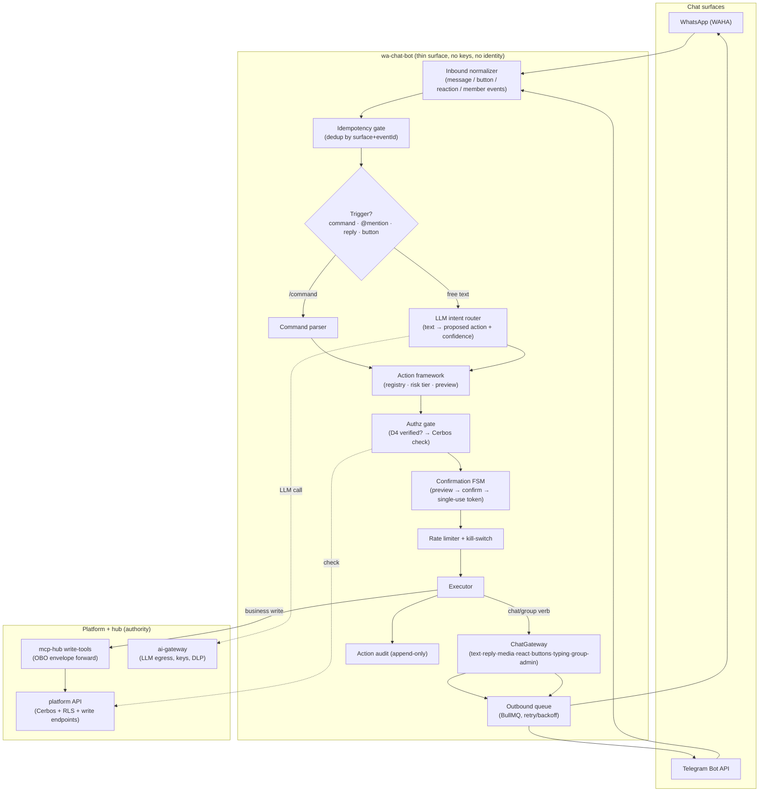
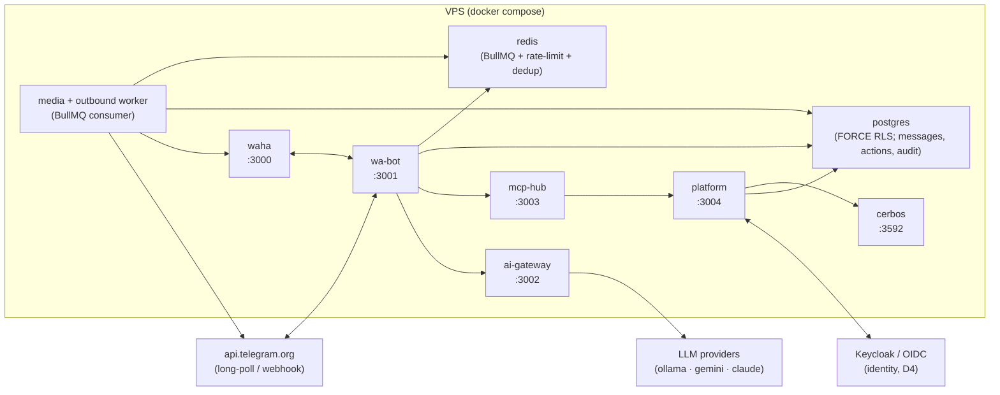
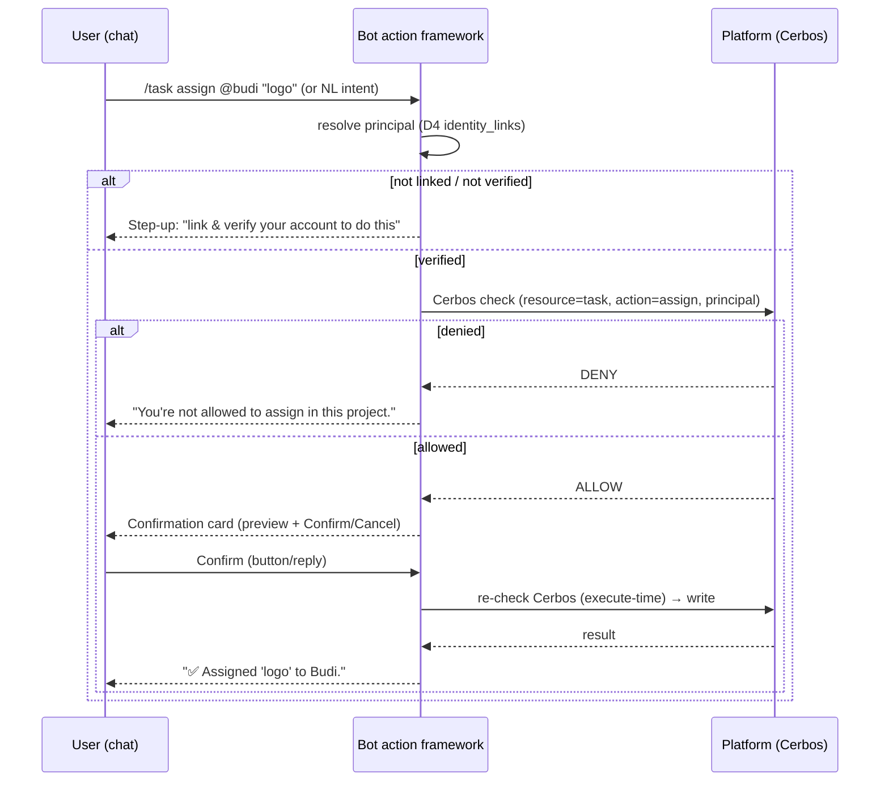
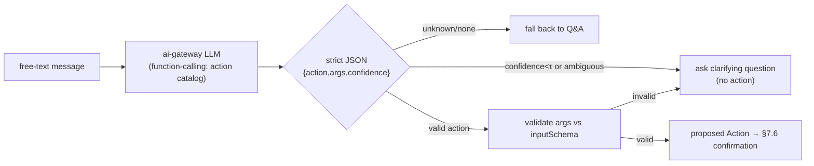
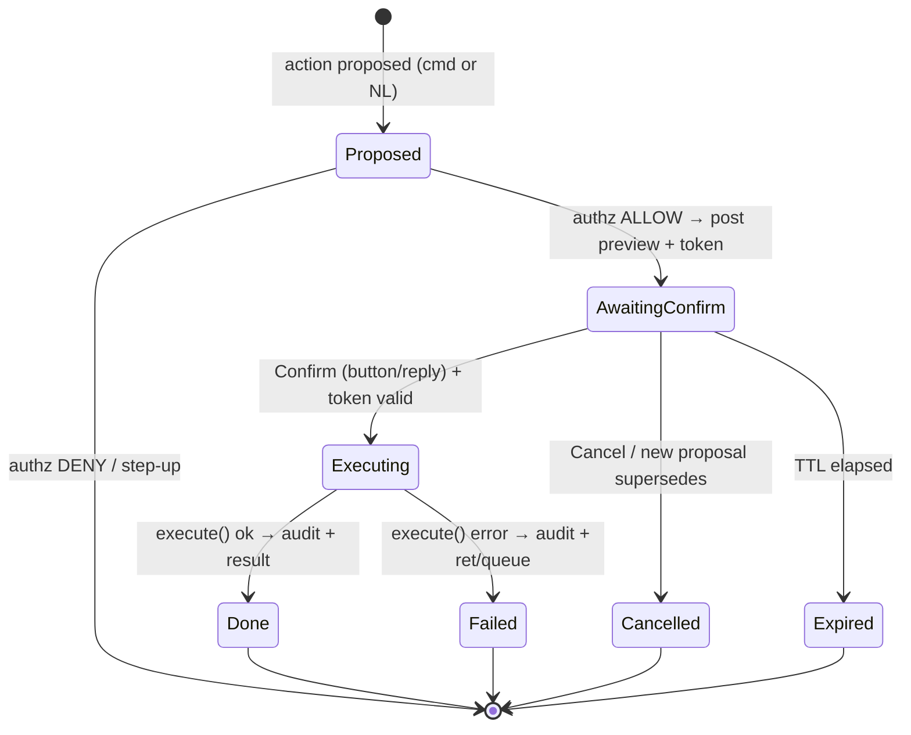
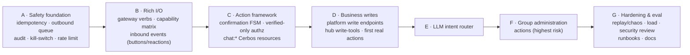

# wa-chat-bot → Industry-Grade Action Agent — Design Spec

**Date:** 2026-07-05
**Status:** Approved (design), pre-authorized for implementation
**Owner workstream:** WS5 (Surfaces) × WS1 (Platform) × WS2 (MCP hub) × WS8 (agents)
**Supersedes for the action surface:** the read/reply trial skeleton described in `wa-chat-bot/README.md`

---

## 1. Context & problem

The current `wa-chat-bot` is a mature **read-and-reply** assistant: it ingests WhatsApp/Telegram
messages, scrubs PII, crypto-shred-stores them, and answers questions / posts digests. Its entire
outbound capability is a single verb:

```ts
export interface WhatsAppGateway { sendText(chatId: string, text: string): Promise<void>; }
```

Every "skill" (`ping`, `summarize`, `capture`, `know`, `projects`, `actions`, …) is **read-only** —
it queries and replies with text. Every MCP hub tool is `.list` / `.search` / `.pendingApprovals`,
all routed through a GET-only `platformGet`. There is **no write path anywhere**: the bot cannot
create a task, assign work, approve an approval, send media, react, use buttons, or manage a group.

**Goal:** make the bot a genuinely industry-usable **action agent** that performs real, authorized
actions inside WhatsApp and Telegram — in group chats and DMs — while preserving every
non-negotiable in the program (bot holds no keys, never asserts identity, PII scrubbed/encrypted,
verified-only writes, full auditability).

## 2. Decisions locked (from brainstorming)

| Fork | Decision |
|---|---|
| **Action scope** | Full: business/platform writes **+** rich chat replies **+** interactive controls **+** group administration |
| **Write authorization** | **Verified-only** for all writes: linked+verified D4 identity required; Cerbos decides per action; unverified → step-up prompt |
| **Trigger model** | **Commands + LLM** on day one (both explicit `/commands` and natural-language intent) |
| **LLM execution path** | In-bot **intent router → proposed hub tool call**, always confirmation-gated (no auto-execute) |
| **Safety posture** | All four: confirm-before-execute, full audit trail, idempotency + delivery guarantees, rate limits + kill-switch |

## 3. Goals / non-goals

**Goals**
- Real, authorized mutations from chat: platform business objects, rich chat output, interactive
  controls, group admin.
- Verified-only writes, Cerbos-enforced per action, re-checked at execute time.
- Every mutating action confirmed, audited, idempotent, rate-limited, and globally killable.
- Surface-agnostic: WhatsApp (WAHA) and Telegram share one contract; capability differences
  degrade gracefully.
- TDD throughout; parity tests prove unverified callers can never mutate.

**Non-goals (this spec)**
- Multi-step autonomous agent planning (the `ai-agents` supervisor). The intent router proposes a
  **single** action; multi-step chaining is a documented future escalation, not built here.
- New UI in `platform-ui` (covered by its own plans).
- Provider migration off WAHA/Telegram (the `ChatGateway` contract keeps that swappable).

## 4. Guiding principle — the thin surface stays thin

The bot remains a **thin, identity-forwarding surface**. It never touches the DB, never holds
provider/model keys, never asserts identity. Every write flows:

```
chat → bot action-framework → (hub write-tool | gateway verb) → platform (Cerbos + RLS + audit)
```

Authorization, tenancy, and business logic stay in the platform. The bot's new responsibility is
**orchestration + safety** (propose → confirm → authorize → execute → audit), not authority.

## 5. Architecture overview



## 6. Deployment topology



**Notes**
- **Redis** is added to the bot's runtime for three jobs: BullMQ (media + new **outbound** queue),
  distributed rate-limit token buckets, and inbound dedup keys. Single-process fallback (in-memory)
  remains for dev/tests when `REDIS_URL` is unset.
- Outbound sends move onto a **worker + queue** so a transient WAHA/Telegram failure retries with
  backoff instead of silently dropping (today they are fire-and-forget `.catch(log)`).
- No new trust boundary: the bot still calls only the hub (OBO) and the ai-gateway (egress).

## 7. Building blocks

### 7.1 Gateway contract expansion (`ChatGateway`)

Rename `WhatsAppGateway` → `ChatGateway` (surface-agnostic; keep a type alias for back-compat).
New verbs, each with WAHA + Telegram implementations:

| Verb | WhatsApp (WAHA) | Telegram | Degradation if unsupported |
|---|---|---|---|
| `sendText` | ✅ existing | ✅ existing | — |
| `reply(chatId, replyToId, text)` (quote) | ✅ `reply_to` | ✅ `reply_to_message_id` | falls back to `sendText` |
| `sendMedia(chatId, {kind, bytes/url, caption})` | ✅ `/sendImage`·`/sendFile`·`/sendVoice` | ✅ `sendPhoto`·`sendDocument`·`sendVoice` | caption-only `sendText` + note |
| `react(chatId, msgId, emoji)` | ✅ `/reaction` | ✅ `setMessageReaction` | `sendText("👍")` fallback |
| `sendButtons(chatId, text, actions[])` | ✅ interactive (WAHA) / numbered-list fallback | ✅ `inline_keyboard` | numbered-text `reply "1"` fallback |
| `typing(chatId, on)` | ✅ `/startTyping` | ✅ `sendChatAction` | no-op |
| group admin: `addMember`·`removeMember`·`promote`·`demote`·`setSubject`·`pin`·`inviteLink` | ✅ WAHA group endpoints | ✅ Bot API (bot must be admin) | returns `unsupported` result → surfaced to user |

A **capability matrix** (`gateway/capabilities.ts`) declares `{surface → verb → supported}`. The
executor consults it before dispatch; unsupported verbs return a structured `unsupported` outcome
that the confirmation/preview step reflects honestly ("Telegram can't pin here").

### 7.2 Inbound event expansion

`normalize()` today returns a text-only `InboundMessage`. Introduce an `InboundEvent` union:

```ts
type InboundEvent =
  | { kind: "message"; ... }        // existing shape (text + media)
  | { kind: "button"; chatId; senderId; actionToken; msgId; ts }   // callback / inline keyboard press
  | { kind: "reaction"; chatId; senderId; emoji; msgId; ts }       // reaction trigger (e.g. ✅ approves)
  | { kind: "edit"; ... }
  | { kind: "member"; chatId; joined|left; userId; ts };
```

- Telegram `allowed_updates` widened to `["message","callback_query","message_reaction","chat_member"]`.
- WAHA event types mapped (`message`, `message.reaction`, `group.participants`, button payloads).
- Button presses carry a **single-use action token** that resolves against the confirmation FSM
  (§7.6) — the payload never carries raw action args (avoids tampering; token is server-side state).

### 7.3 Action framework

New first-class `Action` (distinct from read-only `Skill`, which stays):

```ts
interface Action {
  name: string;                       // e.g. "task.create"
  category: "business" | "chat" | "group-admin";
  riskTier: "low" | "medium" | "high";
  cerbos: { resource: string; action: string };   // authz mapping
  inputSchema: JSONSchema;            // validated before preview
  preview(ctx): Promise<string>;      // human-readable "what will happen"
  execute(ctx): Promise<ActionResult>;// calls hub write-tool OR gateway verb — never the DB
}
```

Actions register in an `ActionRegistry` alongside skills. `execute` is only ever reached **after**
authz + confirmation + rate-limit + kill-switch checks pass.

### 7.4 Verified-only authorization



- **D4**: bot forwards only the `(provider, external_id)` OBO envelope; the platform resolves the
  linked, verified identity. Unlinked or assurance-below-verified → **step-up**, never execution.
- **Cerbos**: business actions map to existing platform resources (`task`, `project`,
  `agency:approval`, `time_entry`). Chat/group-admin actions get **new Cerbos resources**
  (`chat:message`, `chat:group`) with actions like `send_media`, `pin`, `remove_member`, scoped by
  the chat's bound tenant/company. Policies live in the versioned Cerbos policy repo (P5b pattern).
- **Re-check at execute time**, not just at propose time (revocation between propose and confirm
  must deny — D11).

### 7.5 LLM intent router



- The action catalog (names + schemas + descriptions) is sent to the LLM via the ai-gateway using a
  function-calling / tool-choice contract; the model must return one catalog action or `none`.
- **Never auto-executes.** The router only ever yields a *proposal*, which enters the same
  confirmation FSM as `/commands`. This collapses command and NL paths to one audited execute gate.
- Confidence threshold + arg-schema validation gate; below threshold → a clarifying question.
- Prompt-injection containment: the model chooses only from the allow-list; args are schema-checked;
  authz + confirmation are enforced regardless of what the model returns.

### 7.6 Confirm-before-execute FSM



- Pending-action store keyed by `(chatId, senderId)` (Redis w/ TTL; in-memory fallback). Holds
  action name, validated args, preview, and a **single-use confirmation token**.
- Confirm via **button press** (token in callback) or **reply** ("yes"/"confirm"/"1").
- Token single-use → **idempotent execute** (a double-tap or webhook redelivery executes once).
- On confirm: re-resolve principal, **re-run Cerbos**, then `execute()`.

### 7.7 Safety layer

- **Inbound idempotency**: dedup by `(surface, eventId)` — Redis `SET NX` with TTL, plus a unique
  constraint on the message store. Eliminates today's double-store/double-reply on webhook retry.
- **Outbound delivery**: all gateway sends go through a **BullMQ outbound queue** consumed by the
  worker; retry with exponential backoff + dead-letter. Replaces fire-and-forget `.catch(log)`.
- **Action audit** (append-only `action_audit` table): `{ts, actor_principal_hash, surface, chatId,
  action, args_summary (PII-safe), decision (allow/deny/stepup), outcome (done/failed/…),
  latency_ms, error?}`. Mirrors the existing Cerbos decision-audit; queryable for incident review.
- **Rate limits**: per-user and per-action token buckets (Redis). Sensible defaults per risk tier
  (e.g. high-risk group-admin far tighter); configurable.
- **Kill-switch**: `ACTIONS_ENABLED` env **plus** a runtime toggle (a control key checked before any
  execute). When off, all writes fail-closed with a user-visible "actions are temporarily disabled";
  reads/Q&A continue. Flipping it requires no redeploy.

### 7.8 Platform + hub write-tools

- **platform/**: new authorized **write endpoints**, each Cerbos-gated, RLS-scoped, audited:
  - `POST /api/:tenant/projects` (create) · `POST …/projects/:id/tasks` (create)
  - `PATCH …/tasks/:id` (assign / status / complete)
  - `POST …/time` (log time)
  - `POST …/modules/agency/approvals/:id/approve` · `/reject`
- **mcp-hub/**: a `platformPost`/`platformPatch` helper (today only `platformGet`) and matching
  **write-tools** (`tasks.create`, `tasks.update`, `projects.create`, `time.log`,
  `agency.approve`, `agency.reject`) — each forwards the OBO envelope; the platform enforces authz.
  Tool `minAssurance` documents intent, but **the platform is the enforcement point** (defence in
  depth: hub declares, platform decides).

## 8. Data model additions

| Table / store | Purpose | Notes |
|---|---|---|
| `action_audit` | append-only action log | PII-safe; actor stored as principal hash; FORCE RLS by tenant |
| `pending_action` (Redis, TTL) | confirmation FSM state | key `(chatId,senderId)`; single-use token; ephemeral |
| `inbound_seen` (Redis, TTL) | inbound dedup | key `(surface,eventId)`; SET NX |
| message store | add unique `(surface,wa_message_id)` | belt-and-braces dedup at rest |
| platform write endpoints | mutate existing tenant tables | no new business tables; reuse projects/tasks/time/approvals |

## 9. Phasing (each phase = its own implementation plan + PR)



- **A — Safety foundation** *(first; nothing mutating ships before this exists)*.
- **B — Rich I/O** (gateway verbs + capability matrix + inbound button/reaction events).
- **C — Action framework + confirmation FSM + verified-only authz** (+ `chat:*` Cerbos resources).
- **D — Business writes** (platform endpoints + hub tools → task create/assign/complete, approvals
  approve/reject, project create, time log).
- **E — LLM intent router**.
- **F — Group administration** actions.
- **G — Hardening & eval** (chaos/replay, load, security review, runbooks: action-incident +
  kill-switch, docs; README truthfully updated from "trial skeleton" to action-agent status).

Rationale: safety before capability; capability (I/O) before framework; framework before the first
real writes; deterministic writes before the LLM path; highest-risk (group admin) last; a dedicated
hardening gate before "industry-ready" is claimed.

## 10. Testing strategy (TDD, vitest — matches existing style)

- **Gateway capability contract tests**: every verb on every surface, incl. degradation paths.
- **Inbound event tests**: message/button/reaction/member normalization for WAHA + Telegram.
- **Authz parity**: for each action, unverified/unlinked ⇒ step-up (never execute); verified+denied
  ⇒ deny; verified+allowed ⇒ execute. Cerbos-in-the-loop (P5b test pattern).
- **Confirmation FSM**: propose→confirm→execute; expiry; cancel; **double-confirm executes once**;
  revocation between propose and confirm ⇒ deny.
- **Idempotency/replay**: duplicate inbound event ⇒ single store + single execute; outbound retry.
- **Kill-switch & rate-limit**: writes blocked when off / over budget; reads unaffected.
- **Intent-router eval set**: labelled `text → expected {action|clarify|none}` corpus; asserts no
  destructive action is proposed from ambiguous/adversarial input.
- **Audit assertions**: every execute path writes exactly one PII-safe audit row.

## 11. Security & compliance posture

- No new keys in the bot; LLM still via ai-gateway only.
- Writes are verified-only, Cerbos-enforced, re-checked at execute, revocation-honoring (D11).
- Args and previews are PII-scrubbed before logging (reuse `scrub`).
- Prompt-injection: allow-list + schema validation + human confirmation + authz make a malicious
  message unable to cause an unauthorized or unconfirmed mutation.
- Kill-switch + rate limits give incident response an immediate lever.
- Legal gate unchanged: no real regulated data ingestion before Gate 1; action-agent changes do not
  alter that dependency.

## 12. Risks & mitigations

| Risk | Mitigation |
|---|---|
| WAHA group-admin API gaps/instability | Capability matrix + honest `unsupported` outcomes; group-admin is Phase F, gated hardest |
| LLM proposes wrong/destructive action | Allow-list, schema validation, confidence threshold, **mandatory confirmation**, execute-time authz |
| Redis becomes a new hard dependency | In-memory fallback for dev/tests; compose adds redis for VPS; degrade to single-process if unset |
| Confirmation fatigue | Risk-tiered: low-risk actions get lightweight confirm; batching considered later (not now) |
| Scope is large | Strict phasing; each phase independently shippable and testable; A–D delivers a genuinely usable core |

## 13. Open items (tracked, non-blocking)

- Multi-step agentic actions via the `ai-agents` supervisor — deliberately deferred (§3 non-goals).
- Per-surface button UX polish (WhatsApp interactive message limits) — handled in Phase B/G.
- Localization of confirmation/preview strings — after core.
